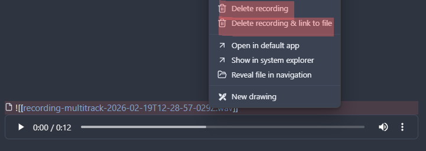
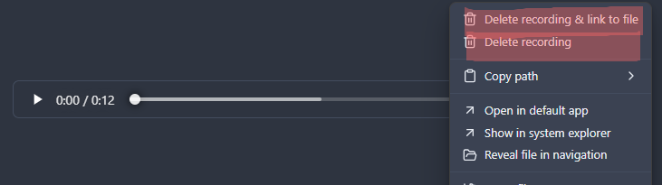
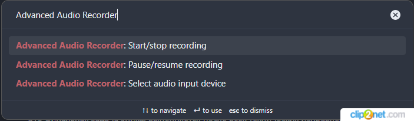

# Obsidian Advanced Audio Recorder

An audio recording plugin for Obsidian with configurable save location, input device selection, pause/resume control, and optional multi-track capture.

## Features

- **Configurable Save Folder**: Choose where recordings are stored in your vault.
- **Audio Input Selection**: Pick the microphone/input device from command palette or settings.
- **Pause and Resume**: Pause and continue the same active recording session. This is triggered via the **Command Palette** or a custom hotkey while recording is active.
- **Multi-Track Recording**: Record several input devices at once and export as a single or multiple files.
- **Format and Bitrate Settings**: Choose output format and bitrate from plugin settings.

## Installation

1. Open **Obsidian Settings**.
2. Navigate to **Community Plugins** and disable **Safe Mode**.
3. Click **Browse** and search for **"Advanced Audio Recorder"**.
4. Click **Install**.
5. Once installed, **Enable** the plugin.

## Usage

1. Click the microphone icon in the left ribbon or run **Start/stop recording** from the Command Palette.
2. Configure **Save folder**, **Input device**, and recording options in plugin settings.
3. Start recording.
4. Optionally run **Pause/resume recording**.
5. Stop recording to save files and insert links into the active note.
6. Optionally delete recordings from the File Explorer or using the context menu.

### Deleting Recordings using the context menu

You can delete recordings using the context menu in two ways:

1. **From the Editor:** Right-click on the file link/embed in editing mode.

2. **From the Player:** Right-click directly on the embedded player.

## Commands

- **Start/stop recording** — starts a new recording or stops the current one.
- **Pause/resume recording** — pauses an active recording and resumes it.
- **Select audio input device** — opens a quick picker and saves the selected device.

### How to Pause and Resume

1. While a recording is **active**, open the Obsidian **Command Palette** (`Ctrl/Cmd + P`).
2. Type `Advanced Audio Recorder: Pause/resume recording`.
3. Press **Enter**. The status bar and ribbon icon will indicate that the recording is paused.
4. Run the same command again to **Resume**.

> [!TIP]
> For the best experience, assign a **hotkey** to the `Pause/resume recording` command in Obsidian's **Settings > Hotkeys**.

## Formats and Containers

- Available formats depend on your platform and browser **MediaRecorder** support.
- Common options on most systems include: `webm`, `wav`, and `ogg`.
- When **WAV** is selected, recording is captured in a compressed format and converted to WAV on save to ensure data integrity.
- In multi-track mode:
  - **Single file** output combines tracks into one file.
  - **Multiple files** output saves one file per track.

## Configuration

Visit the plugin settings to:
- Select recording format, bitrate, and sample rate.
- Select default input device.
- Set save folder and file prefix.
- Configure multi-track recording (track count, output mode, per-track devices).
- Enable debug logs when troubleshooting.

## License

This project is licensed under the MIT License - see the [LICENSE](LICENSE) file for details.

## Support

If you find this plugin useful, consider supporting its development!

[Buy Me A Coffee](https://coff.ee/akhmelevskiy)
