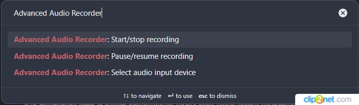

# Advanced Audio Recorder for Obsidian

**Record, play, clean up, and transcribe audio without leaving [Obsidian](https://obsidian.md).**

Advanced Audio Recorder turns Obsidian into a full audio workspace: a configurable **voice recorder** and **dictation** tool, a **multi-track** capture rig, an **audio converter**, a waveform **audio player** with bookmarks and chapters, an on-demand **noise cleanup** tool, and a built-in **speech-to-text / transcription** engine (OpenAI Whisper, Groq, Deepgram, Google Gemini, or fully offline `whisper.cpp`) with optional **LLM summarization**.

Whether you take **voice notes**, record **meetings** and **interviews**, capture **lectures**, or dictate drafts, the plugin saves the audio into your vault, embeds a rich player in your note, and can write a searchable transcript right beside it.

**Desktop only** · Requires Obsidian **1.6.6+** · MIT licensed

> 📖 **[Read the full documentation »](docs/index.md)** — guides for every feature, a complete settings reference, step-by-step setup for each transcription engine, and architecture diagrams. The link is also available at the top of the plugin's settings tab.

## Why Advanced Audio Recorder?

- **Everything stays in your vault.** Recordings, transcripts, and bookmarks are plain files next to your notes — no external app, no lock-in.
- **From quick voice note to multi-mic interview.** Single click to record, or configure up to 8 simultaneous input devices.
- **Hear and navigate your audio.** A waveform player with speed control, skip, loop, bookmarks, chapters, and clickable timecodes replaces the plain embed.
- **Turn speech into text.** Four transcription engines (cloud or offline), speaker diarization, multiple output formats, and optional LLM cleanup or summary.
- **Private by default.** API keys stay on your device. The local `whisper.cpp` engine never touches the network.

## Features

**Recording**
- One-click recording from the ribbon, the command palette, or a custom hotkey, with live status-bar feedback.
- Pause and resume mid-recording without losing progress.
- Multi-track recording from up to 8 input devices at once (mixed into one file or saved per track).
- Automatic splitting of long recordings into fixed-duration parts.
- Crash recovery that reassembles a recording interrupted by a crash, power loss, or plugin reload.
- Live input-level meter, elapsed-time and size stats, and a prominent mobile recording banner.

**Formats & files**
- 8 output formats: **WAV, WebM, OGG, MP3, MP4, M4A, AAC, FLAC** (availability depends on your platform).
- Convert any audio file between formats from the right-click menu.
- Split existing files into parts, losslessly for WAV.
- Audio file info viewer (duration, bitrate, sample rate, codec, channels) with one-click Markdown copy.

**Playback**
- Enhanced audio player with a clickable **waveform**, playback speed (0.5×–3×), ±10s skip, volume, mute, and loop.
- Per-recording **bookmarks** and **chapters** with a seek-bar overlay and a jump/rename/delete list.
- **Timecode links** (`[[recording#t=1:30]]`) that jump the player to a position.

**Cleanup & processing**
- On-demand audio **cleanup**: high-pass filter, noise gate, and loudness leveling, written to a new copy.
- Browser input processing while recording: noise suppression, echo cancellation, automatic gain control.

**Transcription (speech-to-text)**
- Four engines: **Whisper API** (OpenAI / Groq / any compatible host), **Deepgram**, **Google Gemini**, and **local `whisper.cpp`** (offline).
- Speaker **diarization** (Deepgram and Gemini), language auto-detection, and word-level timestamps.
- Output as an in-note transcript, a sidecar file (**JSON, SRT, WebVTT, TXT**), or both, with fully templated formatting and clickable timecodes.
- Optional **LLM post-processing** to clean up, summarize, or apply a custom instruction (OpenAI, Anthropic/Claude, or Gemini).
- Run a long job in the background by minimizing it to the status bar.

**Diagnostics**
- Test recording, a full System-info report for bug reports, and a verbose debug mode.

## Installation

### From Community Plugins (recommended)

1. Open **Settings → Community plugins** in Obsidian and turn off **Restricted mode** if needed.
2. Click **Browse**, search for **“Advanced Audio Recorder”**.
3. Click **Install**, then **Enable**.

### Manual installation

Copy `main.js`, `manifest.json`, and `styles.css` from a [release](https://github.com/akhmialeuski/advanced-audio-recorder/releases) into `<vault>/.obsidian/plugins/advanced-audio-recorder/`, then enable the plugin in **Settings → Community plugins**.

See the [Getting started guide](docs/getting-started.md) for a full walkthrough.

## Quick start

1. Click the **microphone icon** in the left ribbon (or run **Start/stop recording** from the command palette).
2. Speak or play audio into your microphone.
3. Click the ribbon icon again to **stop** and save.
4. An audio embed link (`![[recording-….webm]]`) is inserted into the active note.

> The plugin assigns **no default hotkeys** to avoid conflicts — set your own in **Settings → Hotkeys**.

## Documentation

The complete documentation lives in the [`docs/`](docs/index.md) folder.

| Guide                                                  | What it covers                                                       |
| ------------------------------------------------------ | -------------------------------------------------------------------- |
| [Documentation home](docs/index.md)                    | Overview and a map of every guide.                                   |
| [Getting started](docs/getting-started.md)             | Install, permissions, and your first recording.                      |
| [Features overview](docs/features.md)                  | A catalog of everything the plugin does.                             |
| [Recording](docs/recording.md)                         | The full recording workflow, pause/resume, save, and crash recovery. |
| [Multi-track recording](docs/multi-track-recording.md) | Record several input devices at once.                                |
| [Formats and containers](docs/formats.md)              | The 8 formats, online vs offline encoding, and how to choose.        |
| [File operations](docs/file-operations.md)             | The right-click menu: info, convert, split, delete.                  |
| [Splitting recordings](docs/splitting.md)              | Automatic and manual splitting into parts.                           |
| [Enhanced audio player](docs/audio-player.md)          | Waveform, controls, bookmarks, chapters, and timecode links.         |
| [Audio cleanup](docs/audio-cleanup.md)                 | High-pass, noise gate, and loudness leveling.                        |
| [Transcription](docs/transcription.md)                 | Engines, diarization, output formats, and destinations.              |
| [LLM post-processing](docs/llm-post-processing.md)     | Clean up or summarize transcripts with an LLM.                       |
| [Settings reference](docs/settings-reference.md)       | Every setting, its options, and its default.                         |
| [Architecture](docs/architecture.md)                   | How the plugin works, with diagrams.                                 |
| [Troubleshooting](docs/troubleshooting.md)             | Diagnostics and fixes for common problems.                           |
| [Use cases & how-tos](docs/use-cases/index.md)         | Get API keys, set up `whisper.cpp`, and end-to-end workflows.        |

**Setting up transcription?** Step-by-step guides for each engine:
[OpenAI / Whisper API](docs/use-cases/openai-whisper-api-key.md) ·
[Groq (free tier)](docs/use-cases/groq-whisper-setup.md) ·
[Deepgram](docs/use-cases/deepgram-api-key.md) ·
[Google Gemini](docs/use-cases/gemini-api-key.md) ·
[Anthropic / Claude](docs/use-cases/anthropic-api-key.md) ·
[Local whisper.cpp (offline)](docs/use-cases/local-whisper-cpp.md)

## Transcription engines at a glance

| Engine                        | Cost                        | Diarization | Max file | Offline | Best for                                |
| ----------------------------- | --------------------------- | ----------- | -------- | ------- | --------------------------------------- |
| **Whisper API** (OpenAI/Groq) | Paid (Groq has a free tier) | No          | 25 MB\*  | No      | Accurate single-speaker transcription   |
| **Deepgram**                  | Free credit, then pay-as-go | Yes         | 2 GB     | No      | Meetings and interviews with speakers   |
| **Google Gemini**             | Free tier, then paid        | Yes         | 2 GB     | No      | Long recordings and reuse for LLM tasks |
| **Local whisper.cpp**         | Free                        | No          | —        | Yes     | Private, offline transcription          |

\* Files over 25 MB are automatically resampled and split into upload-sized chunks. See the [transcription guide](docs/transcription.md).

## Troubleshooting & bug reports

- Start with the [Troubleshooting guide](docs/troubleshooting.md).
- When filing an issue, follow the [Bug reporting guide](docs/BUG_REPORTING_GUIDE.md) and include the **System info** and **Audio file info** output.
- Report bugs and request features on [GitHub Issues](https://github.com/akhmialeuski/advanced-audio-recorder/issues).

## License

Released under the [MIT License](LICENSE).

## Support

If this plugin saves you time, consider supporting its development:

[☕ Buy Me A Coffee](https://coff.ee/akhmelevskiy)

---

Keywords: obsidian audio recorder, obsidian voice recorder, obsidian dictation, record audio in obsidian, microphone recorder, multi-track recording, meeting recorder, interview recorder, lecture recorder, audio converter, wav mp3 flac ogg webm m4a aac, waveform audio player, audio bookmarks and chapters, speech to text, transcription, Whisper, OpenAI, Groq, Deepgram, Google Gemini, whisper.cpp offline transcription, speaker diarization, transcript SRT VTT, LLM summary, voice memo plugin.
