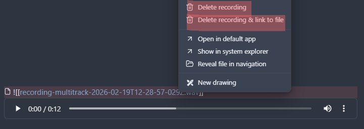
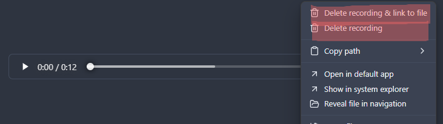

# Obsidian Advanced Audio Recorder

An advanced audio recording plugin for [Obsidian](https://obsidian.md) with configurable save location, input device selection, pause/resume control, multi-track capture, format conversion, and built-in diagnostics.

**Desktop only** | Requires Obsidian 0.15.0+

## Features

- **Audio recording** with real-time status bar and ribbon icon feedback.
- **Pause and resume** mid-recording without losing progress.
- **Multi-track recording** from up to 8 input devices simultaneously.
- **8 output formats**: WAV, WebM, OGG, MP3, MP4, M4A, AAC, FLAC.
- **Audio format conversion** between supported formats via context menu.
- **Audio splitting**: automatic splitting of recordings into fixed-duration parts and manual splitting of existing files via context menu.
- **Enhanced audio player** that replaces the built-in embed with a waveform, playback-speed control, skip buttons, volume, loop, a time display, and timecode links.
- **Audio file info** viewer showing duration, bitrate, sample rate, codec, and more.
- **Configurable save location** with vault folder or near-active-file mode.
- **Insert at original position** to place the audio link where recording started.
- **System diagnostics** for troubleshooting environment and codec issues.
- **Test recording** to verify device and format settings before real use.

## Installation

1. Open **Settings** in Obsidian.
2. Navigate to **Community plugins** and disable **Safe mode**.
3. Click **Browse** and search for **"Advanced Audio Recorder"**.
4. Click **Install**, then **Enable** the plugin.

## Quick start

1. Click the **microphone icon** in the left ribbon (or run `Start/stop recording` from the command palette).
2. Speak or play audio into your microphone.
3. Click the ribbon icon again (or run the command) to **stop** and save.
4. An audio embed link is automatically inserted into the active note.

## Commands

All commands are available via the command palette (`Ctrl/Cmd + P`) and can be assigned custom hotkeys in **Settings > Hotkeys**.

| Command | Description |
|---------|-------------|
| **Start/stop recording** | Starts a new recording session or stops the current one. The recorded file is saved and a link is inserted into the active note. |
| **Pause/resume recording** | Pauses an active recording and resumes it. Available only while recording is active. |
| **Select audio input device** | Opens a quick device picker modal. The selected device is saved to settings immediately. |

> **Tip:** The plugin does not assign default hotkeys to avoid conflicts. Assign your own hotkeys in **Settings > Hotkeys** for the best experience.

## Recording workflow

### Starting a recording

Click the **microphone icon** in the ribbon or run `Start/stop recording` from the command palette. The plugin captures the current note and cursor position so the audio link can be inserted there when recording finishes.

During recording:
- The **ribbon icon** changes from a microphone to an active recording indicator.
- The **status bar** displays `Recording...` with **Pause** and **Stop** buttons.

### Pausing and resuming

While recording is active, run `Pause/resume recording` from the command palette or click the **Pause** button in the status bar.

- The status bar shows `Recording paused` with **Resume** and **Stop** buttons.
- Run the same command again or click **Resume** to continue recording.

### Stopping and saving

Click the ribbon icon or run `Start/stop recording` again. The plugin:

1. Stops the MediaRecorder.
2. Flushes audio buffers and assembles the final file.
3. Writes the file to the configured save location.
4. Inserts an embed link (`![[filename.ext]]`) into the active note.
5. Cleans up temporary data.

### Save progress indicator

For longer recordings, saving may take noticeable time. The status bar shows a progress bar during this phase:

| Progress | Stage |
|----------|-------|
| 0% | Saving... |
| 20% | Flushing buffers... |
| 40% | Assembling audio... |
| 60% | Writing file... |
| 80% | Cleaning up... |
| 100% | Saved |

The ribbon icon switches to a **save** icon while saving is in progress.

### Crash recovery

Desktop recordings register their temporary segment files in a journal (`recording-journal.json` in the plugin folder) while the session is active. If Obsidian crashes, the power is lost, or the plugin is disabled mid-recording, the next launch detects the interrupted session and offers three choices:

- **Recover audio** — reassembles the surviving segments into playable files (`<name>-recovered.wav` for WAV sessions, the raw recorder container for compressed sessions) next to where the recording was being saved. No re-encoding is performed, so even truncated streams stay playable.
- **Discard** — deletes the temporary segment files. Auto-split part files that were already finalized are never touched.
- **Decide later** — leaves everything in place; the prompt returns on the next launch.

Audio that was still buffered in memory at the moment of the crash (up to the flush threshold) cannot be recovered; everything already flushed to disk can.

### Automatic splitting

When **Split recordings automatically** is enabled in settings, the recording is saved as separate part files of the configured duration (`recording-...-part1.webm`, `recording-...-part2.webm`, ...) instead of one long file. Each finished part is written to disk while the recording continues, and the remainder recorded after the last boundary becomes the final part. Links to all parts are inserted into the note when the recording stops.

Notes on precision and behavior:

- **WAV recordings** are split sample-exactly at the configured boundary.
- **Compressed formats** (WebM, OGG, MP3, ...) restart the recorder at each boundary, so parts are approximately the configured length (within a few seconds) and a sub-second capture gap may occur between parts.
- **Merged multi-track recordings** (output mode `Single file` with several tracks) are not auto-split; the plugin shows a notice and saves one merged file.
- **Desktop only**: auto-split is not available in the mobile app; a notice is shown when a mobile recording starts with the option enabled.
- Split settings changed during an active recording apply to the next session.

## Context menu actions

Right-click on an audio file in the **File Explorer**, on an audio **embed link** in the editor, or on an **embedded audio player** to access these actions:

### Audio file info

Displays detailed metadata about the audio file in a modal dialog:

- **File name** and **file size**
- **Duration** (HH:MM:SS)
- **Container format** (MIME type)
- **Audio codec** (opus, aac, mp3, pcm, flac, etc.)
- **Bitrate** (calculated kbps)
- **Sample rate** (Hz)
- **Channels** (Mono/Stereo)

The modal includes a **Copy as Markdown** button that copies all metadata as a formatted Markdown list to the clipboard. This is useful when filing bug reports.

### Convert audio format

Opens a conversion dialog to transcode the audio file to a different format. Options:

- **Target format** with encoder description (e.g., `FLAC (Mediabunny FLAC Encoder)`, `MP3 (Mediabunny MP3 Encoder)`).
- **Bitrate** selection (64-320 kbps).
- **Delete source file** toggle to remove the original after successful conversion.
- **Update links in notes**: `Do nothing`, `Replace source link`, or `Insert after source link`.

The conversion reads the source file and transcodes it to the target format through the streaming mediabunny pipeline: the audio is processed in chunks instead of being decoded fully into memory and is always re-encoded at the selected bitrate. If the source container cannot be processed by the pipeline, the plugin falls back to a full decode and re-encode. The new file is saved alongside the original. Converting to WAV always performs a full decode.

### Split audio into parts

Opens a dialog to split the audio file into parts of a fixed duration. Options:

- **Part duration** in minutes (1-180).
- **Part name suffix** appended with the part number (e.g., `recording-part1.wav`).
- **Bitrate** used when re-encoding parts of compressed formats (hidden for WAV sources).
- **Delete source file** toggle to remove the original after a successful split.
- **Update links in notes**: `Do nothing`, `Replace source link`, or `Insert after source link`. Links in note bodies are updated across the whole vault, including notes that are not open. Both wikilinks (`![[...]]`) and Markdown links (``) are covered, and new links follow your link-format preferences. Links inside frontmatter properties are **not** rewritten (a property cannot hold several links); the plugin shows a notice when such links exist. When a link shares a line with other content (for example a table row), the part links are separated with spaces instead of line breaks so the layout stays intact.

WAV files are split losslessly at the byte level without re-encoding, building one part at a time so even multi-gigabyte files are handled. Compressed formats are decoded once into memory and re-encoded per part, so minor quality loss is possible and very long compressed files need enough free memory for the decoded audio. Part files are saved next to the source file, and the split is aborted if any target part file already exists. If writing fails midway, already-written parts are removed and the source file is kept.

### Delete recording

Moves the audio file to the system trash.

### Delete recording & link to file

Moves the audio file to the system trash **and** removes the corresponding embed link from the editor. Available when right-clicking on a link in the editor or on an embedded player.

## Enhanced audio player

When **Enhanced audio player** is enabled in settings, the plugin replaces Obsidian's built-in audio embed with a richer player wherever an audio file is embedded (`![[recording.webm]]`). The takeover is done through a Markdown post-processor, so it applies in both Reading view and Live Preview and is torn down cleanly when a note re-renders or its leaf closes. Disabling the setting restores the built-in embed on the next render.

The player offers:

- **Waveform seek bar**: the recording is drawn as a waveform; click or drag anywhere on it to seek. The played portion uses the theme accent color. Waveforms are computed once per file revision and cached, so scrolling a note with many players does not redecode audio.
- **Playback speed**: cycle through speed presets (0.5×–3×). A default speed can be set in settings.
- **Skip buttons**: jump backward and forward by a configurable number of seconds.
- **Volume** control and **loop** toggle.
- **Time display**: elapsed and total time.
- **Mute** toggle alongside the volume control.
- **Copy timestamp link**: copies a link to the current position (for example `[[recording#t=1:30]]`), following your link-format preferences.

### Markers and chapters

With **Markers and chapters** enabled, each recording can carry per-file **bookmarks** (jump points) and **chapters** (named segments):

- **Add a bookmark** at the current position with the bookmark button, or by **double-clicking the waveform**.
- **Add a chapter** at the current position with the chapter button.
- **Markers and chapters appear on the seek bar** — bookmarks as ticks, chapters as labelled boundary lines — and clicking one jumps to it.
- The optional **marker list** below the player lets you jump to, **rename**, or **delete** each entry.
- **Previous / next chapter** buttons navigate between chapter boundaries.

Markers are stored in a single `player-markers.json` index inside the plugin folder, keyed by the recording's path, so your vault stays free of sidecar files. (Moving or renaming the audio file currently orphans its markers.)

### Timecode links

A link with a `#t=` offset jumps a rendered player to that position instead of opening the file. The offset accepts plain seconds (`#t=90`), `m:ss` (`#t=1:30`), and `h:mm:ss` (`#t=1:02:03`). When a matching player is already visible in the note, clicking the link seeks it; otherwise the link behaves normally.

### Waveform and large files

Drawing a waveform requires decoding the whole file into memory, so files above the configurable **Waveform file size limit** skip the waveform and fall back to a plain seek bar (still fully seekable). Turn off **Show waveform** to always use the plain seek bar and avoid decoding.

> **Desktop and mobile**: the enhanced player works wherever Obsidian renders audio embeds. Waveform extraction relies on the Web Audio API available in the app.

## Formats and containers

Available recording formats depend on your platform's **MediaRecorder** support. The plugin detects supported formats at runtime.

| Format   | Codec       | Encoding                          | Notes                                                                                                                                          |
| -------- | ----------- | --------------------------------- | ---------------------------------------------------------------------------------------------------------------------------------------------- |
| **WebM** | Opus        | Online                            | Default format. Widely supported on desktop.                                                                                                   |
| **OGG**  | Opus/Vorbis | Online                            | Good compatibility on most systems.                                                                                                            |
| **WAV**  | PCM         | Online (streaming)                | Uncompressed. Captured as raw PCM in real time and assembled into a WAV file on save. Supports long recordings reliably without memory issues. |
| **MP3**  | MP3         | Offline (Mediabunny MP3 Encoder)  | Encoded after recording stops using the Mediabunny MP3 encoder extension.                                                                      |
| **FLAC** | FLAC        | Offline (Mediabunny FLAC Encoder) | Lossless compression. Encoded after recording using the Mediabunny FLAC encoder extension.                                                     |
| **MP4**  | AAC         | Online/Offline                    | Browser-dependent. May use offline encoding via mediabunny.                                                                                    |
| **M4A**  | AAC         | Online/Offline                    | Same as MP4, different container extension.                                                                                                    |
| **AAC**  | AAC         | Online/Offline                    | Raw AAC stream. Browser-dependent support.                                                                                                     |

**Online encoding** means the browser's MediaRecorder writes data in real time during recording.
**Offline encoding** means the audio is captured in a supported intermediate format (e.g., WebM) and then re-encoded after recording stops. When the intermediate codec already matches the target codec, the audio packets are copied without re-encoding. The settings tab marks offline formats with an `(offline)` label.

## Multi-track recording

Record from multiple input devices simultaneously (up to 8 tracks).

### Setup

1. Enable **Multi-track recording** in settings.
2. Set the **Maximum tracks** count (1-8).
3. Assign an **Audio source** (input device) to each track.
4. Choose the **Output mode**:
   - **Single file**: all tracks are mixed into one file.
   - **Multiple files**: each track is saved as a separate file.

### Behavior

- Each track uses its own MediaRecorder instance with the configured format and bitrate.
- All tracks start and stop together.
- In **Multiple files** mode, file names include the track number or device name (when **Use source names for tracks** is enabled). Tracks that share a device get the track number appended so their files never collide.

### Memory notes for merged output

- **WAV recordings merged to WAV** are mixed directly from the on-disk track data in small windows; memory use stays close to the size of the final file regardless of recording length.
- **Compressed merged outputs** (and tracks with mismatched sample rates) are mixed through the Web Audio engine, which decodes every track into memory first — roughly 1.2 GB per hour-long stereo track. For very long multi-track sessions, prefer the `Multiple files` output mode or WAV output.

## Settings reference

Open **Settings > Advanced Audio Recorder** to configure the plugin.

The plugin keeps an automatic backup of its settings in `data.json.bak` next to `data.json` in the plugin folder. The backup is refreshed on every successful settings load and save and is used to restore the settings automatically when `data.json` goes missing. When the backup is restored, a new `data.json` is written immediately so the backup is never the only copy. If `data.json` exists but cannot be read at startup (for example, when the file is temporarily locked during a plugin update), the plugin leaves the stored file untouched, keeps the session on the backup copy when one is readable (defaults otherwise), disables saving to protect the stored settings, and shows a notice; restarting Obsidian recovers the settings.

### Audio input

| Setting | Description | Default |
|---------|-------------|---------|
| **Input device** | Select the default microphone/input device. The dropdown dynamically lists all available devices and auto-refreshes when devices are connected or disconnected. | Auto-detected |
| **Sample rate** | Audio sample rate in Hz. Options: 8000, 16000, 22050, 44100, 48000. | 44100 |

### Output format

| Setting | Description | Default |
|---------|-------------|---------|
| **Recording format** | Final file format. Offline formats are labeled with `(offline)`. | WebM |
| **Audio bitrate** | Compression quality. Options: 64, 96, 128, 160, 192, 256, 320 kbps. Higher values produce better quality and larger files. | 128 kbps |
| **Output summary** | Read-only display showing the current format, bitrate, compression type, and encoder. | — |
| **Delete source after conversion** | When converting audio via context menu, automatically delete the original file after successful conversion. | Off |
| **Update links after conversion** | How to handle links to the source file in notes after conversion. Options: `Do nothing`, `Replace source link`, `Insert after source link`. | Replace source link |

### File storage

| Setting | Description | Default |
|---------|-------------|---------|
| **Save folder** | Vault folder where recordings are stored. Offers autocomplete suggestions from existing folders. | Vault root |
| **Save recordings near active file** | Save recordings in the same directory as the currently active note. Takes priority over Save folder. | Off |
| **Active file subfolder** | Optional subfolder relative to the active file directory (e.g., `audio`). Created automatically if it does not exist. Only visible when "Save near active file" is enabled. | — |
| **File prefix** | Filename prefix for recordings (e.g., `recording` produces `recording-1710000000000.webm`). | `recording` |
| **Insert at original position** | Remember the note and cursor position when recording starts. The audio link is inserted at that location, even if you navigate away during recording. | Off |

### Audio splitting

| Setting                            | Description                                                                                                                      | Default |
| ---------------------------------- | -------------------------------------------------------------------------------------------------------------------------------- | ------- |
| **Split recordings automatically** | Save the recording as separate part files of fixed duration. Desktop only; not applied to merged multi-track recordings.         | Off     |
| **Part duration**                  | Length of each part in minutes (1-180). Also the default part duration for manual splitting.                                     | 15      |
| **Part name suffix**               | Suffix appended with the part number (e.g., `part` produces `-part1`, `-part2`). Letters, digits, hyphens, and underscores only. | `part`  |
| **Delete source after split**      | Default state of the delete source file option in the manual split dialog.                                                       | Off     |

### Multi-track recording

| Setting | Description | Default |
|---------|-------------|---------|
| **Enable multi-track recording** | Record from multiple input devices at the same time. | Off |
| **Maximum tracks** | Number of simultaneous tracks (1-8). | 2 |
| **Output mode** | `Single file` combines all tracks into one file. `Multiple files` saves one file per track. | Single file |
| **Audio source for track N** | Select the input device for each track. One dropdown per track. | — |

### Audio player

| Setting | Description | Default |
|---------|-------------|---------|
| **Enhanced audio player** | Replace the built-in audio embed with the enhanced player. Enabling it reveals the options below. Applies to notes rendered after the change. | Off |
| **Show waveform** | Draw a waveform behind the seek bar. When off, a plain progress bar is shown and no decoding is performed. | On |
| **Waveform height** | Height of the waveform in pixels (24–160). | 48 |
| **Waveform file size limit** | Files larger than this (in megabytes, 1–500) skip the waveform and show a plain seek bar. | 50 |
| **Show speed control** | Show the playback-speed button. | On |
| **Default playback speed** | Speed applied to players when a note opens. | 1× |
| **Show skip buttons** | Show skip-forward and skip-back buttons. | On |
| **Skip amount** | Seconds skipped by the skip buttons (1–60). | 10 |
| **Show volume control** | Show the volume slider. | On |
| **Show mute button** | Show a mute / unmute button. | On |
| **Show time display** | Show elapsed and total time. | On |
| **Loop by default** | Start new players with looping enabled. | Off |
| **Timecode links** | Enable `#t=` links that seek a player, plus the player's "copy timestamp link" button. | On |
| **Markers and chapters** | Add per-file bookmarks and chapters. Enabling it reveals the options below. Stored in the plugin folder, not the vault. | On |
| **Show marker list** | List markers and chapters below the player with jump, rename, and delete actions. | On |
| **Chapter navigation** | Show previous / next chapter buttons. | On |

### Diagnostics

| Setting | Description |
|---------|-------------|
| **Test recording** | Records a 5-second test clip using current settings and plays it back. The test file is automatically deleted when you leave settings. Useful for verifying device and format compatibility. |
| **System info** | Opens a modal with full system diagnostics: Obsidian version, Electron version, platform, audio devices, supported formats, codec support, active recording configuration, and all plugin settings. Includes a **Copy to clipboard** button for sharing in bug reports. |
| **Debug mode** | Enables verbose console logs prefixed with `[AudioRecorder]` for troubleshooting recording issues. |

## Troubleshooting

### No sound is recorded

1. Check that the correct **Input device** is selected in settings.
2. Run the **Test recording** from settings to verify device access.
3. Ensure your OS/browser has granted microphone permissions to Obsidian.

### Recording format is not available

Some formats require browser-level MediaRecorder support. If a format is not listed:
- Try **WebM** or **WAV** which have the broadest support.
- Check **System info** in settings to see which formats and codecs your environment supports.

### Conversion fails

- Ensure the source file is a valid audio file (not corrupted).
- Check that the target format is supported for offline encoding (see the **Formats and containers** table).
- Use **Audio file info** from the context menu to inspect the source file properties.

### Recording is slow to save

Long recordings may take time during the save phase (buffer flushing, audio assembly). The progress bar in the status bar shows the current stage. This is expected behavior.

### Collecting diagnostics for bug reports

When reporting issues:
1. Open **Settings > Advanced Audio Recorder > System info** and click **Copy to clipboard**.
2. Right-click the problematic audio file and select **Audio file info**, then click **Copy as Markdown**.
3. Include both outputs in your bug report along with steps to reproduce.

See [Bug reporting guide](docs/BUG_REPORTING_GUIDE.md) for detailed instructions.

## License

This project is licensed under the MIT License. See the [LICENSE](LICENSE) file for details.

## Support

If you find this plugin useful, consider supporting its development!

[Buy Me A Coffee](https://coff.ee/akhmelevskiy)
