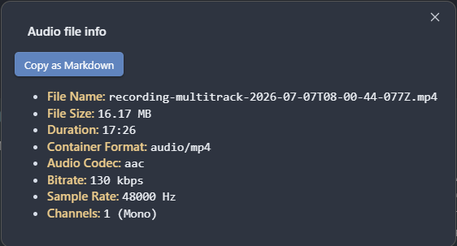

# Bug reporting guide

This guide explains how to collect the information needed to report a bug effectively. The more detail you provide, the faster the issue can be diagnosed and fixed.

- [Before reporting](#before-reporting)
- [Steps to reproduce](#steps-to-reproduce)
- [Expected vs actual behavior](#expected-vs-actual-behavior)
- [System diagnostics](#system-diagnostics)
- [Audio file info](#audio-file-info)
- [Console logs](#console-logs)
- [Screenshots](#screenshots)
- [Example bug report](#example-bug-report)
- [Where to report](#where-to-report)
- [Related pages](#related-pages)

## Before reporting

1. **Update the plugin** to the latest version and check if the issue persists.
2. **Disable other plugins** temporarily to rule out conflicts.
3. **Restart Obsidian** to ensure a clean state.

## Steps to reproduce

Write the exact steps someone else can follow to trigger the bug. Be specific:

- What format and bitrate were you using?
- Were you recording single-track or multi-track?
- How long was the recording?
- What did you click or which command did you run?

## Expected vs actual behavior

Describe what you expected to happen and what actually happened instead.

## System diagnostics

The plugin includes a built-in diagnostics tool that collects all relevant environment information in one step.

_Figure: The System info modal opened from the Diagnostics settings section._

**How to collect:**

1. Open **Settings > Advanced Audio Recorder**.
2. Scroll down to the **Diagnostics** section.
3. Click the **Show info** button next to **System info**.
4. In the modal that opens, click **Copy to clipboard**.
5. Paste the copied JSON into your bug report.

The diagnostics output includes:

- Plugin settings (format, bitrate, sample rate, save folder, multi-track config).
- Environment info (Obsidian version, Electron version, platform, architecture).
- Audio devices (all detected input and output devices).
- Audio capabilities (supported formats, sample rates, bitrates, codec support).
- Active recording configuration (the exact format, MIME type, and codec that would be used for recording).

## Audio file info

If the bug involves a specific audio file (e.g., playback issues, corruption, wrong format), collect the file metadata:

_Figure: The Audio file info modal opened from the file context menu._

1. In the **File Explorer** or in the **Editor**, right-click on the audio file.
2. Select **Audio file info** from the context menu.
3. In the modal, click **Copy as Markdown**.
4. Paste the copied text into your bug report.

The output includes file name, size, duration, container format, audio codec, bitrate, sample rate, and channel count.

## Console logs

If **Debug mode** is enabled, the plugin writes detailed logs to the developer console:

1. Open **Settings > Advanced Audio Recorder** and enable **Debug mode**.
2. Reproduce the issue.
3. Open the developer console: **View > Toggle Developer Tools** (or `Ctrl/Cmd + Shift + I`).
4. Look for log entries starting with `[AudioRecorder]`.
5. Copy the relevant log lines and include them in your bug report.

## Screenshots

If the issue is visual (e.g., status bar glitch, modal rendering problem), attach a screenshot or screen recording.

## Example bug report

> **Title:** Recording produces empty file when using FLAC format
>
> **Steps to reproduce:**
>
> 1. Set recording format to FLAC in plugin settings.
> 2. Start a recording and speak for 10 seconds.
> 3. Stop the recording.
> 4. The inserted link points to a 0-byte file.
>
> **Expected:** A valid FLAC file with audio content.
>
> **Actual:** The file is empty (0 bytes). No error message is shown.
>
> **Audio file info:**
>
> - File Name: `recording-1710000000000.flac`
> - File Size: `0 Bytes`
> - Duration: `00:00:00`
> - Container Format: `audio/flac`
> - Audio Codec: `flac`
> - Bitrate: `0 kbps`
> - Sample Rate: `0 Hz`
> - Channels: `unknown`
>
> **System diagnostics:** _(JSON pasted here)_

## Where to report

Open an issue on GitHub: [Advanced Audio Recorder Issues](https://github.com/akhmialeuski/advanced-audio-recorder/issues)

Use the **Bug report** template when creating a new issue. It includes all the sections described above.

## Related pages

- [Troubleshooting](troubleshooting.md)
- [Settings reference (Diagnostics)](settings-reference.md#diagnostics)
- [Features](features.md)
