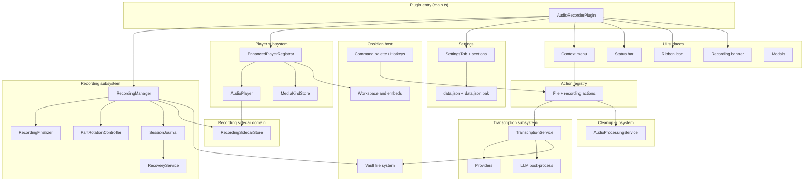
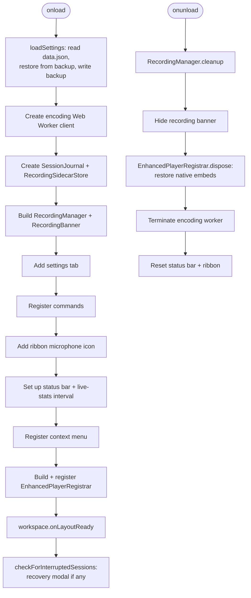
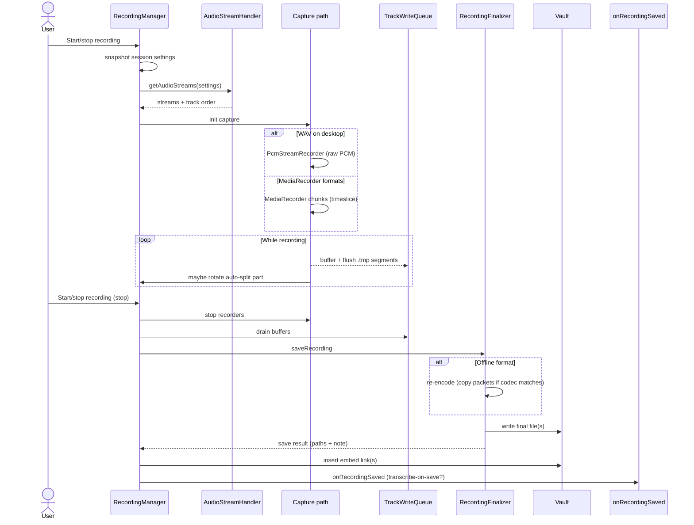
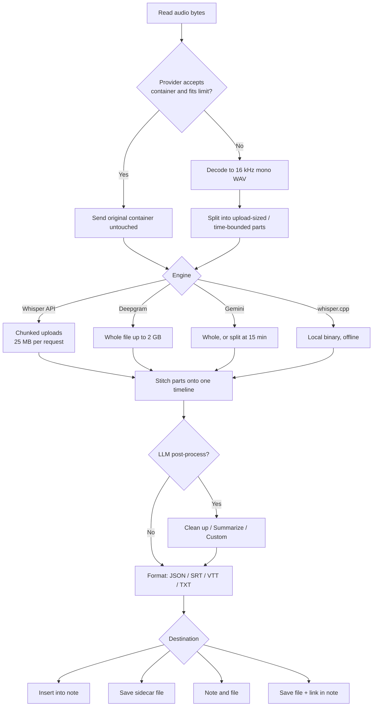
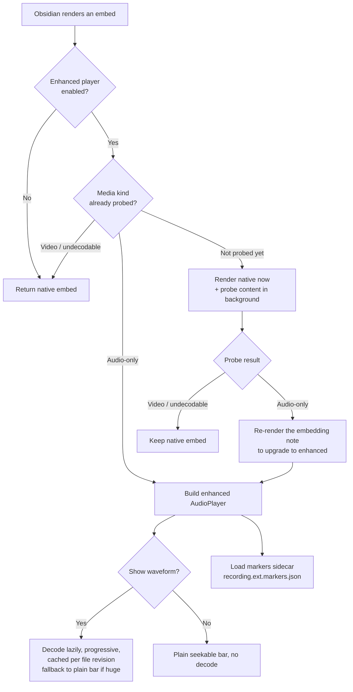
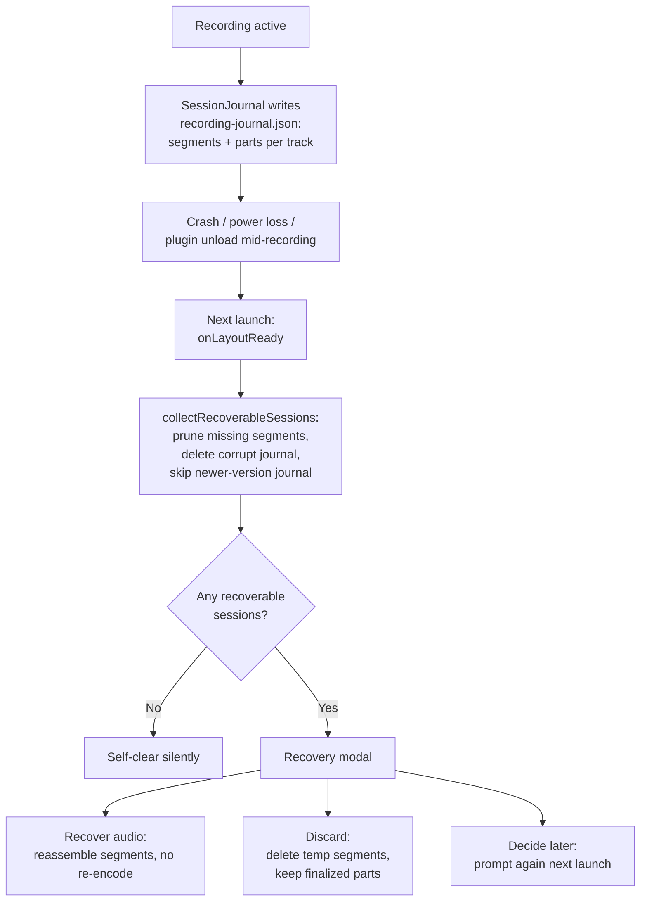
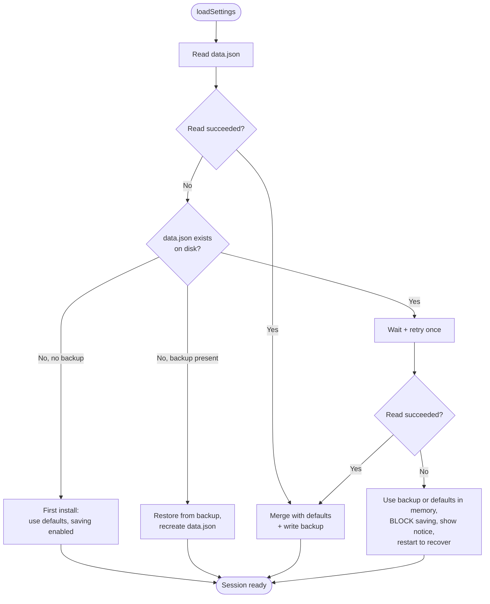

# Architecture

This document is a technical map of how **Advanced Audio Recorder** is put together: how the plugin loads, how a recording flows from microphone to file, how transcription and the enhanced player work, and how crash recovery and settings backup keep your data safe. It is written for contributors and curious power users. If you only want to _use_ the plugin, start with [Getting started](getting-started.md) and the [Features overview](features.md); come back here when you want to know _why_ something behaves the way it does, or where in the source a behavior lives.

Everything below is verified against the plugin source under `src/`. The plugin runs on **desktop and mobile** (it requires Obsidian `1.6.6+`). Platform differences are decided in one low-level policy layer, `src/platform/` (`platformKind.ts` detects the platform; `capabilities.ts` answers "is this feature available here?" and "which limit applies here?"). Feature code and the settings UI branch on named capabilities - multi-track capture, device selection, auto-split, PCM WAV capture, recovery journaling, local transcription, memory ceilings - never on the platform itself. Device-bound settings (input device ids, channel layouts) are stored per platform under a `perPlatform` branch in `data.json`, so a vault synced between a desktop and a phone never mixes their hardware configuration.

- [System overview](#system-overview)
- [Plugin lifecycle](#plugin-lifecycle)
- [Recording pipeline](#recording-pipeline)
- [Transcription pipeline](#transcription-pipeline)
- [Enhanced player takeover](#enhanced-player-takeover)
- [Crash recovery](#crash-recovery)
- [Settings load and backup](#settings-load-and-backup)
- [Module map](#module-map)

---

## System overview

The plugin entry point (`src/main.ts`) constructs a small set of long-lived managers and registers them with the Obsidian host. Each subsystem owns one concern: recording, playback, transcription, on-demand cleanup, settings, and the shared UI surfaces (status bar, ribbon, modals, context menu).

What to notice:

- **The plugin object is a thin coordinator.** `main.ts` builds the managers, wires their callbacks, and forwards UI events to them. The real work lives in the subsystem classes.
- **One `RecordingSidecarStore` is shared** by the recording subsystem (which writes markers captured during a session), the player subsystem (which reads and edits them), auto chapters, and the transcription feature (which stores the speaker roster and written outputs in the same sidecar document), so their cache and serialized write chain stay unified. The marker data model is a standalone domain (`src/markers/`), owned by neither subsystem; the sidecar persistence lives in `src/sidecar/`.
- **File actions are defined once, in a shared action registry** (`src/actions/`). The same declarative list - info, convert, split, clean up, transcribe, delete - is rendered into the file and editor context menus and registered as palette commands, so every action can also be assigned a hotkey. See [File operations](file-operations.md).
- **Settings persist to `data.json`** with an automatic `data.json.bak` next to it, described in [Settings load and backup](#settings-load-and-backup).

---

## Plugin lifecycle

`onload()` runs once when the plugin is enabled. It loads settings (with backup restore), builds the managers, registers commands and UI, and schedules the crash-recovery check for after the workspace is ready so plugin load is never delayed. `onunload()` tears everything down cleanly.

Notes on the lifecycle:

- **Settings load first**, because every manager constructed afterward receives a live `settings` reference. The load path can restore from `data.json.bak` and even block saving when the stored file is unreadable (see [Settings load and backup](#settings-load-and-backup)).
- **Streaming conversions are offloaded to a Web Worker** when the build injected its source; if that source is unavailable, everything falls back to the main thread.
- **Commands come from two places.** Four session commands are registered directly (`Start/stop recording`, `Pause/resume recording`, `Add marker/chapter at current position` - gated on markers being enabled and a session being active - and `Select audio input device`), and the shared action registry adds the rest: `Add bookmark at current recording position` and `Add chapter at current recording position` (same recording gate), plus one command per file action (`Audio file info`, `Convert audio format`, `Split audio into parts`, `Clean up audio`, `Transcribe audio`, `Delete recording`), each gated on the active file being audio. No default hotkeys are assigned - see [Recording](recording.md) and [Settings reference](settings-reference.md).
- **Recovery runs after layout is ready**, never during load, and a failure there is caught and logged so it can never break the plugin.
- **Unload restores Obsidian's native embeds first** (so disabling the plugin never leaves overridden media embeds behind), then flushes recording buffers best-effort. The crash-recovery journal is deliberately _not_ ended on unload - an unload mid-recording is exactly the case the next launch should offer to recover.

---

## Recording pipeline

A recording is driven by `RecordingManager`. When you start, it snapshots the session-scoped settings (format, mode, bitrate, auto-split config), acquires the input streams, and chooses one of two capture paths. When you stop, it drains buffers, finalizes the files, writes them, inserts the embed links, and fires the optional transcribe-on-save hook.

Key decisions in this pipeline:

- **Two capture paths.** WAV on desktop uses a `PcmStreamRecorder` that captures raw PCM directly and assembles a WAV on save - this streams to disk and handles long recordings reliably. Every other format (and WAV on mobile) uses a `MediaRecorder` started with a chunk timeslice, delivering compressed chunks. Format details and the online-vs-offline distinction are in [Formats](formats.md).
- **Buffering and flushing.** The `TrackWriteQueue` serializes per-track writes; chunks accumulate to a flush threshold and are written to `.tmp` segment files. These segments are what the crash-recovery journal tracks.
- **Auto-split rotation.** When auto-split is on (desktop, and not for a merged multi-track session), `PartRotationController` finalizes a part at each boundary while recording continues. WAV parts are split sample-exactly; compressed formats restart the recorder per boundary. See [Splitting](splitting.md).
- **Finalization.** `RecordingFinalizer` produces the final files and reports the save-progress stages you see in the status bar (`Saving > Flushing buffers > Assembling audio > Writing file > Cleaning up > Saved`). Offline formats are re-encoded here; packets are copied without re-encoding when the codec already matches.
- **Multi-track output.** In `Single file` mode the tracks are mixed into one file; in `Multiple files` mode each track is saved separately, with the source/device name (and the track number appended to disambiguate when tracks share a device). See [Multi-track recording](multi-track-recording.md).
- **Transcribe-on-save.** When `Transcribe after recording` is enabled, the hook transcribes only the first saved file - a multi-track session records the same audio per track, and an auto-split session would otherwise fire one request per part. See [Transcription](transcription.md) and [Transcribe after recording](use-cases/transcribe-after-recording.md).

---

## Transcription pipeline

`TranscriptionService` (in `src/transcription/`) reads the audio, prepares provider-ready payloads, transcribes each through the configured provider, stitches the results onto one timeline, optionally post-processes with an LLM, and renders the output. `runTranscription.ts` is the high-level entry point that then writes the configured destinations.

How the stages map to behavior:

- **Preparation is lazy.** When a provider accepts the original container and the file fits the per-request limit, the bytes are sent untouched - no decode, so peak memory stays at the encoded file size. Only when the container is unsupported or the file is too large/long does the service decode to 16 kHz mono WAV and split it into upload-sized (or time-bounded) parts. Each part materializes its WAV bytes only just before upload, so a multi-chunk job never holds more than one chunk in memory.
- **Per-engine limits and behavior.** Whisper API has a hard 25 MB per-request limit (larger files are resampled and chunked, then stitched; no diarization). Deepgram sends up to 2 GB whole with consistent diarization. Gemini uploads up to 2 GB whole, decodes containers it does not accept, and splits recordings longer than 15 minutes into stitched parts (diarized splits reset speaker numbering, surfaced as a warning). Local whisper.cpp runs a local binary fully offline. See [Transcription](transcription.md#engines) and the engine setup guides under [Use cases](use-cases/index.md).
- **Stitching.** Successful per-part transcripts are merged onto the original timeline. A part that overruns a provider's output-token budget is subdivided and retried rather than discarded; a part that fails outright is recorded as missing, and the run keeps the good parts and warns instead of failing the whole job.
- **Diarization is one gate for the whole run.** The effective diarize flag decides both whether speaker labels are requested and whether any returned labels are stripped, so the request-time and output-time decisions can never diverge. Diarization is only available for Deepgram and Gemini. See [Speakers and diarization](transcription.md#speakers-and-diarization).
- **LLM post-processing is best-effort.** A failure falls back to the raw transcript rather than discarding completed (and possibly already-billed) work. See [LLM post-processing](llm-post-processing.md).
- **Output is rendered then written.** Markdown is built with optional clickable `#t=` timecode links, and `runTranscription.ts` writes the sidecar file and/or inserts into the note per the `Destination` setting. If in-note insertion is the only requested destination but it fails (note not open, reading mode), a sidecar file is written as a safety net so a completed transcript is never silently dropped.

---

## Enhanced player takeover

`EnhancedPlayerRegistrar` is the single decision point for whether an embedded audio file gets the enhanced `AudioPlayer` or Obsidian's native embed. It registers a custom embed creator in Obsidian's internal embed registry (with a Markdown post-processor as a Reading-view-only fallback), classifies each file by probing its actual content, and upgrades open views once a file proves audio-only. The `AudioPlayer` itself is a thin coordinator over focused collaborators: `SeekController` (seeking and timecode math), `WaveformController` (peak decode and cache), `PlayerMarkerController` (bookmark/chapter edits), `DurationProbe` (cheap metadata-only duration read), `MediaEmbedShell` (the embed DOM shell), and the `PlayerControlsView`, `WaveformCanvas`, and `MarkerListView` views.

What this buys you:

- **Container classification, not extension.** The media kind is always determined by probing the actual content, cached per path, and persisted in the plugin folder (`MediaKindStore`), so an audio-only `.mp4` or `.webm` still gets the enhanced player, a file carrying a video track keeps Obsidian's native player, and the probe never repeats across sessions. See [Audio player](audio-player.md#audio-video-and-unsupported-files).
- **Both view modes stay correct.** Returning Obsidian's native embed unwrapped is what keeps Live Preview and Reading view consistent; the same re-render mechanism applies player setting changes immediately and identically in both modes.
- **Waveforms are cheap to scroll.** Peaks are computed once per file revision and cached, decoded lazily and progressively as the player scrolls into view, and fall back to a plain (still seekable) bar above a large safety size or when the file cannot be decoded. Turning off `Show waveform` skips decoding entirely.
- **Markers live in a sidecar.** Each recording's bookmarks and chapters are stored in a `recording.ext.markers.json` sidecar next to it; the registrar moves the sidecar on rename and removes it on delete so markers stay attached. Edits are allowed in Live Preview and read-only in Reading view. See [Markers and chapters](audio-player.md#markers-and-chapters).
- **Timecode links play from the offset in both view modes.** A document-level click handler intercepts `#t=` links that point to an audio file and plays from that offset instead of opening the file. It resolves the link the same in Reading view (a rendered `a.internal-link`) and Live Preview (read from the editor source, since CodeMirror renders the link without an attribute), seeks an on-screen embed in place when one exists, and otherwise plays the file's shared element through note-independent `DetachedPlayback` surfaced in the status bar.
- **One audio element and one command set per file.** Every playback surface - the embedded `AudioPlayer`, the status-bar controls, and `DetachedPlayback` - operates on the single shared element the `AudioPlayerRegistry` keys per file, and every play, pause, stop, skip, mute, volume, and seek routes through `src/player/playbackCommands.ts`. Keeping one element and one command source is what stops the surfaces drifting out of sync (playback running while an embed still reads `0:00`). Because mocked unit tests hid exactly that drift, a change to any playback surface must add a real integration test that drives the actual `AudioPlayer` against a real registry, as in `tests/integration/PlaybackSync.test.ts`.

---

## Crash recovery

While a desktop recording is active, `SessionJournal` records its temporary `.tmp` segment files in `recording-journal.json` inside the plugin folder. If Obsidian crashes, loses power, or the plugin is unloaded mid-recording, the next launch collects the surviving sessions and offers a recovery choice through `RecoveryService` and a modal.

Important details:

- **What can be recovered.** Everything already flushed to disk can be reassembled; in-memory audio still buffered below the flush threshold at the moment of the crash cannot. Recovery never transcodes - a raw reassembled container (or a WAV for PCM sessions) is the safest artifact a truncated stream can produce.
- **Pruning self-clears.** `collectRecoverableSessions` drops segments (and tracks, and sessions) whose files no longer exist and persists the pruned journal, so a crash before the first flush self-clears without ever prompting. A corrupt journal is deleted; a journal written by a newer plugin version is left untouched so a downgrade never destroys recovery data it cannot interpret.
- **MediaRecorder header rule.** A compressed track is only playable from its first segment (which carries the container header); if that segment was lost, the track is marked discard-only rather than producing an unplayable file.
- **Recover, Discard, Decide later.** Recover reassembles surviving segments and removes the consumed temp files. Discard deletes the temp segments but never touches finalized auto-split part files. Decide later leaves everything in place and the prompt returns next launch. See [Crash recovery](recording.md#crash-recovery) in the recording guide.

---

## Settings load and backup

Settings persist to `data.json` in the plugin folder, with a `data.json.bak` copy kept next to it. The load path in `main.ts` carefully distinguishes "no settings yet" (first install) from "settings exist but cannot be read" (a transient lock during a plugin update, a truncated file), and protects the stored file in the latter case.

Why it works this way:

- **Missing vs. unreadable is decided by an explicit `exists()` check**, not by the `loadData()` return value, because some filesystems map a missing file to the same result as a failed read.
- **The backup is refreshed on every successful load and save.** When `data.json` goes missing but the backup is present, the settings are restored _and a new `data.json` is written immediately_ so the backup is never left as the only copy.
- **An unreadable `data.json` blocks saving.** The session continues on the backup (or defaults), saving is disabled so the possibly intact and possibly newer stored file is never overwritten with fallback values, and a notice tells you to restart. A protective `exists()` failure is treated as "file present" so a possibly intact file is never overwritten.
- **External changes reload.** `onExternalSettingsChange` (sync, manual edit) reloads settings so a stale in-memory copy does not overwrite the external change on the next save.

See [Settings reference](settings-reference.md) for every individual setting and its default.

---

## Module map

The `src/` tree groups code by concern. The table below maps each area to its key directory and responsibility; file names are real and can be opened directly.

| Area             | Key directory under `src/`                                               | Responsibility                                                                                                                                          |
| ---------------- | ------------------------------------------------------------------------ | ------------------------------------------------------------------------------------------------------------------------------------------------------- |
| Entry point      | `main.ts`                                                                | Loads settings, builds managers, registers commands, ribbon, status bar, context menu, player, recovery                                                 |
| Recording        | `recording/` (`RecordingManager`, `RecordingFinalizer`, `TestRecorder`)  | Stream capture, PCM/MediaRecorder paths, write queue, auto-split rotation, finalization, the test recording                                             |
| Crash recovery   | `recording/` (`SessionJournal`, `RecoveryService`)                       | Journals temp segments and offers recovery, discard, or decide-later on next launch                                                                     |
| Audio encoding   | `audio/` (`AudioEncoder`, `AudioFormatConverter`, `formatRegistry`)      | Format registry, capability detection, PCM/WAV encoding, conversion, and the Web Worker encoding offload                                                |
| Actions          | `actions/` (`fileActions`, `PluginAction`, `registerActionCommands`)     | Single declarative list of file/recording actions, rendered into every menu and registered as commands                                                  |
| Player           | `player/` (`EnhancedPlayerRegistrar`, `AudioPlayer`, controllers, views) | Embed takeover, container probing (persisted in `MediaKindStore`), waveform decode/cache, playback controls                                             |
| Markers          | `markers/` (`markerModel`, `markerFactory`)                              | Pure marker/chapter data model: ordering, navigation, (de)serialization                                                                                 |
| Recording sidecar | `sidecar/` (`RecordingSidecarStore`, `recordingSidecarModel`)           | Persists the per-recording sidecar (markers + transcript roster/outputs/history); follows rename, move, and delete                                      |
| Transcription    | `transcription/` (`TranscriptionService`, `api`)                         | Audio preparation, provider dispatch, cancellation, stitching, output formatting and destinations                                                       |
| Providers        | `transcription/providers/`                                               | Whisper API, Deepgram, Gemini, and local whisper.cpp engine implementations                                                                             |
| LLM post-process | `transcription/llm/`, `llmPostProcess.ts`                                | Clean up, summarize, or apply a custom instruction to a finished transcript                                                                             |
| Cleanup          | `cleanup/` (`AudioProcessingService`, `audioDsp`)                        | On-demand offline DSP: high-pass filter, noise gate, loudness leveling                                                                                  |
| Settings         | `settings/` (`settingsSchema`, `SettingsTab`, `sections/`)               | Settings model and defaults (`settingsSchema`), serialization, validation, and the rendered settings tab                                                |
| UI surfaces      | `ui/` (`StatusBar`, `RibbonIcon`, modals)                                | Status bar, ribbon icon, recording banner, context menu, and every modal dialog                                                                         |
| Diagnostics      | `diagnostics/` (`SystemDiagnostics`, `SystemInfoModal`)                  | Environment, device, codec, and settings info collection and the read-only copyable JSON snapshot modal                                                 |
| Obsidian glue    | `obsidian/` (`embedRegistry`)                                            | Thin wrappers over Obsidian's internal embed registry API                                                                                               |
| Utilities        | `utils/`                                                                 | Time formatting, byte formatting, device helpers, link updating, debug logging                                                                          |
| Constants        | `constants.ts`                                                           | Format ids, limits, thresholds, defaults, and catalogue links used across the plugin                                                                    |
| Errors           | `errors.ts`                                                              | Shared error classes (`AudioStreamError`, `SettingsValidationError`, `RecordingError`, `EncodingError`) thrown across recording, settings, and encoding |

For the user-facing tour of each capability, see the [Features overview](features.md); for the exact controls and defaults, see the [Settings reference](settings-reference.md). If you hit a bug, the [Troubleshooting](troubleshooting.md) guide and the [Bug reporting guide](BUG_REPORTING_GUIDE.md) explain how to collect diagnostics.
