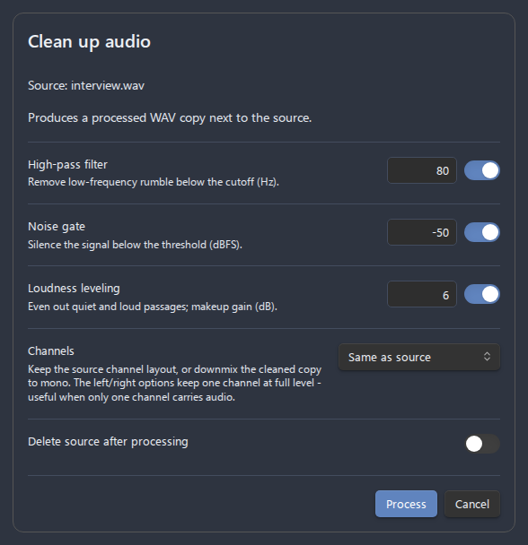

# Audio cleanup guide

The **Clean up audio** action runs offline digital signal processing (DSP) over an existing recording to remove background noise and even out loudness. It is **on-demand only** — it is invoked from the context menu, processes a file you choose, and writes a new copy. It never changes how live recording works, and it never overwrites the original.

- [Overview](#overview)
- [How to run it](#how-to-run-it)
- [Processing stages](#processing-stages)
  - [High-pass filter](#high-pass-filter)
  - [Noise gate](#noise-gate)
  - [Loudness leveling](#loudness-leveling)
- [Output](#output)
- [Defaults and settings](#defaults-and-settings)
- [Recommended settings](#recommended-settings)
- [Limitations](#limitations)
- [Troubleshooting](#troubleshooting)

## Overview

The browser's built-in input processing (noise suppression, echo cancellation, automatic gain control — configured under **Settings → Audio processing & feedback**) is applied *while recording*. The **Clean up audio** action is the stronger, after-the-fact alternative: it decodes a finished file, applies the stages you select, and writes a cleaned `…-processed.wav` copy next to the source.

Use it when:

- A recording has constant background hiss, hum, or room rumble.
- There is dead air / quiet gaps you want silenced.
- Quiet and loud passages are uneven and you want a more consistent level.
- You captured raw audio (browser filters off) and want to clean it selectively.

## How to run it

*Figure: the Clean up audio dialog with per-stage toggles and parameters.*

1. Right-click the target audio in any of these places:
   - the **File Explorer**,
   - an audio **embed link** in the editor (`![[recording.webm]]`),
   - an **embedded audio player**.
2. Choose **Clean up audio**.
3. In the dialog, toggle the stages you want and adjust their parameters. The toggles and values start from your settings defaults but can be changed per run.
4. (Optional) Enable **Delete source after processing** to move the original to the system trash once the cleaned copy is written.
5. Click **Process**. A notice reports the path of the written file.

At least one stage must be enabled, or the dialog asks you to enable one.

## Processing stages

The stages are applied in this order: **noise gate → high-pass filter → loudness leveling**. You can enable any combination.

### High-pass filter

Attenuates everything below a cutoff frequency, which removes low-frequency rumble: air conditioning, traffic, desk thumps, mains hum, and microphone handling noise.

| Parameter       | Meaning                                              | Range     | Default |
| --------------- | ---------------------------------------------------- | --------- | ------- |
| **Cutoff (Hz)** | Frequencies below this are progressively attenuated. | 20–300 Hz | 80 Hz   |

- **Speech**: 80–120 Hz is safe and removes most rumble without thinning the voice.
- **Music / full-range**: keep it low (20–40 Hz) or disable it, so you don't lose bass.

### Noise gate

Silences the signal whenever its level falls below a threshold, so quiet background noise between words/phrases disappears. The gate uses **hysteresis** (it opens at the threshold but only closes once the level drops a margin below it) plus attack/release smoothing, so it does not "chatter" on and off or introduce clicks.

| Parameter            | Meaning                                      | Range           | Default  |
| -------------------- | -------------------------------------------- | --------------- | -------- |
| **Threshold (dBFS)** | Audio quieter than this is gated to silence. | −80 to −20 dBFS | −50 dBFS |

- A **lower** threshold (e.g. −60 dBFS) gates only very quiet noise — safer, less aggressive.
- A **higher** threshold (e.g. −35 dBFS) removes more, but risks clipping the start/end of soft speech. Tune by ear.

### Loudness leveling

Runs the audio through a compressor and a makeup-gain stage to even out quiet and loud passages — useful for interviews or dictation recorded at an inconsistent distance from the mic.

| Parameter            | Meaning                                                | Range   | Default |
| -------------------- | ------------------------------------------------------ | ------- | ------- |
| **Makeup gain (dB)** | Gain added after compression to restore overall level. | 0–24 dB | 6 dB    |

The compressor itself uses fixed, speech-friendly settings (threshold −24 dB, ratio 12:1, knee 30 dB, attack 3 ms, release 250 ms). Raise the makeup gain if the result is quieter than you want; lower it if it sounds too loud or starts to distort.

## Output

- The cleaned file is always written as **16-bit PCM WAV**, regardless of the source format, because the cleanup re-encodes the decoded audio. The source's channel layout (mono/stereo) is preserved; the sample rate is the one the Obsidian audio engine decodes to, which may differ from the source.
- The file is saved **next to the source**, named `<source-name>-processed.wav`. If that name is taken, a numeric suffix is appended (`…-processed_1.wav`).
- The original file is left untouched unless you enable **Delete source after processing**. If processing succeeds but deleting the source fails, the cleaned copy is still kept and a notice explains what happened.
- **Linking into your note.** When you start the cleanup from an embed or player **inside a note**, the cleaned copy is linked into that note automatically: with **Delete source after processing** on, the source's embed is *replaced* with the cleaned file (so no broken link is left behind); with it off, the cleaned file's embed is *inserted on the line right after* the source, keeping both. The new links follow your link-format preferences, and the [enhanced player](audio-player.md) picks up the cleaned file straight away. Running cleanup from the **File Explorer** (where the active note does not embed the file) writes the copy but adds no link.

## Defaults and settings

*Figure: the Audio cleanup defaults section in plugin settings.*

Under **Settings → Advanced Audio Recorder → Audio cleanup defaults**, set the values the dialog starts from each time:

| Setting               | Description                                             | Default       |
| --------------------- | ------------------------------------------------------- | ------------- |
| **High-pass filter**  | Default on/off and cutoff (Hz) for the high-pass stage. | On, 80 Hz     |
| **Noise gate**        | Default on/off and threshold (dBFS) for the gate.       | Off, −50 dBFS |
| **Loudness leveling** | Default on/off and makeup gain (dB) for the compressor. | Off, 6 dB     |

These are only defaults — every run can override them in the dialog.

## Recommended settings

| Use case                | High-pass     | Noise gate   | Leveling  |
| ----------------------- | ------------- | ------------ | --------- |
| Voice note / dictation  | On, ~90 Hz    | On, −50 dBFS | On, ~6 dB |
| Interview (two voices)  | On, ~80 Hz    | On, −45 dBFS | On, ~4 dB |
| Lecture in a noisy room | On, ~100 Hz   | On, −40 dBFS | On, ~6 dB |
| Music / instrument      | Off or ~30 Hz | Off          | Off       |

Start conservative and re-run with stronger settings if needed — the original is preserved, so you can experiment freely.

## Limitations

- **Output is always WAV.** Convert it afterwards with **Convert audio format** from the context menu if you need a compressed format.
- **Size and length caps.** Cleanup decodes the whole file into memory, then processes it one time segment at a time so memory stays bounded regardless of the recording length — a roughly 45-minute stereo recording is cleaned up in memory without splitting it first. A file is still refused with a clear message when it is larger than 1 GB (checked before decoding), longer than two hours, or decodes to more samples than the working set allows (checked right after decoding). The decoded-size cap catches a heavily compressed file that is small on disk yet expands to several gigabytes once decoded. For a file over the cap, split it first (**Split audio into parts**) and clean each part.
- **Desktop only.** The plugin is desktop-only, so cleanup runs only in the Obsidian desktop app. Processing a long file briefly uses significant memory and CPU.
- **Not real-time.** This is post-processing. To shape the signal *during* recording, use the browser input toggles under **Audio processing & feedback** instead.

## Troubleshooting

- **"Audio file is too large to clean up here"** — the file exceeds the 1 GB on-disk limit, or it decodes to more samples than the working set allows (roughly a 45-minute stereo recording). Split it into parts and process each part.
- **"Audio is too long to clean up here"** — the file exceeds the two-hour limit. Split it into parts and process each part.
- **"The file contains no decodable audio data"** — the file is empty or its container/codec can't be decoded by the app. Check the file with **Audio file info**, or convert it first.
- **"Audio processing failed: …"** — decoding or writing failed; the message carries the cause. Verify the file is a valid audio file and that there is free space in the vault.
- **The voice sounds thin** — lower or disable the high-pass cutoff.
- **Words get cut off / choppy** — lower the noise-gate threshold (e.g. from −40 to −55 dBFS) or disable the gate.
- **Result is too quiet or too loud** — adjust the leveling makeup gain.
