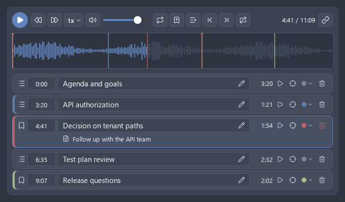
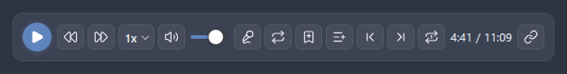
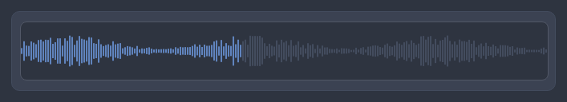
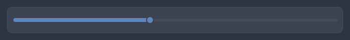
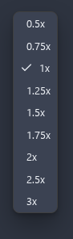
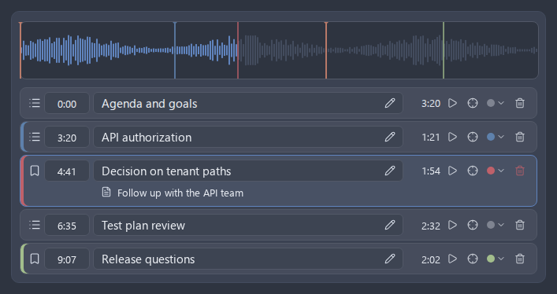
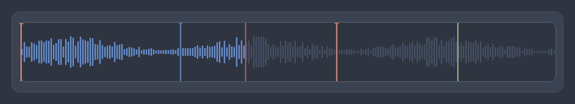
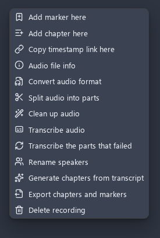

# Enhanced audio player

The **Enhanced audio player** replaces Obsidian's built-in audio embed with a richer player wherever an audio file is embedded (`![[recording.webm]]`). It adds a waveform seek bar, playback-speed control, skip buttons, volume and mute, a loop toggle, a chapter repeat, a time display, per-file markers and chapters, and a copy-timestamp-link action. A recording left part-heard resumes where it stopped, and playback is announced to the operating system so the lock screen and the media keys can drive it. While a recording plays, a companion strip of playback controls also appears in the status bar so you can drive it without scrolling back to the embed, and every one of those actions is also a command you can bind to a hotkey. The takeover is opt-in, applies in both Reading view and Live Preview, and falls back cleanly to Obsidian's native embed for video files, undecodable files, or when the feature is off.

- [Enabling the player](#enabling-the-player)
- [How the takeover works](#how-the-takeover-works)
- [The controls](#the-controls)
    - [Waveform seek bar](#waveform-seek-bar)
    - [Playback speed](#playback-speed)
    - [Skip forward and back](#skip-forward-and-back)
    - [Volume and mute](#volume-and-mute)
    - [Loop](#loop)
    - [Repeat chapter](#repeat-chapter)
    - [Time display](#time-display)
    - [Copy timestamp link](#copy-timestamp-link)
- [Resuming where you left off](#resuming-where-you-left-off)
- [Playback controls in the status bar](#playback-controls-in-the-status-bar)
- [System media controls](#system-media-controls)
- [Searching markers across the vault](#searching-markers-across-the-vault)
- [Exporting chapters and markers](#exporting-chapters-and-markers)
- [Playback commands and hotkeys](#playback-commands-and-hotkeys)
- [Markers and chapters](#markers-and-chapters)
- [Timecode links](#timecode-links)
- [Audio, video, and unsupported files](#audio-video-and-unsupported-files)
- [Related settings](#related-settings)


_Figure: the enhanced player rendered in place of an audio embed, with the waveform seek bar above the control row._

## Enabling the player

The enhanced player is off by default. Turn it on under **Settings > Advanced Audio Recorder > Audio player > Enhanced audio player**.

1. Open **Settings > Advanced Audio Recorder**.
2. Scroll to the **Audio player** section.
3. Enable **Enhanced audio player**.
4. Two more options appear below it - **Show waveform** (on by default) and **Markers and chapters** (on by default).


_Figure: the Audio player settings section, with the master toggle and its two windows._

The change applies to notes that are **rendered after** the change. Toggling the master switch flips what every embed is (native versus enhanced), so the plugin re-renders open notes to rebuild their embeds. Disabling **Enhanced audio player** restores Obsidian's built-in embed on the next render.

The two sub-toggles - **Show waveform** and **Markers and chapters** - apply **in place** to already-open players, so flipping either one updates the live player immediately without re-rendering the note or interrupting playback. See [Related settings](#related-settings).

---

## How the takeover works

The player integrates with Obsidian's own embed rendering rather than bolting on afterward:

- **Embed registry.** The plugin registers a custom embed creator in Obsidian's internal embed registry for its media extensions (`wav`, `webm`, `ogg`, `mp3`, `mp4`, `m4a`, `aac`, `flac`). Obsidian itself then builds the embed through the plugin in **both Reading view and Live Preview**, so the enhanced player is the embed rather than something layered over a native one.
- **Markdown post-processor fallback.** When the internal embed-registry API is unavailable, the plugin falls back to a Markdown post-processor that takes over embeds in **Reading view only**. A console warning notes when this fallback is in use.
- **Clean teardown.** Each player is a render child whose lifecycle - event listeners, the audio element, observers, and registry registration - is torn down automatically when the note re-renders or its leaf closes. If the enhanced render ever throws, the embed degrades to a plain native `audio` element so the note still opens and the audio still plays.

A single audio element is shared per file across view modes, so the same playback is controlled whether you are in Reading view or Live Preview, and switching modes does not stop and restart playback.

The player also keeps working in **pop-out windows**: moving a note that embeds a recording into its own window preserves the right-click menu and timecode-link playback there, because the plugin binds those handlers to each window's own document rather than only the main one.

> **Desktop and mobile.** The enhanced player works in both the Obsidian desktop app and the mobile app (iOS and Android), taking over audio embeds wherever Obsidian renders them; waveform extraction relies on the Web Audio API available in both. See [Mobile support](mobile-support.md).

---

## The controls

Every control below is **fixed** in what it does. Only the master **Enhanced audio player** toggle, the two windows (**Show waveform**, **Markers and chapters**), and the **Skip step** can be changed in settings.


_Figure: the full control row of the enhanced player._

### Waveform seek bar

The recording is drawn as a waveform that doubles as the seek bar.

- **Click or drag** anywhere on it to seek. A drag that leaves the bar still tracks, because the bar captures the pointer on press.
- **Keyboard.** Focus the seek bar and use the arrow keys to nudge the position by **5 seconds** per press (`ArrowRight`/`ArrowUp` forward, `ArrowLeft`/`ArrowDown` back). `Home` jumps to the start; `End` jumps to the end. The seek bar is exposed as a slider for screen readers.
- **Played portion.** The part you have already played uses the **theme accent color**, so progress is visible at a glance.
- **Caching.** Waveforms are computed once per file revision (keyed on the file path, modification time, and size) and cached, so scrolling a note with many players does not re-decode audio. Resizing the window or switching view modes redraws from the cache instead of decoding again.
- **Lazy and progressive decoding.** Decoding is deferred until the player scrolls near the viewport, so a long note with several recordings does not decode every embed up front. Peaks are then computed progressively in the background and the waveform fills in as they become ready, so even an hour-plus recording never blocks the interface.
- **Plain-bar fallback.** A file larger than the safety ceiling (**1 GB** on disk), or one the app cannot decode, falls back to a plain - but still seekable - progress bar instead of the waveform. The plain bar shows a filled track for the played portion and a thumb at the current position.
- **Disabling the waveform.** Turn off **Show waveform** in settings to always use the plain bar. No audio is decoded in that mode at all.


_Figure: the waveform seek bar, with the played portion in the theme accent and the current position marked._


_Figure: the plain (still seekable) bar shown when Show waveform is off or the file exceeds the decode ceiling._

### Playback speed

Click the **speed** button to open a dropdown of presets and pick any one (the current rate is checked). The presets are `0.5×`, `0.75×`, `1×`, `1.25×`, `1.5×`, `1.75×`, `2×`, `2.5×`, and `3×`.

New players start at `1×`. The button always shows the current rate.


_Figure: the playback-speed dropdown, opened from the speed button._

### Skip forward and back

The **back** and **forward** buttons jump playback by the configured **Skip step** in each direction, clamped to the track bounds. The step is 10 seconds unless you change it, and the button labels name the step in force, so they always say what they will do.

### Volume and mute

- A **volume slider** sets the level from 0 to 1. Dragging it above 0 while muted automatically unmutes.
- The **mute** button toggles mute and reflects the state with its icon.

### Loop

The **loop** button toggles whether the recording repeats when it reaches the end. Loop is **off** for a newly opened recording and stays on once you enable it for the shared audio element.

### Repeat chapter

The **repeat chapter** button repeats the chapter playback is currently inside. When playback reaches the start of the following chapter it returns to the start of the repeated one, which is what makes an unclear passage or a stretch of foreign speech replay without touching the seek bar. The last chapter is repeated too: nothing follows it, so the end of the recording is its boundary.

Moving to another chapter moves what repeats. A chapter jump, a click on a marker, and a drag of the seek bar all take the repeat with them, so you are never pulled back to the chapter you were listening to a moment ago.

The button appears only when **Markers and chapters** is enabled for the recording, because a recording without chapters defines no stretch to repeat. Repeat is per recording and starts **off**; it is not remembered between sessions.

### Time display

The time readout shows **elapsed / total** time (for example `1:05 / 3:42`). Both sides are formatted against the total length so they line up. A file whose duration the browser does not report up front (common for MediaRecorder WebM, and some multitrack MP4 files) is probed automatically so the total fills in.

### Copy timestamp link

The **link** button copies a [timecode link](#timecode-links) to the **current position** - for example `[[recording#t=1:30]]` - to the clipboard, following your vault's link-format preferences. A notice confirms the copied timestamp. You can also copy a link at any other position from the [right-click menu](#markers-and-chapters).

---

## Resuming where you left off

A recording you leave part-heard **remembers where you stopped**, and the next time you open the note it starts from there rather than from the beginning. The position is written when playback pauses, and again when the note is closed, which covers both ways a listening session ends.

Two boundaries keep the memory useful. A position in the **first 15 seconds** is not remembered, because resuming there saves nothing. A position in the **last 15 seconds** counts as heard out, and so does playing a recording to its end: either clears the stored position, so a recording you have finished starts from the beginning next time.

The position lives in the recording's [sidecar file](transcription.md), next to its markers and chapters, so it travels with the recording through a rename and is removed with it. A recording that carries nothing else gets a sidecar of its own once it is left part-heard, and that file is deleted again as soon as the position is cleared.

A [timecode link](#timecode-links) outranks the remembered position. An embed that names a position, such as `![[recording#t=1:30]]`, starts at the position the link asks for, because that is an explicit request and the memory is not.

---

## Playback controls in the status bar

Whenever an enhanced player is playing, a compact set of **playback controls appears in the status bar** at the bottom-right of the Obsidian window, so you can drive the recording without scrolling back up to the embed. This is the same status-bar slot that shows `Recording...` while you capture; during playback it switches to the transport strip shown below.


_Figure: the status-bar playback controls shown while a recording plays, with transport, volume, marker, chapter, and time._

The strip carries:

- **Skip back and skip forward** by the configured **Skip step** (10 seconds by default), the same step as the embed's skip buttons.
- **Play or pause** and **stop**. The button reflects the live state, and stop resets the position to the start.
- **Mute** and a **volume slider** from 0 to 1. Dragging the slider above 0 while muted unmutes it, matching the embed.
- **Add marker** and **add chapter** at the current position. These two appear only when **Markers and chapters** is enabled for the playing recording.
- **Repeat chapter**, which engages the same repeat the embed's button does and shows the same state. It appears whenever the playing recording has chapters, including in Reading view where the add buttons do not.
- The **elapsed over total time** readout, formatted the same way as the embed.

Playback speed is deliberately left out here to keep the strip compact; change the speed from the embed's speed button or with the [speed commands](#playback-commands-and-hotkeys) instead. Every button drives the **same playback** as the embedded control row, because both delegate to one shared audio element per recording, so an action in one surface is reflected in the other.

The strip **appears when playback starts** and **disappears when you stop it** - with the stop button here, with the stop action in the embed, or when the recording reaches its end. Pausing keeps the strip visible, showing the play icon, so you can resume from the status bar; only stopping or reaching the end dismisses it. Recording and saving always take precedence: starting a recording while a player is paused shows the recording controls instead, and the playback strip returns once recording stops if the audio is still active.

---

## System media controls

While a recording plays, the plugin announces it to the operating system, so it can be driven from **the lock screen, the media keys, and a headset button** without bringing Obsidian to the front. The announcement names the recording and the chapter playback is inside, and reports the position so a lock screen can draw a scrubber.

The system is offered **play**, **pause**, **stop**, **skip back**, **skip forward**, and **seek to a position**. A recording with chapters is additionally offered **previous track** and **next track**, which move between chapters rather than between files; a recording without them is not, because there would be nothing for the plugin to do with the press.

Every one of those controls drives the **same playback** as the embed and the status bar, because all three go through one shared audio element per recording. A skip from the media keys moves the embed's time display, and a pause from the lock screen shows the play icon in both surfaces.

The skip controls move by the configured **Skip step**, unless the system asks for a specific offset of its own, in which case that offset is used.

The announcement is **taken down** when playback stops and when the plugin unloads, so the system controls never outlive the plugin that answers them. A platform that offers no media session integration gets no announcement and is otherwise unaffected.

---

## Playback commands and hotkeys

Every playback action is also a **command**, so a recording can be driven entirely from the keyboard while your hands stay on the transcript. The plugin assigns **no default hotkeys**; bind the ones you use under **Settings > Hotkeys** and search for `Advanced Audio Recorder`.

| Command                                   | What it does                                                                            |
| ----------------------------------------- | --------------------------------------------------------------------------------------- |
| Play/pause playback                       | Starts the paused recording or pauses the running one, exactly as the play button does. |
| Stop playback                             | Stops playback, resets it to the start, and dismisses the status-bar strip.             |
| Skip playback back                        | Moves back by the same step the skip buttons use.                                       |
| Skip playback forward                     | Moves forward by that same step.                                                        |
| Mute/unmute playback                      | Toggles the output without touching the volume level.                                   |
| Increase playback speed                   | Steps up to the next speed preset and stops at the fastest one.                         |
| Decrease playback speed                   | Steps down to the previous preset and stops at the slowest one.                         |
| Go to previous chapter                    | Jumps to the chapter before the current position, or to the start when there is none.   |
| Go to next chapter                        | Jumps to the chapter after the current position.                                        |
| Repeat current chapter                    | Turns repeating of the chapter playback is inside on or off.                            |
| Search markers and chapters               | Opens the vault-wide marker search; offered with nothing playing.                       |
| Add bookmark at current playback position | Drops a bookmark where playback stands.                                                 |
| Add chapter at current playback position  | Drops a chapter where playback stands.                                                  |

The marker search is the exception to everything that follows: it is bound to no recording, so it is always offered. The commands below exist **only while something is playing**. Obsidian hides a command whose availability check fails, so with nothing active none of them appear in the command palette and a bound hotkey stays inert, which leaves the key free for whatever else it is used for. Stopping playback, or letting a recording reach its end, withdraws them again; pausing keeps them, so the same key resumes what it paused.

Three of them carry a further condition. The chapter jumps and the chapter repeat are offered only when **Markers and chapters** is enabled for the recording that is playing, because a recording without them defines no chapters to move between or to repeat. The two add commands need that setting **and** an editable view, exactly like the add buttons in the embed and in the status bar, so a player rendered in Reading view offers neither.

The speed commands move between the same presets the embed's speed button lists, so a hotkey can never land on a speed that button cannot show. Every command drives the **same shared audio element** as the embedded control row and the status-bar strip, which is why a speed change from a hotkey updates the embed's speed button and a chapter jump moves the time readout in both surfaces at once.

---

## Markers and chapters

With **Markers and chapters** enabled, each recording can carry per-file **bookmarks** (jump points) and **chapters** (named segments). These are extra navigation aids stored alongside the recording; they do not change the audio.


_Figure: the marker list under the player, with bookmark ticks and chapter boundaries on the seek bar._

**Adding markers**

- **Add a bookmark** at the current position with the **bookmark** button, or by **double-clicking the waveform** at the spot you want.
- **Add a chapter** at the current position with the **chapter** button.
- Each new entry gets a default label and is added to the [marker list](#markers-and-chapters), where you can rename it. A notice confirms the addition with its timestamp.

**On the seek bar**

- **Bookmarks** appear as **ticks** on the seek bar.
- **Chapters** appear as **labelled boundary lines**.
- Clicking either one jumps playback to it (without forcing play/pause to change).


_Figure: bookmark ticks and chapter boundaries rendered on the seek bar._

**The marker list**

The list below the player shows every marker and chapter in time order. From it you can:

- **Jump** to an entry by clicking its time (or the whole row in Reading view).
- **Rename** an entry by editing its label inline (saved shortly after you stop typing).
- **Move** an entry to another time by typing into its time field, in any of the forms a timecode link accepts (`90`, `1:30`, `0:01:30`). A time that means nothing is refused and the field goes back to what it showed.
- **Move** an entry to wherever playback currently is with the crosshair button beside its time. A marker is almost always pressed a beat after the thing worth marking, so this is the quickest way to correct one.
- **Note** an entry in the field under its row, for the reason a short label cannot hold.
- **Colour** an entry from its colour picker, to tell apart what different markers are for.
- **Delete** an entry with its trash button.

A time outside the recording is refused with a notice and the marker stays where it was. Moving a marker re-orders the list around it and recomputes the neighbouring segment lengths.

A marker's colour shows as an edge on its row and as the colour of its tick on the seek bar, so a long recording's markers can be told apart at a glance. A marker with no colour looks exactly as it always did. In Reading view the note is shown under the row and is part of the row's accessible name, so it reaches a screen reader as well as the eye.

The currently playing segment is highlighted as playback crosses chapter boundaries. The read-only list also shows each segment's length.

**Chapter navigation**

The **previous chapter** and **next chapter** buttons move between chapter boundaries. Previous-chapter from just after a boundary returns to the start of the current chapter.

**Right-click menu**

Right-click the player to add a **marker** or **chapter**, or copy a **timestamp link**, **at the clicked position** - alongside the usual audio file actions (info, convert, split, delete). Position-aware actions use the spot under the cursor. The **add marker** and **add chapter** items appear only when **Markers and chapters** is enabled and the note is open for editing (Live Preview); **copy timestamp link** is always available.


_Figure: the right-click menu on the player, with position-aware marker, chapter, and timestamp actions._

**Editing versus read-only**

Adding, renaming, moving, noting, colouring, and deleting markers is available while **editing** the note (Live Preview). In **Reading view** the markers and chapters are **read-only** - they are shown and remain clickable to jump, but cannot be edited. The player defaults to read-only and only enables edit controls once it confirms it is inside the editor, so Reading view never wrongly shows edit affordances.

**Storage and portability**

Markers are stored in a **sidecar file** next to each recording, named `<recording>.markers.json` (for example `recording.webm.markers.json`). The file is the recording's **shared sidecar** (format version 2): besides the markers and chapters it also carries the transcription data behind [speaker renaming](transcription.md#naming-speakers) - the speaker roster with assigned names, the outputs each transcription wrote, and the rename history. A marker's note and colour are stored with it, and only when it carries them: a marker without either is written exactly as it was before the two existed, so a sidecar does not change merely by being read and written again. Sidecars written by older plugin versions (version 1, markers only) are read as-is and upgraded on the next write without losing anything. Because the sidecar lives in your vault:

- Markers **survive a plugin reinstall**.
- They **travel with the vault**.
- Renaming, moving, or deleting the recording **moves or removes its sidecar automatically**, so markers stay attached and never orphan. Deleting all of a recording's markers removes the sidecar once it holds no transcript data either, so the vault is not left with empty files.
- A sidecar file that exists but **cannot be read** (damaged JSON, a sync conflict) is treated as unreachable rather than empty: the plugin pauses writes to it so the possibly intact data is never overwritten, and re-reads the file on every access, so fixing or removing it recovers without a restart. A marker edit refused this way is **said out loud**: the player shows why the save failed and rolls the view back instead of pretending the marker was added.

Markers can also be added **while recording**, before the file even exists as a player - see [Marking moments while recording](recording.md#marking-moments-while-recording). Those markers attach to the recording's sidecar at save and show up in the player once the recording stops.

---

## Searching markers across the vault

The command **Search markers and chapters** opens a fuzzy search over **every marker and chapter in the vault**, so a passage can be found without remembering which recording holds it. Unlike the playback commands, it is available with nothing playing and no audio file open, because it is bound to no recording.

A query is matched against three things: the marker's **own name**, the **recording** it is in, and any **note** written on it. Each result shows the marker's name on the first line, and on the second the kind, the recording, the position, and the note. Choosing one plays that recording from the marker, through the same mechanism a [timecode link](#timecode-links) uses.

The vault is scanned **once per session**, on the first search. Every sidecar is read at most once, and typing into the search reads nothing further, so the search stays usable on a phone. Recordings with no markers are not in the index and cannot be found through it.

The index keeps itself current: a recording renamed or deleted is carried over or dropped, and a sidecar written outside a player, by a finished recording or by generated chapters, is re-read for that recording alone.

---

## Exporting chapters and markers

**Export chapters and markers**, in the recording's context menu, the editor menu of its embed, and the command palette, writes the recording's markup out in one of three forms:

- A **timecoded list**, one line per marker with the timecode first, which is the form a video description box takes. Written to `<recording>.chapters.txt` beside the audio.
- A **cue sheet**, which players and audio editors read. Written to `<recording>.cue`. Only chapters go into it: a cue sheet describes a division of the recording into playable tracks, and a bookmark is a point rather than a division.
- A **Markdown outline** whose timecodes are **clickable links** into the recording, built by the same mechanism transcripts use, so pressing one moves playback there. It is inserted into the open note or copied to the clipboard, as you choose.

The timecodes widen together to the longest one in the export, so a recording over an hour renders every line as `h:mm:ss` and the list reads as a column. A note written on a marker is appended after a dash, in all three forms.

The action is offered on every recording, because whether it has any markers cannot be known without reading the sidecar; a recording with none simply says so.

---

## Timecode links

A link with a `#t=` offset plays the recording from that position instead of opening the file. The offset accepts several formats:

| Format    | Example      | Meaning                |
| --------- | ------------ | ---------------------- |
| Seconds   | `#t=90`      | 90 seconds (1:30)      |
| `m:ss`    | `#t=1:30`    | 1 minute 30 seconds    |
| `h:mm:ss` | `#t=1:02:03` | 1 hour 2 min 3 seconds |

When a matching player is visible in the note, **clicking the link seeks it** and starts playback in place. When no player for that file is on screen - for example the embed is scrolled out of view, so Live Preview has unloaded it - the click starts playback from that moment anyway, driven straight from the file and controlled through the [status-bar playback controls](#playback-controls-in-the-status-bar), so a transcript timestamp never dumps you onto the raw file in a new tab. A single embed with a `#t=` offset displays that start position until you engage playback, without dragging other embeds of the same file.

A note with the recording embedded above a transcript line rendered this way looks like this:

```markdown
![[meeting-notes.webm]]

[[meeting-notes.webm#t=1:30]] **Speaker 1** Let's start with the budget review for next quarter.
```

Clicking the `[[meeting-notes.webm#t=1:30]]` link seeks the embedded player above it to `1:30` instead of opening the file.

Timecode links are also how transcripts become clickable: when **Timestamps as player links** is on, each transcript timestamp is rendered as a `#t=` link that seeks the player to that moment - click a line to hear it. See [Transcription > output formatting](transcription.md#output-where-the-transcript-goes) for how those links are generated, and [Copy timestamp link](#copy-timestamp-link) above to create one by hand.

This makes reviewing a transcript hands-off. Start the recording playing, from the embed or by clicking a first timestamp, then click any later timestamp to **jump playback straight to that line** instead of scrubbing the seek bar. Each transcript line carries an alias, so the timestamp renders as the readable time while still pointing at the exact offset:

```markdown
[[meeting-notes.webm#t=6:33|6:33]] **Speaker 3** That's a lot of progress.
```

Here the visible `6:33` is clickable and seeks the player to 6 minutes 33 seconds. The [status-bar playback controls](#playback-controls-in-the-status-bar) follow every jump, so you can pause, skip, or drop a marker from the bottom of the window as you read, without returning to the embed.

---

## Audio, video, and unsupported files

The enhanced player takes over **audio-only** files. Other media is left to Obsidian's built-in player:

- **Audio-only files** get the enhanced player.
- **Files that carry a video track** (for example a `.mp4` or `.webm` with video) keep Obsidian's built-in player, so the video can be watched.
- **Files the app cannot decode** fall back to the built-in embed as well.

Crucially, the media kind is classified from the file's **container metadata, not its extension**. Each file is probed once and cached. This means an **audio-only `.mp4` or `.webm`** recording still gets the enhanced player, even though those containers can also hold video. A file that has not been probed yet renders natively for a moment and is then upgraded to the enhanced player in place once the probe confirms it is audio-only.

The waveform is drawn for supported audio files up to the **1 GB** decode ceiling; a larger or undecodable file falls back to the plain (still seekable) bar, as described under [Waveform seek bar](#waveform-seek-bar).

---

## Related settings

Those settings live under **Settings > Advanced Audio Recorder > Audio player**, together with the **Skip step**. The player's other controls (speed, volume, mute, loop, time display, copy-timestamp link) are fixed and are not listed here because there is nothing to configure.

| Setting                   | Description                                                                                                                                                | Default |
| ------------------------- | ---------------------------------------------------------------------------------------------------------------------------------------------------------- | ------- |
| **Enhanced audio player** | Replace the built-in audio embed with the enhanced player. Enabling it reveals the two options below. Applies to notes rendered after the change.          | Off     |
| **Show waveform**         | Draw a waveform behind the seek bar. When off, a plain (still seekable) progress bar is shown and no audio is decoded. Applies in place to open players.   | On      |
| **Markers and chapters**  | Show the markers and chapters list and the add/jump/rename/delete and chapter-navigation controls. Markers are stored in a sidecar next to each recording. | On      |

For the full settings tour, see the [Settings reference](settings-reference.md#audio-player). For the player's role in the wider feature set, see [Features](features.md). For markers added during capture, see [Recording](recording.md). For clickable transcript timestamps, see [Transcription](transcription.md).
