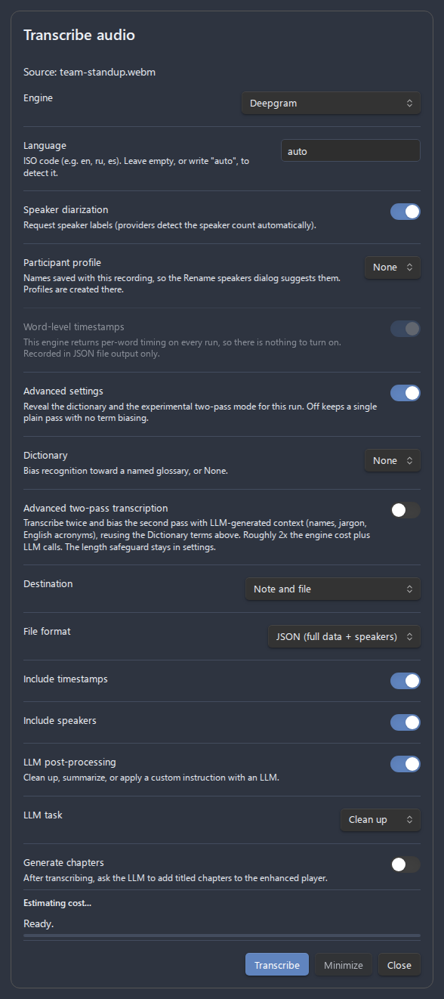
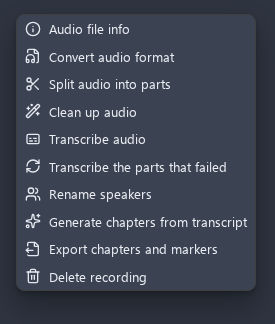

# Features overview

Advanced Audio Recorder is a recording plugin for [Obsidian](https://obsidian.md) that runs on desktop and mobile, captures audio from one or many input devices, saves it in the format you choose, and layers on an enhanced player, transcription, on-demand cleanup, and diagnostics. This page is a complete catalog of every feature in the plugin: each one gets a short summary and a **Learn more** link to its deep-dive doc. Use it as a map - start anywhere, then follow the links for full procedures, settings, and limitations. A few features are desktop-only; see [Mobile support](mobile-support.md).

- [Recording](#recording)
- [Pause and resume](#pause-and-resume)
- [Markers while recording](#markers-while-recording)
- [Crash recovery](#crash-recovery)
- [Automatic splitting](#automatic-splitting)
- [Multi-track recording](#multi-track-recording)
- [Output formats and encoding](#output-formats-and-encoding)
- [Format conversion](#format-conversion)
- [Manual splitting](#manual-splitting)
- [Audio file info](#audio-file-info)
- [Delete and delete-and-link](#delete-and-delete-and-link)
- [Enhanced audio player](#enhanced-audio-player)
- [Markers and chapters](#markers-and-chapters)
- [On-demand audio cleanup](#on-demand-audio-cleanup)
- [Input processing and live feedback](#input-processing-and-live-feedback)
- [Transcription](#transcription)
- [LLM post-processing](#llm-post-processing)
- [Auto chapters](#auto-chapters)
- [Diagnostics](#diagnostics)
- [Feature matrix](#feature-matrix)

_Figure: The plugin settings tab, where every feature below is configured._

---

## Recording

Start and stop a recording from the **microphone icon** in the left ribbon or with the `Start/stop recording` command. While recording, the ribbon icon switches to an active indicator and the **status bar** shows `Recording...` with **Pause** and **Stop** buttons. When you stop, the plugin flushes its buffers, assembles the file, writes it to your save location, and inserts an embed link (`![[filename.ext]]`) into the active note. For longer recordings a save-progress bar walks through stages (`Saving...` > `Flushing buffers...` > `Assembling audio...` > `Writing file...` > `Cleaning up...` > `Saved`) while the ribbon shows a save icon.

To choose which microphone is used, run the `Select audio input device` command. It opens a quick-pick modal listing the detected input devices; choosing one saves it to settings immediately and shows a confirmation notice.

Learn more: [Recording](recording.md)

## Pause and resume

Pause an active recording and pick it up again without losing what you have captured. Run `Pause/resume recording` or click **Pause** in the status bar; the bar then reads `Recording paused` with **Resume** and **Stop**. Paused time is excluded from the elapsed counter, so the timer reflects actual recorded audio. The command is available only while a recording is active.

Learn more: [Recording](recording.md#pausing-and-resuming)

## Markers while recording

When **Markers and chapters** is enabled, you can drop a bookmark or chapter at the live position without waiting for playback. Click **Add marker** in the status bar or run `Add marker/chapter at current position` (available while recording or paused). Two more commands - `Add bookmark at current recording position` and `Add chapter at current recording position` - drop a marker of that kind directly, skipping the kind selector, so each can be bound to its own hotkey. A small dialog lets you name the marker and choose its kind, and the timestamp is **frozen at the moment you triggered it** so naming never shifts the position. The marker is attached to the recording's sidecar at save and appears in the enhanced player once the recording stops.

Learn more: [Recording](recording.md#marking-moments-while-recording)

## Crash recovery

Desktop recordings journal their temporary segment files (`recording-journal.json` in the plugin folder) while a session is active. If Obsidian crashes, loses power, or the plugin is disabled mid-recording, the next launch detects the interrupted session and offers a modal with three choices: **Recover audio** (reassembles surviving segments with no re-encode), **Discard** (deletes temp segments; already-finalized auto-split parts are untouched), or **Decide later** (prompt returns next launch). Audio still buffered in memory at the moment of the crash - up to the flush threshold - cannot be recovered; everything already flushed to disk can.

Learn more: [Recording](recording.md#crash-recovery)

## Automatic splitting

Enable **Split recordings automatically** to save a recording as separate part files of a fixed duration (`...-part1.webm`, `...-part2.webm`, ...) instead of one long file. Each finished part is written to disk while recording continues, and links to all parts are inserted into the note when you stop. WAV is split sample-exactly; compressed formats restart the recorder at each boundary, so parts are approximately the configured length. Auto-split is desktop only and is not applied to merged multi-track recordings.

Learn more: [Splitting](splitting.md#automatic-splitting-during-recording)

## Multi-track recording

Record from up to 8 input devices at the same time. Enable **Multi-track recording**, set the **Maximum tracks** count, assign an **Audio source** to each track, and pick the **Output mode**: **Single file** mixes all tracks into one file, **Multiple files** saves one file per track. Each track runs its own recorder; all tracks start and stop together. In **Multiple files** mode, file names use the source/device name (with the track number appended so files sharing a device never collide).

Learn more: [Multi-track recording](multi-track-recording.md)

## Output formats and encoding

The plugin supports 8 output formats - **WebM** (default), **OGG**, **WAV**, **MP3**, **FLAC**, **MP4**, **M4A**, and **AAC** - with availability detected at runtime from your platform's MediaRecorder support. **Online** formats are written in real time by the browser's MediaRecorder; **offline** formats (MP3, FLAC, and sometimes MP4/M4A/AAC) are captured in an intermediate container and re-encoded after you stop, with packets copied without re-encoding when the codec already matches. The settings tab marks offline formats with an `(offline)` label.

Learn more: [Formats](formats.md)

## Format conversion

Right-click any audio file (in the File Explorer, on an embed link, or on an embedded player) and choose **Convert audio format** to transcode it to a different format. The dialog offers a **Target format** (with encoder description), a **Bitrate** selection (64-320 kbps), a **Delete source file** toggle, and an **Update links in notes** choice (`Do nothing`, `Replace source link`, `Insert after source link`). Conversion runs through the streaming Mediabunny pipeline in chunks and re-encodes at the chosen bitrate; converting to WAV always performs a full decode.

Learn more: [File operations](file-operations.md#convert-audio-format)

## Manual splitting

Right-click an audio file and choose **Split audio into parts** to break an existing recording into fixed-duration parts. The dialog offers a **Part duration** (1-180 minutes), a **Part name suffix**, a re-encode **Bitrate** (hidden for WAV sources), a **Delete source file** toggle, and **Update links in notes**. WAV files are split losslessly at the byte level (so even multi-gigabyte files are handled); compressed formats are decoded once and re-encoded per part. Link updates apply across the whole vault and cover both wikilinks and Markdown links.

Learn more: [Splitting](splitting.md#manual-splitting-existing-file)

## Audio file info

Right-click an audio file and choose **Audio file info** to open a modal with its metadata: file name and size, duration (HH:MM:SS), container format (MIME type), audio codec, bitrate, sample rate, and channels (Mono/Stereo). A **Copy as Markdown** button copies all of it as a formatted Markdown list - handy when filing bug reports.

Learn more: [File operations](file-operations.md#audio-file-info)

## Delete and delete-and-link

Two context-menu actions remove recordings safely. **Delete recording** moves the audio file to the system trash. **Delete recording & link to file** moves the file to the trash **and** removes its embed link from the editor; it is available when you right-click a link in the editor or an embedded player.

Learn more: [File operations](file-operations.md#delete-recording)

## Enhanced audio player

When **Enhanced audio player** is enabled, the plugin replaces Obsidian's built-in audio embed with a richer player anywhere an audio file is embedded. It adds a **waveform seek bar** (click, drag, or use the keyboard to seek; the played portion uses the theme accent), **playback speed** presets (0.5×-3×), **skip** buttons (±10s), **volume** and **mute**, a **loop** toggle, a **time display** (elapsed/total), and a **copy timestamp link** button. While a recording plays, the same transport, volume, marker, chapter, and time controls also appear in the **status bar**, and they dismiss when playback stops. Timecode links (`#t=90`, `#t=1:30`, `#t=1:02:03`) jump a visible player to that position, so clicking a transcript timestamp moves playback straight to that line. The enhanced player takes over audio-only files; files with a video track and undecodable files keep Obsidian's built-in player.

_Figure: The enhanced player replaces the built-in audio embed._

Learn more: [Audio player](audio-player.md)

## Markers and chapters

With **Markers and chapters** enabled, each recording carries per-file **bookmarks** (jump points) and **chapters** (named segments). Add a bookmark with the bookmark button or by double-clicking the waveform; add a chapter with the chapter button. Markers and chapters render on the seek bar (ticks and labelled boundaries), an optional **marker list** below the player lets you jump, rename, or delete each entry, and prev/next chapter buttons navigate between boundaries. Markers are stored in a sidecar file next to the recording (e.g. `recording.webm.markers.json`), so they travel with the vault and follow rename, move, and delete. Editing is allowed in Live Preview; markers are read-only (still clickable) in Reading view.

_Figure: The marker list lets you jump to, rename, or delete each entry._

Learn more: [Audio player](audio-player.md#markers-and-chapters)

## On-demand audio cleanup

Right-click an audio file (or its embed) and choose **Clean up audio** to run offline DSP that removes noise (high-pass filter + noise gate) and evens out loudness (loudness leveling), writing a `...-processed.wav` copy and leaving the original untouched. It runs only when you ask and never alters live recording. The dialog starts from your **Audio cleanup defaults** but each stage and value can be overridden per run.

Learn more: [Audio cleanup](audio-cleanup.md)

## Input processing and live feedback

Control the browser's microphone processing and watch live feedback while recording, all under **Audio processing & feedback**. Toggles for **Noise suppression**, **Echo cancellation**, and **Automatic gain control** (all default On) are applied to the input stream and the diagnostics test recording. The **Input level meter** shows a live VU meter in the status bar, **Recording stats** show live elapsed time and growing total size, and the **Mobile recording banner** marks an in-progress recording where there is no ribbon icon.

Learn more: [Recording](recording.md#live-feedback)

## Transcription

When **Enable transcription** is on, recordings and existing audio files can be converted to text. Run it from the **Transcribe audio** context-menu action, the identically named palette command, or automatically with **Transcribe after recording**. Four engines are available: **Whisper API (OpenAI-compatible)**, **Deepgram**, **Google Gemini**, and **Local whisper.cpp (desktop)**. **Speaker diarization** is supported on Deepgram and Gemini. Output can be inserted into the note, saved to a sidecar file (JSON / SRT / WebVTT / TXT), or both, with fully configurable in-note formatting. While a job runs, a progress dialog shows a progress bar, elapsed timer, **Cancel**, and **Minimize** (sends the job to the status bar so you can keep working).

_Figure: The transcription dialog before a job starts._

Learn more: [Transcription](transcription.md)

## LLM post-processing

Optionally pass a finished transcript through an LLM to **clean up** punctuation and formatting (preserving wording, timestamps, and speakers), **summarize** it into key points and action items, or apply a **custom instruction**. Each task has its own editable prompt. Providers are **OpenAI** (default `gpt-5.6-sol`), **Anthropic (Claude)** (default `claude-opus-4-8`), and **Google Gemini** (default `gemini-3.5-flash`); the OpenAI and Gemini keys are shared with the matching transcription engines, while Anthropic uses its own key.

Learn more: [LLM post-processing](llm-post-processing.md)

## Auto chapters

With **Auto chapters** enabled, the **Generate chapters from transcript** action (context menu, editor menu, command palette) asks the configured LLM to divide a transcribed recording into titled chapters, written to the recording's marker sidecar and shown in the enhanced player. It requires an existing transcript (sidecar file or in-note transcript with timecode links) and asks you to transcribe first when none is found. How the recording is split follows a selectable **chapter guidance profile**: a built-in **Default** is seeded and editable, and you can add profiles for specific cases and pick the right one per recording. An optional **Generate after transcription** toggle runs it automatically after each transcription. Re-running replaces only previously generated chapters - bookmarks and manual chapters are kept.

Learn more: [Transcription](transcription.md#auto-chapters)

## Diagnostics

Three tools under **Diagnostics** help you verify your setup and report problems. **Test recording** captures a 5-second clip with your current settings and plays it back; nothing is saved. **System info** opens a modal with full diagnostics (Obsidian and Electron versions, platform, devices, supported formats and codecs, active configuration, and all settings) plus a **Copy to clipboard** button. **Debug mode** enables verbose console logs prefixed with `[AudioRecorder]`.

_Figure: The System info modal collects full diagnostics with a copy button._

Learn more: [Troubleshooting](troubleshooting.md) and [Bug reporting guide](BUG_REPORTING_GUIDE.md)

_Figure: The right-click context menu collects most per-file actions in one place._

---

## Feature matrix

| Feature                       | What it does                                                      | Where to configure                              | Deep-dive link                                                 |
| ----------------------------- | ----------------------------------------------------------------- | ----------------------------------------------- | -------------------------------------------------------------- |
| Recording                     | Start/stop capture; ribbon, status bar, save-progress feedback    | Ribbon icon / command palette                   | [Recording](recording.md)                                      |
| Switch input device           | Quick-pick modal to change the microphone                         | Command palette                                 | [Recording](recording.md#switching-the-input-device)           |
| Pause and resume              | Pause and continue a session without losing progress              | Command palette / status bar                    | [Recording](recording.md#pausing-and-resuming)                 |
| Markers while recording       | Drop a bookmark or chapter at the live position                   | Status bar / command palette (markers enabled)  | [Recording](recording.md#marking-moments-while-recording)      |
| Crash recovery                | Recover audio after a crash, power loss, or mid-recording disable | Automatic modal on next launch                  | [Recording](recording.md#crash-recovery)                       |
| Automatic splitting           | Save a recording as fixed-duration part files                     | Settings > Audio splitting                      | [Splitting](splitting.md#automatic-splitting-during-recording) |
| Multi-track recording         | Capture up to 8 input devices at once; single or per-track files  | Settings > Multi-track recording                | [Multi-track recording](multi-track-recording.md)              |
| Output formats and encoding   | 8 formats with online/offline encoding                            | Settings > Output format                        | [Formats](formats.md)                                          |
| Format conversion             | Transcode a file to another format and bitrate                    | Context menu / palette > Convert audio format   | [File operations](file-operations.md#convert-audio-format)     |
| Manual splitting              | Split an existing file into fixed-duration parts                  | Context menu / palette > Split audio into parts | [Splitting](splitting.md#manual-splitting-existing-file)       |
| Audio file info               | Inspect metadata; copy it as Markdown                             | Context menu / palette > Audio file info        | [File operations](file-operations.md#audio-file-info)          |
| Delete / delete and link      | Trash a recording, optionally removing its embed link             | Context menu / palette > Delete actions         | [File operations](file-operations.md#delete-recording)         |
| Enhanced audio player         | Waveform seek bar, speed, skip, volume, loop, timecode links      | Settings > Audio player                         | [Audio player](audio-player.md)                                |
| Markers and chapters          | Per-file bookmarks and chapters stored in a sidecar               | Settings > Audio player                         | [Audio player](audio-player.md#markers-and-chapters)           |
| On-demand audio cleanup       | Offline noise removal and loudness leveling to a new copy         | Context menu / palette > Clean up audio         | [Audio cleanup](audio-cleanup.md)                              |
| Input processing and feedback | Noise/echo/AGC toggles, input meter, stats, mobile banner         | Settings > Audio processing & feedback          | [Recording](recording.md#live-feedback)                        |
| Transcription                 | Speech-to-text via 4 engines, diarization, output formats         | Settings > Transcription                        | [Transcription](transcription.md)                              |
| LLM post-processing           | Clean up, summarize, or custom-process a transcript with an LLM   | Settings > Transcription > LLM post-processing  | [LLM post-processing](llm-post-processing.md)                  |
| Auto chapters                 | LLM-generated titled chapters from an existing transcript         | Settings > Transcription > Auto chapters        | [Transcription](transcription.md#auto-chapters)                |
| Diagnostics                   | Test recording, system info, debug mode                           | Settings > Diagnostics                          | [Troubleshooting](troubleshooting.md)                          |

---

See the [documentation home](index.md) for the full set of guides, the [getting started](getting-started.md) walkthrough for a guided first run, and the [settings reference](settings-reference.md) for every control in one place.
