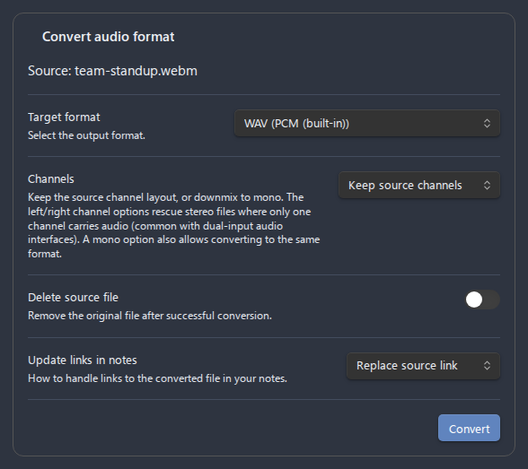
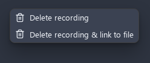

# File operations (context menu)

Advanced Audio Recorder adds a set of actions to Obsidian's right-click menu for audio files. From one place you can inspect a recording's metadata, convert it to another format, split it, clean it up, transcribe it, or delete it - without leaving your vault. This page documents every action, where it appears, and exactly what each one does.

- [Where the menu appears](#where-the-menu-appears)
- [Audio file info](#audio-file-info)
- [Convert audio format](#convert-audio-format)
- [Split audio into parts](#split-audio-into-parts)
- [Clean up audio](#clean-up-audio)
- [Transcribe audio](#transcribe-audio)
- [Delete recording](#delete-recording)
- [All context-menu actions](#all-context-menu-actions)

## Where the menu appears

The plugin adds its actions to the context menu of any audio file. You can open that menu from three places:

- The **File Explorer** - right-click an audio file in the file tree.
- An **embed link** in the editor - right-click an audio link such as `![[recording.webm]]` (both wikilinks `![[…]]` and Markdown links `` are recognized).
- An **embedded audio player** - right-click the player rendered inside a note (the built-in player or the [enhanced player](audio-player.md)).

The plugin recognizes a file as audio by its extension. Supported extensions are `webm`, `ogg`, `wav`, `mp3`, `flac`, `mp4`, `m4a`, and `aac` - see [Formats](formats.md) for what each one is.


_Figure: The plugin's actions grouped together in the File Explorer context menu._

Which actions appear depends on where you click and on your settings:

| Action                              | File Explorer | Embed link | Player | Condition                               |
| ----------------------------------- | ------------- | ---------- | ------ | --------------------------------------- |
| **Audio file info**                 | Yes           | Yes        | Yes    | Always                                  |
| **Convert audio format**            | Yes           | Yes        | Yes    | Always                                  |
| **Split audio into parts**          | Yes           | Yes        | Yes    | Always                                  |
| **Clean up audio**                  | Yes           | Yes        | Yes    | Always                                  |
| **Transcribe audio**                | Yes           | Yes        | Yes    | When transcription is enabled           |
| **Delete recording**                | Yes           | No         | Yes    | Always                                  |
| **Delete recording & link to file** | No            | Yes        | Yes    | When a link to the file is at the click |

On an **embed link** in the editor, plain **Delete recording** is deliberately replaced by **Delete recording & link to file** - deleting the file under a link you are looking at should also clean up the link. When you right-click an **enhanced player**, the menu also offers position-aware actions at the clicked point - **Add marker here**, **Add chapter here**, and **Copy timestamp link here** - alongside the file actions above. Those are documented in [Audio player](audio-player.md#markers-and-chapters).

Every action in the table is also registered as a **command palette** command of the same name, acting on the **active audio file**, so each one can be bound to a hotkey under **Settings > Hotkeys**. The command is available only while the active pane is an audio file (and, for **Transcribe audio**, transcription is enabled).

---

## Audio file info

**Audio file info** opens a read-only modal that decodes the file and reports its technical properties. Use it to confirm what was actually recorded - the container, the codec, the sample rate, and so on - without opening an external tool.


_Figure: The Audio file info modal with the Copy as Markdown button._

The modal lists the following fields:

| Field                | What it shows                                                  | Example          |
| -------------------- | -------------------------------------------------------------- | ---------------- |
| **File Name**        | The file name with its extension.                              | `recording.webm` |
| **File Size**        | On-disk size, formatted (Bytes / KB / MB / GB).                | `4.2 MB`         |
| **Duration**         | Decoded length as `HH:MM:SS` (or `00:MM:SS` under an hour).    | `00:12:34`       |
| **Container Format** | The container's MIME type, inferred from the extension.        | `audio/webm`     |
| **Audio Codec**      | The likely codec, inferred from the extension.                 | `opus`           |
| **Bitrate**          | Average bitrate computed from file size and duration, in kbps. | `128 kbps`       |
| **Sample Rate**      | The decoded sample rate in hertz.                              | `48000 Hz`       |
| **Channels**         | Channel count with a label (`1 (Mono)`, `2 (Stereo)`).         | `2 (Stereo)`     |

A few notes on how these values are derived:

- **Duration**, **Sample Rate**, and **Channels** come from decoding the audio with the browser's audio engine, so they reflect the real decoded stream.
- **Bitrate** is a calculated average (`file size × 8 ÷ duration`), not a value read from the container header. For variable-bitrate files it is an approximation.
- **Container Format** and **Audio Codec** are inferred from the file extension, not parsed from the bytes. The codec mapping is: `webm` > `opus`, `ogg` > `opus/vorbis`, `mp4`/`m4a`/`aac` > `aac`, `mp3` > `mp3`, `wav` > `pcm`, `flac` > `flac`.

If the file cannot be decoded (it is empty, corrupted, or in a container the app cannot read), the plugin shows a notice instead of the modal.

### Copy as Markdown

The modal has a **Copy as Markdown** button. Click it to copy all eight fields to the clipboard as a formatted Markdown bullet list, then paste them anywhere. The button briefly changes to **Copied!** to confirm.

This is the fastest way to attach exact file details to a bug report. See the [Bug reporting guide](BUG_REPORTING_GUIDE.md) for what else to include.

The copied text looks like this:

```markdown
- **File Name:** `recording.webm`
- **File Size:** `4.2 MB`
- **Duration:** `00:12:34`
- **Container Format:** `audio/webm`
- **Audio Codec:** `opus`
- **Bitrate:** `128 kbps`
- **Sample Rate:** `48000 Hz`
- **Channels:** `2 (Stereo)`
```

---

## Convert audio format

**Convert audio format** transcodes the file to a different format. It opens a dialog seeded with your defaults, writes the converted file next to the source, and (optionally) updates the links in your notes and removes the original.


_Figure: The Convert audio format dialog._

The dialog header shows the source file name. Below it are these controls:

| Control                   | Description                                                           | Default              |
| ------------------------- | --------------------------------------------------------------------- | -------------------- |
| **Target format**         | The output format (every offline-encodable format except the source). | First format in list |
| **Channels**              | Keep the source channel layout, or downmix to mono.                   | Keep source channels |
| **Bitrate**               | Bitrate for compressed targets. Ignored for WAV (PCM has no bitrate). | `128` kbps           |
| **Delete source file**    | Move the original to the system trash after a successful conversion.  | From settings        |
| **Update links in notes** | How to rewrite links to the source file in your notes.                | From settings        |

Details on the controls:

- **Target format** lists each format with its encoder, e.g. `MP3 (Mediabunny MP3 Encoder)`, `FLAC (Mediabunny FLAC Encoder)`, `OGG (…)`. The source's own format is excluded for channel-preserving conversions, so you always pick a different one; selecting a mono **Channels** option adds the source's own format back to the list (see below).
- **Channels** offers `Keep source channels`, `Mono (mix all channels)` (the average of every channel - the standard downmix), `Mono (left channel)`, and `Mono (right channel)` (exactly one channel, at full level). The left/right options rescue stereo files where only one channel carries audio - the typical result of recording one microphone through an audio interface whose two mono inputs appear as a single stereo device. See [Recording in mono](recording.md#recording-in-mono) for the capture-time equivalent.
- **Bitrate** offers `64`, `96`, `128`, `160`, `192`, `256`, and `320` kbps.
- **Update links in notes** offers `Do nothing`, `Replace source link`, and `Insert after source link` (see [Link updates and source deletion](#link-updates-and-source-deletion) below).

The **Delete source file** and **Update links in notes** defaults come from **Settings > Advanced Audio Recorder > Output format** (the **Delete source after conversion** and **Update links after conversion** settings). You can override them for a single conversion in the dialog. See [Settings reference](settings-reference.md#output-format) for those settings.

Click **Convert** to run. Progress text appears in the dialog (`Reading source file…`, `Converting… 42%`, `Saving…`, `Updating links…`). When it finishes, a notice reports the new file name (`Converted to …`, or `Replaced with …` when the source was deleted).

### How conversion works

- The source bytes are read once, then transcoded to the target format through the **streaming Mediabunny pipeline**: the audio is processed in chunks instead of being decoded fully into memory, and it is **always re-encoded at the bitrate you selected** (the conversion never copies packets, so your bitrate choice is always honored).
- If the source container cannot be processed by the streaming pipeline, the plugin **falls back to a full decode and re-encode**, so every supported format keeps working even when its container is not stream-readable.
- **Converting to WAV always performs a full decode** first, because the streaming pipeline only targets compressed formats.
- A mono **Channels** option downmixes inside the same pipeline: the mix is the plain average of every channel - sample-identical to the [recording-time downmix](recording.md#recording-in-mono) - and the left/right options keep one channel untouched. A right-channel pick on a file that is already mono falls back to the only channel instead of producing silence.
- The converted file is written **next to the source** as `<source-name>.<target-format>`. If a file with that name already exists, the conversion is **aborted** with a notice - choose a different format or rename the existing file.
- A **same-format mono downmix** (for example stereo `WAV` to mono `WAV`) is written as `<source-name>-mono.<format>`, so it never collides with the source. Same-format conversion without a mono option is refused - it would only re-encode the file into itself.

### Link updates and source deletion

When **Update links in notes** is not `Do nothing`, the plugin rewrites links to the source file across the **whole vault**, including notes that are not currently open. Both wikilinks (`![[…]]`) and Markdown links (``) are covered, and the new links follow your link-format preferences.

- `Replace source link` - the link to the old file becomes a link to the converted file.
- `Insert after source link` - the converted file's link is added after the original, leaving the old link in place.

Two things are handled defensively:

- **Frontmatter links are not rewritten** (a YAML property cannot hold several links). When such links exist, the plugin shows a notice telling you how many must be updated by hand.
- **Source deletion waits on links.** If **Delete source file** is on but some links could not be updated, the source file is **kept** so those links do not break, and a notice explains why.

This is the same vault-wide link engine used by [splitting](splitting.md), so the behavior is consistent across both flows.

---

## Split audio into parts

**Split audio into parts** divides a long recording into fixed-duration segments. It opens a dialog with the part duration, a part-name suffix, an optional bitrate (for compressed sources), a **Delete source file** toggle, and the same **Update links in notes** options as conversion.

WAV files are split losslessly at the byte level without re-encoding; compressed formats are decoded once and re-encoded per part. The parts are written next to the source, and the split aborts if any target part file already exists.

The full reference - duration ranges, naming rules, link handling, and limits - lives in [Splitting](splitting.md).


_Figure: The Split audio into parts dialog (see Splitting for full detail)._

---

## Clean up audio

**Clean up audio** runs offline DSP over the file to remove background noise and even out loudness, writing a cleaned `…-processed.wav` copy and leaving the original untouched. The dialog lets you toggle three stages - high-pass filter, noise gate, and loudness leveling - seeded from your **Audio cleanup defaults**.

This is post-processing you invoke on demand; it never changes how live recording works. The complete reference - every stage, its parameters and ranges, recommended settings, and size/length limits - is in [Audio cleanup](audio-cleanup.md).


_Figure: The Clean up audio dialog (see Audio cleanup for full detail)._

---

## Transcribe audio

**Transcribe audio** sends the file to your configured transcription engine and writes the result back into the note, a sidecar file, or both. This action only appears in the menu when **Enable transcription** is on in settings.

A progress dialog shows the elapsed timer and lets you **Cancel** or **Minimize** the job to the status bar. The full reference - engines, language, diarization, output formats, and setup - is in [Transcription](transcription.md). For step-by-step provider setup, see the [use-case guides](use-cases/index.md).


_Figure: The transcription progress dialog (see Transcription for full detail)._

---

## Delete recording

Two delete actions move the file to the **system trash** (not Obsidian's `.trash` folder, unless your vault is configured that way) so it can be recovered by your OS.

- **Delete recording** - trashes the audio file. Available in the File Explorer and on an embedded player; on an editor embed link the menu offers only the **& link to file** variant below, so deleting the file never leaves the link you clicked behind.
- **Delete recording & link to file** - trashes the audio file **and** removes the embed link from the editor in the same step. Available only when you right-click a **link** in the editor or an **embedded player**, because that variant needs a link at the click position to remove.


_Figure: The two delete actions on an embedded player._

If a recording has marker or chapter data, its sidecar (`recording.webm.markers.json`) is moved or removed automatically with the file - see [Audio player](audio-player.md#markers-and-chapters).

---

## All context-menu actions

| Action                              | What it does                                                                       | Where available                           | Doc                                                  |
| ----------------------------------- | ---------------------------------------------------------------------------------- | ----------------------------------------- | ---------------------------------------------------- |
| **Audio file info**                 | Shows file metadata in a modal with a Copy as Markdown button.                     | File Explorer, embed link, player         | [This page](#audio-file-info)                        |
| **Convert audio format**            | Transcodes the file to another format; can update links and delete the source.     | File Explorer, embed link, player         | [This page](#convert-audio-format)                   |
| **Split audio into parts**          | Splits the file into fixed-duration parts; can update links and delete the source. | File Explorer, embed link, player         | [Splitting](splitting.md)                            |
| **Clean up audio**                  | Runs offline DSP (high-pass, noise gate, leveling) and writes a cleaned WAV copy.  | File Explorer, embed link, player         | [Audio cleanup](audio-cleanup.md)                    |
| **Transcribe audio**                | Transcribes the file with your configured engine.                                  | File Explorer, embed link, player (if on) | [Transcription](transcription.md)                    |
| **Delete recording**                | Moves the audio file to the system trash.                                          | File Explorer, player                     | [This page](#delete-recording)                       |
| **Delete recording & link to file** | Trashes the audio file and removes its embed link from the editor.                 | Embed link, player                        | [This page](#delete-recording)                       |
| **Add marker here**                 | Adds a bookmark at the clicked point on the seek bar.                              | Enhanced player (markers on, editing)     | [Audio player](audio-player.md#markers-and-chapters) |
| **Add chapter here**                | Adds a chapter at the clicked point on the seek bar.                               | Enhanced player (markers on, editing)     | [Audio player](audio-player.md#markers-and-chapters) |
| **Copy timestamp link here**        | Copies a link to the clicked position, e.g. `[[recording#t=1:30]]`.                | Enhanced player                           | [Audio player](audio-player.md#timecode-links)       |

See also: [Features](features.md) for the full feature list, [Settings reference](settings-reference.md) for the defaults these dialogs seed from, and [Troubleshooting](troubleshooting.md) if a conversion or cleanup fails.
