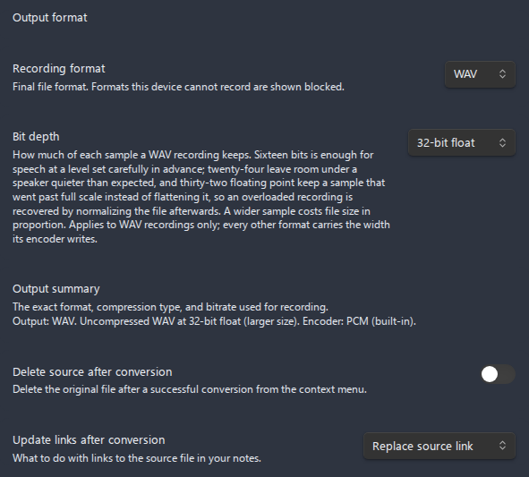

# Formats and containers

Advanced Audio Recorder can record to **eight output formats**: WebM, OGG, WAV, MP3, FLAC, MP4, M4A, and AAC. Which ones you can actually pick depends on what your platform's **MediaRecorder** supports and which encoders the plugin can register at runtime - so the list you see in settings is detected on the machine you are using, not hard-coded. This page explains how that detection works, what each format is for, the difference between online and offline encoding, and how to choose a format, a bitrate and, for WAV, a bit depth.

- [How format availability is detected](#how-format-availability-is-detected)
- [The formats table](#the-formats-table)
- [Online vs offline encoding](#online-vs-offline-encoding)
- [Choosing a format](#choosing-a-format)
- [Bitrate guidance](#bitrate-guidance)
- [Bit depth](#bit-depth)
- [The output summary line](#the-output-summary-line)
- [Where to set the format](#where-to-set-the-format)
- [Related pages](#related-pages)

## How format availability is detected

The plugin does not assume a fixed set of formats. On startup, and whenever it builds the **Recording format** dropdown, it probes the current environment to find out what this machine can produce. All eight formats stay in the dropdown either way, and one this device cannot record is blocked and relabelled `MP3 (not supported on this device)`, so you can see it exists and see why it is out of reach. Two mechanisms feed that judgement:

- **`MediaRecorder.isTypeSupported()`** - the browser-level test for whether the app can record a container/codec directly in real time. The plugin probes the plain MIME type (for example `audio/webm`) for WebM, OGG, MP3, M4A, and MP4. A format passes only if the running Chromium/Electron build reports it as supported.
- **Offline encoder availability** - for formats that MediaRecorder cannot write directly, the plugin checks whether it can encode them after the fact. **WAV** is always available when an `AudioContext` exists (or, on a constrained platform, when a compressed intermediate is supported). **MP3** and **FLAC** are always available because the plugin bundles the **Mediabunny MP3** and **Mediabunny FLAC** extension encoders. **AAC** is added when its offline encoder is available and it was not already offered through MediaRecorder.

Because availability is probed live, **some formats are blocked on a given machine**. AAC, MP4, and M4A in particular rely on AAC codec support in the underlying Chromium build, which varies by operating system and Electron version. WebM and WAV have the broadest support, which is why **WebM is the default** (and MP4 is the fallback default if WebM is somehow unavailable).

If the format you want is blocked:

- Pick **WebM** or **WAV** instead - they have the widest support.
- Open **Settings > Advanced Audio Recorder > Diagnostics > System info** to see the exact list of supported formats and the per-codec support matrix your environment reports. Include that output when filing a [bug report](BUG_REPORTING_GUIDE.md).

> The plugin builds **plain** MIME types (no `;codecs=…` suffix) for the recording test, because appending a codec suffix can trigger silent recording bugs in certain Chromium/Electron builds. The detailed per-codec probe is reported only in **System info** for diagnostics.

## The formats table

All eight formats, with the codec each uses, whether it is encoded online or offline, and the key behavior to know.

| Format   | Codec       | Encoding                          | Notes                                                                                                                                                                                   |
| -------- | ----------- | --------------------------------- | --------------------------------------------------------------------------------------------------------------------------------------------------------------------------------------- |
| **WebM** | Opus        | Online                            | Default format. Widely supported on desktop. Small files at good quality.                                                                                                               |
| **OGG**  | Opus/Vorbis | Online                            | Good compatibility on most systems.                                                                                                                                                     |
| **WAV**  | PCM         | Online (streaming)                | Uncompressed. Captured as raw PCM in real time, at the width the **Bit depth** row names, and assembled into a WAV file on save. Reliable for long recordings, with no memory pressure. |
| **MP3**  | MP3         | Offline (Mediabunny MP3 Encoder)  | Encoded after recording stops using the bundled Mediabunny MP3 encoder. Maximum compatibility with old players and devices.                                                             |
| **FLAC** | FLAC        | Offline (Mediabunny FLAC Encoder) | Lossless compression. Encoded after recording stops using the bundled Mediabunny FLAC encoder. Smaller than WAV, no quality loss.                                                       |
| **MP4**  | AAC         | Online/Offline                    | Browser-dependent. May use offline encoding via Mediabunny when MediaRecorder cannot write it directly.                                                                                 |
| **M4A**  | AAC         | Online/Offline                    | Same codec as MP4, different container extension. Common in the Apple ecosystem.                                                                                                        |
| **AAC**  | AAC         | Online/Offline                    | Raw AAC stream. Browser-dependent support, offered when an AAC encoder is available.                                                                                                    |

Codec mapping is consistent across recording and conversion: WebM and OGG use **Opus**, MP4/M4A/AAC use **AAC**, FLAC uses **FLAC**, MP3 uses **MP3**, and WAV uses **PCM**. A WAV recorded through the desktop capture uses the width the **Bit depth** row names, which is **16-bit PCM** (`pcm-s16`) until you change it; a WAV produced by a conversion is always 16-bit, because the converter's encoder writes that width.

---

## Online vs offline encoding

Every format is produced one of two ways. The settings dropdown marks the offline ones with an **`(offline)`** label so you know which is which.

- **Online encoding** - the browser's **MediaRecorder** writes the encoded data in real time, while you record. WebM, OGG, and WAV are online formats (WAV is captured as raw PCM and assembled into a `.wav` container on save). Online encoding keeps memory low and is the most reliable path for very long sessions.
- **Offline encoding** - the audio is first captured into a supported **intermediate** container (typically WebM or OGG), and then re-encoded to the target format **after you stop recording**. MP3 and FLAC are always offline (they use the bundled Mediabunny extension encoders). MP4, M4A, and AAC are offline whenever MediaRecorder cannot write them directly, in which case they too go through the intermediate-and-re-encode path.

When the intermediate codec **already matches** the target codec, the audio **packets are copied without re-encoding** - there is no second lossy pass and no quality loss for that step. Re-encoding only happens when the codecs differ.

Offline encoding needs a working intermediate format. WebM, OGG and MP4 can all serve as one, and MP4 is there for iOS, whose WebView records neither of the first two. Only when the machine supports none of the three is an offline-only format out of reach, and the plugin then reports it as blocked. The plugin validates this before a recording starts, so you get a clear message rather than a failed save.

> The same offline pipeline powers **[Convert audio format](file-operations.md#convert-audio-format)** from the right-click menu, so you can record in one format and transcode to another later without re-recording.

## Choosing a format

There is no single best format - it depends on what you do with the recording. Practical guidance:

- **WebM (default)** - the best all-round choice. Opus is efficient, so files are small at high quality, and WebM has the broadest support. Use it unless you have a specific reason not to.
- **WAV** - choose it for **long recordings**, **lossless** capture, and **reliability**. WAV is captured as raw PCM and streamed to disk, so an hour-long session never risks a memory problem. It is uncompressed, so files are large, and a single file cannot exceed **4 GB** (see below). It is also the one format whose sample width you choose, through [Bit depth](#bit-depth).
- **FLAC** - **lossless but compressed**, at roughly half the size of WAV. What it is lossless about is the step after capture, because no browser records FLAC directly and the audio therefore arrives through an Opus intermediate at your chosen bitrate, so a FLAC recording preserves that intermediate perfectly rather than the microphone. Choose WAV on the desktop when you want capture itself to be lossless, and choose FLAC to archive a smaller file whose quality you set with the **Audio bitrate** row.
- **MP3** - choose it for **maximum compatibility** with older players, hardware devices, and software that does not understand Opus or AAC.
- **MP4 / M4A** - AAC in a standard container, well suited to **Apple ecosystems** (macOS, iOS, iTunes/Music) and many video tools. M4A is the same codec with the Apple-conventional extension.
- **AAC** - a raw AAC stream, so pick it only when a downstream tool specifically expects a bare `.aac` file. Its availability is browser-dependent.
- **OGG** - Opus or Vorbis in an Ogg container, and a good alternative when a tool prefers Ogg over WebM.

A WAV file states its own size in two 32-bit fields, so **no WAV file can be larger than 4 GB**, which at 48 kHz stereo 16-bit arrives at roughly the sixth hour of continuous recording, and proportionally sooner at a wider bit depth: four hours at 24-bit and three at 32-bit float. Turn on **auto-split** in the recording settings before a session that long: the recording is then written as a series of part files, each well inside the limit, and nothing about the capture changes. You are warned before it comes to that: once a WAV session passes **90 percent** of the ceiling, a notice says the recording is approaching the 4 GB limit and asks you either to turn auto-split on or to stop and start a new recording, which is early enough to act on. Without auto-split a recording that does reach the ceiling is refused at the moment you press stop, with a message naming the limit and pointing at auto-split. The captured PCM segments stay on disk when that happens, but nothing the plugin offers turns them into one WAV: the recovery prompt on the next start assembles them through the same encoder, meets the same refusal, and reports the track as one it could not recover. Recording in parts is what avoids the situation rather than what repairs it, so it is worth deciding before a long session rather than after it.

RF64 is the standard extension of RIFF that moves those size fields to 64 bits, and the plugin deliberately does not write it. Auto-split already answers the long recording end to end, from the recorder through the player to the splitter, while none of the transcription engines these files are handed to afterwards reads RF64, so an RF64 recording would be unplayable in the very workflow it was made for.

A short recommendation table:

| Use case                                | Format | Why                                                                   |
| --------------------------------------- | ------ | --------------------------------------------------------------------- |
| Everyday voice notes, general recording | WebM   | Small files, high quality, widest support - the default for a reason. |
| Long recordings (lectures, meetings)    | WAV    | Streamed to disk, reliable at any length with no memory pressure.     |
| Lossless capture, archival              | WAV    | Uncompressed PCM, so nothing is discarded.                            |
| Lossless but smaller archive            | FLAC   | Lossless compression at roughly half the size of WAV.                 |
| Sharing with old players / devices      | MP3    | Universally playable, even on legacy hardware.                        |
| Apple ecosystem (macOS, iOS, Music)     | M4A    | AAC in the Apple-conventional container.                              |
| Importing into video tools              | MP4    | AAC in a standard, widely accepted container.                         |

When in doubt, record in **WebM** and use **[Convert audio format](file-operations.md#convert-audio-format)** afterwards if a different format is needed for a specific tool.

## Bitrate guidance

The **Audio bitrate** setting controls the quality and size of **compressed** recordings. Options run from **24 kbps up to 320 kbps**, with a default of **128 kbps**. Higher values produce **better quality and larger files**, and lower values save space at the cost of fidelity.

| Bitrate          | Typical use                                                                                             |
| ---------------- | ------------------------------------------------------------------------------------------------------- |
| **24-48 kbps**   | Mono speech only. An hour fits in about 11 MB, which is small enough to transcribe as a single request. |
| **64-96 kbps**   | Voice notes and dictation where size matters more than fidelity.                                        |
| **128 kbps**     | Default. A good balance of quality and size for speech and general use.                                 |
| **160-192 kbps** | Higher-quality speech, interviews, or recordings you will edit later.                                   |
| **256-320 kbps** | Music or anything where you want the best the codec can deliver.                                        |

The low end of the scale is a **mono speech mode**, not a general setting. Opus at 24 kbps stays intelligible for a single voice, which keeps an hour of meeting under the 25 MB a single Whisper request accepts, so the recording is transcribed in one pass and speaker numbering stays consistent across it. On music, or on a stereo recording of any kind, the same value costs real quality.

**Which values you can pick depends on the format**, because the floor belongs to the codec rather than to the dropdown. Opus, used by WebM and OGG, encodes from 6 kbps upward at every sample rate, so the whole scale is available and 24 kbps speech recording means recording in WebM or OGG. MP3 follows the MPEG bitrate tables, and the one that applies is chosen by the rate the encoder writes at: at 32 kHz and above that is MPEG-1 Layer III, which defines nothing below **32 kbps**. Since an MP3 file is encoded after the recording stops, through an `AudioContext` running at whatever rate the audio hardware provides, and that is 44.1 or 48 kHz on essentially every machine, **MP3 starts at 32 kbps** regardless of the **Sample rate** you choose. AAC, used by MP4, M4A, and AAC, leaves the decision to the platform encoder, so the plugin asks that encoder directly and drops the values it refuses from the list entirely, and if the value you had selected is one of them, the selection moves to the nearest one that is left. On Windows, for instance, the system AAC encoder takes only 96, 128, 160, and 192 kbps, so those are the only values offered for MP4, M4A, and AAC there. The description under the setting always says which values are on offer and what decided them, naming either the codec at the rate it writes at or the encoder on this device.

Where the encoder accepts none of the values, no bitrate would help: the format itself cannot be written at that sample rate and layout on this device. Chromium refuses every AAC rate at 24 kHz and below, because the plugin has to ask it about HE-AAC there and only AAC-LC can be encoded. The description under the bitrate setting says so and points at the format and sample rate instead, and the **Recording format** row blocks the format with the same reason. A merged multi-track recording is always encoded this way after the mix, even for a format MediaRecorder could have captured directly, so the check covers that session shape too. When a recording starts, the same question is asked about the audio the opened microphone really delivers, and a format the encoder refuses is replaced with one it accepts, with a notice, before any audio is captured. A value the chosen format cannot write is snapped to the nearest one it can before encoding, and the **Output summary** line reports that value rather than the stored one.

The encoder is asked about the bitrate only for a recording it will actually encode, which means a merged multi-track session or an offline-only format such as MP3 or AAC. A single-track recording in a format MediaRecorder writes directly is encoded by the browser itself, which accepts the bitrate it is given, so nothing is substituted there and no notice appears.

**A lossless recording format still spends the bitrate**, because a lossless recording is not captured losslessly. No browser writes FLAC through MediaRecorder, so a FLAC recording is captured as Opus at the bitrate you choose and only wrapped in FLAC once you stop, which makes the setting a real decision about the audio the file ends up holding rather than about the container. WAV behaves the same way wherever direct PCM capture is unavailable, which is the whole of the mobile app. In both of those cases the bitrate row stays, and it offers the values the intermediate codec reaches rather than the ones the finished container would suggest, so a FLAC recording at 24 kbps is a lossless file wrapped around 24 kbps speech audio. The **Output summary** line names the intermediate for exactly this reason, reading `Output: FLAC, 24 kbps captured as WEBM` instead of implying that a FLAC file has a bitrate you picked.

The setting disappears only for **WAV recorded as raw PCM**, which is the desktop app, because nothing there is encoded at any rate: the samples reach the file as they were captured, so the size follows from the sample rate, the channel count and the bit depth alone. The **Bit depth** row is the decision about quality and size that replaces it there.

In the split and convert dialogs the rule is the container's, not the capture's, because those two decode a finished file and encode it once. A **WAV** or **FLAC** target there carries no bitrate at all, so the row is hidden: WAV is uncompressed 16-bit PCM, and FLAC compresses without loss to whatever size the signal needs, which makes the bitrate such a file reports a result rather than a choice.

## Bit depth

**Bit depth** decides how much of each individual sample a WAV recording keeps, and it applies only where WAV is captured as raw PCM, which is the desktop app. Everywhere else the width belongs to the encoder that writes the file, so on mobile the row is shown greyed out with its stored value intact rather than hidden, because a vault synced from a desktop machine carries the setting and you have to be able to see what it is set to.

Three widths are offered, and the difference between them is headroom rather than fidelity at a level you already set correctly:

- **16-bit integer** is the default and what every recording used before the row existed. It is enough for speech whenever the input level is set carefully in advance, and it is the width every tool reads without question.
- **24-bit integer** puts eight more bits under the signal, which is what a recording made at a cautious level needs: a quiet speaker recorded 30 dB down still has as much resolution left as a 16-bit file recorded near full scale, so raising the level afterwards does not bring the noise floor up with it.
- **32-bit float** stores each sample as a floating point number whose full scale is 1.0 and which is **not clipped** when the signal runs past it. A take that overloaded the input is therefore still recoverable: normalizing the finished file brings the peaks back down with the waveform intact, where a 16-bit or 24-bit file would already have flattened them against the rails.

The cost is file size in direct proportion: 24-bit is half again the size of 16-bit and 32-bit float is double it, and the 4 GB ceiling of the WAV container arrives correspondingly sooner. Nothing else about the recording changes, because the width travels with the audio through the whole pipeline. Auto-split cuts parts on whole sample frames at the chosen width, a multi-track session is mixed at that width and written out at it, and [splitting a finished file](splitting.md) still copies its bytes without decoding them, because the splitter reads the width out of the file's own header.

A 32-bit float file is written with the format tag and the `fact` chunk the WAVE specification requires of a non-PCM representation, so players, editors and the transcription engines read it as what it is. Conversion and audio cleanup still write 16-bit WAV output whatever the source is, since both encode a finished file rather than capture one.

## The output summary line

Directly under the format and bitrate controls, **Settings > Output format** shows a read-only **Output summary** line that confirms exactly what your recordings will be. It combines four pieces of information:

| Part                 | What it tells you                                                                                                                                                                                          |
| -------------------- | ---------------------------------------------------------------------------------------------------------------------------------------------------------------------------------------------------------- |
| **Format**           | The container/extension you selected (for example `webm`, `wav`, `mp3`).                                                                                                                                   |
| **Bitrate (kbps)**   | The compression bitrate that will be applied (omitted or shown as not applicable for WAV).                                                                                                                 |
| **Compression type** | One of three sentences: uncompressed WAV, which also names the bit depth where the capture decides it, compressed audio via offline encoding, or compressed audio saved directly from the recorder output. |
| **Encoder**          | The encoder that will be used - for example `PCM (built-in)`, `Mediabunny MP3 Encoder`, `Mediabunny FLAC Encoder`, or `AudioEncoder (Opus) + Mediabunny`.                                                  |

Use it as a quick sanity check before recording: if the encoder or compression type is not what you expected, adjust the format or bitrate above it.

## Where to set the format

Set the recording format and bitrate under **Settings > Advanced Audio Recorder > Output format**. The same section also holds **Delete source after conversion** and **Update links after conversion**, which apply when you transcode existing files. See the [Settings reference](settings-reference.md#output-format) for every control in that section, and [Recording](recording.md) for how a recording is captured and saved with the chosen format.

## Related pages

- [Recording](recording.md) - how to start, pause, stop, and save a recording in your chosen format.
- [File operations](file-operations.md) - convert an existing file between formats, split it into parts, and inspect its codec and bitrate with Audio file info.
- [Settings reference](settings-reference.md#output-format) - the full Output format settings section.
- [Multi-track recording](multi-track-recording.md) - how the chosen format applies to each track and to merged output.
- [Troubleshooting](troubleshooting.md) - what to do when a format is missing or a conversion fails.
