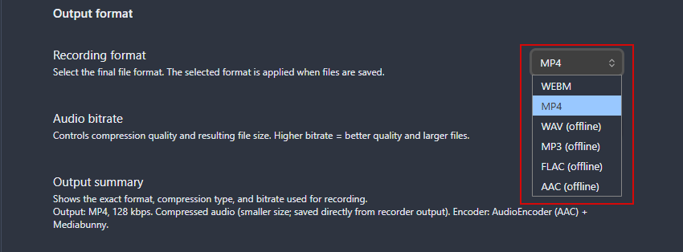
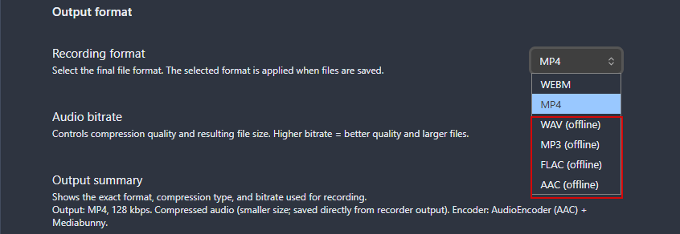
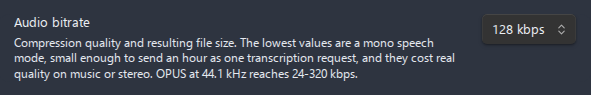
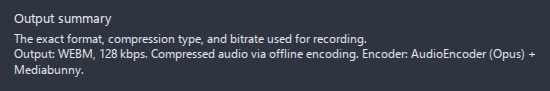

# Formats and containers

Advanced Audio Recorder can record to **eight output formats**: WebM, OGG, WAV, MP3, FLAC, MP4, M4A, and AAC. Which ones you can actually pick depends on what your platform's **MediaRecorder** supports and which encoders the plugin can register at runtime — so the list you see in settings is detected on the machine you are using, not hard-coded. This page explains how that detection works, what each format is for, the difference between online and offline encoding, and how to choose a format and bitrate.

- [How format availability is detected](#how-format-availability-is-detected)
- [The formats table](#the-formats-table)
- [Online vs offline encoding](#online-vs-offline-encoding)
- [Choosing a format](#choosing-a-format)
- [Bitrate guidance](#bitrate-guidance)
- [The output summary line](#the-output-summary-line)
- [Where to set the format](#where-to-set-the-format)
- [Related pages](#related-pages)

## How format availability is detected

The plugin does not assume a fixed set of formats. On startup, and whenever it builds the **Recording format** dropdown, it probes the current environment and lists only what this machine can produce. Two mechanisms feed that list:

- **`MediaRecorder.isTypeSupported()`** — the browser-level test for whether the app can record a container/codec directly in real time. The plugin probes the plain MIME type (for example `audio/webm`) for WebM, OGG, MP3, M4A, and MP4. A format passes only if the running Chromium/Electron build reports it as supported.
- **Offline encoder availability** — for formats that MediaRecorder cannot write directly, the plugin checks whether it can encode them after the fact. **WAV** is always available when an `AudioContext` exists (or, on a constrained platform, when a compressed intermediate is supported). **MP3** and **FLAC** are always available because the plugin bundles the **Mediabunny MP3** and **Mediabunny FLAC** extension encoders. **AAC** is added when its offline encoder is available and it was not already offered through MediaRecorder.

Because availability is probed live, **some formats may be missing on a given machine**. AAC, MP4, and M4A in particular rely on AAC codec support in the underlying Chromium build, which varies by operating system and Electron version. WebM and WAV have the broadest support, which is why **WebM is the default** (and MP4 is the fallback default if WebM is somehow unavailable).

If the format you want is not in the list:

- Pick **WebM** or **WAV** instead — they have the widest support.
- Open **Settings → Advanced Audio Recorder → Diagnostics → System info** to see the exact list of supported formats and the per-codec support matrix your environment reports. Include that output when filing a [bug report](BUG_REPORTING_GUIDE.md).

> The plugin builds **plain** MIME types (no `;codecs=…` suffix) for the recording test, because appending a codec suffix can trigger silent recording bugs in certain Chromium/Electron builds. The detailed per-codec probe is reported only in **System info** for diagnostics.

*Figure: the Recording format dropdown lists only the formats your machine supports; offline-only formats carry an `(offline)` label.*

## The formats table

All eight formats, with the codec each uses, whether it is encoded online or offline, and the key behavior to know.

| Format   | Codec       | Encoding                          | Notes                                                                                                                                        |
| -------- | ----------- | --------------------------------- | -------------------------------------------------------------------------------------------------------------------------------------------- |
| **WebM** | Opus        | Online                            | Default format. Widely supported on desktop. Small files at good quality.                                                                    |
| **OGG**  | Opus/Vorbis | Online                            | Good compatibility on most systems.                                                                                                          |
| **WAV**  | PCM         | Online (streaming)                | Uncompressed. Captured as raw PCM in real time and assembled into a WAV file on save. Reliable for long recordings, with no memory pressure. |
| **MP3**  | MP3         | Offline (Mediabunny MP3 Encoder)  | Encoded after recording stops using the bundled Mediabunny MP3 encoder. Maximum compatibility with old players and devices.                  |
| **FLAC** | FLAC        | Offline (Mediabunny FLAC Encoder) | Lossless compression. Encoded after recording stops using the bundled Mediabunny FLAC encoder. Smaller than WAV, no quality loss.            |
| **MP4**  | AAC         | Online/Offline                    | Browser-dependent. May use offline encoding via Mediabunny when MediaRecorder cannot write it directly.                                      |
| **M4A**  | AAC         | Online/Offline                    | Same codec as MP4, different container extension. Common in the Apple ecosystem.                                                             |
| **AAC**  | AAC         | Online/Offline                    | Raw AAC stream. Browser-dependent support; offered when an AAC encoder is available.                                                         |

Codec mapping is consistent across recording and conversion: WebM and OGG use **Opus**, MP4/M4A/AAC use **AAC**, FLAC uses **FLAC**, MP3 uses **MP3**, and WAV uses **16-bit PCM** (`pcm-s16`).

---

## Online vs offline encoding

Every format is produced one of two ways. The settings dropdown marks the offline ones with an **`(offline)`** label so you know which is which.

- **Online encoding** — the browser's **MediaRecorder** writes the encoded data in real time, while you record. WebM, OGG, and WAV are online formats (WAV is captured as raw PCM and assembled into a `.wav` container on save). Online encoding keeps memory low and is the most reliable path for very long sessions.
- **Offline encoding** — the audio is first captured into a supported **intermediate** container (typically WebM or OGG), and then re-encoded to the target format **after you stop recording**. MP3 and FLAC are always offline (they use the bundled Mediabunny extension encoders). MP4, M4A, and AAC are offline whenever MediaRecorder cannot write them directly, in which case they too go through the intermediate-and-re-encode path.

*Figure: offline formats carry an `(offline)` label in the Recording format dropdown so you can tell them apart from online ones.*

When the intermediate codec **already matches** the target codec, the audio **packets are copied without re-encoding** — there is no second lossy pass and no quality loss for that step. Re-encoding only happens when the codecs differ.

Offline encoding needs a working intermediate format: if neither WebM nor OGG is supported on the machine, an offline-only format cannot be produced and the plugin reports it as unavailable. The plugin validates this before a recording starts, so you get a clear message rather than a failed save.

> The same offline pipeline powers **[Convert audio format](file-operations.md#convert-audio-format)** from the right-click menu, so you can record in one format and transcode to another later without re-recording.

## Choosing a format

There is no single best format — it depends on what you do with the recording. Practical guidance:

- **WebM (default)** — the best all-round choice. Opus is efficient, so files are small at high quality, and WebM has the broadest support. Use it unless you have a specific reason not to.
- **WAV** — choose it for **long recordings**, **lossless** capture, and **reliability**. WAV is captured as raw PCM and streamed to disk, so an hour-long session never risks a memory problem. It is uncompressed, so files are large.
- **FLAC** — **lossless but compressed**: the same audio quality as WAV at roughly half the size. Good for archival when you want lossless without the bulk of WAV. Encoded offline after you stop.
- **MP3** — choose it for **maximum compatibility** with older players, hardware devices, and software that does not understand Opus or AAC.
- **MP4 / M4A** — AAC in a standard container, well suited to **Apple ecosystems** (macOS, iOS, iTunes/Music) and many video tools. M4A is the same codec with the Apple-conventional extension.
- **AAC** — a raw AAC stream; pick it only when a downstream tool specifically expects a bare `.aac` file. Its availability is browser-dependent.
- **OGG** — Opus or Vorbis in an Ogg container; a good alternative when a tool prefers Ogg over WebM.

A short recommendation table:

| Use case                                | Format | Why                                                                   |
| --------------------------------------- | ------ | --------------------------------------------------------------------- |
| Everyday voice notes, general recording | WebM   | Small files, high quality, widest support — the default for a reason. |
| Long recordings (lectures, meetings)    | WAV    | Streamed to disk; reliable at any length with no memory pressure.     |
| Lossless capture, archival              | WAV    | Uncompressed PCM; nothing is discarded.                               |
| Lossless but smaller archive            | FLAC   | Lossless compression at roughly half the size of WAV.                 |
| Sharing with old players / devices      | MP3    | Universally playable, even on legacy hardware.                        |
| Apple ecosystem (macOS, iOS, Music)     | M4A    | AAC in the Apple-conventional container.                              |
| Importing into video tools              | MP4    | AAC in a standard, widely accepted container.                         |

When in doubt, record in **WebM** and use **[Convert audio format](file-operations.md#convert-audio-format)** afterwards if a different format is needed for a specific tool.

## Bitrate guidance

The **Audio bitrate** setting controls the quality and size of **compressed** recordings. Options are **64, 96, 128, 160, 192, 256, and 320 kbps**, with a default of **128 kbps**. Higher values produce **better quality and larger files**; lower values save space at the cost of fidelity.

| Bitrate          | Typical use                                                             |
| ---------------- | ----------------------------------------------------------------------- |
| **64–96 kbps**   | Voice notes and dictation where size matters more than fidelity.        |
| **128 kbps**     | Default. A good balance of quality and size for speech and general use. |
| **160–192 kbps** | Higher-quality speech, interviews, or recordings you will edit later.   |
| **256–320 kbps** | Music or anything where you want the best the codec can deliver.        |

Bitrate applies to the **compressed** formats (WebM, OGG, MP3, FLAC, MP4, M4A, AAC). It is **not used for WAV**: WAV is uncompressed 16-bit PCM, so its size is fixed by the sample rate and channel count, and a bitrate setting would be meaningless for it. For that reason the bitrate control is irrelevant to WAV output and is hidden in the WAV split/convert flows.

*Figure: the Audio bitrate dropdown sets the quality and size of compressed recordings, with a default of 128 kbps.*

## The output summary line

Directly under the format and bitrate controls, **Settings → Output format** shows a read-only **Output summary** line that confirms exactly what your recordings will be. It combines four pieces of information:

| Part                 | What it tells you                                                                                                                                         |
| -------------------- | --------------------------------------------------------------------------------------------------------------------------------------------------------- |
| **Format**           | The container/extension you selected (for example `webm`, `wav`, `mp3`).                                                                                  |
| **Bitrate (kbps)**   | The compression bitrate that will be applied (omitted or shown as not applicable for WAV).                                                                |
| **Compression type** | Whether the output is lossy (Opus, AAC, MP3), lossless-compressed (FLAC), or uncompressed (WAV).                                                          |
| **Encoder**          | The encoder that will be used — for example `PCM (built-in)`, `Mediabunny MP3 Encoder`, `Mediabunny FLAC Encoder`, or `AudioEncoder (Opus) + Mediabunny`. |

Use it as a quick sanity check before recording: if the encoder or compression type is not what you expected, adjust the format or bitrate above it.

*Figure: the Output summary line confirms the format, bitrate, compression type, and encoder for your current settings.*

## Where to set the format

Set the recording format and bitrate under **Settings → Advanced Audio Recorder → Output format**. The same section also holds **Delete source after conversion** and **Update links after conversion**, which apply when you transcode existing files. See the [Settings reference](settings-reference.md#output-format) for every control in that section, and [Recording](recording.md) for how a recording is captured and saved with the chosen format.

## Related pages

- [Recording](recording.md) — how to start, pause, stop, and save a recording in your chosen format.
- [File operations](file-operations.md) — convert an existing file between formats, split it into parts, and inspect its codec and bitrate with Audio file info.
- [Settings reference](settings-reference.md#output-format) — the full Output format settings section.
- [Multi-track recording](multi-track-recording.md) — how the chosen format applies to each track and to merged output.
- [Troubleshooting](troubleshooting.md) — what to do when a format is missing or a conversion fails.
