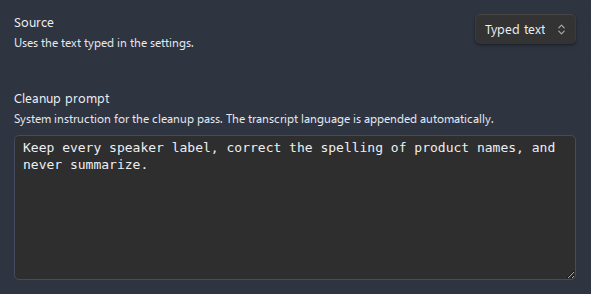
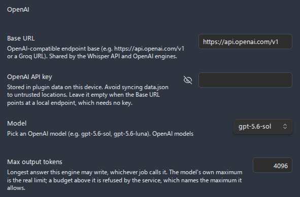

# LLM post-processing

**LLM post-processing** is an optional step that passes a finished transcript through a large language model (LLM) before it is written to your note or sidecar file. Use it to **clean up** the raw machine transcript, **summarize** it into key points and action items, or apply your own **custom** instruction. It is part of the transcription pipeline: it only runs when transcription runs, after the speech-to-text engine produces the transcript and before the output is saved.

- [What it does and when it runs](#what-it-does-and-when-it-runs)
- [Enabling it](#enabling-it)
- [The three tasks](#the-three-tasks)
    - [Clean up](#clean-up)
    - [Summarize](#summarize)
    - [Custom](#custom)
- [Editable prompts](#editable-prompts)
- [Default prompts](#default-prompts)
- [Providers and models](#providers-and-models)
- [Shared API keys](#shared-api-keys)
- [Base URL](#base-url)
- [Max output tokens](#max-output-tokens)
- [Worked examples](#worked-examples)
- [Behavior and reliability](#behavior-and-reliability)
- [Settings summary](#settings-summary)
- [Related pages](#related-pages)

## What it does and when it runs

When **Enable LLM post-processing** is on, the plugin runs the LLM pass at the very end of a [transcription](transcription.md):

1. The speech-to-text **engine** transcribes the audio into a transcript (segments, timestamps, and - when [diarization](transcription.md#speakers-and-diarization) is in effect - speaker labels).
2. The transcript is rendered to Markdown using your [transcript output](transcription.md#output-where-the-transcript-goes) settings.
3. **LLM post-processing runs** on that result - the status bar and progress dialog show `Post-processing with LLM...`.
4. The processed text is written to your note and/or sidecar file according to **Destination**.

It changes the **text** of the transcript, not the audio. It runs on every transcription while it is enabled - automatic [transcribe-after-recording](use-cases/transcribe-after-recording.md) runs, the **Transcribe audio** command, and the right-click **Transcribe audio** action all go through the same step.

> **It is a separate, paid API call.** The cloud providers (OpenAI, Anthropic, Google Gemini) bill for the tokens this step uses, on top of the transcription engine's cost. The local whisper.cpp transcription engine is offline, but LLM post-processing always uses one of the three cloud LLM providers.

---

## Enabling it

LLM post-processing lives at the bottom of the transcription settings, after the **Transcript output** section.

1. Open **Settings > Advanced Audio Recorder**.
2. Turn on **Enable transcription** (the whole **Transcription** section only appears when it is on).
3. Scroll to the **LLM post-processing** heading.
4. Turn on **Enable LLM post-processing**. The task, prompt, provider, key, model, and token controls appear below it.

If transcription itself is off, there is nothing for this step to process, so the option is hidden.

---

## The three tasks

Pick what the LLM should do with the transcript from the **Task** dropdown.

| Task          | What it does                                                                                                         | What it preserves                                                                |
| ------------- | -------------------------------------------------------------------------------------------------------------------- | -------------------------------------------------------------------------------- |
| **Clean up**  | Fixes punctuation, capitalization, and obvious speech-to-text errors; adds paragraph breaks; trims filler artifacts. | The speaker's exact wording and meaning, plus any speaker labels and timestamps. |
| **Summarize** | Condenses the transcript into key points and action items as Markdown bullet lists under short headings.             | Both: the summary is added **above** the full transcript, which is kept intact.  |
| **Custom**    | Sends your own instruction to the LLM, verbatim, and uses the model's reply as the transcript body.                  | Whatever your instruction tells it to preserve.                                  |

### Clean up

The default task. The LLM is asked to act as a transcription editor: correct punctuation, capitalization, and obvious recognition errors, insert sensible paragraph breaks, and remove filler artifacts that add no meaning - **without** summarizing, translating, paraphrasing, adding, or omitting content. Speaker labels and timestamps are kept exactly as they appear, each on its original line. The cleaned text **replaces** the raw transcript body in your output.

### Summarize

The LLM is asked to act as an analyst and produce a concise set of key points and action items as Markdown bullet lists under short headings, faithful to the content and inventing nothing. Unlike the other two tasks, summarize **does not replace** the transcript: the output is written as a `### Summary` section, followed by a `### Transcript` section that contains the full transcript unchanged. The summary is generated from the plain transcript text (timestamps and player links are not fed to the model), so you get a clean prose summary plus the complete transcript underneath.

### Custom

Your **Custom instruction** is sent to the model **verbatim** as the system prompt - no language clause and no wording are added. The model's reply **replaces** the transcript body. This is the most flexible task and the one where you are fully responsible for the result: if you want the output in a specific language, format, or structure, say so in the instruction.

---

## Editable prompts

Each task has its own editable prompt, shown in a text area below the **Task** dropdown. The field that appears depends on the selected task:

| Task          | Field shown            | Language handling                                                                                   |
| ------------- | ---------------------- | --------------------------------------------------------------------------------------------------- |
| **Clean up**  | **Cleanup prompt**     | The transcript language is **appended automatically** at request time - you do not add it yourself. |
| **Summarize** | **Summary prompt**     | The transcript language is **appended automatically** at request time - you do not add it yourself. |
| **Custom**    | **Custom instruction** | **Not** appended - sent verbatim in a larger (8-row) editor. Include your own language directive.   |

For **Clean up** and **Summarize**, leave the field empty to use the built-in default shown below. Whatever base text is in the field, the plugin appends a sentence telling the model to respond in the transcript's language (using the detected/declared language when known, e.g. `Respond in the same language as the transcript.` or `The transcript language is en; respond in that same language.`). That is why these two base prompts carry no language directive - adding one yourself would duplicate it.

For **Custom**, the editor is larger because nothing is added: the instruction you type is the entire system prompt. If you leave it empty, the plugin falls back to a generic instruction (`Process the following transcript as instructed.`), which is rarely what you want - type a real instruction.


_Figure: the per-task prompt editor; the Custom instruction field is taller and is sent verbatim._

---

## Default prompts

These ship with the plugin and are used whenever the matching prompt field is empty. The transcript-language sentence is appended to the cleanup and summary prompts automatically. The cleanup prompt also gets a glossary clause automatically whenever a dictionary profile or the advanced-mode domain glossary has terms: the canonical spellings are listed so the model corrects garbled names and acronyms ("кубернетис" to `Kubernetes`) without inserting terms that were not spoken.

**Default Clean up prompt:**

> You are an expert transcription editor. You are given a raw, machine-generated transcript. Correct punctuation, capitalization, and obvious speech-to-text errors; insert sensible paragraph breaks; and remove filler artifacts only when they add no meaning. Do NOT summarize, translate, paraphrase, add, or omit content - preserve the speaker's exact wording and meaning. Preserve any speaker labels and timestamps exactly as they appear, keeping each on its original line. Return only the corrected transcript with no preamble.

**Default Summarize prompt:**

> You are an expert analyst. Summarize the following transcript into a concise set of key points and any action items, as Markdown bullet lists under short headings. Be faithful to the content and do not invent details. Return only the summary with no preamble.

**Default Custom instruction** (shown as a starting point; you are expected to replace it):

> Rewrite the following transcript as clean, well-structured Markdown notes. Preserve the original language and meaning, and return only the result with no preamble.

---

## Providers and models

LLM post-processing supports three providers, chosen from the **LLM provider** dropdown. Each has its own default model and its own user-editable model list.

| Provider               | Dropdown label       | Default model      | Model catalogue                                                            |
| ---------------------- | -------------------- | ------------------ | -------------------------------------------------------------------------- |
| **OpenAI**             | `OpenAI`             | `gpt-4o-mini`      | [OpenAI models](https://platform.openai.com/docs/models)                   |
| **Anthropic (Claude)** | `Anthropic (Claude)` | `claude-opus-4-8`  | [Anthropic models](https://docs.anthropic.com/en/docs/about-claude/models) |
| **Google Gemini**      | `Google Gemini`      | `gemini-2.5-flash` | [Gemini models](https://ai.google.dev/gemini-api/docs/models)              |

The **LLM model** picker is the same control used for transcription models: pick one from the saved list, type a new id under **Add custom model** to add it, use **Remove selected** to prune one, and follow the catalogue link next to the field to the provider's model list. The list is seeded with common models for the selected provider:

| Provider      | Seeded model ids                                              |
| ------------- | ------------------------------------------------------------- |
| **OpenAI**    | `gpt-4o-mini`, `gpt-4o`, `gpt-4.1`, `gpt-4.1-mini`, `o4-mini` |
| **Anthropic** | `claude-opus-4-8`, `claude-sonnet-4-6`, `claude-haiku-4-5`    |
| **Gemini**    | `gemini-2.5-flash`, `gemini-2.5-pro`, `gemini-2.5-flash-lite` |

The model list is per-provider, so switching the **LLM provider** dropdown swaps both the picker contents and the selected model to that provider's list - your OpenAI choice is remembered separately from your Anthropic and Gemini choices.


_Figure: the LLM provider dropdown and the per-provider model picker with add/remove and a catalogue link._

---

## Shared API keys

You only enter a vendor's API token **once**. The LLM key field is bound to the same per-vendor key the transcription engines use, so a token serves both jobs:

| LLM provider           | Key field shown           | Shared with                                                             |
| ---------------------- | ------------------------- | ----------------------------------------------------------------------- |
| **OpenAI**             | **OpenAI API key**        | The [Whisper API](transcription.md#engines) transcription engine's key. |
| **Google Gemini**      | **Google Gemini API key** | The [Gemini](transcription.md#engines) transcription engine's key.      |
| **Anthropic (Claude)** | **Anthropic API key**     | Nothing - Anthropic is LLM-only, so it has its own dedicated key.       |

So if you already set the **Whisper API key** for OpenAI-compatible transcription, the OpenAI LLM provider uses it automatically (and vice versa) - set it in either place. The same is true for the **Gemini API key**. Anthropic is not offered as a transcription engine, so it keeps its own **Anthropic API key**.

Need a key? Follow the matching use-case guide:

- [Anthropic (Claude) API key](use-cases/anthropic-api-key.md)
- [OpenAI / Whisper API key](use-cases/openai-whisper-api-key.md)
- [Google Gemini API key](use-cases/gemini-api-key.md)

> **API keys** are stored in the plugin's `data.json` on this device and are never written to diagnostics output. Avoid syncing `data.json` to untrusted locations.

---

## Base URL

The **LLM base URL** is the API endpoint the request is sent to. It **auto-switches** to the selected provider's default when you change the **LLM provider** dropdown - choosing Anthropic does not leave an OpenAI URL behind, and vice versa. If you typed a custom URL, switching providers leaves your custom value in place.

| Provider          | Default base URL                            |
| ----------------- | ------------------------------------------- |
| **OpenAI**        | `https://api.openai.com/v1`                 |
| **Anthropic**     | `https://api.anthropic.com/v1`              |
| **Google Gemini** | `https://generativelanguage.googleapis.com` |

Leave it at the default unless you are routing requests through an OpenAI-compatible gateway or proxy.

---

## Max output tokens

**Max output tokens** caps the length of the LLM's reply.

| Setting               | Range     | Default | Step |
| --------------------- | --------- | ------- | ---- |
| **Max output tokens** | 512-32000 | 4096    | 512  |

Why it matters: the model stops generating once it hits this budget. If the cap is too low for a long cleanup, the reply is **truncated** - you could lose the end of the transcript. Raise it for long recordings or detailed summaries; the default of `4096` suits short notes and most summaries. Bear in mind:

- Higher caps allow longer replies but cost more and take longer.
- A summary is short, so the default is usually plenty.
- A full **Clean up** pass returns the whole transcript, so a long recording needs a higher cap (and a model whose own output limit is large enough).

---

## Worked examples

These examples are **illustrative** - exact wording depends on the model and your prompt.

### Clean up - before and after

Raw transcript from the speech-to-text engine:

```text
so um yeah i think the the main thing is we need to ship the the beta by friday and uh
get feedback from the the early users before we lock the api
```

After **Clean up**:

```text
So, I think the main thing is we need to ship the beta by Friday and get feedback from
the early users before we lock the API.
```

Wording and meaning are preserved; only punctuation, capitalization, filler ("um", "uh"), and the doubled words are fixed. When the transcript has timestamps or speaker labels, they stay on their original lines.

### Summarize - sample output

For the same recording, **Summarize** prepends a summary and keeps the full transcript below it:

```markdown
### Summary

#### Key points

- Ship the beta by Friday.
- Gather feedback from early users before locking the API.

#### Action items

- [ ] Prepare the beta build for Friday.
- [ ] Collect early-user feedback ahead of the API freeze.

### Transcript

So, I think the main thing is we need to ship the beta by Friday and get feedback from
the early users before we lock the API.
```

The exact headings come from the model following the summary prompt; the `### Summary` and `### Transcript` wrappers are added by the plugin.

---

## Behavior and reliability

- **Best-effort.** Post-processing never throws away a transcript you already paid to produce. If the LLM call fails (bad key, network error, timeout, or a blocked/empty response), the plugin keeps the **raw transcript**, shows a notice (`LLM post-processing failed; saving the raw transcript.`), and continues. The transcript is still saved.
- **Request timeout.** Each LLM request is bounded by a fixed 5-minute timeout (longer than the transcription floor, because cleaning or summarizing a long transcript can legitimately take minutes). This is separate from the transcription **Request timeout** setting.
- **Cancellation.** Cancel is honored up to the moment post-processing begins. Once the LLM request itself is in flight it is not aborted - it runs to completion (bounded by the fixed 5-minute timeout) and the transcript is still written. Closing the dialog cancels the job at the same boundaries, while [Minimize](transcription.md#progress-and-minimizing) keeps it running in the status bar.
- **Token truncation is surfaced.** On Gemini, a response cut off by the output-token limit (or blocked by a safety policy) fails the post-processing step loudly rather than silently replacing the transcript with a partial result - so you fall back to the raw transcript instead of getting a half-cleaned one. Raise **Max output tokens** or shorten the input if this happens.
- **Incomplete-transcription warnings survive.** If part of a long recording could not be transcribed, the plugin prepends its warning callout **after** post-processing, so a cleanup/custom pass that replaces the body cannot strip it.

---

## Settings summary

All controls live under **Settings > Advanced Audio Recorder > Transcription > LLM post-processing**.

| Setting                        | Description                                                                                                     | Default          |
| ------------------------------ | --------------------------------------------------------------------------------------------------------------- | ---------------- |
| **Enable LLM post-processing** | Run an LLM pass over the transcript after transcription. Reveals the controls below.                            | Off              |
| **Task**                       | `Clean up`, `Summarize`, or `Custom`.                                                                           | Clean up         |
| **Cleanup prompt**             | System prompt for Clean up (language clause appended). Empty = built-in default. Shown when Task is Clean up.   | Built-in default |
| **Summary prompt**             | System prompt for Summarize (language clause appended). Empty = built-in default. Shown when Task is Summarize. | Built-in default |
| **Custom instruction**         | System prompt sent verbatim, larger editor. Shown when Task is Custom.                                          | Built-in starter |
| **LLM provider**               | `OpenAI`, `Anthropic (Claude)`, or `Google Gemini`.                                                             | OpenAI           |
| **LLM base URL**               | API endpoint; auto-switches to the provider default unless customized.                                          | Provider default |
| **API key**                    | Shared per vendor: OpenAI reuses the Whisper key, Gemini reuses the Gemini key, Anthropic has its own.          | -                |
| **LLM model**                  | Per-provider model picker (pick, add custom, remove, catalogue link).                                           | See table above  |
| **Max output tokens**          | Upper bound on the reply length (truncation guard). Range 512-32000, step 512.                                  | 4096             |

---

## Related pages

- [Transcription](transcription.md) - the full speech-to-text pipeline this step extends, including engines, diarization, output, and the progress dialog.
- [Settings reference](settings-reference.md) - every plugin setting in one place.
- [Anthropic (Claude) API key](use-cases/anthropic-api-key.md), [OpenAI / Whisper API key](use-cases/openai-whisper-api-key.md), [Google Gemini API key](use-cases/gemini-api-key.md) - get and enter a provider key.
- [Meeting notes workflow](use-cases/meeting-notes-workflow.md) - record, transcribe with diarization, and summarize a meeting end to end.
