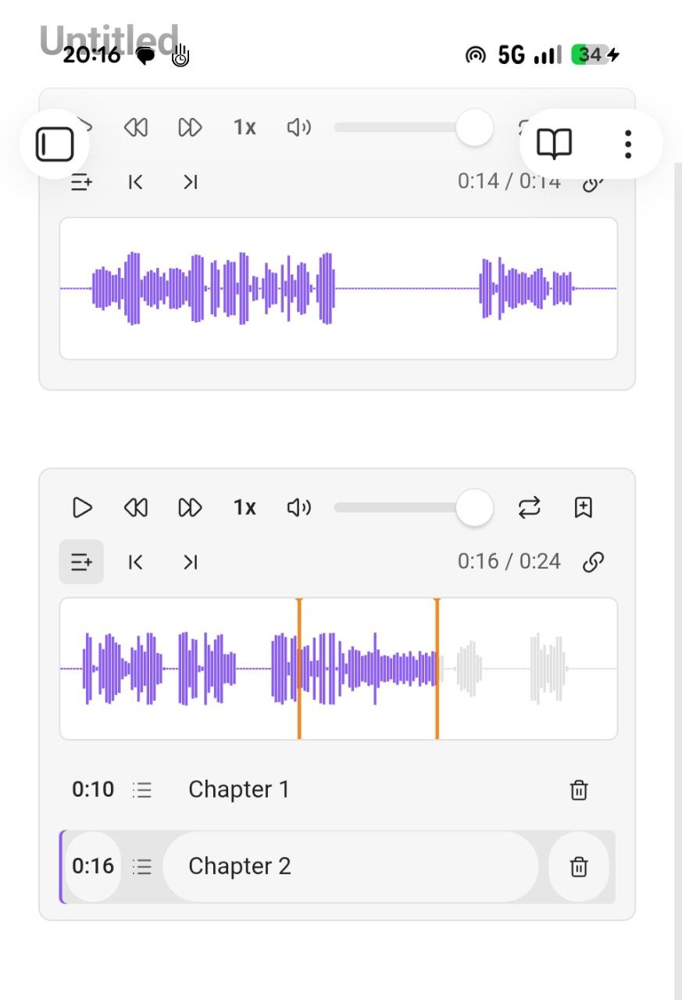

# Mobile support

Advanced Audio Recorder runs in the **Obsidian mobile app** (iOS and Android) as well as on the desktop. You record straight into a note, play recordings back in the enhanced waveform player with markers and chapters, convert and split files, clean up noisy audio, and transcribe with a cloud engine - all from your phone or tablet. A handful of features stay desktop-only because they rely on hardware or capabilities the mobile app does not expose; where a setting is unavailable, the plugin **greys it out** rather than hiding it, and it never fails silently. This page collects everything that is specific to mobile in one place.

- [What works on mobile](#what-works-on-mobile)
- [Platform-specific limitations](#platform-specific-limitations)
- [Recording formats and automatic fallback](#recording-formats-and-automatic-fallback)
- [Transcription on mobile](#transcription-on-mobile)
- [The mobile recording banner](#the-mobile-recording-banner)
- [Getting started on mobile](#getting-started-on-mobile)
- [Related pages](#related-pages)

_Figure: two recordings on Android, each rendered in the enhanced waveform player with its own chapters._

## What works on mobile

Most of the plugin works the same on a phone or tablet as on the desktop:

- **Recording.** Capture a single track from the device's microphone, with pause and resume, live status feedback, and markers dropped while you record. See [Recording](recording.md#recording-on-mobile).
- **The enhanced audio player.** Every embedded recording plays back in the enhanced waveform player - the waveform seek bar, playback-speed presets, skip, volume, mute, loop, the time display, timecode links, and per-file **markers and chapters** all work. The screenshot above is two of these players side by side on Android. See [Audio player](audio-player.md).
- **Markers and chapters.** Add, rename, and jump to bookmarks and chapters, stored in the same sidecar file next to each recording, so they travel with the vault across devices. See [Markers and chapters](audio-player.md#markers-and-chapters).
- **Format conversion.** Transcode a file to another format and bitrate from the right-click menu. See [Convert audio format](file-operations.md#convert-audio-format).
- **Manual splitting.** Split an existing recording into fixed-duration parts, within a size the device can hold in memory. See [Splitting](splitting.md).
- **On-demand audio cleanup.** Run the high-pass filter, noise gate, and loudness leveling on an existing file, with tighter size and length limits than the desktop so the app stays within its memory budget. See [Audio cleanup](audio-cleanup.md).
- **Cloud transcription.** Transcribe recordings with the Whisper API, Deepgram, or Google Gemini, with optional LLM post-processing. See [Transcription on mobile](#transcription-on-mobile) below.
- **File actions.** Audio file info, delete, and delete-and-link all work from the context menu. See [File operations](file-operations.md).

## Platform-specific limitations

The following features are **desktop-only** and do not run in the mobile app. Their settings are shown **greyed out** on mobile, never hidden, so it is always clear why an option is unavailable. A configuration synced from a desktop vault does not break the mobile session - the plugin quietly falls back to what the phone can do.

- **Input device selection.** Phones expose one microphone to the app, so there is no device list to choose from. Recording always uses the system default microphone, and any stored device id is ignored. See [Switching the input device](recording.md#switching-the-input-device).
- **Sample rate selection.** Mobile operating systems fix their own capture sample rate, so the **Sample rate** setting does not apply.
- **Recording channels (mono downmix and channel pick).** The channel-layout options are tied to real multi-channel input devices, which only the desktop platform exposes, so **Recording channels** is unavailable on mobile. See [Recording in mono](recording.md#recording-in-mono).
- **Multi-track recording.** Capturing several input devices at once needs the multi-device access the mobile app does not provide. A multi-track configuration synced from the desktop silently records a normal single-track session on the phone. See [Multi-track recording](multi-track-recording.md).
- **Automatic (time-based) splitting.** The **Split recordings automatically** option does not run on mobile. Long recordings are still saved as parts, but by a size-based rotation described below rather than by the configured duration. See [Splitting](splitting.md).
- **Crash recovery.** In-progress recordings are not journaled on mobile, so audio still buffered in memory when the operating system kills the app cannot be recovered. Parts already written to disk are unaffected. See [Crash recovery](recording.md#crash-recovery).
- **The command line.** The terminal commands the plugin answers exist only where the app has a command line, which is the desktop build from Obsidian 1.12.2 on. Nothing about a mobile session depends on them. See [From the command line](recording.md#from-the-command-line).
- **Local whisper.cpp transcription.** The local engine shells out to a native binary, which the mobile app cannot do. Use a cloud engine instead - see [Transcription on mobile](#transcription-on-mobile).

## Recording formats and automatic fallback

The **Recording format** dropdown offers only the formats the device can genuinely produce, because both recording support and encoder support are probed at runtime. The two platforms differ in what they record natively:

- **iOS** records **AAC** natively - the `mp4` container, and `m4a`, which is the same container under its audio extension. Other formats are produced by converting that native recording when the file is saved, wherever a working encoder exists.
- **Android** records **Opus** (`webm` or `ogg`) natively, the same as the desktop default.

If the format stored in settings is one the current device cannot record - for example a **WebM** default synced from a desktop vault opened on an iPhone - recording does **not** fail. The plugin falls back to the platform's best recordable format and shows a notice so you know the file was saved in a different format than configured.

Long recordings are handled by **part rotation** rather than in-memory growth. When a mobile recording reaches the in-memory buffer limit (about **50 MB**), the finished chunk is written as a complete, self-contained, playable part file (`...-part1`, `...-part2`, and so on) and capture continues seamlessly into the next part. Each part is a valid file on its own, so nothing is lost if the app is interrupted after a part has been written.

## Transcription on mobile

Transcription works on mobile with the **cloud engines**:

- **Whisper API** (OpenAI-compatible, including Groq)
- **Deepgram** (with speaker diarization)
- **Google Gemini** (with speaker diarization)

Optional [LLM post-processing](llm-post-processing.md) - clean up, summarize, or run a custom instruction over the transcript - also works, because it too calls a cloud provider.

The **Local whisper.cpp** engine is **desktop-only** and is shown blocked on mobile. If a configuration synced from the desktop selects the local engine, a manual transcription reports that local transcription is only available in the desktop app, and **Transcribe after recording** is skipped on mobile with a notice instead of failing. Pick one of the cloud engines under **Settings > Advanced Audio Recorder > Transcription** to transcribe on a phone or tablet. See [Transcription](transcription.md) for the full engine comparison and output options.

## The mobile recording banner

The mobile app has no ribbon icon and no desktop status bar to show that a capture is in progress, so the plugin shows a **floating recording banner** instead. The banner carries a recording indicator, the elapsed time, and a **stop** button, so an active session is always visible and can always be stopped.

The banner is governed by the **Mobile recording banner** setting under **Settings > Advanced Audio Recorder > Audio processing & feedback** (default **On**). On the desktop app the ribbon indicator and the status bar already make a recording obvious, so the banner is not shown there. See [Mobile recording banner](recording.md#mobile-recording-banner).

## Getting started on mobile

1. **Install the plugin.** Open **Settings > Community plugins** in the Obsidian mobile app, turn off **Restricted mode** if it is on, tap **Browse**, search for **Advanced Audio Recorder**, then **Install** and **Enable**. This is the same catalogue used on the desktop - see [Getting started](getting-started.md#from-community-plugins).
2. **Grant microphone permission.** The first time you record, the operating system asks to let Obsidian use the microphone - choose **Allow**. If you miss the prompt or capture stays silent, enable microphone access for Obsidian in the phone's system settings.
3. **Record.** Run the **Start/stop recording** command from the command palette (you can also add it to the mobile toolbar for one-tap access, since there is no ribbon icon on mobile). The [mobile recording banner](#the-mobile-recording-banner) appears while the session is live; tap its stop button, or run the command again, to finish and save.
4. **(Optional) Transcribe.** Enable transcription, pick a **cloud** engine, and add its API key under **Settings > Advanced Audio Recorder > Transcription**. See [Transcription on mobile](#transcription-on-mobile) and the [Record a voice memo or lecture on your phone](use-cases/record-on-mobile.md) walkthrough.

Device-bound settings (the input device and channel layouts) are stored **per platform**, so a vault synced between a desktop and a phone keeps each device's own configuration intact.

## Related pages

- [Recording on mobile](recording.md#recording-on-mobile) - the recording section's mobile notes in full.
- [Record a voice memo or lecture on your phone](use-cases/record-on-mobile.md) - an end-to-end mobile walkthrough.
- [Audio player](audio-player.md) - the enhanced waveform player, markers, chapters, and timecode links.
- [Transcription](transcription.md) - the four engines, diarization, and output formats.
- [Getting started](getting-started.md) - install the plugin and make your first recording.
