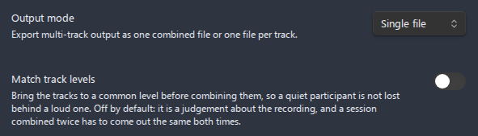

# Multi-track recording

**Multi-track recording** captures from up to **eight input devices at the same time** in a single recording session. Every track is its own recorder running at the format and bitrate you have configured; they all start, pause, resume, and stop together. When you stop, the plugin either **mixes** every track into one file or saves **one file per track**, depending on the output mode you pick. This feature is **desktop-only**: capturing several input devices at once needs access the mobile app does not provide, so the phone records a single track instead.

- [What it is and when to use it](#what-it-is-and-when-to-use-it)
- [Setup](#setup)
- [Output modes](#output-modes)
    - [Single file (mixed)](#single-file-mixed)
    - [Multiple files (one per track)](#multiple-files-one-per-track)
    - [File naming in Multiple files mode](#file-naming-in-multiple-files-mode)
- [Behavior](#behavior)
- [Memory notes for merged output](#memory-notes-for-merged-output)
- [Interaction with automatic splitting](#interaction-with-automatic-splitting)
- [Related settings](#related-settings)

---

## What it is and when to use it

Normal recording captures a single input device. Multi-track recording lets you assign a **separate microphone or input device to each track** and record them all into one session. The tracks share one timeline, so they stay in sync.

Use it when:

- You are recording an **interview with two microphones** - one per speaker - and want each voice cleanly captured, either kept on separate files or mixed into one.
- You run a **panel or podcast** where several people each have their own mic.
- You want to capture **a mic plus a second input** (for example a second person's headset) without an external mixer.
- You want **per-track files you can edit independently** afterward (lower one voice, clean up one channel, transcribe one speaker).

If you only ever record from one device, leave multi-track off - single-device recording is the default and needs no setup. See [Recording](recording.md) for the basics.

> **Desktop only.** Multi-track recording runs only in the Obsidian desktop app; the mobile app records a single track from its default microphone. See [Mobile support](mobile-support.md).

---

## Setup

Multi-track recording is configured under **Settings > Advanced Audio Recorder > Multi-track recording**. The track controls only appear once the feature is enabled.

1. Open **Settings > Advanced Audio Recorder** and scroll to the **Multi-track recording** heading.
2. Turn on **Enable multi-track recording**. (Default: **Off**.) The track options below appear.
3. Set **Maximum tracks** in the number field - the number of simultaneous tracks, from **1 to 8** (default **2**). Use only what you need; each extra track is another live recorder.
4. Choose the **Output mode**: **Single file** (all tracks mixed into one) or **Multiple files** (one file per track). Default is **Single file**.
5. For each track, assign an **Audio source for track N** - pick the input device from the dropdown. There is one dropdown per track, numbered up to the **Maximum tracks** value. The device list auto-populates and refreshes as devices are connected or disconnected.
6. Optionally set **Channels for track N** - the channel layout for that track's capture, bound to the track's device: keep the device layout (default), **Mono (mix all channels)**, **Mono (left channel)**, or **Mono (right channel)**. Because the choice is per track, a microphone that arrives hard-panned through a dual-input audio interface can be reduced to mono while a genuine stereo source on another track (for example a system-loopback device) keeps both channels. The selector is disabled when the track has no device yet, its device reports a mono-only input, or the selected device has been disconnected. The saved choice is retained and becomes available again after reconnecting a capable device. See [Recording in mono](recording.md#recording-in-mono) for how each mode sounds.


_Figure: the Multi-track recording settings section with multiple per-track device dropdowns shown._

Once configured, start recording exactly as you normally do - the **microphone ribbon icon** or the **Start/stop recording** command. All assigned tracks begin together. See [Recording](recording.md) for the recording workflow, status bar, and save behavior.

> **Tip:** You can assign the **same device** to more than one track. The plugin keeps the files from colliding (see [File naming in Multiple files mode](#file-naming-in-multiple-files-mode)), though recording the same source twice rarely adds anything.

---

## Output modes

The **Output mode** dropdown decides what happens when you stop the session.

| Mode               | What you get                                  | Best for                                                                 |
| ------------------ | --------------------------------------------- | ------------------------------------------------------------------------ |
| **Single file**    | All tracks **mixed down** into one audio file | A finished recording you just want to listen to or transcribe as a whole |
| **Multiple files** | **One file per track**, kept separate         | Editing, cleaning, or transcribing each source independently             |

### Single file (mixed)

Every track is combined into a single mixed file at your configured [format](formats.md) and bitrate. Mono inputs are duplicated into both channels; the output is mono only when every input is mono, and stereo otherwise. Tracks reduced to mono by their **Channels for track N** setting count as mono inputs here - give every track a mono mode and the merged file is mono too. The mix runs **after** you stop recording, so a longer session takes a moment to assemble (the status bar shows the [save progress](recording.md#save-progress-in-the-status-bar)). One embed link is inserted into your note.

Because the tracks are mixed only once at stop, **merged output cannot be auto-split** - see [Interaction with automatic splitting](#interaction-with-automatic-splitting). For very long mixed sessions, mind the [memory notes](#memory-notes-for-merged-output) below.


_Figure: the Output mode dropdown set to Single file._

### Multiple files (one per track)

Each track is saved as its **own separate file** - no mixing happens. You get one file per track, each at your configured format and bitrate, and a link to **each** part file is inserted into the note when the recording stops. This mode keeps memory low (nothing is decoded for a mixdown) and is the recommended choice for long multi-track sessions.

### File naming in Multiple files mode

In **Multiple files** mode, each track's file is named from the **source device name** by default, so you can tell the tracks apart at a glance. The name is built as:

```text
<file prefix>-<source name>-<timestamp>.<ext>
```

- **`<file prefix>`** is the **File prefix** setting (default `recording`). See [File operations](file-operations.md).
- **`<source name>`** is the input device's label with non-alphanumeric characters stripped (for example `Built-in Microphone` becomes `BuiltinMicrophone`). If the device label cannot be resolved, the track falls back to a generic name.
- **`<timestamp>`** is the session timestamp shared by every track in the recording.
- **`<ext>`** is the recording format's extension.

When **two tracks use the same device**, their source names would be identical and the files would collide. To prevent that, the plugin **appends the track number** to disambiguate them - for example `recording-BuiltinMicrophone-1-...` and `recording-BuiltinMicrophone-2-...`. The suffix is only added to the tracks that actually clash; uniquely named tracks keep their plain source name.

> **There is no toggle for this.** Using the source/device name (with the track number appended to disambiguate) is the **default and only** behavior in the current version. You do not need to enable anything, and there is no "use source names" setting in the UI.

---

## Behavior

- **Each track is its own recorder.** Every track runs an independent recorder on its assigned stream, using the **same [recording format](formats.md) and [bitrate](settings-reference.md#output-format)** you have configured. There is no per-track format or bitrate; the **channel layout is per track** (see **Channels for track N** above). The global [Recording channels](settings-reference.md#audio-input) setting does not apply to multi-track sessions.
- **All tracks start and stop together.** Starting the session starts every track at once; stopping stops them all. **Pause/resume** and **markers/chapters** apply to the whole session, across every track, on one shared timeline.
- **Recording stats sum across tracks.** The live size shown in the status bar is the **total across all tracks and parts**, so a multi-track session grows faster on disk than a single-track one. See [Recording feedback](recording.md#live-feedback).
- **Same device on several tracks is allowed.** Files are kept from colliding by the track-number suffix described above.
- **Format and mode are locked for the session.** The output format and output mode are snapshotted when recording starts; changing them in settings mid-recording takes effect on the **next** session, not the current one.

---

## Memory notes for merged output

Mixing tracks into a **Single file** has to bring audio together in memory, and how much memory that takes depends on the format. This only matters in **Single file** mode - **Multiple files** mode never mixes and stays low on memory.

| Merged session                             | How it is mixed                                                             | Memory footprint                                          |
| ------------------------------------------ | --------------------------------------------------------------------------- | --------------------------------------------------------- |
| **WAV tracks > mixed WAV**                 | Mixed directly from the on-disk PCM in small fixed-size windows             | Stays close to the **size of the final file**, any length |
| **Compressed, or mismatched sample rates** | Decoded through the Web Audio engine (each track fully decoded into memory) | Roughly **1.2 GB per hour-long stereo track**             |

- **WAV > WAV merges are cheap.** Because WAV tracks are already raw PCM on disk, they are mixed straight from disk in small windows. Peak memory is about the output file plus one window per track, regardless of how long the recording is.
- **Compressed or rate-mismatched merges are expensive.** A compressed merged output (or tracks whose sample rates do not match) must be decoded through the Web Audio engine, which loads **every track into memory** - about **1.2 GB per hour-long stereo track**.
- **For very long multi-track sessions, prefer `Multiple files` or WAV.** Either switch to **Multiple files** output (no mixdown at all) or record to **[WAV](formats.md)** so the cheap streaming mix is used. Both keep memory bounded for hour-plus sessions.

---

## Interaction with automatic splitting

**Merged multi-track output is not automatically split.** When **Single file** mode is active with more than one track and **Split recordings automatically** is also enabled, auto-split is skipped for that session: the plugin shows the notice **"Auto-split is skipped for merged multi-track recordings."** and saves **one merged file** instead of parts. The tracks are mixed only once at stop, which is incompatible with writing parts during recording.

Auto-split **does** work in these cases:

- **Multiple files** mode - each track's file can still be split into parts as it records, because no mixdown is involved.
- A single-track session (one stream), which behaves like a normal recording.

For everything about splitting - automatic and manual, part naming, WAV vs compressed precision - see [Splitting](splitting.md).

---

## Related settings

All multi-track controls live under **Settings > Advanced Audio Recorder > Multi-track recording**.

| Setting                          | Description                                                                              | Default     |
| -------------------------------- | ---------------------------------------------------------------------------------------- | ----------- |
| **Enable multi-track recording** | Record from multiple input devices at the same time. Reveals the options below.          | Off         |
| **Maximum tracks**               | Number of simultaneous tracks (number field, 1-8).                                       | 2           |
| **Output mode**                  | `Single file` mixes all tracks into one file. `Multiple files` saves one file per track. | Single file |
| **Audio source for track N**     | Input device assigned to each track. One dropdown per track, up to **Maximum tracks**.   | -           |
| **Channels for track N**         | Channel layout for that track's capture: device layout, mono mix, or one picked channel. Disabled without a device or for mono-only devices. | Same as input device |

Settings that also shape multi-track output:

- **Recording format** and **Audio bitrate** apply to **every** track - see [Formats](formats.md) and the [Settings reference](settings-reference.md#output-format).
- **File prefix**, **Save folder**, and the near-active-file options control where files land and how they are named - see [File operations](file-operations.md).
- **Split recordings automatically** interacts with merged output as described above - see [Splitting](splitting.md).

For the full list of every plugin setting, see the [Settings reference](settings-reference.md). For the basics of starting, pausing, and saving a recording, see [Recording](recording.md).
