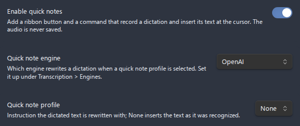

# Quick notes

A **quick note** is a dictation that lands in the note you are writing. Press the quick note button, say what you want to write down, press it again, and the recognized text is inserted at the cursor. The audio is never saved: it exists only while it is being recorded and transcribed, and it is dropped as soon as the text is ready. A **quick note profile** can rewrite the text with an LLM before it is inserted, so a stream of thoughts comes out as a tidy paragraph, a bulleted list, or a task.

- [How it works](#how-it-works)
- [Enabling quick notes](#enabling-quick-notes)
- [Dictating a note](#dictating-a-note)
- [Where the text goes](#where-the-text-goes)
- [Quick note profiles](#quick-note-profiles)
- [Long dictations](#long-dictations)
- [Behavior and reliability](#behavior-and-reliability)
- [Settings summary](#settings-summary)
- [Related pages](#related-pages)

## How it works

Quick notes reuse the plugin's own pipeline rather than a second one:

1. The microphone is opened with the same device, channel and encoding settings a recording uses, and the audio is kept in memory rather than written to the vault.
2. When you stop, the audio is sent to the transcription engine configured under **Settings > Transcription**, with its language and, when the advanced settings are on, its dictionary profile.
3. When a quick note profile is selected, the recognized text is sent to the **Quick note engine** with the profile's instruction.
4. The final text is inserted at the cursor, and the audio is discarded.

A quick note asks for plain text in the language it was spoken in. Speaker labels, word timings, **Translate speech to English**, the advanced two-pass mode, the transcript output format and the LLM post-processing of recordings are left to recordings, so a dictation is never billed for them and never comes back translated.

## Enabling quick notes

Quick notes are off by default, and while they are off the button is hidden and the command is not offered. They have an entry of their own on the main settings tab, the first one below the file storage rows:

1. Open **Settings > Advanced Audio Recorder > Transcription** and make sure **Enable transcription** is on and the engine is set up, because a dictation is transcribed by that engine.
2. Open **Settings > Advanced Audio Recorder > Quick notes** and turn on **Enable quick notes**.

The quick note button appears in the left ribbon at once, beside the recorder's own button, and the **Start/stop quick note** command becomes available in the command palette. Turning the switch off, or turning transcription off, hides both again without a restart. The button uses a waveform icon, so it cannot be mistaken for the recorder's microphone or for the microphone of Obsidian's own Audio recorder.

With quick notes on and transcription off, the entry reads **Needs transcription** and the page shows a **Transcription is off** row, so a switched-on feature never sits there without a button and without a reason. The entry also carries a warning marker while a press would be refused, for example while the engine has no key.



## Dictating a note

1. Put the cursor where the text should go.
2. Click the waveform button in the ribbon, or run **Start/stop quick note**. The button turns red and pulses, and the status bar shows `Quick note...` with a stop button, the elapsed time, the recorded size and the input level meter, the way it shows a recording.
3. Speak.
4. Click the button again, click the stop button in the status bar, or run the command again. The ribbon button pulses in the accent colour, and the status bar follows the processing stage by stage with a progress bar: `Quick note: stopping...`, `Quick note: Preparing audio...`, `Quick note: Transcribing...` (with the part being sent for a long dictation), `Quick note: Rewriting with LLM...` when a profile is selected, and `Quick note: Done`.
5. The text appears at the cursor, and the status bar clears.

The elapsed time, the size and the meter follow the **Recording stats** and **Input level meter** switches under **Audio processing & feedback**, like those of a recording.

Nothing is asked when you press the button: every setting a dictation reads is in the settings tab. The plugin assigns no hotkey, and you can bind one to **Start/stop quick note** under **Settings > Hotkeys**. On mobile, where neither the ribbon nor the status bar is shown, add the command to the mobile toolbar for one-tap access. A notice then says that the dictation is recording and follows the same stages until the text is inserted.

Before the microphone opens, the plugin checks that the dictation could be completed, so you are never left speaking into a note that refuses the text afterwards. A quick note does not start in these cases, and a notice says why:

- Transcription is switched off, or the transcription engine is missing its key or model.
- A quick note profile is selected and the **Quick note engine** is missing its key or model.
- A recording is running, because the two would capture the same speech twice.

The same rule holds the other way round. While a dictation is recording, a recording does not start, from the ribbon, the command palette or the command line, and a notice says `Stop the quick note before starting a recording.` Once the dictation is stopped and only being transcribed, the microphone is free again and a recording starts as usual.

## Where the text goes

The text is inserted into the note that was active when you started the dictation, at that note's cursor as it stands when the text arrives. You can keep typing while a dictation is transcribed, and the text follows your cursor. You can also switch to another note: the text still goes into the note you dictated for, as long as it is open in a pane.

When that note has been closed, the text goes into the note that is active instead. When no note is open at all, the text is copied to the clipboard and a notice says so, because a dictation you have already paid for is never thrown away for want of a cursor. When the clipboard refuses it too, as a window without focus does, a notice that stays until it is closed shows the text itself.

The text is inserted exactly as it comes back. A profile that should produce a heading, a list or a checkbox says so in its instruction.

## Quick note profiles

Without a profile, a quick note is inserted as it was recognized. That is the default, and it costs only the transcription.

A **quick note profile** is a named instruction the dictated text is rewritten with. Profiles are created, renamed and deleted in the **Quick note profiles** catalogue of the Quick notes page, which works exactly like the prompt catalogues of [LLM post-processing](llm-post-processing.md#prompt-profiles): each profile is a page of its own with its instruction, a switch that makes it the profile in use, and rename and delete. The **Quick note profile** row above the catalogue picks the profile in use, and **None** switches the rewrite off. A profile's instruction can also be read from a note, by setting its **Source** row to **Note**.

The instruction is sent to the model verbatim as the system prompt, with the recognized text as the message. Nothing is added to it, so ask for the rewritten text alone and name the language when it matters. A few instructions that work well:

```text
Clean up this dictation: fix punctuation and capitalization, remove filler words and false starts, and keep my wording. Reply with the cleaned text only, in the language it was dictated in.
```

```text
Turn this dictation into a Markdown bulleted list, one idea per item, in the language it was dictated in. Reply with the list only.
```

```text
Turn this dictation into one Markdown task line starting with "- [ ] ". Keep it short. Reply with the line only.
```

Dictating "buy milk and eggs and call the plumber about the kitchen tap" with the second profile selected inserts:

```markdown
- Buy milk
- Buy eggs
- Call the plumber about the kitchen tap
```

The rewrite runs on the engine named by the **Quick note engine** row, which can be a different service from the one post-processing uses. Its endpoint, key and model are configured once on its page under **Transcription > Engines**. On an existing setup it starts on the engine post-processing already uses.

## Long dictations

There is no limit on how long a dictation can be. A typical quick note lasts under a minute, and a longer one is split into parts exactly as a long recording is: when the audio is larger or longer than the engine accepts in one request, it is sent in parts and the text comes back in order. When one part fails, the text of the parts that succeeded is still inserted, and a notice names the part that is missing.

## Behavior and reliability

- **The audio is never saved.** It is held in memory while you speak and while it is transcribed, and dropped as soon as the text is ready, whether the dictation succeeded, failed, or was cancelled. Nothing is written to the vault, so nothing reaches a sync service.
- **The rewrite is best-effort.** When the LLM call fails, the text is inserted as it was recognized, and a notice says `Quick note rewrite failed; inserting the text as dictated.`
- **One dictation at a time.** Pressing the button while the last dictation is still being transcribed only shows `The last quick note is still being transcribed.`, however many presses land while the microphone is opening.
- **Disabling cancels.** Turning quick notes off, turning transcription off, or disabling the plugin closes the microphone and cancels a dictation in flight, which then inserts nothing.
- **Costs are counted.** The transcription and the rewrite are added to the session total shown in the Transcribe dialog, like any other run.
- **Privacy.** The audio is sent to the transcription engine, and the recognized text to the quick note engine when a profile is selected. With the local whisper.cpp engine and no profile, a quick note never leaves the computer.

## Settings summary

All controls live under **Settings > Advanced Audio Recorder > Quick notes**.

| Setting                  | What it does                                                                                                   | Default                    |
| ------------------------ | -------------------------------------------------------------------------------------------------------------- | -------------------------- |
| **Enable quick notes**   | Adds the quick note button to the ribbon and the **Start/stop quick note** command. Reveals the rows below.    | Off                        |
| **Transcription is off** | Shown instead of the button when quick notes are on and transcription is off. Turn transcription on.           | -                          |
| **Quick note engine**    | `OpenAI`, `Anthropic (Claude)`, `Google Gemini`, `Mistral`, or `DeepSeek`. Called only when a profile is used. | The post-processing engine |
| **Quick note profile**   | The instruction the dictation is rewritten with. **None** inserts the text as it was recognized.               | None                       |
| **Quick note profiles**  | Named instructions, each a page with its instruction or the note it is read from, rename, and delete.          | No profiles                |

The transcription itself follows the Transcription page: the engine, **Language**, the **Dictionary profile** when the advanced settings are on, and the microphone settings under **Audio input**.

## Related pages

- [Transcription](transcription.md) - the engines a dictation is transcribed with, and how their keys are set up.
- [LLM post-processing](llm-post-processing.md) - the prompt catalogues quick note profiles share their mechanics with.
- [Settings reference](settings-reference.md#quick-notes) - every quick note setting in the order the tab shows it.
- [Mobile support](mobile-support.md) - running commands from the mobile toolbar.
