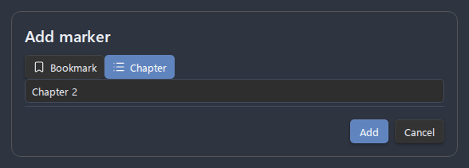

# Recording

Recording is the core of Advanced Audio Recorder: start a capture from the ribbon or the command palette, watch live feedback in the status bar, drop markers as you go, and the plugin writes the finished file and inserts an embed link into your note when you stop. This page walks the complete workflow end to end - every button, every status-bar state, every save stage, and what happens when a recording is interrupted.

- [Starting a recording](#starting-a-recording)
- [Switching the input device](#switching-the-input-device)
- [The status bar while recording](#the-status-bar-while-recording)
- [Live feedback](#live-feedback)
- [Marking moments while recording](#marking-moments-while-recording)
- [Pausing and resuming](#pausing-and-resuming)
- [Stopping and saving](#stopping-and-saving)
- [Insert at original position](#insert-at-original-position)
- [Crash recovery](#crash-recovery)
- [Recording on mobile](#recording-on-mobile)
- [Mobile recording banner](#mobile-recording-banner)
- [Automatic splitting](#automatic-splitting)
- [Related settings](#related-settings)

## Starting a recording

There are two equivalent ways to start a recording:

1. Click the **microphone icon** in the left ribbon, or
2. Open the command palette (`Ctrl/Cmd + P`) and run **Start/stop recording**.

The plugin does not assign a default hotkey to any command, so if you want a keyboard shortcut, set one yourself under **Settings > Hotkeys**.

The moment you start, the plugin captures the **active note and cursor position** so the finished audio link can be placed exactly where you began - see [Insert at original position](#insert-at-original-position) for when this matters. A short `Recording started` notice confirms the session is live.

If the recording cannot start, the plugin shows a specific notice instead of failing silently:

| Cause                                       | Notice                                                                   |
| ------------------------------------------- | ------------------------------------------------------------------------ |
| Microphone permission was denied            | `Microphone access denied. Please grant permission in browser settings.` |
| No input device is connected                | `No microphone found. Please connect an audio input device.`             |
| The device is already in use by another app | `Microphone is in use by another application.`                           |
| The selected format is not supported        | The reason reported by the capability check                              |

If recording does not work, run **Test recording** from settings and check **System info** for supported formats - see [Troubleshooting](troubleshooting.md).

---

## Switching the input device

You do not have to open the settings tab to change which microphone records. Run the **Select audio input device** command from the command palette (`Ctrl/Cmd + P`) and a quick-pick modal opens, listing every input the plugin detected. Choose one and it is saved to your settings **immediately** - a confirmation notice reports the device that is now selected, and the next recording uses it.

This is the quickest way to switch mics between recordings - for example, moving from a laptop's built-in microphone to a headset before a meeting. The same choice is also available, alongside the sample rate, under [Audio input settings](settings-reference.md#audio-input).

---

## Recording in mono

By default a recording keeps whatever channel layout the input device delivers - a stereo device produces a stereo file. The **Recording channels** setting under [Audio input](settings-reference.md#audio-input) can reduce the recording to mono during capture instead:

| Option                     | What it records                                                                 |
| -------------------------- | ------------------------------------------------------------------------------- |
| **Same as input device**   | The device's own layout (default; previous behaviour).                          |
| **Mono (mix all channels)** | The average of every input channel - the standard stereo-to-mono downmix.      |
| **Mono (left channel)**    | Only the first input channel, at full level.                                    |
| **Mono (right channel)**   | Only the second input channel, at full level.                                   |

The left/right options exist for a common piece of hardware: audio interfaces with two mono inputs (mic on input 1, instrument on input 2) that the operating system exposes as one **stereo** device. Recording a single microphone through such an interface yields a stereo file with the voice hard-panned to one side. Picking **Mono (left channel)** (or right, depending on the input used) records just that channel with no level loss - whereas mixing would also fold in the silent channel and land the voice 6 dB quieter.

Notes:

- The downmix happens **during capture**, on every format: WAV records mono samples directly (half the file size), and compressed formats encode a mono stream, so the whole bitrate serves one channel. There is no extra re-encode.
- The setting applies to **single-track** recordings and to the **Test recording** button in settings. Each track of a [multi-track session](multi-track-recording.md) has its own **Track N channels** selector instead, so a hard-panned microphone track can go mono while a genuine stereo track stays untouched.
- The selector is **disabled (greyed out)** when the selected device reports a mono-only input or is no longer connected - every mono option would be pointless until a multichannel device is available. The saved channel choice is preserved, so reconnecting the device restores it. Devices whose capabilities the platform does not report keep the selection available.
- If a mono option is active while the device actually delivers mono, the recording still works - the picked-channel options fall back to the only channel available.
- Existing stereo files can be fixed after the fact with the **Channels** option in the [Convert audio format dialog](file-operations.md#convert-audio-format) or the [Clean up audio dialog](audio-cleanup.md#channels).

### Automatic silent-channel prompt

If you forget to set the channel mode, the plugin can catch a lopsided recording after the fact. With **Detect silent channel after recording** on (**Settings > Audio processing & feedback**, default on), one file from every output track is checked for the stereo-with-one-silent-channel pattern (for auto-split sessions, the first part of each track). When it is found, a notice identifies the affected file and offers a **Convert to mono** action that opens the [conversion dialog](file-operations.md#convert-audio-format) already preset to keep the channel that carries audio. You still confirm the format and link handling before it runs.

The active recording duration is checked before the file is read, so long sessions (over 20 minutes) are skipped without a decode. Shorter files are metadata-probed before decoding, and the signal check uses short RMS windows instead of one whole-file average: a brief but real sound on a channel is preserved instead of being diluted by a long quiet stretch. Turn the setting off to silence the prompt entirely.

---

## The status bar while recording

Once a session is active, the ribbon icon changes from a plain microphone to an active recording indicator, and the **status bar** (bottom-right of the Obsidian window) shows the live recording controls.

_Figure: The recording status bar with the live label, control buttons, stats, and input meter._

The status bar shows a label and a row of icon buttons:

| Element            | When it appears                                   | What it does                                      |
| ------------------ | ------------------------------------------------- | ------------------------------------------------- |
| `Recording...`     | While recording is active                         | The live status label.                            |
| `Recording paused` | While the session is paused                       | The label changes to reflect the paused state.    |
| **Add marker**     | Only when **Markers and chapters** is enabled     | Drops a bookmark or chapter at the live position. |
| **Pause**          | While recording (becomes **Resume** while paused) | Pauses the recording.                             |
| **Stop**           | Always, while recording or paused                 | Stops and saves the recording.                    |

The **Add marker** button only renders when the **Markers and chapters** option of the [enhanced player](audio-player.md) is enabled; otherwise the row shows just **Pause** and **Stop**. All three buttons are clickable and keyboard-focusable.

---

## Live feedback

Alongside the control buttons, the status bar shows live indicators that confirm the microphone is working and the recording is growing. Both are configurable under **Settings > Audio processing & feedback**.

- **Input level meter** - a live VU meter that fills in response to the microphone signal, so you can see at a glance that sound is actually being picked up. Controlled by **Input level meter** (default On).
- **Recording stats** - two figures that update continuously:
    - **Elapsed time** in `m:ss` (or `h:mm:ss` for long sessions). This counts _active_ recording time only; paused intervals are excluded.
    - **Total recorded size**, shown as it grows. For multi-track or multi-part sessions this is the sum across all tracks and parts.

    Controlled by **Recording stats** (default On).

Turning either indicator off only hides it from the status bar; recording itself is unaffected. For the related input-processing toggles (noise suppression, echo cancellation, automatic gain control) and how they shape the captured signal, see the [Related settings](#related-settings) table and [settings reference](settings-reference.md).

---

## Marking moments while recording

When **Markers and chapters** is enabled, you can flag an important moment the instant it happens - no need to wait for playback. This is ideal for marking the start of a topic in a lecture, an action item in a meeting, or a take you want to find again.

To drop a marker:

1. Click the **Add marker** button in the status bar, or run the **Add marker/chapter at current position** command. This is available only while a session is **recording or paused** and **Markers and chapters** is on.
2. A small naming dialog opens. Type a name and choose whether the marker is a **bookmark** (a single jump point) or a **chapter** (a named segment boundary).
3. Confirm. The marker is saved.

If you always drop the same kind, two dedicated commands skip the kind selector: **Add bookmark at current recording position** and **Add chapter at current recording position**. They obey the same recording-or-paused gate and can each be bound to a hotkey, so a single keypress drops a pre-typed marker and only the name is left to fill in.

_Figure: The naming dialog that opens when you add a marker while recording._

Two details make this reliable:

- **The timestamp is frozen at the moment you trigger the marker.** However long you spend naming it, the marker lands at the position where you clicked, not where the recording has reached by the time you confirm.
- **The marker is attached at save.** It is written into the recording's sidecar file when the session stops, so it is already present the first time you open the finished recording in the [enhanced player](audio-player.md#markers-and-chapters). If the recording happens to stop while the naming dialog is still open, the marker is still saved with its default name, and your edit (or cancellation) is applied to the saved marker afterward - nothing is lost.

Markers behave the same way in the player whether they were added live or during playback. For the full marker and chapter feature - the marker list, seek-bar ticks, chapter navigation, and where the sidecar is stored - see [Markers and chapters](audio-player.md#markers-and-chapters).

---

## Pausing and resuming

You can pause a recording without losing progress and resume it later in the same file.

- To pause: click the **Pause** button in the status bar, or run **Pause/resume recording**. The status bar switches to `Recording paused`, the **Pause** button becomes **Resume**, and a `Recording paused` notice appears.
- To resume: click **Resume**, or run the same command again. The label returns to `Recording...` and a `Recording resumed` notice appears.

The **Pause/resume recording** command is available only while a recording is active; running it with no session shows `No active recording to pause or resume`.

Paused intervals do not count toward the elapsed time, and the recorded size stops growing while paused. You can add markers while paused, too.

---

## Stopping and saving

Click the ribbon icon again, run **Start/stop recording**, or click the **Stop** button in the status bar to end the session. The plugin then runs a fixed save sequence:

1. **Stop the MediaRecorder** (or the PCM recorder for WAV) and wait for the final audio chunk.
2. **Flush** any audio still buffered in memory to disk.
3. **Assemble** the buffered segments into the final audio file.
4. **Write** the file to the configured save location.
5. **Insert an embed link** (`![[filename.ext]]`) into the active note.
6. **Clean up** the temporary segment files.

A `Recording stopped` notice confirms completion.

### Save progress in the status bar

For longer recordings the save can take a noticeable moment. The status bar shows a progress bar that walks through these stages:

| Progress | Stage                 |
| -------- | --------------------- |
| 0%       | `Saving...`           |
| 20%      | `Flushing buffers...` |
| 40%      | `Assembling audio...` |
| 60%      | `Writing file...`     |
| 80%      | `Cleaning up...`      |
| 100%     | `Saved`               |

While saving is in progress the ribbon icon switches from the recording indicator to a **save** icon, then returns to the plain microphone once the file is written.

A recording that is slow to save is expected behaviour for long captures, not an error. For multi-part recordings, see [Automatic splitting](#automatic-splitting); for the full list of output formats and how each is encoded, see [Formats](formats.md).

---

## Insert at original position

By default the embed link is inserted at the cursor in whatever note is active when the recording **stops**. Enable **Insert at original position** (under **Settings > File storage**, default Off) to instead remember the note and cursor position from when the recording **started** and place the link there - even if you scrolled, switched notes, or navigated away during the recording.

The position is captured as a snapshot at the moment recording begins. One caveat follows from that: if you **edit the original note while recording** - adding or deleting text above the saved spot - the remembered position can shift, because it is an offset into the note as it was when recording started. For predictable placement, avoid editing the target note's earlier content during a recording, or simply leave this option off and let the link land at your cursor on stop.

This setting works together with the [file storage options](file-operations.md) that decide _which folder_ the audio file itself is written to.

---

## Crash recovery

Desktop recordings are crash-resilient. While a session is active the plugin journals its temporary segment files in `recording-journal.json` (in the plugin folder) and flushes audio to disk as it goes. If Obsidian crashes, the machine loses power, or the plugin is disabled mid-recording, the next launch detects the interrupted session and opens a recovery dialog.

The dialog lists each interrupted session (start time, track count, and number of temporary segments) and offers three choices:

| Choice            | Effect                                                                                                                                                        |
| ----------------- | ------------------------------------------------------------------------------------------------------------------------------------------------------------- |
| **Recover audio** | Reassembles the surviving segments into playable files next to where the recording was being saved. No re-encoding is done, so even a truncated stream plays. |
| **Discard**       | Deletes the temporary segment files. Auto-split part files that were already finalized are never touched.                                                     |
| **Decide later**  | Leaves everything in place; the prompt returns on the next launch.                                                                                            |

Notes on what can and cannot be recovered:

- Recovered WAV (PCM) sessions are written as `<name>-recovered.wav`; compressed sessions are written in their raw recorder container as `<name>-recovered.<ext>`. The output lands in the directory where the recording was being saved, not in your current save folder (which may have changed since the crash).
- **Audio still buffered in memory** at the instant of the crash (up to the flush threshold) **cannot be recovered**. Everything already flushed to disk can.
- For a compressed track, the first segment carries the container header. If that first segment was lost, the track cannot be made playable and is reported as a failed track rather than producing a broken file.
- A session with **no surviving segments on disk** is pruned automatically and never prompts - so a crash before the first flush self-clears.

---

## Recording on mobile

Recording works in the Obsidian mobile app, with platform limits the plugin applies automatically (blocked options are shown greyed out in settings, never hidden):

- **Single track from the default microphone.** Phones expose one microphone to the app, so multi-track recording and input device selection are desktop-only; a multi-track configuration synced from desktop silently records a normal single-track session on the phone.
- **Formats follow the device.** The format dropdown blocks formats the device genuinely cannot produce (recording support and encoder support are both probed at runtime). On iOS the system records AAC (`mp4`, and `m4a` - the same container under its audio extension) natively; other formats are produced by converting that recording when it is saved, where a working encoder exists. On Android, Opus (`webm`/`ogg`) is recorded natively as on desktop. If the stored format cannot be recorded on this device (for example a config synced from desktop), recording does not fail: it falls back to the platform's best recordable format and says so.
- **Long recordings are saved as parts.** When a mobile recording exceeds the in-memory buffer limit (about 50 MB), the recorder is rotated: the finished chunk is saved as a complete, playable part file (`-part1`, `-part2`, ...) and capture continues seamlessly into the next part.
- **Time-based auto-split and crash recovery are desktop-only.** On mobile, audio still buffered in memory at the moment the OS kills the app cannot be recovered; already-saved parts are unaffected.
- **Local whisper.cpp transcription is desktop-only** (it runs an external program). The cloud engines - Whisper API, Deepgram, Gemini - work on mobile; if a synced config selects the local engine, automatic transcription after recording is skipped with a notice.
- **The OS pauses background apps.** Locking the screen, switching apps, or an incoming call can suspend Obsidian and interrupt the capture. This is a mobile OS limitation, not a plugin setting: keep the app in the foreground and the screen on for long recordings.
- Device-bound settings (input device, channel layouts) are stored **per platform**, so a vault synced between desktop and phone keeps each device's configuration intact.

## Mobile recording banner

The **Mobile recording banner** option (under **Settings > Audio processing & feedback**, default On) governs a floating on-screen banner shown on mobile, where there is no ribbon icon to show that a recording is in progress. When shown, the banner displays a recording indicator, the elapsed time, and a stop button so the session is always visible and stoppable.

On the desktop app the ribbon indicator and the status bar already make the recording obvious, so the banner is not shown there.

---

## Automatic splitting

When **Split recordings automatically** is enabled, a long recording is saved as several fixed-duration **part files** (for example `recording-...-part1.webm`, `recording-...-part2.webm`) instead of one large file. Each finished part is written to disk while recording continues, and links to every part are inserted into the note when you stop.

In brief:

- **Part duration** (default 15 minutes, range 1-180) sets the length of each part.
- WAV recordings split sample-exactly at the boundary; compressed formats restart the recorder at each boundary, so parts are approximately the configured length and a sub-second gap may occur between them.
- Auto-split is **desktop only** and is **not** applied to merged multi-track output (one `Single file` mixed from several tracks); the plugin shows a notice and saves a single merged file in that case.

This is only a summary. For the full behaviour - manual splitting of existing files, naming, link rewriting, and memory notes - see [Splitting](splitting.md).

---

## Related settings

These settings shape the recording workflow. See the [settings reference](settings-reference.md) for the complete list, exact ranges, and defaults.

| Setting                              | What it controls                                                                                        | Reference                                                                       |
| ------------------------------------ | ------------------------------------------------------------------------------------------------------- | ------------------------------------------------------------------------------- |
| **Input device**                     | Which microphone or input the recording captures.                                                       | [Audio input](settings-reference.md#audio-input)                                |
| **Sample rate**                      | Capture sample rate in Hz (default 44100).                                                              | [Audio input](settings-reference.md#audio-input)                                |
| **Recording channels**               | Keep the device channel layout, or record mono (mix all channels, or keep only the left/right channel). | [Audio input](settings-reference.md#audio-input)                                |
| **Recording format**                 | The output container/codec (default WebM); offline formats are labelled `(offline)`.                    | [Output format](settings-reference.md#output-format)                            |
| **Audio bitrate**                    | Compression quality for the recording (default 128 kbps).                                               | [Output format](settings-reference.md#output-format)                            |
| **Save folder**                      | The vault folder recordings are written to (default vault root).                                        | [File storage](settings-reference.md#file-storage)                              |
| **Save recordings near active file** | Writes the file beside the active note instead; takes priority over Save folder.                        | [File storage](settings-reference.md#file-storage)                              |
| **File prefix**                      | The filename prefix for new recordings (default `recording`).                                           | [File storage](settings-reference.md#file-storage)                              |
| **Insert at original position**      | Places the embed link where recording started rather than at the cursor on stop (default Off).          | [File storage](settings-reference.md#file-storage)                              |
| **Split recordings automatically**   | Saves a long recording as fixed-duration part files (desktop only, default Off).                        | [Audio splitting](settings-reference.md#audio-splitting)                        |
| **Part duration**                    | The length of each auto-split part in minutes (default 15, range 1-180).                                | [Audio splitting](settings-reference.md#audio-splitting)                        |
| **Markers and chapters**             | Enables the **Add marker** control while recording and the marker list in the player (default On).      | [Audio player](settings-reference.md#audio-player)                              |
| **Input level meter**                | Shows the live VU meter in the status bar (default On).                                                 | [Audio processing & feedback](settings-reference.md#audio-processing--feedback) |
| **Recording stats**                  | Shows live elapsed time and recorded size in the status bar (default On).                               | [Audio processing & feedback](settings-reference.md#audio-processing--feedback) |
| **Mobile recording banner**          | Shows the floating recording banner where the ribbon is unavailable (default On).                       | [Audio processing & feedback](settings-reference.md#audio-processing--feedback) |
| **Noise suppression**                | Applies the browser's noise suppression to the input stream (default On).                               | [Audio processing & feedback](settings-reference.md#audio-processing--feedback) |
| **Echo cancellation**                | Applies the browser's echo cancellation to the input stream (default On).                               | [Audio processing & feedback](settings-reference.md#audio-processing--feedback) |
| **Automatic gain control**           | Applies the browser's automatic gain control to the input stream (default On).                          | [Audio processing & feedback](settings-reference.md#audio-processing--feedback) |

---

See also: [Getting started](getting-started.md) · [Multi-track recording](multi-track-recording.md) · [Audio player](audio-player.md) · [Formats](formats.md) · [Transcription](transcription.md) · [Troubleshooting](troubleshooting.md)
