# Settings reference

This is the exhaustive reference for every setting in **Advanced Audio Recorder**. Open **Settings > Advanced Audio Recorder** to reach it. The settings tab is grouped into headed sections; this page covers them in the exact order they appear, with a fully aligned table per section listing what each control does, its options or range, and its default. On Obsidian 1.13 and later the sections that are set once and then read past sit behind an entry that already shows what they hold, so opening one is a choice: transcription, audio splitting, multi-track recording, the audio player, audio processing and feedback, the audio cleanup defaults, and diagnostics. The main tab keeps inline what a recording is configured with before a session, namely the input, the output format, and where the file goes. On older versions every section is inline, and the settings themselves are the same either way. Two more things follow the Obsidian version: from 1.13 the profile catalogues can be dragged into the order you want them offered in, and from 1.13.1 an entry shows a warning marker when something behind it is missing - a transcription engine with no key or model, multi-track recording switched on with no track given an input at all, or more than one track asking for this machine's own output, which one session can capture only once. Conditional controls (ones that only appear once another setting is on) are called out inline. Every catalogue of named profiles is two rows rather than one: a dropdown named in the singular, such as **Dictionary profile**, which picks the profile a run uses by default and offers **None**, and the page named in the plural, such as **Dictionary profiles**, which is where a profile is added, renamed, edited or deleted. For deeper, task-focused walkthroughs, each section links to its own guide.

- [Where settings live and how they apply](#where-settings-live-and-how-they-apply)
- [Documentation and release notes](#documentation-and-release-notes)
- [Audio input](#audio-input)
- [Output format](#output-format)
- [File storage](#file-storage)
- [Audio splitting](#audio-splitting)
- [Multi-track recording](#multi-track-recording)
- [Audio player](#audio-player)
- [Transcription](#transcription)
    - [Engine: Whisper API](#engine-whisper-api)
    - [Engine: Deepgram](#engine-deepgram)
    - [Engine: Google Gemini](#engine-google-gemini)
    - [Engine: Mistral Voxtral](#engine-mistral-voxtral)
    - [Engine: Mistral](#engine-mistral)
    - [Engine: DeepSeek](#engine-deepseek)
    - [Engine: OpenAI](#engine-openai)
    - [Engine: Anthropic (Claude)](#engine-anthropic-claude)
    - [Engine: Local whisper.cpp](#engine-local-whispercpp)
    - [Transcript output](#transcript-output)
    - [Auto chapters](#auto-chapters)
    - [LLM post-processing](#llm-post-processing)
    - [Advanced settings](#advanced-settings)
- [Audio processing & feedback](#audio-processing--feedback)
- [Audio cleanup defaults](#audio-cleanup-defaults)
- [Diagnostics](#diagnostics)
- [Settings backup and recovery](#settings-backup-and-recovery)

---

## Where settings live and how they apply

Settings are stored in the plugin's `data.json` on this device. Almost every control saves the moment you change it - toggles and dropdowns save immediately, a number field saves when you commit it (press Enter, leave the field, or use the stepper arrows), and text fields save shortly after you stop typing. There is no separate "Save" button.

A few settings reveal or hide other controls when toggled, so the tab redraws in place:

- Turning **Save recordings near active file** on reveals **Active file subfolder**.
- Turning **Enable multi-track recording** on also disables **Include system audio** under **Audio input**, since a per-track configuration says what each track records and one session can capture the system output only once.
- Turning **Enable multi-track recording** on reveals **Maximum tracks**, **Output mode**, and one **Track N input** and **Track N channels** dropdown pair per track. Choosing **Single file** as the output mode reveals **Match track levels** and a **Track N level** and **Track N position** field per track, which decide how each track lands in the combined file.
- Turning **Enhanced audio player** on reveals **Show waveform**, **Markers and chapters**, and **Skip step**.
- Turning **Enable transcription** on reveals the **Transcription engine** row, transcript output, and LLM sub-sections; the engine page holds the picker and the fields of whichever engine it points at, so choosing another one swaps them there.
- Turning **Enable LLM post-processing** on reveals its **Post-processing engine** row and the task and prompt controls; the key, the model, and the token ceiling belong to that engine and live on its page under **Engines**.
- Turning **Auto chapters** on reveals its own **Chapters engine** row, so chapters can run on a different service from post-processing, and it reveals **Generate after transcription** whenever there are transcriptions for that generation to follow.
- Turning **Enable transcription** back off keeps the **Auto chapters** block and the **Engines** entry on screen while chapters are on, because the chapters action is offered on any recording that already has a transcript and it still needs an engine, a key, and a model. Everything that has no run without transcription goes away with it, so transcript output, the post-processing block, and the advanced two-pass block all disappear.

Player settings apply live: changing **Show waveform** or **Markers and chapters** rebuilds any enhanced player already open in a note, so you do not have to reopen the embed. Other changes (for example a new recording format or save folder) take effect on the next action that uses them.

---

## Documentation and release notes

At the very top of the settings tab is a callout with a book icon linking to the online documentation, so the guides and use-case walkthroughs are one click away instead of buried in the GitHub repository. Under it is the switch for the dialog that reports what an update changed, described in [After an update](getting-started.md#after-an-update).

| Control                    | What it does                                                                                                                                                                                                                                                                                                                   | Options / range | Default |
| -------------------------- | ------------------------------------------------------------------------------------------------------------------------------------------------------------------------------------------------------------------------------------------------------------------------------------------------------------------------------ | --------------- | ------- |
| **Open the documentation** | Opens the plugin's `docs/` folder on GitHub in your browser (a static link).                                                                                                                                                                                                                                                   | Link            | -       |
| **Release notes**          | Shows a **What's new** dialog the first time a new version of the plugin runs, listing every release since the one you were on. Off leaves the version recorded anyway, so turning it back on shows the next update rather than everything missed meanwhile. The notes stay reachable through the **Show what's new** command. | On / Off        | On      |

---

## Audio input

Pick the microphone, sample rate, and channel layout used for recordings, and say whether this computer's own output is recorded beside the microphone. The device dropdown auto-refreshes when you plug or unplug a device while the tab is open. See [Recording](recording.md) for how these are used.

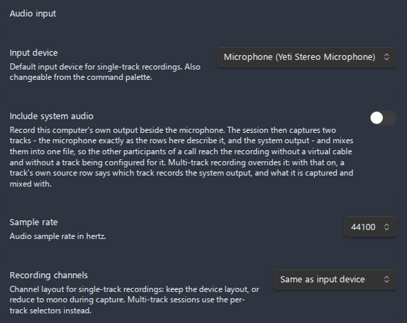

| Setting                  | What it does                                                                                                                                                                                                                                                                                                                                                                                                                                                                                                                                                                                                                                                                                                                                                      | Options / range                                                                             | Default                                                                                                                |
| ------------------------ | ----------------------------------------------------------------------------------------------------------------------------------------------------------------------------------------------------------------------------------------------------------------------------------------------------------------------------------------------------------------------------------------------------------------------------------------------------------------------------------------------------------------------------------------------------------------------------------------------------------------------------------------------------------------------------------------------------------------------------------------------------------------- | ------------------------------------------------------------------------------------------- | ---------------------------------------------------------------------------------------------------------------------- |
| **Input device**         | Default input device for single-track recordings. The dropdown lists every detected device and refreshes on device change. The **Select audio input device** command opens a quick device-picker modal; choosing a device saves it here immediately and shows a confirmation notice.                                                                                                                                                                                                                                                                                                                                                                                                                                                                              | Auto-detected device list                                                                   | None - pick one before recording (the dropdown shows the first detected device, but nothing is saved until you choose) |
| **Include system audio** | Records this computer's own output beside the microphone, without configuring a track for it. The session then captures two tracks - the microphone as the rows around this one describe it, and the system output granted by the host - and mixes them into one file, so the remote side of a call reaches the recording. Electron grants that output on Windows only, and the row says so where the build cannot; a recording started with it on elsewhere is refused with the same reason. Off on mobile, which cannot open two captures at once. Disabled while **Multi-track recording** is on, because a per-track configuration already says what each track records and one session can capture the system output only once.                              | On / Off                                                                                    | Off                                                                                                                    |
| **Sample rate**          | Audio sample rate in hertz, as a dropdown over a fixed list. Every value is offered on every device, because `getUserMedia` accepts a rate it cannot deliver and quietly substitutes its own, so there is nothing to probe.                                                                                                                                                                                                                                                                                                                                                                                                                                                                                                                                       | 8000 / 16000 / 22050 / 44100 / 48000 Hz                                                     | 44100 Hz                                                                                                               |
| **Recording channels**   | Channel layout for **single-track** recordings. `Same as input device` keeps whatever the device delivers. The mono options downmix during capture: `Mono (mix all channels)` averages every input channel, while `Mono (left channel)` / `Mono (right channel)` keep exactly one channel at full level - the right choice for audio interfaces whose two mono inputs appear as a single stereo device, where a mix would sound 6 dB quieter. Also applies to the settings test recording. Disabled (greyed out) when the selected input device reports a mono-only input or is disconnected; the saved choice is preserved and restored when a capable device is available again. Multi-track sessions use the per-track **Track N channels** selectors instead. | Same as input device / Mono (mix all channels) / Mono (left channel) / Mono (right channel) | Same as input device                                                                                                   |

---

## Output format

Choose the final file format and quality for recordings, and how conversions handle the source file and its links. Offline formats are labelled `(offline)` in the dropdown. See [Formats and containers](formats.md) and [File operations](file-operations.md).

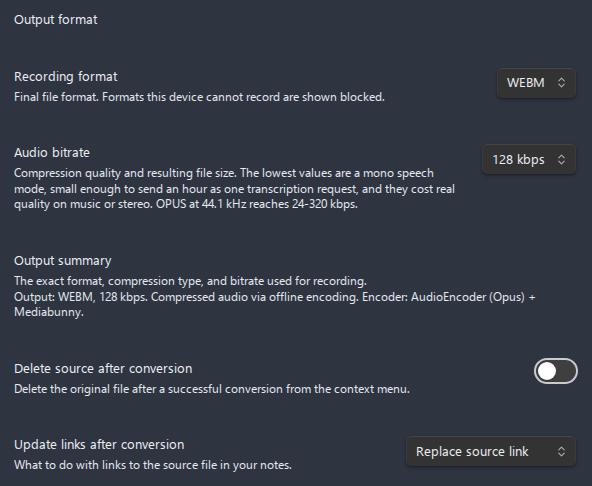

| Setting                            | What it does                                                                                                                                                                                                                                                                                                                                                                                                                                                                                            | Options / range                                             | Default             |
| ---------------------------------- | ------------------------------------------------------------------------------------------------------------------------------------------------------------------------------------------------------------------------------------------------------------------------------------------------------------------------------------------------------------------------------------------------------------------------------------------------------------------------------------------------------- | ----------------------------------------------------------- | ------------------- |
| **Recording format**               | Final file format applied when a recording is saved. Formats that re-encode after stop show `(offline)`.                                                                                                                                                                                                                                                                                                                                                                                                | Detected formats: WebM, OGG, WAV, MP3, FLAC, MP4, M4A, AAC  | WebM                |
| **Bit depth**                      | How much of each sample a WAV recording keeps, applied only where WAV is captured as raw PCM. Wider samples leave headroom for a level set too cautiously, and the floating point width keeps a sample that ran past full scale instead of flattening it, so an overloaded take is recovered by normalizing the file. File size grows in proportion. Greyed out on a device that records WAV through a compressed intermediate, with the stored value preserved. See [Bit depth](formats.md#bit-depth). | 16-bit integer / 24-bit integer / 32-bit float              | 16-bit integer      |
| **Audio bitrate**                  | Compression quality, in kbps. Only the values the chosen format, the channel layout the capture will have, and this device's encoder can write are listed; the list is read again as soon as a setting that moves that layout is saved, whether it is **Recording channels**, **Include system audio**, or a row of the **Multi-track recording** page. The row is hidden only for WAV recorded as raw PCM. See [Bitrate guidance](formats.md#bitrate-guidance).                                        | 24 / 32 / 48 / 64 / 96 / 128 / 160 / 192 / 256 / 320 kbps   | 128 kbps            |
| **Output summary**                 | Read-only line showing the exact format, bitrate, compression type, and encoder currently in effect.                                                                                                                                                                                                                                                                                                                                                                                                    | Display only                                                | -                   |
| **Delete source after conversion** | When converting audio from the context menu, delete the original after a successful conversion.                                                                                                                                                                                                                                                                                                                                                                                                         | On / Off                                                    | Off                 |
| **Update links after conversion**  | How to handle existing note links to the source file after a conversion.                                                                                                                                                                                                                                                                                                                                                                                                                                | Do nothing / Replace source link / Insert after source link | Replace source link |

---

## File storage

Decide where recordings are saved, what they are named, and where the embed link is inserted. See [Recording](recording.md) and [File operations](file-operations.md).

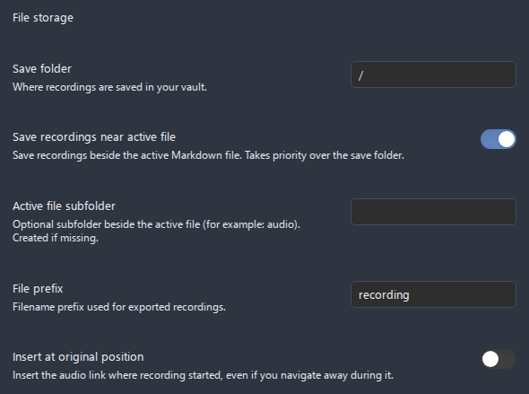

| Setting                              | What it does                                                                                                                                                                      | Options / range                      | Default     |
| ------------------------------------ | --------------------------------------------------------------------------------------------------------------------------------------------------------------------------------- | ------------------------------------ | ----------- |
| **Save folder**                      | Vault folder where recordings are stored. Existing folders are suggested as you type.                                                                                             | Any vault folder path (autocomplete) | Vault root  |
| **Save recordings near active file** | Save in the same directory as the active note. Takes priority over **Save folder** when on.                                                                                       | On / Off                             | Off         |
| **Active file subfolder**            | Optional subfolder relative to the active file's directory (for example `audio`), created automatically if missing. **Only shown when "Save recordings near active file" is on.** | Folder name                          | - (empty)   |
| **File prefix**                      | Filename prefix for recordings, for example `recording` produces `recording-<timestamp>.webm`.                                                                                    | Free text                            | `recording` |
| **Insert at original position**      | Remember the note and cursor where recording started and insert the link there, even if you navigate away during recording.                                                       | On / Off                             | Off         |

---

## Audio splitting

Split a long recording into fixed-duration parts, and set the defaults the manual split dialog starts from. Auto-split is not applied to a session that mixes several tracks into one file. See [Splitting](splitting.md).

| Setting                            | What it does                                                                                                                                                                                                 | Options / range                          | Default |
| ---------------------------------- | ------------------------------------------------------------------------------------------------------------------------------------------------------------------------------------------------------------ | ---------------------------------------- | ------- |
| **Split recordings automatically** | Save the recording as separate part files of fixed duration instead of one long file. Not for merged multi-track; on mobile it also bounds what a crash can cost.                                            | On / Off                                 | Off     |
| **Part duration**                  | Length of each part, in minutes. Also the default duration for manual splitting from the context menu.                                                                                                       | Number field, 1-180 minutes              | 15      |
| **Part name suffix**               | Suffix joined with the part number in file names (for example `part` > `-part1`, `-part2`). Letters, digits, hyphens, underscores only; an invalid value is rejected and the last valid one stays in effect. | Letters / digits / hyphens / underscores | `part`  |
| **Delete source after split**      | Default state of the "delete source file" option in the manual split dialog.                                                                                                                                 | On / Off                                 | Off     |

---

## Multi-track recording

Record from several input devices at once. The track configuration controls only appear once **Enable multi-track recording** is on, and the number of **Track N input** dropdowns matches **Maximum tracks**. See [Multi-track recording](multi-track-recording.md).

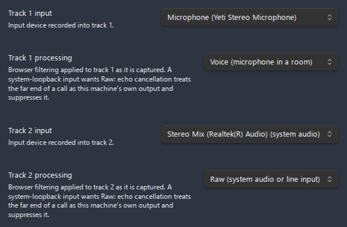

| Setting                          | What it does                                                                                                                                                                                                                                                                                                                                                                                                                                                                                                                    | Options / range                                                                             | Default                 |
| -------------------------------- | ------------------------------------------------------------------------------------------------------------------------------------------------------------------------------------------------------------------------------------------------------------------------------------------------------------------------------------------------------------------------------------------------------------------------------------------------------------------------------------------------------------------------------- | ------------------------------------------------------------------------------------------- | ----------------------- |
| **Enable multi-track recording** | Record from multiple input devices at the same time. Reveals the controls below.                                                                                                                                                                                                                                                                                                                                                                                                                                                | On / Off                                                                                    | Off                     |
| **Maximum tracks**               | Number of simultaneous tracks. **Only shown when multi-track is on.** Changing it adds or removes source dropdowns.                                                                                                                                                                                                                                                                                                                                                                                                             | Number field, 1-8                                                                           | 2                       |
| **Output mode**                  | Whether tracks are combined or kept separate. **Only shown when multi-track is on.** `Single file` mixes all tracks into one file; `Multiple files` saves one file per track.                                                                                                                                                                                                                                                                                                                                                   | Single file / Multiple files                                                                | Single file             |
| **Match track levels**           | Bring the tracks to a common level before combining them, so a quiet participant is not lost behind a loud one. **Only shown in `Single file` mode**, which is the only mode that combines anything. A track that is only noise is left alone rather than amplified. Off by default because it is a judgement about the recording, and a session combined twice has to come out the same both times. Multi-track sessions only: the system-audio pairing configures no tracks here, so it is written at the levels it recorded. | On / Off                                                                                    | Off                     |
| **Track N source**               | What the track records. `Input device` is a microphone or line input and is the default. `System audio (this computer)` records this machine's own output, so the other participants of a call reach the recording without any virtual device; Electron grants it on Windows only, and the row says so where the build cannot. A system-audio track names no device, so its input, channel and processing rows are hidden, and one session can capture the system output only once.                                             | Input device / System audio (this computer)                                                 | Input device            |
| **Track N input**                | Input device assigned to each track - one dropdown per track. **Shown per Maximum tracks.** Multi-track file names use the source/device name by default, with the track number appended to disambiguate tracks that share a device.                                                                                                                                                                                                                                                                                            | Detected device list                                                                        | - (unset)               |
| **Track N channels**             | Channel layout for that track's capture, bound to the track's device: keep the device layout, mix all of its channels to mono, or keep only its left/right channel. Set per track, so a hard-panned microphone track can become mono while a genuine stereo track (e.g. system loopback) stays untouched. Disabled (greyed out) when the track has no device, its device reports a mono-only input, or the selected device is disconnected. The saved choice is preserved across capability changes and reconnection.           | Same as input device / Mono (mix all channels) / Mono (left channel) / Mono (right channel) | Same as input device    |
| **Track N processing**           | Browser filtering applied to that track as it is captured, overriding the three session-wide toggles under [Audio processing & feedback](#audio-processing--feedback). `Same as global settings` follows them, `Voice` turns all three on, and `Raw` turns all three off. A system-loopback track wants `Raw`: echo cancellation treats the far end of a call as this machine's own output and suppresses it. Disabled without a device, hidden on a system-audio track.                                                        | Same as global settings / Voice (microphone in a room) / Raw (system audio or line input)   | Same as global settings |
| **Track N level**                | Level applied to that track in the combined file, in decibels. Six decibels down is half the amplitude. **Only shown in `Single file` mode.**                                                                                                                                                                                                                                                                                                                                                                                   | Number field, -24 to +24                                                                    | 0                       |
| **Track N position**             | Where that track sits in the combined file: -1 fully left, 0 centre, 1 fully right. A track placed off centre makes the combined file stereo even when every input is mono. **Only shown in `Single file` mode.**                                                                                                                                                                                                                                                                                                               | Number field, -1 to 1                                                                       | 0                       |

---

## Audio player

Replace Obsidian's built-in audio embed with the enhanced player. The three rows below the master switch (**Show waveform**, **Markers and chapters**, **Skip step**) only appear once **Enhanced audio player** is on. The player's other controls - playback speed (0.5x-3x), volume, mute, voice boost, loop, time display, and the copy-timestamp-link button - are fixed and not configurable here, though the voice-boost button renders whatever the **Audio cleanup defaults** describe. See [Audio player](audio-player.md).

| Setting                   | What it does                                                                                                                                                                                                                 | Options / range | Default |
| ------------------------- | ---------------------------------------------------------------------------------------------------------------------------------------------------------------------------------------------------------------------------- | --------------- | ------- |
| **Enhanced audio player** | Replace the built-in embed with the richer player (waveform, speed, skip, volume, mute, loop, time display, timecode links, markers, chapters). Video files keep the built-in player. Reveals the two options below.         | On / Off        | On      |
| **Show waveform**         | Draw a waveform behind the seek bar. When off, a plain (still seekable) bar is shown and no audio is decoded. **Only shown when the enhanced player is on.**                                                                 | On / Off        | On      |
| **Markers and chapters**  | Show the markers and chapters list below the player, with add, jump, rename, delete, and chapter-navigation controls. Markers are stored in a sidecar next to each recording. **Only shown when the enhanced player is on.** | On / Off        | On      |
| **Skip step**             | Seconds the skip-forward and skip-back controls move by, in the player, in the status bar, and from their commands. Five suits picking apart speech, thirty suits a lecture. **Only shown when the enhanced player is on.**  | 1-120 seconds   | 10      |

---

## Transcription

Turn recordings (and existing audio files) into text. Only **Enable transcription** is visible until you turn it on; then the engine fields, transcript output, and LLM sub-section appear. The fields below the engine dropdown change with the selected **Transcription engine**. See [Transcription](transcription.md) for the full feature guide and [Speakers and diarization](transcription.md#speakers-and-diarization) for diarization behavior.

These controls are shown for every engine (once transcription is enabled), except the two time limits: **Request timeout** is shown for the cloud engines and **Local run timeout** for Local whisper.cpp, so exactly one of them is always on screen and it is the one that bounds the work the chosen engine does.

| Setting                         | What it does                                                                                                                                                                                                                                                                                                                                                                                                                                                                                    | Options / range                                                                                            | Default     |
| ------------------------------- | ----------------------------------------------------------------------------------------------------------------------------------------------------------------------------------------------------------------------------------------------------------------------------------------------------------------------------------------------------------------------------------------------------------------------------------------------------------------------------------------------- | ---------------------------------------------------------------------------------------------------------- | ----------- |
| **Enable transcription**        | Master switch for speech-to-text. Reveals every control below.                                                                                                                                                                                                                                                                                                                                                                                                                                  | On / Off                                                                                                   | Off         |
| **Transcription engine**        | Which transcription backend to use. Swaps in that engine's own fields below.                                                                                                                                                                                                                                                                                                                                                                                                                    | Whisper API (OpenAI-compatible) / Deepgram / Google Gemini / Mistral Voxtral / Local whisper.cpp (desktop) | Whisper API |
| **Transcribe after recording**  | Automatically transcribe each recording once it is saved.                                                                                                                                                                                                                                                                                                                                                                                                                                       | On / Off                                                                                                   | Off         |
| **Show cost estimates**         | Show an approximate API cost estimate before a run and a running per-session total in the Transcribe dialog. Built-in approximate rates; cloud engines only (local whisper.cpp is free).                                                                                                                                                                                                                                                                                                        | On / Off                                                                                                   | On          |
| **Language**                    | Language hint. `auto` detects; otherwise an ISO code. Surrounding spaces are ignored and an empty value falls back to `auto`. **Not sent on Mistral Voxtral**, which refuses a hint alongside the timestamp granularity it needs to return timed segments and so detects the language itself. The row stays editable there, because auto chapters fall back to this field when a transcript carries no detected language, and the note under the row says the transcription request ignores it. | `auto` or ISO code (for example `en`, `ru`, `es`)                                                          | `auto`      |
| **Speaker diarization**         | Request per-speaker labels; the speaker count is detected automatically. **Enabled only for Deepgram, Google Gemini, and Mistral Voxtral** - for Whisper API and local whisper.cpp it is disabled and greyed out (those engines return no speaker labels).                                                                                                                                                                                                                                      | On / Off (disabled for non-diarizing engines)                                                              | Off         |
| **Translate speech to English** | Write the recording down in English whatever was spoken, using the engine's own translating operation. **Enabled only for Whisper API**; disabled and greyed out on the other engines, which carry no such operation. The **Language** hint is ignored while this is on.                                                                                                                                                                                                                        | On / Off (disabled where the engine has no translating operation)                                          | Off         |
| **Participant profile**         | Roster of names offered by default in the Transcribe dialog, where the run that carries it writes those names into the recording so **Rename speakers** suggests them. **Shown only while diarization is on.**                                                                                                                                                                                                                                                                                  | None, or one of the saved profiles                                                                         | None        |
| **Participant profiles**        | The page holding those rosters, each with its names, a rename and a delete. **Shown only while diarization is on.**                                                                                                                                                                                                                                                                                                                                                                             | Profile pages                                                                                              | None saved  |
| **Word-level timestamps**       | Request per-word timing, recorded in the JSON file output only. **Selectable only for Whisper API**, which is the one engine that reads the request. Deepgram returns per-word timing on every run whatever the switch says, and Gemini, Mistral Voxtral, and local whisper.cpp answer with segment-level timing only, so on those three the switch is shown disabled with the engine's own behaviour named under it.                                                                           | On / Off (disabled where the engine decides for itself)                                                    | Off         |
| **Request timeout**             | Minutes before a single transcription request (one part of a long recording, or a whole-file upload) is aborted and reported, so a stalled request cannot hang the run. **Hidden for local whisper.cpp** (it runs no network request; see **Local run timeout** below).                                                                                                                                                                                                                         | Number field, 1-60 minutes                                                                                 | 10          |
| **Local run timeout**           | Minutes before the local `whisper.cpp` process is stopped, so a run that hangs cannot hold the Transcribe dialog or keep a CPU core busy after the window is closed. Pressing Cancel stops the process straight away, without waiting for this limit. Longer than a network timeout on purpose: the model runs on your own CPU, where a large one can take longer than the recording itself. **Shown for local whisper.cpp only.**                                                              | Number field, 1-720 minutes                                                                                | 120         |

Every service the plugin talks to is configured once, on its own page under the **Engines** entry: its base URL, its API key, the model catalogue it serves, and, for a service that writes text, the longest answer it may produce. The transcription section and each LLM job keep only the choice of which service does that work, so a key serving two jobs is entered in one place. Picking a model and editing the list of them are two questions, so they are two rows. **Model** is a dropdown over the saved ids, answered in place. **Model catalogue** opens the list those ids live on, reports how many are saved, and is where one is added or removed: it carries a filter once it is long, a delete button on each row, and an add button that asks for the id your endpoint serves. Tapping a row there also puts that id to work, which is the quicker path on mobile. Adding a model selects it too, and deleting the one in use moves the selection to the first remaining id. Delete every id and the engine's entry reads **No model**, since a request naming none cannot succeed; a run then stops with that reason instead of failing at the endpoint. Alongside the five transcription engines below, the page lists **OpenAI**, **Anthropic (Claude)**, **Mistral**, and **DeepSeek**, which only answer prompts and therefore hold a base URL, a key, a model catalogue, and **Max output tokens** and nothing else.

Whether a key is required is a question about the endpoint rather than about the provider. A **Base URL** left on the vendor's own host cannot be reached without one, so a run against it stops before it starts and says so. A **Base URL** you have pointed somewhere else runs with the **API key** field empty, and the request then carries no authorization header at all, which is what a local OpenAI-compatible server such as Ollama, LM Studio, LocalAI, or a `whisper-server` build expects. An endpoint that does want a key answers `401` for itself, and that answer reaches you as the same authentication guidance any wrong key produces. One consequence is worth knowing: an engine on a custom endpoint counts as configured while its key field is empty, because that is what the run will do with it.

### Engine: Whisper API

One of the pages under **Engines**, listed whether or not it is the engine transcription currently runs on. Works with OpenAI and any compatible host (for example Groq) by setting the base URL, key, and model. The 25 MB per-request limit is enforced by the API; files at or under it are uploaded in their original container, while larger files are resampled to 16 kHz mono, split into upload-sized WAV chunks, and stitched onto one timeline. No diarization. See [OpenAI Whisper API key](use-cases/openai-whisper-api-key.md) and [Groq Whisper setup](use-cases/groq-whisper-setup.md).

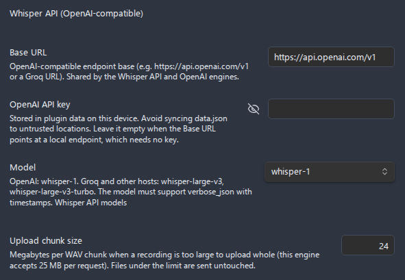

| Setting               | What it does                                                                                                                                                                                                                        | Options / range                                                                                                 | Default                     |
| --------------------- | ----------------------------------------------------------------------------------------------------------------------------------------------------------------------------------------------------------------------------------- | --------------------------------------------------------------------------------------------------------------- | --------------------------- |
| **Base URL**          | OpenAI-compatible endpoint base (for example `https://api.openai.com/v1`, or a Groq URL). Shared with the OpenAI engine.                                                                                                            | URL                                                                                                             | `https://api.openai.com/v1` |
| **OpenAI API key**    | API key, stored in plugin data on this device. Shared with the OpenAI engine, so it is entered once.                                                                                                                                | Secret text                                                                                                     | - (empty)                   |
| **Model**             | Model the engine runs on, picked from the saved ids. Must support `verbose_json` with timestamps.                                                                                                                                   | Editable list (seeded: `whisper-1`, `whisper-large-v3`, `whisper-large-v3-turbo`, `distil-whisper-large-v3-en`) | `whisper-1`                 |
| **Model catalogue**   | The page holding the ids the picker above offers. Its entry reports how many are saved, and the page carries a filter, a delete button on each row, and an add button that asks for an id. Tapping a row also puts that id to work. | Page of saved ids                                                                                               | Seeded list                 |
| **Upload chunk size** | Megabytes per WAV chunk when a recording is too large to upload whole. Files under the limit are sent untouched. The API limit is 25 MB.                                                                                            | Number field, 1-24 MB                                                                                           | 24 MB                       |

### Engine: Deepgram

One of the pages under **Engines**, listed whether or not it is the engine transcription currently runs on. Deepgram's official pre-recorded API. Files up to 2 GB are sent whole, so diarization keeps consistent speaker numbering across the entire recording. A free account includes a starter credit, then pay-as-you-go. See [Deepgram API key](use-cases/deepgram-api-key.md).

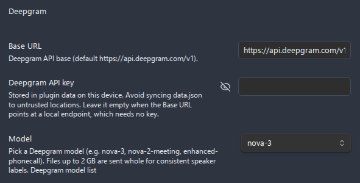

| Setting              | What it does                                                                                                                                                                                                                        | Options / range                                                 | Default                       |
| -------------------- | ----------------------------------------------------------------------------------------------------------------------------------------------------------------------------------------------------------------------------------- | --------------------------------------------------------------- | ----------------------------- |
| **Base URL**         | Deepgram API base.                                                                                                                                                                                                                  | URL                                                             | `https://api.deepgram.com/v1` |
| **Deepgram API key** | API key, stored in plugin data on this device.                                                                                                                                                                                      | Secret text                                                     | - (empty)                     |
| **Model**            | Model the engine runs on, picked from the saved ids. The seed list covers the Nova, Enhanced, Base, and hosted Whisper families.                                                                                                    | Editable list (seeded with the Nova / Enhanced / Base families) | `nova-3`                      |
| **Model catalogue**  | The page holding the ids the picker above offers. Its entry reports how many are saved, and the page carries a filter, a delete button on each row, and an add button that asks for an id. Tapping a row also puts that id to work. | Page of saved ids                                               | Seeded list                   |

### Engine: Google Gemini

One of the pages under **Engines**, listed whether or not it is the engine transcription currently runs on, and also the page the post-processing prompts are configured on when they run through Gemini. Google's multimodal `generateContent` plus the File API. Files up to 2 GB are uploaded whole. Containers Gemini does not accept (for example `webm`, `m4a`) are decoded to 16 kHz mono WAV first. Recordings longer than 15 minutes are split into parts and stitched; a diarized split resets speaker numbering and surfaces a warning. See [Gemini API key](use-cases/gemini-api-key.md).

| Setting                   | What it does                                                                                                                                                                                                                        | Options / range                                                                                                                                                            | Default                                     |
| ------------------------- | ----------------------------------------------------------------------------------------------------------------------------------------------------------------------------------------------------------------------------------- | -------------------------------------------------------------------------------------------------------------------------------------------------------------------------- | ------------------------------------------- |
| **Base URL**              | Gemini API base (no version segment; the provider appends it).                                                                                                                                                                      | URL                                                                                                                                                                        | `https://generativelanguage.googleapis.com` |
| **Google Gemini API key** | API key, stored in plugin data on this device.                                                                                                                                                                                      | Secret text                                                                                                                                                                | - (empty)                                   |
| **Model**                 | Model the engine runs on, picked from the saved ids. One catalogue serves transcription and prompts alike, because the ids are the same family.                                                                                     | Editable list (seeded: `gemini-3.6-flash`, `gemini-3.5-flash`, `gemini-3.5-flash-lite`, `gemini-2.5-flash`, `gemini-2.5-pro`, `gemini-2.5-flash-lite`, `gemini-2.0-flash`) | `gemini-3.5-flash`                          |
| **Model catalogue**       | The page holding the ids the picker above offers. Its entry reports how many are saved, and the page carries a filter, a delete button on each row, and an add button that asks for an id. Tapping a row also puts that id to work. | Page of saved ids                                                                                                                                                          | Seeded list                                 |
| **Max output tokens**     | Longest answer this engine may write, whichever job calls it. The model's own maximum is the real limit, so a larger budget is refused by the service rather than by this field.                                                    | Number field, any whole number from 512 to 200000                                                                                                                          | 4096                                        |

### Engine: Mistral Voxtral

One of the pages under **Engines**, listed whether or not it is the engine transcription currently runs on. Mistral's batch transcription endpoint. A recording of up to three hours goes in one request, so diarization keeps consistent speaker numbering across the whole file, and files are sent whole up to 1 GB. MP3, WAV, M4A, FLAC, and OGG are uploaded untouched, while any other container, including the `webm` this plugin records by default, is decoded to 16 kHz mono WAV first and uploaded under a matching name. A recording past three hours is refused before it is uploaded whenever the plugin decodes it, which is how it learns the length. The language hint is never sent, because Mistral refuses it alongside the timestamp granularity that makes the response carry timed segments, and only the segment level is asked for, because the response carries no timed segments without it and the endpoint refuses a request naming two levels at once.

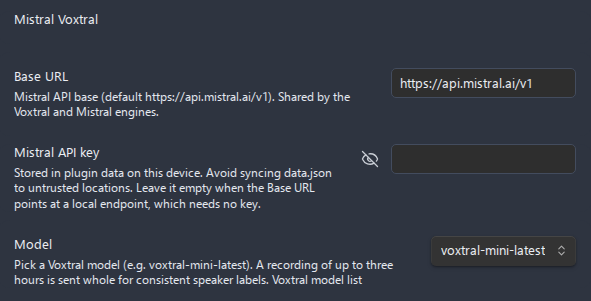

| Setting             | What it does                                                                                                                                                                                                                        | Options / range                               | Default                     |
| ------------------- | ----------------------------------------------------------------------------------------------------------------------------------------------------------------------------------------------------------------------------------- | --------------------------------------------- | --------------------------- |
| **Base URL**        | Mistral API base. Shared with the Mistral engine, which serves the chat models over the same account.                                                                                                                               | URL                                           | `https://api.mistral.ai/v1` |
| **Mistral API key** | API key, stored in plugin data on this device. Shared with the Mistral engine, so it is entered once.                                                                                                                               | Secret text                                   | - (empty)                   |
| **Model**           | Model the engine runs on, picked from the saved ids. Only the batch transcription catalogue is seeded, since the realtime model takes a streaming connection and refuses diarization.                                               | Editable list (seeded: `voxtral-mini-latest`) | `voxtral-mini-latest`       |
| **Model catalogue** | The page holding the ids the picker above offers. Its entry reports how many are saved, and the page carries a filter, a delete button on each row, and an add button that asks for an id. Tapping a row also puts that id to work. | Page of saved ids                             | Seeded list                 |

### Engine: Mistral

The page the post-processing prompts are configured on when they run through Mistral. It holds no transcription fields of its own: the speech models live on the **Mistral Voxtral** page above, and the two pages share one endpoint and one key because they are two catalogues over one account.

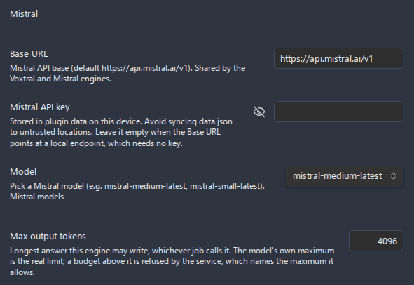

| Setting               | What it does                                                                                                                                                                                                                        | Options / range                                                                                 | Default                     |
| --------------------- | ----------------------------------------------------------------------------------------------------------------------------------------------------------------------------------------------------------------------------------- | ----------------------------------------------------------------------------------------------- | --------------------------- |
| **Base URL**          | Mistral API base. Shared with the Mistral Voxtral engine.                                                                                                                                                                           | URL                                                                                             | `https://api.mistral.ai/v1` |
| **Mistral API key**   | API key, stored in plugin data on this device. Shared with the Mistral Voxtral engine, so it is entered once.                                                                                                                       | Secret text                                                                                     | - (empty)                   |
| **Model**             | Model the engine runs on, picked from the saved ids. The `-latest` aliases track the current generation of each tier.                                                                                                               | Editable list (seeded: `mistral-medium-latest`, `mistral-small-latest`, `mistral-large-latest`) | `mistral-medium-latest`     |
| **Model catalogue**   | The page holding the ids the picker above offers. Its entry reports how many are saved, and the page carries a filter, a delete button on each row, and an add button that asks for an id. Tapping a row also puts that id to work. | Page of saved ids                                                                               | Seeded list                 |
| **Max output tokens** | Longest answer this engine may write, whichever job calls it. The model's own maximum is the real limit, so a larger budget is refused by the service rather than by this field.                                                    | Number field, any whole number from 512 to 200000                                               | 4096                        |

### Engine: DeepSeek

The page the post-processing prompts, the chapter titles, and the two-pass context agents are configured on when they run through DeepSeek. DeepSeek does not transcribe audio, so the page backs a chat catalogue only and keeps a key of its own, apart from every transcription account. The text of the transcript is sent to DeepSeek's servers.

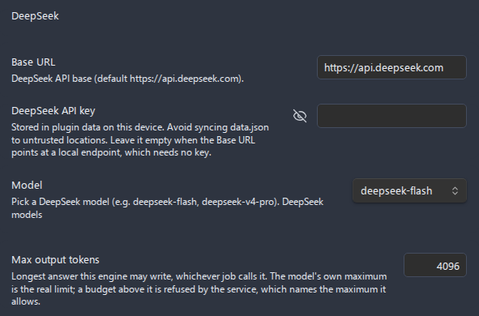

| Setting               | What it does                                                                                                                                                                                                                        | Options / range                                             | Default                    |
| --------------------- | ----------------------------------------------------------------------------------------------------------------------------------------------------------------------------------------------------------------------------------- | ----------------------------------------------------------- | -------------------------- |
| **Base URL**          | DeepSeek API base. The chat endpoint is appended to it directly, with no `/v1` segment.                                                                                                                                             | URL                                                         | `https://api.deepseek.com` |
| **DeepSeek API key**  | API key, stored in plugin data on this device. Read by this engine only.                                                                                                                                                            | Secret text                                                 | - (empty)                  |
| **Model**             | Model the engine runs on, picked from the saved ids. The estimate prices it at the weekday peak rate, so an off-peak run costs about half.                                                                                          | Editable list (seeded: `deepseek-flash`, `deepseek-v4-pro`) | `deepseek-flash`           |
| **Model catalogue**   | The page holding the ids the picker above offers. Its entry reports how many are saved, and the page carries a filter, a delete button on each row, and an add button that asks for an id. Tapping a row also puts that id to work. | Page of saved ids                                           | Seeded list                |
| **Max output tokens** | Longest answer this engine may write, whichever job calls it. The model's own maximum is the real limit, so a larger budget is refused by the service rather than by this field.                                                    | Number field, any whole number from 512 to 200000           | 4096                       |

### Engine: OpenAI

The page the post-processing prompts, the chapter titles, and the two-pass context agents are configured on when they run through OpenAI. It holds no transcription fields of its own, because the speech models live on the **Whisper API** page above, and the two pages share one endpoint and one key because they are two catalogues over one account.

| Setting               | What it does                                                                                                                                                                     | Options / range                                                                    | Default                     |
| --------------------- | -------------------------------------------------------------------------------------------------------------------------------------------------------------------------------- | ---------------------------------------------------------------------------------- | --------------------------- |
| **Base URL**          | OpenAI-compatible endpoint base. Shared with the Whisper API engine.                                                                                                             | URL                                                                                | `https://api.openai.com/v1` |
| **OpenAI API key**    | API key, stored in plugin data on this device. Shared with the Whisper API engine, so it is entered once.                                                                        | Secret text                                                                        | - (empty)                   |
| **Model**             | Model the prompt jobs run on, picked from the saved ids.                                                                                                                         | Editable list (seeded: `gpt-5.6-sol`, `gpt-5.6-terra`, `gpt-5.6-luna`)             | `gpt-5.6-sol`               |
| **Model catalogue**   | The page holding the ids the picker above offers, with a filter, a delete button on each row, and an add button that asks for an id.                                             | Page of saved ids                                                                  | Seeded list                 |
| **Max output tokens** | Longest answer this engine may write, whichever job calls it. The model's own maximum is the real limit, so a larger budget is refused by the service rather than by this field. | Number field, any whole number from 512 to 200000                                  | 4096                        |

### Engine: Anthropic (Claude)

The page the prompt jobs are configured on when they run through Anthropic. It answers no transcription request, because Anthropic serves no speech model here, and it is the one prompt engine whose key is shared with nothing else.

| Setting               | What it does                                                                                                                                                                     | Options / range                                                                                                | Default                        |
| --------------------- | -------------------------------------------------------------------------------------------------------------------------------------------------------------------------------- | -------------------------------------------------------------------------------------------------------------- | ------------------------------ |
| **Base URL**          | Anthropic API base.                                                                                                                                                              | URL                                                                                                            | `https://api.anthropic.com/v1` |
| **Anthropic API key** | API key, stored in plugin data on this device.                                                                                                                                   | Secret text                                                                                                    | - (empty)                      |
| **Model**             | Model the prompt jobs run on, picked from the saved ids.                                                                                                                         | Editable list (seeded: `claude-opus-4-8`, `claude-sonnet-5`, `claude-haiku-4-5`, `claude-fable-5`)             | `claude-opus-4-8`              |
| **Model catalogue**   | The page holding the ids the picker above offers, with a filter, a delete button on each row, and an add button that asks for an id.                                             | Page of saved ids                                                                                              | Seeded list                    |
| **Max output tokens** | Longest answer this engine may write, whichever job calls it. The model's own maximum is the real limit, so a larger budget is refused by the service rather than by this field. | Number field, any whole number from 512 to 200000                                                              | 4096                           |

### Engine: Local whisper.cpp

One of the pages under **Engines**, listed whether or not it is the engine transcription currently runs on. Runs a local `whisper.cpp` binary fully offline. There is no network request, so **Request timeout** is hidden and **Local run timeout** bounds the process instead, and there is no diarization. See [Local whisper.cpp](use-cases/local-whisper-cpp.md).

| Setting                     | What it does                                                                                                                           | Options / range                                                                                                                         | Default   |
| --------------------------- | -------------------------------------------------------------------------------------------------------------------------------------- | --------------------------------------------------------------------------------------------------------------------------------------- | --------- |
| **whisper.cpp binary path** | Absolute path to the `whisper.cpp` executable.                                                                                         | File path                                                                                                                               | - (empty) |
| **Model path**              | Absolute path to a GGML model file (`.bin`). A catalogue link is shown. Names ending in `.en` are English-only; the rest multilingual. | File path. Common names: `tiny`, `tiny.en`, `base`, `base.en`, `small`, `small.en`, `medium`, `medium.en`, `large-v3`, `large-v3-turbo` | - (empty) |
| **Extra arguments**         | Optional extra CLI arguments, space-separated, passed to the binary.                                                                   | Free text                                                                                                                               | - (empty) |

### Transcript output

Shown for every engine, below the engine fields. Controls where the transcript goes and how it is formatted in the note. The **File format** dropdown appears only when **Destination** is not "Insert into note". The speaker-related controls (**Include speakers**, **Merge speaker turns**, **Speaker format**) are disabled and greyed out whenever diarization is not in effect - that is, with an engine that cannot diarize, or with diarization turned off - because there are no speaker labels for them to act on.

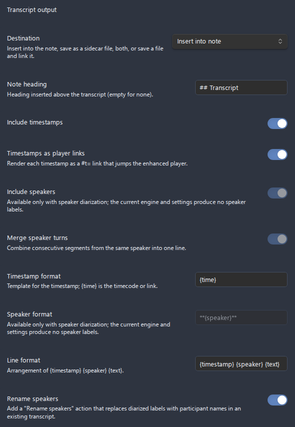

| Setting                        | What it does                                                                                                                                                                                                                                            | Options / range                                                                        | Default                        |
| ------------------------------ | ------------------------------------------------------------------------------------------------------------------------------------------------------------------------------------------------------------------------------------------------------- | -------------------------------------------------------------------------------------- | ------------------------------ |
| **Destination**                | Where the transcript is written.                                                                                                                                                                                                                        | Insert into note / Save to file / Note and file / Save to file and link it in the note | Insert into note               |
| **File format**                | Format of the sidecar transcript file. **Shown only when Destination is not "Insert into note".** JSON carries the full data including speakers and word timings.                                                                                       | JSON / SubRip (`.srt`) / WebVTT (`.vtt`) / Plain text (`.txt`)                         | JSON                           |
| **Note heading**               | Heading inserted above the in-note transcript. Empty for no heading.                                                                                                                                                                                    | Free text                                                                              | `## Transcript`                |
| **Include timestamps**         | Show per-segment timestamps in the in-note transcript.                                                                                                                                                                                                  | On / Off                                                                               | On                             |
| **Timestamps as player links** | Render each timestamp as a `#t=` link that jumps the enhanced player to that position.                                                                                                                                                                  | On / Off                                                                               | On                             |
| **Include speakers**           | Show speaker labels in the in-note transcript. **Diarization-gated** (disabled when diarization is not in effect).                                                                                                                                      | On / Off                                                                               | On                             |
| **Merge speaker turns**        | Combine consecutive segments from the same speaker into one line. **Diarization-gated.**                                                                                                                                                                | On / Off                                                                               | On                             |
| **Timestamp format**           | Template for the timestamp fragment, where `{time}` is the timecode or link. Avoid wrapping `{time}` in `[ ]` when timestamp links are on. An empty value is refused with **A template cannot be empty.** and nothing is saved.                         | Template with `{time}`                                                                 | `{time}`                       |
| **Speaker format**             | Template for the speaker label, where `{speaker}` is the name. **Diarization-gated.** An empty value is refused the same way.                                                                                                                           | Template with `{speaker}`                                                              | `**{speaker}**`                |
| **Line format**                | Arrangement of `{timestamp}`, `{speaker}`, and `{text}` on each line. An empty value is refused the same way.                                                                                                                                           | Template with `{timestamp} {speaker} {text}`                                           | `{timestamp} {speaker} {text}` |
| **Rename speakers**            | Add a **Rename speakers** action (context menu, editor menu, command palette) to replace diarized labels with participant names in an existing transcript. The dialog also plays a sample of each speaker and keeps the recording's participant roster. | On / Off                                                                               | Off                            |

### Auto chapters

Sub-section inside Transcription, between Transcript output and LLM post-processing. Asks the configured LLM to divide a transcribed recording into titled chapters, written to the recording's marker sidecar and shown in the enhanced player's [markers and chapters](audio-player.md#markers-and-chapters) window. The action refuses to run when the recording has no transcript yet (sidecar file or in-note transcript with timecode links) and asks you to transcribe first. Re-running replaces only previously generated chapters; bookmarks and manually added chapters are kept. Chapters name their own engine on the **Chapters engine** row below the switch, so they can run on a different service from post-processing, and that service is set up on its page under **Engines**. How the recording is split is steered by a selectable **chapter guidance profile**: a built-in **Default** profile is seeded and editable, and you can add profiles for specific cases (a meeting by agenda item, a lecture by topic, an interview by question) and pick the right one before generating.

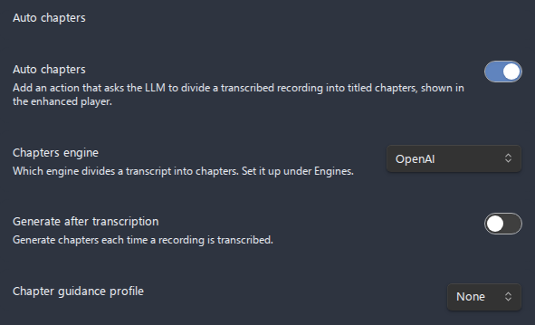

| Setting                          | What it does                                                                                                                                                                                                                                                                                     | Options / range                                                  | Default                                                 |
| -------------------------------- | ------------------------------------------------------------------------------------------------------------------------------------------------------------------------------------------------------------------------------------------------------------------------------------------------ | ---------------------------------------------------------------- | ------------------------------------------------------- |
| **Auto chapters**                | Add a **Generate chapters from transcript** action (context menu, editor menu, command palette). Reveals the options below.                                                                                                                                                                      | On / Off                                                         | Off                                                     |
| **Chapters engine**              | Which service divides the transcript into chapters. Its endpoint, key, model, and token ceiling are configured on its page under **Engines**.                                                                                                                                                    | OpenAI / Anthropic (Claude) / Google Gemini / Mistral / DeepSeek | Follows the post-processing engine on an existing setup |
| **Generate after transcription** | Automatically generate chapters each time a recording is transcribed (also offered per run in the Transcribe dialog).                                                                                                                                                                            | On / Off                                                         | Off                                                     |
| **Chapter guidance profiles**    | Named prompts for how to divide the recording; the selected one is appended to the fixed base prompt. Each is a page of its own with its prompt (typed on the page, or read from a note, as its **Source** row chooses and states), a switch putting that profile in use, and rename and delete. | Profile pages                                                    | Default                                                 |

### LLM post-processing

Block inside Transcription, below Auto chapters. Optionally pass the transcript through an LLM to clean up, summarize, or apply a custom instruction. Only **Enable LLM post-processing** is visible until it is on; then its **Post-processing engine** row, the **Task**, and that task's prompt profiles appear; the catalogue shown changes with the **Task**. Everything about the service itself lives on its page under **Engines**, so the endpoint, the key, the model catalogue, and the token ceiling are entered once there and read by every job that calls it. See [LLM post-processing](llm-post-processing.md) and [Anthropic API key](use-cases/anthropic-api-key.md).

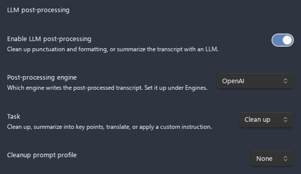

| Setting                         | What it does                                                                                                                                                                                                                                                                                                                                             | Options / range                                                  | Default         |
| ------------------------------- | -------------------------------------------------------------------------------------------------------------------------------------------------------------------------------------------------------------------------------------------------------------------------------------------------------------------------------------------------------- | ---------------------------------------------------------------- | --------------- |
| **Enable LLM post-processing**  | Master switch. Reveals the controls below.                                                                                                                                                                                                                                                                                                               | On / Off                                                         | Off             |
| **Post-processing engine**      | Which service writes the post-processed transcript. Its endpoint, key, model, and token ceiling are configured on its page under **Engines**.                                                                                                                                                                                                            | OpenAI / Anthropic (Claude) / Google Gemini / Mistral / DeepSeek | OpenAI          |
| **Task**                        | What the LLM does to the transcript. Each task shows its own prompt catalogue below.                                                                                                                                                                                                                                                                     | Clean up / Summarize / Custom / Translate                        | Clean up        |
| **Translate into**              | Language the translation task writes in. Empty means English. The original transcript is kept beside the translation, never replaced by it. Shown only while the task is **Translate**.                                                                                                                                                                  | Free text                                                        | Empty (English) |
| **Cleanup prompt profiles**     | Named system instructions for the cleanup pass, each a page of its own with its prompt (typed on the page, or read from a note, as its **Source** row chooses and states), a switch putting that profile in use, rename, and delete. **Shown when Task is Clean up.** The transcript language is appended automatically; None uses the built-in default. | Profile pages                                                    | Default         |
| **Summary prompt profiles**     | Named system instructions for the summary pass, same catalogue mechanics. **Shown when Task is Summarize.** The transcript language is appended automatically; None uses the built-in default.                                                                                                                                                           | Profile pages                                                    | Default         |
| **Translation prompt profiles** | Named system instructions for the translation pass. **Shown when Task is Translate.** The target language is appended automatically. This is the one catalogue that ships no profile, so its selection starts at None.                                                                                                                                   | Profile pages                                                    | None            |
| **Custom instruction profiles** | Named instructions applied to the transcript. **Shown when Task is Custom.** Sent verbatim - include any language directive yourself.                                                                                                                                                                                                                    | Profile pages                                                    | Default         |

### Advanced settings

The last block on the Transcription page, below LLM post-processing, gated behind the **Advanced settings** master switch that is off by default. While off, a recording transcribes in one plain pass with no term biasing, and turning it on reveals the **Dictionary profiles** and the two-pass toggle below. The two-pass mode is the advanced form of the same dictionary biasing, so it reuses the terms from the selected Dictionary profile as its context candidates rather than a separate glossary. That experimental mode transcribes each recording twice: LLM agents mine the first draft for the meeting's proper names, jargon, and English terms and acronyms, and the second pass re-decodes the audio biased toward them, asking for the language the first pass detected and discarding a pass that came back in another one anyway. **Roughly 2x the engine cost and time plus several LLM calls per file**, made on the engine its own **Context agents engine** row names, which appears beside the two-pass toggle and is configured under **Engines**. Best-effort: any failure, and a second pass shorter than the safeguard ratio, keep the first pass's transcript. See [Advanced two-pass transcription](transcription.md#advanced-two-pass-transcription).

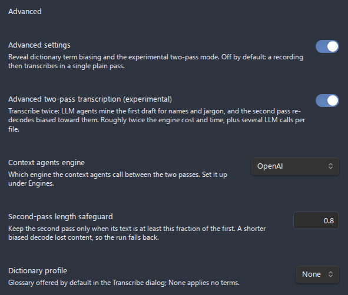

| Setting                                            | What it does                                                                                                                                                                                                                                                                                                                                                                                            | Options / range                                                  | Default                                                 |
| -------------------------------------------------- | ------------------------------------------------------------------------------------------------------------------------------------------------------------------------------------------------------------------------------------------------------------------------------------------------------------------------------------------------------------------------------------------------------- | ---------------------------------------------------------------- | ------------------------------------------------------- |
| **Advanced settings**                              | Master switch; reveals the dictionary profiles and the two-pass toggle below. Off transcribes in one plain pass with no biasing.                                                                                                                                                                                                                                                                        | On / Off                                                         | Off                                                     |
| **Advanced two-pass transcription (experimental)** | Sub-toggle; its description carries the cost warning. Reveals the engine row and the length safeguard.                                                                                                                                                                                                                                                                                                  | On / Off                                                         | Off                                                     |
| **Context agents engine**                          | Which service the context agents call between the two passes. Its endpoint, key, model, and token ceiling are configured on its page under **Engines**.                                                                                                                                                                                                                                                 | OpenAI / Anthropic (Claude) / Google Gemini / Mistral / DeepSeek | Follows the post-processing engine on an existing setup |
| **Second-pass length safeguard**                   | Keep the second pass only when its text is at least this fraction of the first pass's; shorter output reverts to the first-pass transcript (the over-correction guard).                                                                                                                                                                                                                                 | Number field, 0.5-1.0                                            | 0.8                                                     |
| **Dictionary profiles**                            | Named custom-dictionary glossaries, each a page of its own with its terms (typed on the page, or read from a note, as its **Source** row chooses and states), a switch putting that profile in use, and rename and delete. Pick one, or None, per run in the Transcribe dialog, and the last pick is remembered for transcribe-on-save. Long lists trimmed to the engine limit; dropped terms reported. | Profile pages                                                    | None                                                    |

---

## Audio processing & feedback

Control the browser's input processing applied while recording, plus the live recording feedback shown in the status bar and on mobile. These input filters are applied during recording (and to the diagnostics test recording), unlike the after-the-fact [Audio cleanup](audio-cleanup.md) action. See [Recording](recording.md).

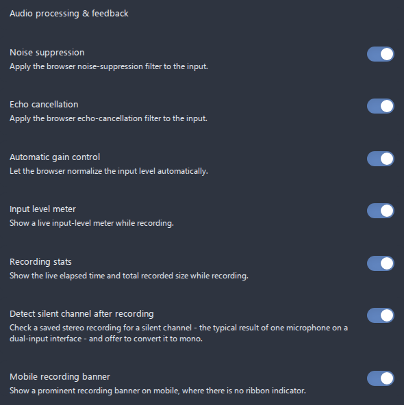

| Setting                                   | What it does                                                                                                                                                                                                                                                                                                                                                          | Options / range | Default |
| ----------------------------------------- | --------------------------------------------------------------------------------------------------------------------------------------------------------------------------------------------------------------------------------------------------------------------------------------------------------------------------------------------------------------------- | --------------- | ------- |
| **Noise suppression**                     | Apply the browser noise-suppression filter to the microphone input.                                                                                                                                                                                                                                                                                                   | On / Off        | On      |
| **Echo cancellation**                     | Apply the browser echo-cancellation filter to the input.                                                                                                                                                                                                                                                                                                              | On / Off        | On      |
| **Automatic gain control**                | Let the browser normalize the input level automatically.                                                                                                                                                                                                                                                                                                              | On / Off        | On      |
| **Input level meter**                     | Show a live input-level (VU) meter in the status bar while recording.                                                                                                                                                                                                                                                                                                 | On / Off        | On      |
| **Recording stats**                       | Show the live elapsed time and total recorded size in the status bar while recording.                                                                                                                                                                                                                                                                                 | On / Off        | On      |
| **Detect silent channel after recording** | After a recording is saved, check one file per output track for a silent channel (a single mic on a dual-input interface) and show a notice that opens mono conversion with the correct channel preset. Sessions longer than 20 minutes are skipped before their files are read. See [Automatic silent-channel prompt](recording.md#automatic-silent-channel-prompt). | On / Off        | On      |
| **Mobile recording banner**               | Show a prominent recording banner on mobile, where there is no ribbon indicator.                                                                                                                                                                                                                                                                                      | On / Off        | On      |

---

## Audio cleanup defaults

A section of its own, beside **Audio processing & feedback** rather than inside it. These values prefill the on-demand **Clean up audio** dialog opened from the file or embed context menu, and each run can override them. Cleanup writes a processed copy and never changes live recording. Each stage is two rows, because a row holds one control: the switch that decides whether the stage runs, and the number it takes. A stage switched off leaves its number row on screen, greyed out, so the value you would go back to stays visible. See the full [Audio cleanup guide](audio-cleanup.md).

| Setting                  | What it does                                                                        | Options / range                       | Default   |
| ------------------------ | ----------------------------------------------------------------------------------- | ------------------------------------- | --------- |
| **High-pass filter**     | Whether the stage that removes low-frequency rumble runs by default.                | On / Off                              | On        |
| **High-pass cutoff**     | Cutoff frequency in hertz. Disabled while the high-pass filter is off.              | Number field, 20-300 Hz, step 5       | 80        |
| **Noise gate**           | Whether the stage that silences the signal below the threshold runs by default.     | On / Off                              | Off       |
| **Noise gate threshold** | Level in dBFS below which the signal is silenced. Disabled while the gate is off.   | Number field, -80 to -20 dBFS, step 1 | -50       |
| **Loudness leveling**    | Whether the compressor that evens out quiet and loud passages runs by default.      | On / Off                              | Off       |
| **Makeup gain**          | Gain in decibels applied after leveling. Disabled while loudness leveling is off.   | Number field, 0-24 dB, step 1         | 6         |

---

## Diagnostics

Tools for verifying your setup and gathering information for bug reports. See [Troubleshooting](troubleshooting.md) and the [Bug reporting guide](BUG_REPORTING_GUIDE.md).

| Setting            | What it does                                                                                                                                                                                                                                                                                                                                                                                                                    | Options / range         | Default |
| ------------------ | ------------------------------------------------------------------------------------------------------------------------------------------------------------------------------------------------------------------------------------------------------------------------------------------------------------------------------------------------------------------------------------------------------------------------------- | ----------------------- | ------- |
| **Test recording** | Records a 5-second clip with your current settings and plays it back inline. Nothing is saved to your vault; the clip is discarded when you leave settings.                                                                                                                                                                                                                                                                     | Button (**Start test**) | -       |
| **System info**    | Opens the **System diagnostics** modal - Obsidian, Electron and Chromium versions, platform, audio devices, supported formats and codecs, active recording configuration, and the recording-related plugin settings (format, bitrate, sample rate, save location, file prefix, multi-track config, selected input device, and the debug flag) - with a **Copy to clipboard** button. API keys are never written to this output. | The whole row opens it  | -       |
| **Debug mode**     | Enable verbose logs (prefixed `[AudioRecorder]`) for troubleshooting recording issues.                                                                                                                                                                                                                                                                                                                                          | On / Off                | Off     |

---

## Settings backup and recovery

The plugin keeps an automatic backup of its settings in `data.json.bak`, next to `data.json` in the plugin folder. The backup is refreshed on every successful settings load and save, and is used to restore the settings automatically if `data.json` goes missing - when that happens a new `data.json` is written immediately, so the backup is never the only copy.

If `data.json` exists but cannot be read at startup (for example, while the file is temporarily locked during a plugin update), the plugin leaves the stored file untouched, keeps the session on the backup copy when one is readable (or defaults otherwise), disables saving to protect the stored settings, and shows a notice. Restarting Obsidian recovers the settings.

Your API keys live in `data.json` on this device and are never written to diagnostics output. Avoid syncing `data.json` to untrusted locations; the local whisper.cpp engine keeps everything offline if that is a concern. For where this fits the bigger picture, see [Architecture](architecture.md).
