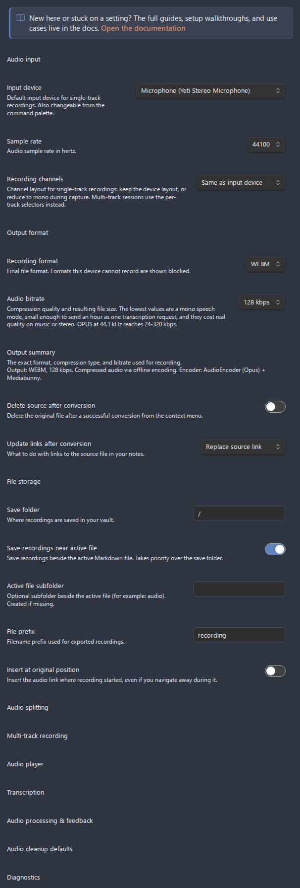
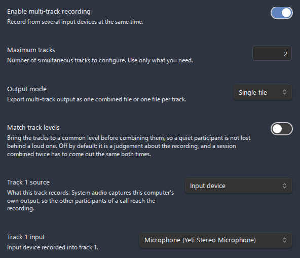
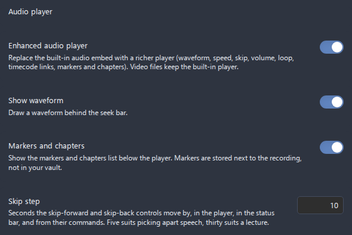
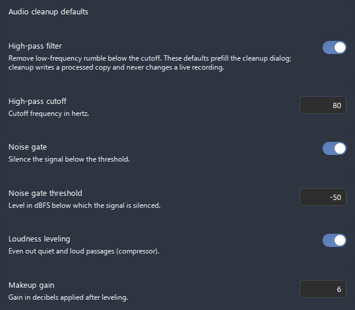
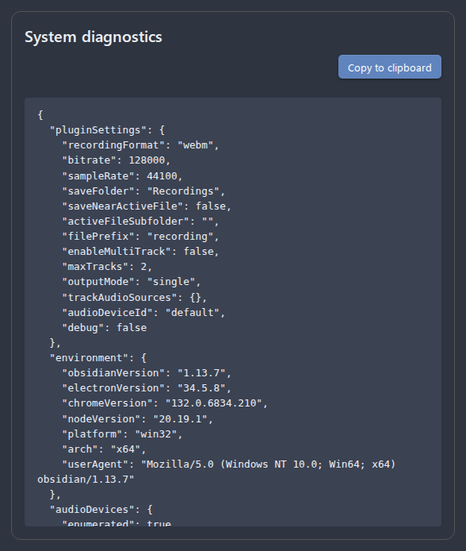

# Settings reference

This is the exhaustive reference for every setting in **Advanced Audio Recorder**. Open **Settings > Advanced Audio Recorder** to reach it. The settings tab is grouped into headed sections; this page covers them in the exact order they appear, with a fully aligned table per section listing what each control does, its options or range, and its default. On Obsidian 1.13 and later the sections that are set once and then read past sit behind an entry that already shows what they hold, so opening one is a choice: transcription, audio splitting, multi-track recording, the audio player, audio processing and feedback, the audio cleanup defaults, and diagnostics. The main tab keeps inline what a recording is configured with before a session, namely the input, the output format, and where the file goes. On older versions every section is inline, and the settings themselves are the same either way. Conditional controls (ones that only appear once another setting is on) are called out inline. For deeper, task-focused walkthroughs, each section links to its own guide.

- [Where settings live and how they apply](#where-settings-live-and-how-they-apply)
- [Documentation callout](#documentation-callout)
- [Audio input](#audio-input)
- [Output format](#output-format)
- [File storage](#file-storage)
- [Audio splitting](#audio-splitting)
- [Multi-track recording](#multi-track-recording)
- [Audio player](#audio-player)
- [Transcription](#transcription)
    - [Engine: Whisper API](#engine-whisper-api)
    - [Engine: Deepgram](#engine-deepgram)
    - [Engine: Google Gemini](#engine-google-gemini)
    - [Engine: Local whisper.cpp](#engine-local-whispercpp)
    - [Transcript output](#transcript-output)
    - [Auto chapters](#auto-chapters)
    - [LLM post-processing](#llm-post-processing)
- [Audio processing & feedback](#audio-processing--feedback)
- [Audio cleanup defaults](#audio-cleanup-defaults)
- [Diagnostics](#diagnostics)
- [Settings backup and recovery](#settings-backup-and-recovery)

---

## Where settings live and how they apply

Settings are stored in the plugin's `data.json` on this device. Almost every control saves the moment you change it - toggles and dropdowns save immediately, a number field saves when you commit it (press Enter, leave the field, or use the stepper arrows), and text fields save shortly after you stop typing. There is no separate "Save" button.

A few settings reveal or hide other controls when toggled, so the tab redraws in place:

- Turning **Save recordings near active file** on reveals **Active file subfolder**.
- Turning **Enable multi-track recording** on reveals **Maximum tracks**, **Output mode**, and one **Track N input** and **Track N channels** dropdown pair per track.
- Turning **Enhanced audio player** on reveals **Show waveform** and **Markers and chapters**.
- Turning **Enable transcription** on reveals the **Engine** entry, transcript output, and LLM sub-sections; the engine page holds the picker and the fields of whichever engine it points at, so choosing another one swaps them there.
- Turning **Enable LLM post-processing** on reveals the task, prompt, provider, key, model, and token controls.
- Turning **Auto chapters** on reveals **Generate after transcription** and keeps the LLM provider controls visible even while LLM post-processing is off.

Player settings apply live: changing **Show waveform** or **Markers and chapters** rebuilds any enhanced player already open in a note, so you do not have to reopen the embed. Other changes (for example a new recording format or save folder) take effect on the next action that uses them.

---

## Documentation callout

At the very top of the settings tab is a callout with a book icon linking to the online documentation, so the guides and use-case walkthroughs are one click away instead of buried in the GitHub repository.

| Control                    | What it does                                                                 | Options / range | Default |
| -------------------------- | ---------------------------------------------------------------------------- | --------------- | ------- |
| **Open the documentation** | Opens the plugin's `docs/` folder on GitHub in your browser (a static link). | Link            | -       |

---

## Audio input

Pick the microphone, sample rate, and channel layout used for recordings. The device dropdown auto-refreshes when you plug or unplug a device while the tab is open. See [Recording](recording.md) for how these are used.

_Figure: The Audio input section with the device picker and sample-rate selector._

| Setting          | What it does                                                                                                                                                                                                                                                                         | Options / range                                                   | Default                                                                                                                |
| ---------------- | ------------------------------------------------------------------------------------------------------------------------------------------------------------------------------------------------------------------------------------------------------------------------------------ | ----------------------------------------------------------------- | ---------------------------------------------------------------------------------------------------------------------- |
| **Input device** | Default input device for single-track recordings. The dropdown lists every detected device and refreshes on device change. The **Select audio input device** command opens a quick device-picker modal; choosing a device saves it here immediately and shows a confirmation notice. | Auto-detected device list                                         | None - pick one before recording (the dropdown shows the first detected device, but nothing is saved until you choose) |
| **Sample rate**  | Audio sample rate in hertz. The exact options come from runtime detection of what your hardware supports.                                                                                                                                                                            | Detected rates (commonly 8000 / 16000 / 22050 / 44100 / 48000 Hz) | 44100 Hz                                                                                                               |
| **Recording channels** | Channel layout for **single-track** recordings. `Same as input device` keeps whatever the device delivers. The mono options downmix during capture: `Mono (mix all channels)` averages every input channel, while `Mono (left channel)` / `Mono (right channel)` keep exactly one channel at full level - the right choice for audio interfaces whose two mono inputs appear as a single stereo device, where a mix would sound 6 dB quieter. Also applies to the settings test recording. Disabled (greyed out) when the selected input device reports a mono-only input or is disconnected; the saved choice is preserved and restored when a capable device is available again. Multi-track sessions use the per-track **Track N channels** selectors instead. | Same as input device / Mono (mix all channels) / Mono (left channel) / Mono (right channel) | Same as input device |

---

## Output format

Choose the final file format and quality for recordings, and how conversions handle the source file and its links. Offline formats are labelled `(offline)` in the dropdown. See [Formats and containers](formats.md) and [File operations](file-operations.md).

_Figure: The Output format section, including the read-only Output summary line._

| Setting                            | What it does                                                                                             | Options / range                                             | Default             |
| ---------------------------------- | -------------------------------------------------------------------------------------------------------- | ----------------------------------------------------------- | ------------------- |
| **Recording format**               | Final file format applied when a recording is saved. Formats that re-encode after stop show `(offline)`. | Detected formats: WebM, OGG, WAV, MP3, FLAC, MP4, M4A, AAC  | WebM                |
| **Audio bitrate**                  | Compression quality, in kbps. Higher means better quality and larger files.                              | 64 / 96 / 128 / 160 / 192 / 256 / 320 kbps                  | 128 kbps            |
| **Output summary**                 | Read-only line showing the exact format, bitrate, compression type, and encoder currently in effect.     | Display only                                                | -                   |
| **Delete source after conversion** | When converting audio from the context menu, delete the original after a successful conversion.          | On / Off                                                    | Off                 |
| **Update links after conversion**  | How to handle existing note links to the source file after a conversion.                                 | Do nothing / Replace source link / Insert after source link | Replace source link |

---

## File storage

Decide where recordings are saved, what they are named, and where the embed link is inserted. See [Recording](recording.md) and [File operations](file-operations.md).

_Figure: The File storage section. The Active file subfolder field appears only when Save near active file is on._

| Setting                              | What it does                                                                                                                                                                      | Options / range                      | Default     |
| ------------------------------------ | --------------------------------------------------------------------------------------------------------------------------------------------------------------------------------- | ------------------------------------ | ----------- |
| **Save folder**                      | Vault folder where recordings are stored. Existing folders are suggested as you type.                                                                                             | Any vault folder path (autocomplete) | Vault root  |
| **Save recordings near active file** | Save in the same directory as the active note. Takes priority over **Save folder** when on.                                                                                       | On / Off                             | Off         |
| **Active file subfolder**            | Optional subfolder relative to the active file's directory (for example `audio`), created automatically if missing. **Only shown when "Save recordings near active file" is on.** | Folder name                          | - (empty)   |
| **File prefix**                      | Filename prefix for recordings, for example `recording` produces `recording-<timestamp>.webm`.                                                                                    | Free text                            | `recording` |
| **Insert at original position**      | Remember the note and cursor where recording started and insert the link there, even if you navigate away during recording.                                                       | On / Off                             | Off         |

---

## Audio splitting

Split a long recording into fixed-duration parts, and set the defaults the manual split dialog starts from. Auto-split is desktop only and is not applied to merged multi-track recordings. See [Splitting](splitting.md).

| Setting                            | What it does                                                                                                                                                                                                 | Options / range                          | Default |
| ---------------------------------- | ------------------------------------------------------------------------------------------------------------------------------------------------------------------------------------------------------------ | ---------------------------------------- | ------- |
| **Split recordings automatically** | Save the recording as separate part files of fixed duration instead of one long file. Desktop only; not for merged multi-track.                                                                              | On / Off                                 | Off     |
| **Part duration**                  | Length of each part, in minutes. Also the default duration for manual splitting from the context menu.                                                                                                       | Number field, 1-180 minutes              | 15      |
| **Part name suffix**               | Suffix joined with the part number in file names (for example `part` > `-part1`, `-part2`). Letters, digits, hyphens, underscores only; an invalid value is rejected and the last valid one stays in effect. | Letters / digits / hyphens / underscores | `part`  |
| **Delete source after split**      | Default state of the "delete source file" option in the manual split dialog.                                                                                                                                 | On / Off                                 | Off     |

---

## Multi-track recording

Record from several input devices at once. The track configuration controls only appear once **Enable multi-track recording** is on, and the number of **Track N input** dropdowns matches **Maximum tracks**. See [Multi-track recording](multi-track-recording.md).

_Figure: The Multi-track recording section with one source dropdown per track._

| Setting                          | What it does                                                                                                                                                                                                                         | Options / range              | Default     |
| -------------------------------- | ------------------------------------------------------------------------------------------------------------------------------------------------------------------------------------------------------------------------------------ | ---------------------------- | ----------- |
| **Enable multi-track recording** | Record from multiple input devices at the same time. Reveals the controls below.                                                                                                                                                     | On / Off                     | Off         |
| **Maximum tracks**               | Number of simultaneous tracks. **Only shown when multi-track is on.** Changing it adds or removes source dropdowns.                                                                                                                  | Number field, 1-8            | 2           |
| **Output mode**                  | Whether tracks are combined or kept separate. **Only shown when multi-track is on.** `Single file` mixes all tracks into one file; `Multiple files` saves one file per track.                                                        | Single file / Multiple files | Single file |
| **Track N input**     | Input device assigned to each track - one dropdown per track. **Shown per Maximum tracks.** Multi-track file names use the source/device name by default, with the track number appended to disambiguate tracks that share a device. | Detected device list         | - (unset)   |
| **Track N channels**         | Channel layout for that track's capture, bound to the track's device: keep the device layout, mix all of its channels to mono, or keep only its left/right channel. Set per track, so a hard-panned microphone track can become mono while a genuine stereo track (e.g. system loopback) stays untouched. Disabled (greyed out) when the track has no device, its device reports a mono-only input, or the selected device is disconnected. The saved choice is preserved across capability changes and reconnection. | Same as input device / Mono (mix all channels) / Mono (left channel) / Mono (right channel) | Same as input device |

---

## Audio player

Replace Obsidian's built-in audio embed with the enhanced player. The two window toggles (**Show waveform**, **Markers and chapters**) only appear once **Enhanced audio player** is on. The player's other controls - playback speed (0.5×-3×), ±10 s skip, volume, mute, loop, time display, and the copy-timestamp-link button - are fixed and not configurable here. See [Audio player](audio-player.md).

_Figure: The Audio player section with the two window toggles revealed._

| Setting                   | What it does                                                                                                                                                                                                                 | Options / range | Default |
| ------------------------- | ---------------------------------------------------------------------------------------------------------------------------------------------------------------------------------------------------------------------------- | --------------- | ------- |
| **Enhanced audio player** | Replace the built-in embed with the richer player (waveform, speed, skip, volume, mute, loop, time display, timecode links, markers, chapters). Video files keep the built-in player. Reveals the two options below.         | On / Off        | Off     |
| **Show waveform**         | Draw a waveform behind the seek bar. When off, a plain (still seekable) bar is shown and no audio is decoded. **Only shown when the enhanced player is on.**                                                                 | On / Off        | On      |
| **Markers and chapters**  | Show the markers and chapters list below the player, with add, jump, rename, delete, and chapter-navigation controls. Markers are stored in a sidecar next to each recording. **Only shown when the enhanced player is on.** | On / Off        | On      |

---

## Transcription

Turn recordings (and existing audio files) into text. Only **Enable transcription** is visible until you turn it on; then the engine fields, transcript output, and LLM sub-section appear. The fields below the engine dropdown change with the selected **Engine**. See [Transcription](transcription.md) for the full feature guide and [Speakers and diarization](transcription.md#speakers-and-diarization) for diarization behavior.

These controls are shown for every engine (once transcription is enabled), except **Request timeout**, which is hidden for Local whisper.cpp:

| Setting                        | What it does                                                                                                                                                                                                                             | Options / range                                                                          | Default     |
| ------------------------------ | ---------------------------------------------------------------------------------------------------------------------------------------------------------------------------------------------------------------------------------------- | ---------------------------------------------------------------------------------------- | ----------- |
| **Enable transcription**       | Master switch for speech-to-text. Reveals every control below.                                                                                                                                                                           | On / Off                                                                                 | Off         |
| **Transcribe after recording** | Automatically transcribe each recording once it is saved.                                                                                                                                                                                | On / Off                                                                                 | Off         |
| **Show cost estimates**        | Show an approximate API cost estimate before a run and a running per-session total in the Transcribe dialog. Built-in approximate rates; cloud engines only (local whisper.cpp is free).                                                 | On / Off                                                                                 | On          |
| **Engine**                     | Which transcription backend to use. Swaps in that engine's own fields below.                                                                                                                                                             | Whisper API (OpenAI-compatible) / Deepgram / Google Gemini / Local whisper.cpp (desktop) | Whisper API |
| **Language**                   | Language hint. `auto` detects; otherwise an ISO code. Surrounding spaces are ignored and an empty value falls back to `auto`.                                                                                                            | `auto` or ISO code (for example `en`, `ru`, `es`)                                        | `auto`      |
| **Speaker diarization**        | Request per-speaker labels; the speaker count is detected automatically. **Enabled only for Deepgram and Google Gemini** - for Whisper API and local whisper.cpp it is disabled and greyed out (those engines return no speaker labels). | On / Off (disabled for non-diarizing engines)                                            | Off         |
| **Word-level timestamps**      | Request per-word timing when the provider supports it. Recorded in the JSON file output only.                                                                                                                                            | On / Off                                                                                 | Off         |
| **Request timeout**            | Minutes before a single transcription request (one part of a long recording, or a whole-file upload) is aborted and reported, so a stalled request cannot hang the run. **Hidden for local whisper.cpp** (it runs no network request).   | Number field, 1-60 minutes                                                               | 10          |

### Engine: Whisper API

Shown when **Engine** is **Whisper API (OpenAI-compatible)**. Works with OpenAI and any compatible host (for example Groq) by setting the base URL, key, and model. The 25 MB per-request limit is enforced by the API; files at or under it are uploaded in their original container, while larger files are resampled to 16 kHz mono, split into upload-sized WAV chunks, and stitched onto one timeline. No diarization. See [OpenAI Whisper API key](use-cases/openai-whisper-api-key.md) and [Groq Whisper setup](use-cases/groq-whisper-setup.md).

| Setting                  | What it does                                                                                                                             | Options / range                                                                                                 | Default                     |
| ------------------------ | ---------------------------------------------------------------------------------------------------------------------------------------- | --------------------------------------------------------------------------------------------------------------- | --------------------------- |
| **Upload chunk size**    | Megabytes per WAV chunk when a recording is too large to upload whole. Files under the limit are sent untouched. The API limit is 25 MB. | Number field, 1-24 MB                                                                                           | 24 MB                       |
| **Whisper API base URL** | OpenAI-compatible endpoint base (for example `https://api.openai.com/v1`, or a Groq URL).                                                | URL                                                                                                             | `https://api.openai.com/v1` |
| **Whisper API key**      | API key, stored in plugin data on this device. Shared with the OpenAI LLM provider as the OpenAI vendor key.                             | Secret text                                                                                                     | - (empty)                   |
| **Whisper model**        | Model id in use, shown on the entry that opens the saved ids and picked there. Must support `verbose_json` with timestamps.              | Editable list (seeded: `whisper-1`, `whisper-large-v3`, `whisper-large-v3-turbo`, `distil-whisper-large-v3-en`) | `whisper-1`                 |

Every model picker in this tab (Whisper, Deepgram, Gemini, and the LLM model below) is an entry that shows the id in use and opens the list of ids saved for that engine or vendor, where the picking happens: tap a row and it becomes the one in use, marked **In use**. The list also carries a filter once it is long, a delete button on each row, and an add button that asks for the id your endpoint serves. Adding a model selects it too, and deleting the one in use moves the selection to the first remaining id.

### Engine: Deepgram

Shown when **Engine** is **Deepgram**. Deepgram's official pre-recorded API. Files up to 2 GB are sent whole, so diarization keeps consistent speaker numbering across the entire recording. A free account includes a starter credit, then pay-as-you-go. See [Deepgram API key](use-cases/deepgram-api-key.md).

| Setting               | What it does                                                                                                                                               | Options / range                                                 | Default                       |
| --------------------- | ---------------------------------------------------------------------------------------------------------------------------------------------------------- | --------------------------------------------------------------- | ----------------------------- |
| **Deepgram base URL** | Deepgram API base.                                                                                                                                         | URL                                                             | `https://api.deepgram.com/v1` |
| **Deepgram API key**  | API key, stored in plugin data on this device.                                                                                                             | Secret text                                                     | - (empty)                     |
| **Deepgram model**    | Model id in use, shown on the entry that opens the saved ids and picked there. The seed list covers the Nova, Enhanced, Base, and hosted Whisper families. | Editable list (seeded with the Nova / Enhanced / Base families) | `nova-3`                      |

### Engine: Google Gemini

Shown when **Engine** is **Google Gemini**. Google's multimodal `generateContent` plus the File API. Files up to 2 GB are uploaded whole. Containers Gemini does not accept (for example `webm`, `m4a`) are decoded to 16 kHz mono WAV first. Recordings longer than 15 minutes are split into parts and stitched; a diarized split resets speaker numbering and surfaces a warning. See [Gemini API key](use-cases/gemini-api-key.md).

| Setting             | What it does                                                                        | Options / range                                                                                                                                                            | Default                                     |
| ------------------- | ----------------------------------------------------------------------------------- | -------------------------------------------------------------------------------------------------------------------------------------------------------------------------- | ------------------------------------------- |
| **Gemini base URL** | Gemini API base (no version segment; the provider appends it).                      | URL                                                                                                                                                                        | `https://generativelanguage.googleapis.com` |
| **Gemini API key**  | API key, stored in plugin data on this device. Shared with the Gemini LLM provider. | Secret text                                                                                                                                                                | - (empty)                                   |
| **Gemini model**    | Model id in use, shown on the entry that opens the saved ids and picked there.      | Editable list (seeded: `gemini-3.6-flash`, `gemini-3.5-flash`, `gemini-3.5-flash-lite`, `gemini-2.5-flash`, `gemini-2.5-pro`, `gemini-2.5-flash-lite`, `gemini-2.0-flash`) | `gemini-3.5-flash`                          |

### Engine: Local whisper.cpp

Shown when **Engine** is **Local whisper.cpp (desktop)**. Runs a local `whisper.cpp` binary fully offline - no network request, so **Request timeout** is hidden and there is no diarization. See [Local whisper.cpp](use-cases/local-whisper-cpp.md).

| Setting                     | What it does                                                                                                                           | Options / range                                                                                                                         | Default   |
| --------------------------- | -------------------------------------------------------------------------------------------------------------------------------------- | --------------------------------------------------------------------------------------------------------------------------------------- | --------- |
| **whisper.cpp binary path** | Absolute path to the `whisper.cpp` executable.                                                                                         | File path                                                                                                                               | - (empty) |
| **Model path**              | Absolute path to a GGML model file (`.bin`). A catalogue link is shown. Names ending in `.en` are English-only; the rest multilingual. | File path. Common names: `tiny`, `tiny.en`, `base`, `base.en`, `small`, `small.en`, `medium`, `medium.en`, `large-v3`, `large-v3-turbo` | - (empty) |
| **Extra arguments**         | Optional extra CLI arguments, space-separated, passed to the binary.                                                                   | Free text                                                                                                                               | - (empty) |

### Advanced settings

Sub-section inside Transcription, gated behind the **Advanced settings** master switch that is off by default. While off, a recording transcribes in one plain pass with no term biasing; turning it on reveals the **Dictionary profiles** and the two-pass toggle below. The two-pass mode is the advanced form of the same dictionary biasing, so it reuses the terms from the selected Dictionary profile as its context candidates rather than a separate glossary. That experimental mode transcribes each recording twice: LLM agents mine the first draft for the meeting's proper names, jargon, and English terms and acronyms, and the second pass re-decodes the audio biased toward them, with its language pinned to the first pass's detection. **Roughly 2x the engine cost and time plus several LLM calls per file** (on the provider configured under **LLM post-processing**, whose fields stay visible while this mode is on). Best-effort: any failure, and a second pass shorter than the safeguard ratio, keep the first pass's transcript. See [Advanced two-pass transcription](transcription.md#advanced-two-pass-transcription).

| Setting                                            | What it does                                                                                                                                                                                                                                                                                        | Options / range       | Default |
| -------------------------------------------------- | --------------------------------------------------------------------------------------------------------------------------------------------------------------------------------------------------------------------------------------------------------------------------------------------------- | --------------------- | ------- |
| **Advanced settings**                              | Master switch; reveals the dictionary profiles and the two-pass toggle below. Off transcribes in one plain pass with no biasing.                                                                                                                                                                    | On / Off              | Off     |
| **Dictionary profiles**                            | Named custom-dictionary glossaries, each a page of its own with its terms, a use-by-default switch, and rename and delete. Pick one, or None, per run in the Transcribe dialog; the last pick is remembered for transcribe-on-save. Long lists trimmed to the engine limit; dropped terms reported. | Profile pages         | None    |
| **Advanced two-pass transcription (experimental)** | Sub-toggle; its description carries the cost warning. Reveals the length safeguard.                                                                                                                                                                                                                 | On / Off              | Off     |
| **Second-pass length safeguard**                   | Keep the second pass only when its text is at least this fraction of the first pass's; shorter output reverts to the first-pass transcript (the over-correction guard).                                                                                                                             | Number field, 0.5-1.0 | 0.8     |

### Transcript output

Shown for every engine, below the engine fields. Controls where the transcript goes and how it is formatted in the note. The **File format** dropdown appears only when **Destination** is not "Insert into note". The speaker-related controls (**Include speakers**, **Merge speaker turns**, **Speaker format**) are disabled and greyed out whenever diarization is not in effect - that is, with an engine that cannot diarize, or with diarization turned off - because there are no speaker labels for them to act on.

| Setting                        | What it does                                                                                                                                                      | Options / range                                                                        | Default                        |
| ------------------------------ | ----------------------------------------------------------------------------------------------------------------------------------------------------------------- | -------------------------------------------------------------------------------------- | ------------------------------ |
| **Destination**                | Where the transcript is written.                                                                                                                                  | Insert into note / Save to file / Note and file / Save to file and link it in the note | Insert into note               |
| **File format**                | Format of the sidecar transcript file. **Shown only when Destination is not "Insert into note".** JSON carries the full data including speakers and word timings. | JSON / SubRip (`.srt`) / WebVTT (`.vtt`) / Plain text (`.txt`)                         | JSON                           |
| **Note heading**               | Heading inserted above the in-note transcript. Empty for no heading.                                                                                              | Free text                                                                              | `## Transcript`                |
| **Include timestamps**         | Show per-segment timestamps in the in-note transcript.                                                                                                            | On / Off                                                                               | On                             |
| **Timestamps as player links** | Render each timestamp as a `#t=` link that jumps the enhanced player to that position.                                                                            | On / Off                                                                               | On                             |
| **Include speakers**           | Show speaker labels in the in-note transcript. **Diarization-gated** (disabled when diarization is not in effect).                                                | On / Off                                                                               | On                             |
| **Merge speaker turns**        | Combine consecutive segments from the same speaker into one line. **Diarization-gated.**                                                                          | On / Off                                                                               | On                             |
| **Timestamp format**           | Template for the timestamp fragment; `{time}` is the timecode/link. Avoid wrapping `{time}` in `[ ]` when timestamp links are on. Empty resets to `{time}`.       | Template with `{time}`                                                                 | `{time}`                       |
| **Speaker format**             | Template for the speaker label; `{speaker}` is the name. **Diarization-gated.** Empty resets to `**{speaker}**`.                                                  | Template with `{speaker}`                                                              | `**{speaker}**`                |
| **Line format**                | Arrangement of `{timestamp}`, `{speaker}`, and `{text}` on each line. Empty resets to the default.                                                                | Template with `{timestamp} {speaker} {text}`                                           | `{timestamp} {speaker} {text}` |
| **Rename speakers**            | Add a **Rename speakers** action (context menu, editor menu, command palette) to replace diarized labels with participant names in an existing transcript. The dialog also plays a sample of each speaker and keeps the recording's participant roster. | On / Off                                                                               | Off                            |

### Auto chapters

Sub-section inside Transcription, between Transcript output and LLM post-processing. Asks the configured LLM to divide a transcribed recording into titled chapters, written to the recording's marker sidecar and shown in the enhanced player's [markers and chapters](audio-player.md#markers-and-chapters) window. The action refuses to run when the recording has no transcript yet (sidecar file or in-note transcript with timecode links) and asks you to transcribe first. Re-running replaces only previously generated chapters; bookmarks and manually added chapters are kept. Uses the LLM provider configured under **LLM post-processing**, whose provider fields stay visible while this feature is on. How the recording is split is steered by a selectable **chapter guidance profile**: a built-in **Default** profile is seeded and editable, and you can add profiles for specific cases (a meeting by agenda item, a lecture by topic, an interview by question) and pick the right one before generating.

| Setting                          | What it does                                                                                                                                                                                     | Options / range | Default |
| -------------------------------- | ------------------------------------------------------------------------------------------------------------------------------------------------------------------------------------------------ | --------------- | ------- |
| **Auto chapters**                | Add a **Generate chapters from transcript** action (context menu, editor menu, command palette). Reveals the options below.                                                                      | On / Off        | Off     |
| **Generate after transcription** | Automatically generate chapters each time a recording is transcribed (also offered per run in the Transcribe dialog).                                                                            | On / Off        | Off     |
| **Chapter guidance profiles**    | Named prompts for how to divide the recording; the selected one is appended to the fixed base prompt. Each is a page of its own with its prompt, a use-by-default switch, and rename and delete. | Profile pages   | Default |

### LLM post-processing

Sub-section inside Transcription, below Auto chapters. Optionally pass the transcript through an LLM to clean up, summarize, or apply a custom instruction. Only **Enable LLM post-processing** is visible until it is on; then the task, prompt, provider, key, model, and token controls appear (the provider, key, model, and token controls also stay visible while **Auto chapters** or **Advanced two-pass transcription** is on, since both use the same provider). The prompt field changes with the **Task**, and the API key field and model picker change with the **LLM provider**. See [LLM post-processing](llm-post-processing.md) and [Anthropic API key](use-cases/anthropic-api-key.md).

| Setting                                        | What it does                                                                                                                                                                                                              | Options / range                                                                                                                                                                                                                                                                                                                      | Default                                                |
| ---------------------------------------------- | ------------------------------------------------------------------------------------------------------------------------------------------------------------------------------------------------------------------------- | ------------------------------------------------------------------------------------------------------------------------------------------------------------------------------------------------------------------------------------------------------------------------------------------------------------------------------------ | ------------------------------------------------------ |
| **Enable LLM post-processing**                 | Master switch. Reveals the controls below.                                                                                                                                                                                | On / Off                                                                                                                                                                                                                                                                                                                             | Off                                                    |
| **Task**                                       | What the LLM does to the transcript. Each task selects its own prompt field below.                                                                                                                                        | Clean up / Summarize / Custom                                                                                                                                                                                                                                                                                                        | Clean up                                               |
| **Cleanup prompt**                             | System instruction for the cleanup pass. **Shown when Task is Clean up.** The transcript language is appended automatically; empty uses the built-in default.                                                             | Text area                                                                                                                                                                                                                                                                                                                            | Built-in cleanup prompt                                |
| **Summary prompt**                             | System instruction for the summary pass. **Shown when Task is Summarize.** The transcript language is appended automatically; empty uses the built-in default.                                                            | Text area                                                                                                                                                                                                                                                                                                                            | Built-in summary prompt                                |
| **Custom instruction**                         | Instruction applied to the transcript. **Shown when Task is Custom.** Sent verbatim in a larger editor - include any language directive yourself.                                                                         | Larger text area                                                                                                                                                                                                                                                                                                                     | Built-in custom instruction                            |
| **LLM provider**                               | Which LLM backend to use. Switching providers moves the base URL to that provider's default (unless you typed a custom one) and selects that provider's model and key.                                                    | OpenAI / Anthropic (Claude) / Google Gemini                                                                                                                                                                                                                                                                                          | OpenAI                                                 |
| **LLM base URL**                               | API base URL for the selected provider.                                                                                                                                                                                   | URL                                                                                                                                                                                                                                                                                                                                  | `https://api.openai.com/v1` (provider-dependent)       |
| **OpenAI / Anthropic / Google Gemini API key** | API key for the selected provider, stored in plugin data on this device. **Keys are shared per vendor:** the OpenAI LLM reuses the Whisper API key and the Gemini LLM reuses the Gemini key; Anthropic keeps its own key. | Secret text                                                                                                                                                                                                                                                                                                                          | - (empty)                                              |
| **LLM model**                                  | Model id in use, shown on the entry that opens the ids saved for this provider and picked there.                                                                                                                          | Editable list per provider - OpenAI seeded `gpt-5.6-sol`, `gpt-5.6-terra`, `gpt-5.6-luna`; Anthropic seeded `claude-opus-4-8`, `claude-sonnet-5`, `claude-haiku-4-5`, `claude-fable-5`; Gemini seeded `gemini-3.6-flash`, `gemini-3.5-flash`, `gemini-3.5-flash-lite`, `gemini-2.5-flash`, `gemini-2.5-pro`, `gemini-2.5-flash-lite` | `gpt-5.6-sol` / `claude-opus-4-8` / `gemini-3.5-flash` |
| **Max output tokens**                          | Upper bound on the LLM response length.                                                                                                                                                                                   | Number field, 512-32000 (step 512)                                                                                                                                                                                                                                                                                                   | 4096                                                   |

---

## Audio processing & feedback

Control the browser's input processing applied while recording, plus the live recording feedback shown in the status bar and on mobile. These input filters are applied during recording (and to the diagnostics test recording), unlike the after-the-fact [Audio cleanup](audio-cleanup.md) action. See [Recording](recording.md).

| Setting                     | What it does                                                                          | Options / range | Default |
| --------------------------- | ------------------------------------------------------------------------------------- | --------------- | ------- |
| **Noise suppression**       | Apply the browser noise-suppression filter to the microphone input.                   | On / Off        | On      |
| **Echo cancellation**       | Apply the browser echo-cancellation filter to the input.                              | On / Off        | On      |
| **Automatic gain control**  | Let the browser normalize the input level automatically.                              | On / Off        | On      |
| **Input level meter**       | Show a live input-level (VU) meter in the status bar while recording.                 | On / Off        | On      |
| **Recording stats**         | Show the live elapsed time and total recorded size in the status bar while recording. | On / Off        | On      |
| **Detect silent channel after recording** | After a recording is saved, check one file per output track for a silent channel (a single mic on a dual-input interface) and show a notice that opens mono conversion with the correct channel preset. Sessions longer than 20 minutes are skipped before their files are read. See [Automatic silent-channel prompt](recording.md#automatic-silent-channel-prompt). | On / Off        | On      |
| **Mobile recording banner** | Show a prominent recording banner on mobile, where there is no ribbon indicator.      | On / Off        | On      |

---

## Audio cleanup defaults

Sub-heading at the end of **Audio processing & feedback**. These values prefill the on-demand **Clean up audio** dialog opened from the file/embed context menu; each run can override them. Cleanup writes a processed copy and never changes live recording. Each row pairs a number field (the parameter value) with a toggle (default on/off). See the full [Audio cleanup guide](audio-cleanup.md).

_Figure: The Audio cleanup defaults, each a number field paired with a toggle._

| Setting               | What it does                                                                                | Options / range                                | Default       |
| --------------------- | ------------------------------------------------------------------------------------------- | ---------------------------------------------- | ------------- |
| **High-pass filter**  | Default on/off and cutoff for the stage that removes low-frequency rumble below the cutoff. | Number field 20-300 Hz (step 5) + toggle       | On, 80 Hz     |
| **Noise gate**        | Default on/off and threshold for the stage that silences the signal below the threshold.    | Number field -80 to -20 dBFS (step 1) + toggle | Off, -50 dBFS |
| **Loudness leveling** | Default on/off and makeup gain for the compressor that evens out quiet and loud passages.   | Number field 0-24 dB (step 1) + toggle         | Off, 6 dB     |

---

## Diagnostics

Tools for verifying your setup and gathering information for bug reports. See [Troubleshooting](troubleshooting.md) and the [Bug reporting guide](BUG_REPORTING_GUIDE.md).

| Setting            | What it does                                                                                                                                                                                                                                                                                                                                                                                                       | Options / range         | Default |
| ------------------ | ------------------------------------------------------------------------------------------------------------------------------------------------------------------------------------------------------------------------------------------------------------------------------------------------------------------------------------------------------------------------------------------------------------------ | ----------------------- | ------- |
| **Test recording** | Records a 5-second clip with your current settings and plays it back inline. Nothing is saved to your vault; the clip is discarded when you leave settings.                                                                                                                                                                                                                                                        | Button (**Start test**) | -       |
| **System info**    | Opens a modal with full diagnostics - Obsidian and Electron versions, platform, audio devices, supported formats and codecs, active recording configuration, and the recording-related plugin settings (format, bitrate, sample rate, save location, file prefix, multi-track config, selected input device, and the debug flag) - with a **Copy to clipboard** button. API keys are never written to this output. | Button (**Show info**)  | -       |
| **Debug mode**     | Enable verbose logs (prefixed `[AudioRecorder]`) for troubleshooting recording issues.                                                                                                                                                                                                                                                                                                                             | On / Off                | Off     |

_Figure: The System info modal opened from Diagnostics._

---

## Settings backup and recovery

The plugin keeps an automatic backup of its settings in `data.json.bak`, next to `data.json` in the plugin folder. The backup is refreshed on every successful settings load and save, and is used to restore the settings automatically if `data.json` goes missing - when that happens a new `data.json` is written immediately, so the backup is never the only copy.

If `data.json` exists but cannot be read at startup (for example, while the file is temporarily locked during a plugin update), the plugin leaves the stored file untouched, keeps the session on the backup copy when one is readable (or defaults otherwise), disables saving to protect the stored settings, and shows a notice. Restarting Obsidian recovers the settings.

Your API keys live in `data.json` on this device and are never written to diagnostics output. Avoid syncing `data.json` to untrusted locations; the local whisper.cpp engine keeps everything offline if that is a concern. For where this fits the bigger picture, see [Architecture](architecture.md).
