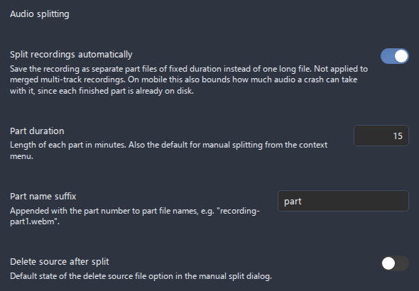
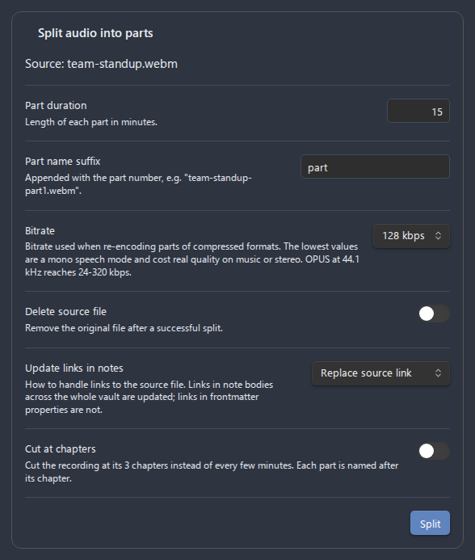

# Splitting recordings

Splitting breaks one long recording into several shorter part files. **Advanced Audio Recorder** does this two ways: it can split a recording **automatically as you record**, writing each part to disk on the fly, or it can split an **existing audio file on demand** from the context menu. Both produce numbered parts named after the source, both can rewrite the links in your notes to point at the new parts, and both keep your original safe unless you explicitly ask to delete it.

- [Why split](#why-split)
- [Automatic splitting (during recording)](#automatic-splitting-during-recording)
- [Manual splitting (existing file)](#manual-splitting-existing-file)
    - [The split dialog](#the-split-dialog)
    - [Part naming](#part-naming)
- [How link updating works](#how-link-updating-works)
- [Lossless vs lossy splitting](#lossless-vs-lossy-splitting)
- [Failure handling](#failure-handling)
- [Related settings](#related-settings)
- [Troubleshooting](#troubleshooting)

## Why split

A two-hour lecture or an all-day meeting recorded as one file is awkward to work with. Splitting it into parts helps you:

- **Stay under upload limits.** Most cloud transcription engines cap the size of a single request. The Whisper API in particular refuses anything over 25 MB per request, so a long recording must be broken up before it can be sent. See [Transcription](transcription.md) for the per-engine limits.
- **Navigate long material.** Shorter parts are quicker to open, scrub, and share. You can link to the exact part of a meeting that matters instead of one giant file.
- **Process big files in pieces.** Some actions (for example [Audio cleanup](audio-cleanup.md)) work better on shorter inputs. Split first, then clean or convert each part.
- **Keep recording reliably.** With automatic splitting on, each finished part is flushed to disk while recording continues, so a crash costs you at most the unfinished last part rather than the whole session. See [Crash recovery](recording.md#crash-recovery).

---

## Automatic splitting (during recording)

When **Split recordings automatically** is enabled, a recording is saved as a series of fixed-duration part files (`recording-…-part1.webm`, `recording-…-part2.webm`, …) instead of one long file. Each finished part is written to disk while the recording continues, and the remainder recorded after the last boundary becomes the final part. Links to **all** parts are inserted into the note when the recording stops.


_Figure: the Audio splitting section of the plugin settings, where automatic splitting is enabled and the part duration and suffix are configured._

### Enabling it

1. Open **Settings > Advanced Audio Recorder > Audio splitting**.
2. Turn on **Split recordings automatically**.
3. Set **Part duration** (the number field accepts `1` to `180` minutes; the default is `15`). This value is the target length of every part.
4. Optionally set the **Part name suffix** (default `part`) that is appended with the part number - see [Part naming](#part-naming).
5. Record as usual. When you stop, the part files are written and all of their links are inserted into the active note.

### Precision at the boundary

How exactly a part lands on the configured boundary depends on the recording format:

| Source format          | Boundary precision                                                                                                                                                                               |
| ---------------------- | ------------------------------------------------------------------------------------------------------------------------------------------------------------------------------------------------ |
| **WAV** (PCM)          | **Sample-exact.** Parts are cut on a whole sample frame at exactly the configured duration, because raw PCM can be sliced cleanly.                                                               |
| **Compressed** formats | **Approximate.** The recorder restarts at each boundary, so each part is roughly the configured length (within a few seconds), and a sub-second capture gap may occur between consecutive parts. |

"Compressed" covers WebM, OGG, MP3, FLAC, MP4, M4A, and AAC. For a gap-free, sample-accurate split, record in **WAV** - see [Formats](formats.md) for the trade-offs of each container.

### Constraints

- **Desktop only.** Automatic splitting is not available in the mobile app. If a mobile recording starts with the option on, the plugin shows a notice and saves one file.
- **Not for merged multi-track.** A multi-track recording with **Output mode** set to `Single file` is mixed into one file and cannot be auto-split; the plugin shows a notice and saves the single merged file. To auto-split a multi-track session, use **Multiple files** output mode, where each track is recorded independently. See [Multi-track recording](multi-track-recording.md).
- **Changes apply next session.** Split settings changed during an active recording take effect on the **next** recording, not the one in progress.

After an automatically split recording stops, an embed link for every part is inserted into the active note:

```markdown
![[lecture-part1.webm]]
![[lecture-part2.webm]]
![[lecture-part3.webm]]
![[lecture-part4.webm]]
```

---

## Manual splitting (existing file)

You can split any existing audio file at any time, without re-recording it. This is the way to break up a file you imported, a recording you made before enabling auto-split, or a part that is still too long.

To open the split dialog, right-click the target audio in any of these places and choose **Split audio into parts**:

- the **File Explorer**,
- an audio **embed link** in the editor (`![[recording.webm]]`),
- an **embedded audio player** (right-click the [enhanced player](audio-player.md)).

### The split dialog


_Figure: the Split audio into parts dialog, with the per-run options that override your saved defaults for a single split._

The dialog header shows the **Source** file name and exposes these options. Each starts from your saved settings but can be changed for this one run:

| Option                    | What it does                                                                                                                                                                   | Range / values                                                    | Default                                                                |
| ------------------------- | ------------------------------------------------------------------------------------------------------------------------------------------------------------------------------ | ----------------------------------------------------------------- | ---------------------------------------------------------------------- |
| **Part duration**         | Length of each part in minutes. Type the value directly or adjust it with the up/down stepper.                                                                                 | `1`-`180` minutes                                                 | Your **Part duration** setting (`15`)                                  |
| **Part name suffix**      | Text appended with the part number to name each file. The description previews the resulting file name as you type. Invalid characters mark the field red and block the split. | Letters, digits, hyphens, and underscores only                    | Your **Part name suffix** setting (`part`)                             |
| **Bitrate**               | Bitrate used when re-encoding parts of a compressed source. **Hidden for WAV sources**, which are split without re-encoding.                                                   | `64`, `96`, `128`, `160`, `192`, `256`, `320` kbps                | Your **Audio bitrate** setting (`128`)                                 |
| **Delete source file**    | Move the original file to the system trash after a successful split.                                                                                                           | On / Off                                                          | Your **Delete source after split** setting (`Off`)                     |
| **Update links in notes** | How to rewrite the links that point at the source file across your vault - see [How link updating works](#how-link-updating-works).                                            | `Do nothing` / `Replace source link` / `Insert after source link` | Your **Update links after conversion** setting (`Replace source link`) |

Click **Split** to run. The dialog shows live progress text (`Reading source file…`, `Decoding audio…`, `Writing part N of M…`, `Updating links…`, `Removing source file…`). When it finishes, a notice reports the number of parts and the first part's name.

You do not have to wait on the open dialog. If you close it while a split is still running, the operation continues in the background and a persistent notice mirrors its progress until it completes.

### Part naming

Each part file is named:

```
<source-basename>-<suffix><number>.<extension>
```

For a source `meeting.wav` split with the default suffix, you get `meeting-part1.wav`, `meeting-part2.wav`, and so on. The numbering is `1`-based and continues for as many parts as the duration produces.

- The **suffix** may contain only letters, digits, hyphens, and underscores (`A-Z`, `a-z`, `0-9`, `-`, `_`). Leading and trailing whitespace is ignored. An empty suffix falls back to the default `part`. Any other character is rejected with the notice _"Part suffix may contain only letters, digits, hyphens, and underscores."_ and the split does not run.
- The **extension** of the parts depends on the source format - see [Lossless vs lossy splitting](#lossless-vs-lossy-splitting). WAV sources stay `.wav`; a compressed source keeps its own extension when an offline encoder is available for it, and otherwise the parts are written as WAV (with a notice explaining the fallback).

---

## How link updating works

When **Update links in notes** is set to `Replace source link` or `Insert after source link`, the plugin rewrites the links that point at the source file so they point at the new parts instead. This is the same vault-wide mechanism used by **Convert audio format** (see [File operations](file-operations.md)).

What it covers:

- **The whole vault.** Every note that references the source file is updated, including notes that are not currently open. The plugin finds them through Obsidian's resolved-link index, so nothing is missed because a note happened to be closed.
- **Both link syntaxes.** Wikilinks (`![[recording.wav]]`) and Markdown links (``), embeds and plain links alike, are all rewritten. Because the work is done on Obsidian's parsed link references, every link form the app indexes - including relative paths - is covered.
- **One link per part.** A single source link is replaced with one link per part. With `Replace source link` the source link is swapped for the part links; with `Insert after source link` the original link is kept and the part links are added after it.
- **Your link-format preferences.** New links are generated with `app.fileManager.generateMarkdownLink`, so they follow your vault's link settings (wikilinks vs Markdown links, shortest path, and so on). The embed marker (`!`) of the original link is preserved, so an embed stays an embed.

What it does **not** do:

- **Frontmatter properties are not rewritten.** A YAML property cannot hold several links at once, so links inside a note's frontmatter are left untouched. When such links exist, the plugin shows a notice reporting how many frontmatter links still point at the source file, so you can update them by hand if needed.
- **Stale references are skipped.** If Obsidian's metadata cache is momentarily behind the file's real content, the plugin skips that one reference rather than risk corrupting the note, and counts it as skipped.

How the replacement is laid out depends on whether the link is alone on its line:

- A link that occupies its **own line** is expanded into **one part link per line**, so a stack of part embeds reads cleanly.
- A link that **shares its line** with other content (for example a table row, a heading, or a callout title) gets the part links **separated by spaces** instead of line breaks, so the surrounding construct stays intact.

If you chose **Delete source file** but some links could not be updated (a stale reference was skipped), the plugin **keeps the source file** rather than leave those links broken, and shows a notice explaining why.

A source embed alone on its line is replaced by one embed per part, each on its own line. Before the split:

```markdown
![[meeting.webm]]
```

After splitting into three parts with **Replace source link**:

```markdown
![[meeting-part1.webm]]
![[meeting-part2.webm]]
![[meeting-part3.webm]]
```

---

## Lossless vs lossy splitting

The plugin picks the cheapest correct method based on the source format:

| Source                 | Method                                                                                                                                                                                 | Quality              | Memory                                                             |
| ---------------------- | -------------------------------------------------------------------------------------------------------------------------------------------------------------------------------------- | -------------------- | ------------------------------------------------------------------ |
| **WAV** (raw PCM)      | **Lossless byte-level split.** The raw sample data is sliced at whole-frame boundaries and each part reuses the original header with patched chunk sizes. No decoding, no re-encoding. | **No loss.**         | One part at a time - **multi-gigabyte files are safe.**            |
| **Compressed** formats | **Decode once, re-encode per part.** The file is decoded fully into memory, then each part is sliced from the decoded audio and re-encoded at the chosen bitrate.                      | Minor loss possible. | Needs enough free memory to hold the **entire decoded** recording. |

Notes:

- **WAV is the safe choice for very long files.** Because byte-level splitting builds one part buffer at a time and never decodes the audio, even multi-gigabyte WAV recordings are split without loading the whole thing into memory. Sample format, channel layout, and sample rate are all preserved exactly.
- **Compressed sources are re-encoded**, so a small amount of quality loss is possible (lossy formats lose a little each time they are re-encoded), and a very long compressed file needs enough free memory for the decoded audio. If the source's format has no offline encoder available, the parts are written as **WAV** and a notice explains the fallback.
- **Parts are saved next to the source file**, in the same vault folder.

A source must be **longer than one part** to split. If the file is shorter than the configured part duration, the plugin shows _"File is shorter than one part."_ and does nothing.

---

## Failure handling

The split is designed so a failure never leaves you with a half-broken set of files:

- **Collision pre-check.** Before writing anything, the plugin checks that none of the target part names already exist next to the source. If any does, the split is **aborted** with a notice (_"File … already exists. Rename it or choose a different suffix."_) and no files are written. Rename the existing file or pick a different suffix and try again.
- **Mid-write rollback.** If writing fails partway through (for example, the disk fills up), the parts already written are **removed** and the **source file is kept**. You are back where you started.
- **Post-write steps are best-effort.** Once all parts exist on disk, the link update and optional source deletion run. If one of those fails, the parts are kept (they already exist) and the result is reported as a **partial** success, with a notice describing what went wrong. The source file is kept whenever links could not be fully updated.

---

## Related settings

These live under **Settings > Advanced Audio Recorder > Audio splitting** and seed the defaults for both automatic and manual splitting. See [Settings reference](settings-reference.md#audio-splitting) for the full table.

| Setting                            | Used by                        | Default | Notes                                                                  |
| ---------------------------------- | ------------------------------ | ------- | ---------------------------------------------------------------------- |
| **Split recordings automatically** | Automatic splitting only       | `Off`   | Desktop only; not applied to merged multi-track recordings.            |
| **Part duration**                  | Automatic and manual splitting | `15`    | `1`-`180` minutes. Also the starting value in the manual split dialog. |
| **Part name suffix**               | Automatic and manual splitting | `part`  | Letters, digits, hyphens, and underscores only.                        |
| **Delete source after split**      | Manual split dialog default    | `Off`   | Seeds the **Delete source file** toggle in the split dialog.           |

The split dialog also reuses two settings from elsewhere:

| Setting                           | Section                                              | Default               | Role in splitting                                                              |
| --------------------------------- | ---------------------------------------------------- | --------------------- | ------------------------------------------------------------------------------ |
| **Audio bitrate**                 | [Output format](settings-reference.md#output-format) | `128 kbps`            | Seeds the **Bitrate** field for re-encoding compressed parts (hidden for WAV). |
| **Update links after conversion** | [Output format](settings-reference.md#output-format) | `Replace source link` | Seeds the **Update links in notes** field in the split dialog.                 |

**See also:** [Recording](recording.md) · [Multi-track recording](multi-track-recording.md) · [Formats](formats.md) · [File operations](file-operations.md) · [Transcription](transcription.md) · [Audio cleanup](audio-cleanup.md)

---

## Troubleshooting

- **"File is shorter than one part."** - The source is shorter than the configured **Part duration**. Lower the part duration, or split a longer file.
- **"File … already exists. Rename it or choose a different suffix."** - A target part name collides with an existing file in the same folder. Rename the existing file or change the **Part name suffix**, then retry.
- **"Part suffix may contain only letters, digits, hyphens, and underscores."** - The suffix contains a disallowed character. Use only `A-Z`, `a-z`, `0-9`, `-`, or `_`.
- **"Encoding to "…" is unavailable; parts are saved as WAV."** - The source's compressed format has no offline encoder, so the parts were written as WAV instead. This is expected; convert them afterwards with **Convert audio format** if you need a compressed format.
- **"… frontmatter link(s) still point to the source file."** - Some links live in a note's YAML frontmatter, which cannot be rewritten. Update those property links by hand.
- **"Source file kept: … link(s) could not be updated."** - You asked to delete the source, but some links could not be rewritten, so the source was kept to avoid breaking them.
- **A compressed split runs out of memory** - Re-encoding decodes the whole file into memory. Split it in WAV instead (record in WAV, or convert to WAV first with **Convert audio format**), which splits losslessly one part at a time.
- **Automatic split did not happen** - Auto-split is **desktop only** and does not apply to merged (`Single file`) multi-track recordings. Confirm **Split recordings automatically** is on, that you are on desktop, and that the recording is not a merged multi-track session.
