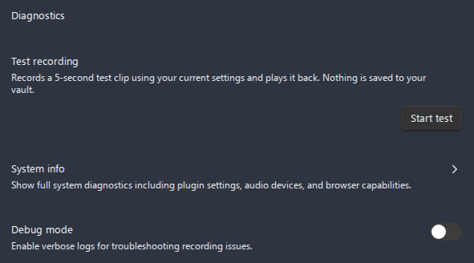
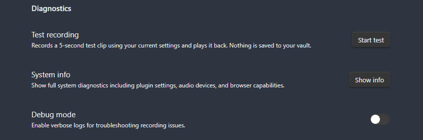

# Troubleshooting and diagnostics

This guide helps you diagnose and fix problems with Advanced Audio Recorder. It covers the three built-in diagnostics tools - **Test recording**, **System info**, and **Debug mode** - and then walks through the most common problems with concrete fixes. When you cannot solve an issue yourself, the last sections explain exactly what to collect and where to report it.

- [Diagnostics tools](#diagnostics-tools)
  - [Test recording](#test-recording)
  - [System info](#system-info)
  - [Debug mode](#debug-mode)
- [Common problems and fixes](#common-problems-and-fixes)
  - [No sound is recorded](#no-sound-is-recorded)
  - [A recording format is not available](#a-recording-format-is-not-available)
  - [Conversion fails](#conversion-fails)
  - [Recording is slow to save](#recording-is-slow-to-save)
  - [Waveform not showing or player not enhanced](#waveform-not-showing-or-player-not-enhanced)
  - [Transcription errors](#transcription-errors)
  - [Audio cleanup errors](#audio-cleanup-errors)
  - [Settings not saving](#settings-not-saving)
- [Collecting diagnostics for a bug report](#collecting-diagnostics-for-a-bug-report)
- [Where to report](#where-to-report)

All three diagnostics tools live at the bottom of the settings tab, under **Settings > Advanced Audio Recorder > Diagnostics**.

*Figure: the Diagnostics section, with the Test recording control, the System info "Show info" button, and the Debug mode toggle.*

---

## Diagnostics tools

### Test recording

**Test recording** is the fastest way to confirm that your selected input device and recording format actually work, without saving anything to your vault. It records a short clip with your current settings and lets you play it straight back.

1. Open **Settings > Advanced Audio Recorder** and scroll to **Diagnostics**.
2. Click **Start test** next to **Test recording**.
3. The control shows `● Recording... (5 seconds)`. Speak or make a sound.
4. After 5 seconds it stops and shows `Test recording complete. Listen below:` with a small inline audio player.
5. Press play on that inline player to hear the clip.

What it tells you:

- **You hear your audio back** - the device, sample rate, browser input processing, and format all work. Live recording should work too.
- **The clip is silent** - the microphone is muted, the wrong input device is selected, or the OS is blocking microphone access. See [No sound is recorded](#no-sound-is-recorded).
- **`Format "<format>" is not supported in this browser.`** - the selected recording format cannot be captured here. See [A recording format is not available](#a-recording-format-is-not-available).
- **`Test recording produced no data. Try a different format or device.`** - capture started but no audio came through; switch the input device or format and retry.
- **`Test recording failed: <message>`** - capture could not start; the message carries the cause (most often a denied microphone permission).

The test uses exactly the same input device, sample rate, bitrate, and browser input processing (noise suppression, echo cancellation, automatic gain control) as a real recording, so it is a faithful preview. Nothing is written to disk - when you leave the section the clip is discarded.

*Figure: a completed test recording with the inline audio player ready to play the captured clip back.*

### System info

**System info** gathers everything needed to diagnose an environment problem into a single JSON snapshot you can paste into a bug report.

1. Open **Settings > Advanced Audio Recorder** and scroll to **Diagnostics**.
2. Click **Show info** next to **System info**.
3. A modal titled **System diagnostics** opens with the full JSON.
4. Click **Copy to clipboard** (the button briefly reads **Copied!**).
5. Paste the JSON into your bug report or wherever you need it.

The snapshot contains the following groups:

| Group                       | What it includes                                                                                                                                                                                                          |
| --------------------------- | ------------------------------------------------------------------------------------------------------------------------------------------------------------------------------------------------------------------------- |
| **Plugin settings**         | Recording format, bitrate, sample rate, save folder, save-near-active-file, active-file subfolder, file prefix, multi-track on/off, max tracks, output mode, per-track sources, selected input device id, and debug flag. |
| **Environment**             | Obsidian (API) version, Electron version, Node version, platform, and architecture.                                                                                                                                       |
| **Audio devices**           | Every detected audio input and output device, with id, label, group id, and kind.                                                                                                                                         |
| **Audio capabilities**      | Supported formats, sample rates, and bitrates; per-codec support; and whether `MediaRecorder` and `getUserMedia` are available.                                                                                           |
| **Active recording config** | The format actually handed to the recorder, the resolved MIME type, the expected codec, whether that MIME type is supported, and the pre-recording validation result.                                                     |

The snapshot never contains your API keys, transcripts, or note contents - only the technical configuration listed above. It is safe to share in a public issue.

*Figure: the System diagnostics modal with the full JSON snapshot and the Copy to clipboard button.*

### Debug mode

**Debug mode** turns on verbose logging so you (or a maintainer) can see exactly what the plugin did step by step. It is off by default.

1. Open **Settings > Advanced Audio Recorder > Diagnostics** and turn on **Debug mode**.
2. Reproduce the problem.
3. Open the developer console: **View > Toggle Developer Tools**, or press `Ctrl/Cmd + Shift + I`.
4. Open the **Console** tab and look for entries prefixed with `[AudioRecorder]`.
5. Copy the relevant lines into your bug report.

Notes:

- Leave Debug mode **off** for everyday use - verbose logging adds noise and a small overhead. Turn it on only while reproducing an issue, then turn it back off.
- If your environment blocks the developer console, capture the System info JSON instead and describe the symptoms in detail; that is usually enough for a first diagnosis.

*Figure: the developer console showing verbose log lines prefixed with [AudioRecorder] after Debug mode is enabled.*

---

## Common problems and fixes

### No sound is recorded

The recording finishes but the file is silent, or **Test recording** plays back nothing.

1. Run **Test recording** (see [above](#test-recording)) to isolate the problem to capture rather than playback.
2. Check the **input device** through either surface - both write your choice to settings:
   - **Settings > Audio input** is the settings UI; pick the correct microphone from the dropdown. A freshly plugged-in device may need the dropdown to refresh - it auto-refreshes on device changes.
   - **Select audio input device** is a command that opens a *separate* quick-pick modal listing detected microphones; choosing one saves it immediately and shows a confirmation notice.

   See [Switching the input device](recording.md#switching-the-input-device) for details.
3. Confirm the OS and Obsidian both have **microphone permission**. On macOS, check **System Settings > Privacy & Security > Microphone**. On Windows, check **Settings > Privacy > Microphone**.
4. Make sure the microphone is not muted in hardware or in the OS mixer, and that the input level is non-zero.
5. With **Input level meter** enabled (**Settings > Audio processing & feedback**), watch the meter move when you speak - a flat meter means no signal is reaching the plugin.
6. If a `Test recording failed:` message mentions a denied permission, grant access and restart Obsidian.

See also: [Recording](recording.md), [Settings reference](settings-reference.md#audio-input).

### A recording format is not available

The format dropdown is missing an option, **Test recording** reports `Format "<format>" is not supported in this browser.`, or a recording produces an empty file.

- Format availability depends on your platform and the Electron/Chromium build Obsidian ships. Not every format can be captured everywhere.
- **Online** formats (WebM, OGG, WAV, MP4, M4A, AAC) are written in real time by `MediaRecorder`; if the browser does not support a format's MIME type it cannot be used.
- **Offline** formats (MP3, FLAC, and the offline paths for MP4/M4A) are re-encoded after the recording stops and do not depend on `MediaRecorder` support; the settings dropdown marks them **(offline)**.
- Open **System info** and look at **Audio capabilities > supported formats** and **codec support** to see exactly what this environment offers, and at **Active recording config** to see the resolved MIME type and whether it is supported.
- If your preferred format is unavailable, record in a supported one (WebM is the reliable default; WAV is the most robust for long recordings) and then **Convert audio format** afterwards from the right-click menu.

See also: [Formats and containers](formats.md), [File operations](file-operations.md).

### Conversion fails

**Convert audio format** errors out or produces an unexpected result.

- Confirm the **target format** is available in this environment (see [above](#a-recording-format-is-not-available)). Offline targets (MP3, FLAC) are re-encoded with the bundled encoders and do not need browser support; online targets do.
- Verify the **source file is valid and decodable**: right-click it and choose **Audio file info**. A 0-byte file, an empty duration, or an unknown codec means the source itself is the problem, not the conversion.
- Make sure there is **free space** in the vault - conversion writes a new file next to the source.
- If conversion of a video-bearing file fails, note that the converter targets audio; files with a video track behave differently from audio-only files.

See also: [File operations](file-operations.md), [Formats and containers](formats.md).

### Recording is slow to save

After you stop, the status bar shows a save sequence and the ribbon switches to a save icon before the embed link appears.

Saving runs through these stages, shown as a percentage in the status bar:

| Progress | Stage            |
| -------- | ---------------- |
| 0%       | Saving           |
| 20%      | Flushing buffers |
| 40%      | Assembling audio |
| 60%      | Writing file     |
| 80%      | Cleaning up      |
| 100%     | Saved            |

This is normal, and longer recordings naturally take longer to assemble and write. If saving is unusually slow:

- For long recordings, prefer **WAV** (PCM streaming) - it is the most reliable for long sessions. Offline formats (MP3, FLAC) re-encode the whole recording after stop, which takes additional time and CPU.
- Enable **automatic splitting** (**Settings > Audio splitting**) so long recordings are written as fixed-duration parts instead of one large file.
- Confirm the vault is on fast, local storage. Saving into a synced or network folder can stall on I/O.
- If Obsidian was interrupted mid-recording (crash, power loss, plugin reload), you are not stuck: on the next launch a recovery modal offers to reassemble the recording. See [Crash recovery](recording.md#crash-recovery).

See also: [Recording](recording.md), [Splitting recordings](splitting.md).

### Waveform not showing or player not enhanced

You see Obsidian's plain audio bar, or the enhanced player loads but the waveform is missing.

- The enhanced player is opt-in. Turn on **Enhanced audio player** under **Settings > Audio player**, and make sure **Show waveform** is on.
- The enhanced player applies to **audio-only** files. A file that contains a **video track**, or a file the app cannot decode, keeps Obsidian's built-in player. Files are classified by their container metadata, not by extension, so renaming a file does not change this.
- For very large or slowly decoding files, the player **falls back to a plain seekable bar** above a certain size or when the audio cannot be decoded. This is expected behaviour, not a bug - playback and seeking still work.
- The waveform is **decoded lazily** as it scrolls into view and is cached per file revision, so it may appear progressively on long files rather than all at once.
- Marker and chapter ticks require **Markers and chapters** to be enabled, and editing markers is only possible in **Live Preview** (markers are read-only in Reading view).

See also: [Enhanced audio player](audio-player.md), [Settings reference](settings-reference.md#audio-player).

### Transcription errors

Transcription stops with an error, or the progress dialog reports a failure.

| Symptom                                            | Cause and fix                                                                                                                                                                                         |
| -------------------------------------------------- | ----------------------------------------------------------------------------------------------------------------------------------------------------------------------------------------------------- |
| `Set the … API key in settings to transcribe.`     | The selected engine has no API key. Open **Settings > Transcription**, select your engine, and paste the key. See the per-engine setup guides below.                                                  |
| `Authentication failed.` / 401 / 403               | The API key is wrong, expired, or not authorized for this provider/model. Re-copy the key from the provider console and confirm your account has access.                                              |
| `Rate limit reached. Wait a moment and try again.` | You hit the provider's rate limit. Wait and retry; for free tiers, consider a paid plan or a different engine.                                                                                        |
| `Request … timed out after … ms.`                  | The request exceeded the configured **Request timeout** (default 10 minutes, range 1-60). Raise the timeout for long files, or split the recording first.                                             |
| File too large                                     | The **Whisper API** caps each request at **25 MB**. Files over that are automatically resampled to 16 kHz mono and split into upload-sized chunks. **Deepgram** and **Gemini** accept up to **2 GB**. |
| `Speaker diarization` greyed out                   | Diarization is only supported by **Deepgram** and **Google Gemini**. It is disabled and greyed for **Whisper API** and **Local whisper.cpp** - switch engines if you need speaker labels.             |
| Gemini diarization warning on long files           | Gemini splits recordings longer than 15 minutes into parts and stitches them; diarized splits reset speaker numbering, which the plugin surfaces as a warning.                                        |
| Local `whisper.cpp` fails to start                 | Check the **binary path** and **model path** (an absolute path to a GGML `.bin` file). Make sure the binary is executable and the model file exists.                                                  |

Other tips:

- The progress dialog has **Cancel** and **Minimize**. Minimizing sends the job to the status bar so you can keep working; click the status bar to reopen it. Closing the dialog cancels the job.
- **API keys** are stored in the plugin's `data.json` on this device and are never written into diagnostics. Avoid syncing `data.json` to untrusted locations. The local `whisper.cpp` engine keeps everything offline.

See also: [Transcription](transcription.md), [LLM post-processing](llm-post-processing.md), and the per-engine guides: [OpenAI / Whisper API](use-cases/openai-whisper-api-key.md), [Groq](use-cases/groq-whisper-setup.md), [Deepgram](use-cases/deepgram-api-key.md), [Gemini](use-cases/gemini-api-key.md), [Anthropic / Claude](use-cases/anthropic-api-key.md), [Local whisper.cpp](use-cases/local-whisper-cpp.md).

*Figure: the transcription progress dialog showing the progress bar, elapsed timer, and the Cancel and Minimize buttons.*

### Audio cleanup errors

The **Clean up audio** dialog refuses a file or fails during processing.

- **"Audio file is too large to clean up here"** - the file exceeds the 1 GB on-disk limit, or it decodes to more samples than the working set allows. Split it first with **Split audio into parts** and clean each part.
- **"Audio is too long to clean up here"** - the file exceeds the two-hour limit. Split it into parts and clean each part.
- **"The file contains no decodable audio data"** - the file is empty or its container/codec cannot be decoded by the app. Check it with **Audio file info**, or convert it first.
- **"Audio processing failed: …"** - decoding or writing failed; the message carries the cause. Verify the file is valid audio and that the vault has free space.

For the full list of cleanup messages, parameter ranges, and quality tips, see [Audio cleanup > Troubleshooting](audio-cleanup.md#troubleshooting).

### Settings not saving

Your changes do not persist, or you see a notice about the settings file.

- If `data.json` is **missing**, the plugin auto-restores your settings from `data.json.bak` (a backup it refreshes on every successful load and save) and shows **"Settings were restored from the backup file."** No action is needed - `data.json` is recreated immediately.
- If `data.json` **exists but cannot be read**, the plugin protects the stored file: it keeps the current session running on the backup (or on defaults), **disables saving**, and shows a notice ending with **"Restart Obsidian to recover."** Changes you make now will not persist until you restart.

What to do:

1. **Restart Obsidian.** This is the documented recovery path and resolves a transient read failure.
2. If the problem persists after a restart, the `data.json` file in `<vault>/.obsidian/plugins/advanced-audio-recorder/` may be corrupt. Because the plugin keeps `data.json.bak` next to it, you can close Obsidian, replace the unreadable `data.json` with the `.bak` copy, and reopen.
3. Avoid editing `data.json` by hand and avoid syncing it to a location that may write a partial file.

See also: [Settings reference](settings-reference.md).

---

## Collecting diagnostics for a bug report

When you open an issue, attach the diagnostics below so the problem can be reproduced quickly. This mirrors the [Bug reporting guide](BUG_REPORTING_GUIDE.md), which has the full checklist and an example report.

1. **Update and isolate.** Update the plugin to the latest version, restart Obsidian, and (if you can) temporarily disable other plugins to rule out conflicts.
2. **Write reproduction steps.** Note the exact format and bitrate, single- vs multi-track, recording length, and what you clicked or which command you ran.
3. **State expected vs actual** behaviour.
4. **Capture System info.** Open **Settings > Advanced Audio Recorder > Diagnostics > System info > Show info**, click **Copy to clipboard**, and paste the JSON into the report.
5. **Capture Audio file info** (when a specific file is involved). Right-click the file, choose **Audio file info**, click **Copy as Markdown**, and paste it in.
6. **Capture console logs** (optional, advanced). Enable **Debug mode**, reproduce the issue, open **View > Toggle Developer Tools**, and copy the `[AudioRecorder]` log lines.
7. **Attach a screenshot or screen recording** if the problem is visual.

---

## Where to report

Report bugs and request features on GitHub: [Advanced Audio Recorder Issues](https://github.com/akhmialeuski/advanced-audio-recorder/issues). Use the **Bug report** template, which includes all the sections above.

Before filing, it is worth a quick look at the relevant deep-dive guide - the fix is often a setting:

- [Recording](recording.md) and [Crash recovery](recording.md#crash-recovery)
- [Multi-track recording](multi-track-recording.md)
- [Formats and containers](formats.md) and [File operations](file-operations.md)
- [Splitting recordings](splitting.md)
- [Enhanced audio player](audio-player.md)
- [Audio cleanup](audio-cleanup.md)
- [Transcription](transcription.md) and [LLM post-processing](llm-post-processing.md)
- [Settings reference](settings-reference.md)
- [Bug reporting guide](BUG_REPORTING_GUIDE.md)

If the plugin saves you time, consider supporting its development: [Buy Me A Coffee](https://coff.ee/akhmelevskiy).
