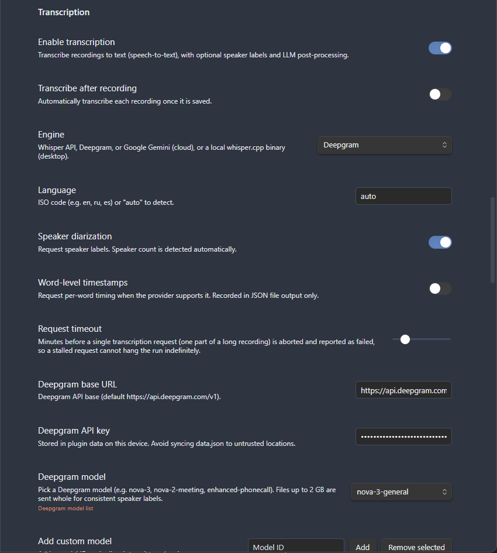
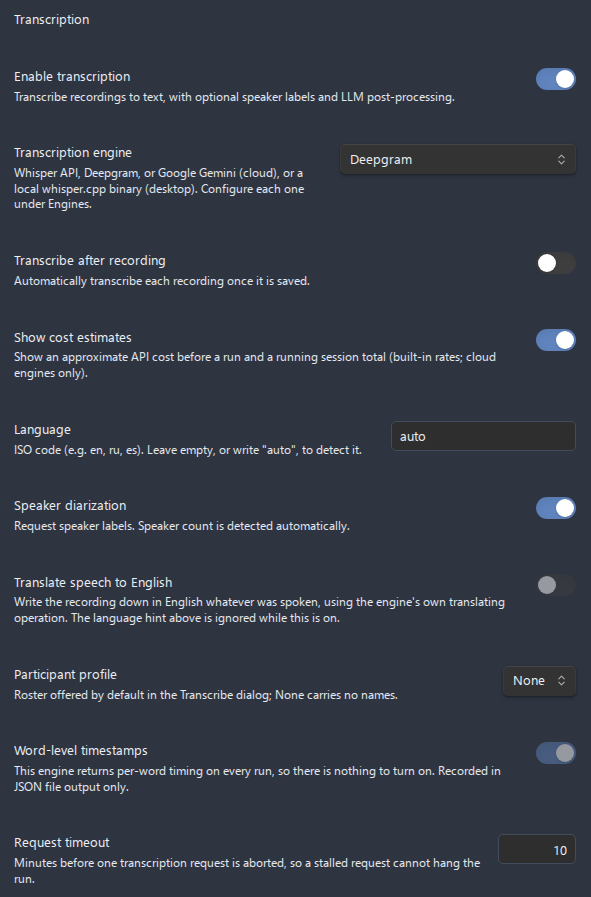

# Get a Deepgram API key (with speaker diarization)

[Deepgram](https://deepgram.com) is the engine to pick when you record **meetings**, **interviews**, or any audio with **more than one voice** and you want each line labelled by who said it. Deepgram's pre-recorded API sends the whole file in one request - up to **2 GB** - and diarizes it with consistent speaker numbering across the entire recording. This guide walks you from a fresh Deepgram account to a working **Settings > Transcription** configuration, then verifies it on a two-voice clip.

- [Why Deepgram](#why-deepgram)
- [Step 1: Sign up for Deepgram](#step-1-sign-up-for-deepgram)
- [Step 2: Create an API key](#step-2-create-an-api-key)
- [Step 3: Configure the plugin](#step-3-configure-the-plugin)
- [Step 4: Enable speaker diarization](#step-4-enable-speaker-diarization)
- [Step 5: Verify with a two-voice recording](#step-5-verify-with-a-two-voice-recording)
- [Choosing a model](#choosing-a-model)
- [Costs](#costs)
- [Privacy](#privacy)
- [Troubleshooting](#troubleshooting)
- [Related guides](#related-guides)

## Why Deepgram

Deepgram is one of four transcription engines in the plugin (alongside the [Whisper API](../use-cases/openai-whisper-api-key.md), [Google Gemini](../use-cases/gemini-api-key.md), and offline [local whisper.cpp](../use-cases/local-whisper-cpp.md)). It stands out for multi-speaker audio:

- **Whole-file requests up to 2 GB.** Deepgram accepts the original audio container and sends it in **one piece**, with no chunking. The 2 GB ceiling comfortably covers hours of recording.
- **Consistent speaker diarization.** Because the whole file is transcribed in a single request, speaker numbering stays **stable across the entire recording** - speaker 1 in the first minute is still speaker 1 in the last. This is the property that makes Deepgram a strong choice for meetings and interviews.
- **Free starter credit, then pay-as-you-go.** A new Deepgram account includes a starter credit so you can transcribe right away; after that you pay only for what you use.
- **Default model `nova-3`.** The plugin ships pointing at Deepgram's current general model, with a model picker for named variants and older families.

If you only ever record a single speaker and want a fully free, offline option, [local whisper.cpp](../use-cases/local-whisper-cpp.md) may suit you better - but it cannot diarize. For diarized speaker labels, use Deepgram (or Gemini). See [Speakers and diarization](../transcription.md#speakers-and-diarization) for how speaker labels flow into the transcript.

## Step 1: Sign up for Deepgram

1. Go to **[https://console.deepgram.com/signup](https://console.deepgram.com/signup)**.
2. Create an account (email and password, or a linked Google/GitHub identity).
3. Confirm your email if Deepgram asks you to, then sign in to the **Deepgram Console**.

A new account includes a **free starter credit**, so you do not need to add a payment method before your first transcription. You can add billing later when the starter credit runs out.

*Figure: The Deepgram Console sign-up page at console.deepgram.com/signup.*

## Step 2: Create an API key

1. In the **Deepgram Console**, open the **API Keys** page from the left-hand navigation.
2. Click **Create a New API Key** (the exact button wording may vary by console version).
3. Give the key a recognizable name, such as `obsidian-advanced-audio-recorder`.
4. Create the key, then **copy it immediately**. Deepgram shows the full key value **only once** - if you navigate away without copying it, you must create a new one.
5. Paste the key somewhere safe for the next step (you will put it into the plugin's settings).

*Figure: The API Keys page in the Deepgram Console, where you create and copy a key.*

Treat the key like a password. Anyone who has it can spend your Deepgram credit. If a key leaks, return to the **API Keys** page and revoke it.

## Step 3: Configure the plugin

Open **Settings > Advanced Audio Recorder** and scroll to the **Transcription** section.

1. Turn on **Enable transcription**. The engine fields appear below it.
2. Set **Engine** to **Deepgram**.
3. In **Deepgram base URL**, leave the default `https://api.deepgram.com/v1`. Only change this if Deepgram tells you to use a different endpoint.
4. Paste the key you copied into **Deepgram API key**.
5. In **Deepgram model**, pick a model. The default is `nova-3`; other options are listed under [Choosing a model](#choosing-a-model).

| Field                 | What to enter                              | Default                       |
| --------------------- | ------------------------------------------ | ----------------------------- |
| **Engine**            | `Deepgram`                                 | Whisper API                   |
| **Deepgram base URL** | Leave as the default unless told otherwise | `https://api.deepgram.com/v1` |
| **Deepgram API key**  | The key copied from the Deepgram Console   | (empty)                       |
| **Deepgram model**    | `nova-3` (or a named variant)              | `nova-3`                      |

*Figure: The Deepgram engine fields under Settings > Transcription.*

The model picker lets you pick from a seeded list, **Add custom model** to type an id Deepgram supports, or **Remove selected** to drop one you do not use. A link to Deepgram's authoritative model catalogue - [https://developers.deepgram.com/docs/model](https://developers.deepgram.com/docs/model) - sits next to the picker.

## Step 4: Enable speaker diarization

Diarization is what separates each voice into a labelled speaker. It is **off by default**, so turn it on for multi-voice audio.

1. Still in the **Transcription** section, find **Speaker diarization**.
2. Turn it **on**.

**Speaker diarization** is enabled only for engines that support it - **Deepgram** and **Google Gemini**. With the Whisper API or local whisper.cpp selected, the toggle is greyed out and reads *"Not supported by the selected engine. Use Deepgram for speaker labels."* Because you selected Deepgram in Step 3, the toggle is active.

*Figure: The Speaker diarization toggle, enabled because Deepgram is the selected engine.*

When diarization is on, the speaker-related output options unlock further down the **Transcript output** area: **Include speakers** (default on) and **Merge speaker turns** (default on, which combines consecutive lines from the same speaker into one block). The **Speaker format** template (default `**{speaker}**`) controls how each label is rendered. See [Speakers and diarization](../transcription.md#speakers-and-diarization) for the full behavior.

> Deepgram diarizes the **whole file in one request**, so speaker numbering is consistent from start to finish - unlike split-then-stitch engines, which can reset numbering across parts.

## Step 5: Verify with a two-voice recording

Confirm everything works end to end with a short clip that has two distinct voices.

1. Record (or open) a short audio file in which **two people each speak at least once** - for example, a 30-second mock interview. You can record one with the ribbon **microphone icon** or the **Start/stop recording** command.
2. Make the audio file the **active file**: open the audio file itself (click its name in the embed, or its entry in the File Explorer) so it opens in its own pane. Opening the *note* it is embedded in does not count - the command below checks the active file's type.
3. Run **Transcribe active audio file** from the command palette, or right-click the recording (or its embed/player) and choose **Transcribe audio**. The palette command appears only when transcription is enabled and the active file is an audio file; the right-click action works regardless of the active file.
4. A progress dialog opens with a progress bar, an elapsed timer, **Cancel**, and **Minimize**. Let it finish.
5. Read the transcript. With diarization on, lines are grouped and labelled by speaker - you should see at least two distinct speakers (for example **Speaker 1** and **Speaker 2**, rendered per your **Speaker format**).

*Figure: The transcription progress dialog; click Minimize to send the job to the status bar and keep working.*

If both speakers appear with their own labels, diarization is working. If everything is attributed to one speaker, see [Troubleshooting](#troubleshooting).

*Figure: A finished diarized transcript with two speakers labelled.*

## Choosing a model

The **Deepgram model** picker is seeded with the families below; the current, authoritative list lives at [https://developers.deepgram.com/docs/model](https://developers.deepgram.com/docs/model). You can also **Add custom model** to enter any model id Deepgram supports.

| Model family       | Example ids                                                                                   | Notes                                                |
| ------------------ | --------------------------------------------------------------------------------------------- | ---------------------------------------------------- |
| **Nova-3**         | `nova-3`, `nova-3-general`, `nova-3-medical`                                                  | Default; Deepgram's current general-purpose model.   |
| **Nova-2**         | `nova-2`, `nova-2-meeting`, `nova-2-phonecall`, `nova-2-finance`, others                      | Named variants tuned for meetings, phone calls, etc. |
| **Nova**           | `nova`, `nova-general`, `nova-phonecall`                                                      | Earlier Nova generation.                             |
| **Enhanced**       | `enhanced`, `enhanced-meeting`, `enhanced-phonecall`, `enhanced-finance`                      | Mid-tier accuracy.                                   |
| **Base**           | `base`, `base-meeting`, `base-phonecall`, `base-finance`, others                              | Lowest-cost tier.                                    |
| **Hosted Whisper** | `whisper`, `whisper-tiny`, `whisper-base`, `whisper-small`, `whisper-medium`, `whisper-large` | Whisper sizes served by Deepgram.                    |

Recommendations:

- **Most meetings and interviews**: start with the default `nova-3`.
- **Calls and meeting audio specifically**: try a named variant such as `nova-2-meeting` or `enhanced-phonecall`.
- Deepgram's real-time **Flux** streaming family is intentionally **not** in the list - this plugin uses the pre-recorded API, which Flux does not serve.

## Costs

- A new Deepgram account includes a **free starter credit**, so you can transcribe immediately without entering a payment method.
- After the credit is used, Deepgram is **pay-as-you-go** - you pay per minute (or per second) of audio, and the rate depends on the model you pick.
- Add billing and review pricing in the **Deepgram Console**.

The plugin sends one request per transcription job (whole-file, up to 2 GB), so a single long recording is a single billed request rather than many chunked ones.

## Privacy

- Your **Deepgram API key** is stored in the plugin's `data.json` on **this device only**. It is never written into the **System info** diagnostics report.
- Avoid syncing `data.json` to untrusted locations, since it holds your key.
- Deepgram is a **cloud** service: your audio is uploaded to Deepgram's servers for transcription. If you need everything to stay offline, use [local whisper.cpp](../use-cases/local-whisper-cpp.md) instead - but note it cannot diarize.

## Troubleshooting

| Symptom                                        | Likely cause and fix                                                                                                                                                      |
| ---------------------------------------------- | ------------------------------------------------------------------------------------------------------------------------------------------------------------------------- |
| **Authentication / 401 error**                 | The **Deepgram API key** is wrong, has a stray space, or was revoked. Re-copy it from the Console's **API Keys** page and paste it again.                                 |
| **Out of credit / payment error**              | Your free starter credit is used up. Add billing in the **Deepgram Console** to continue.                                                                                 |
| **Model not found / invalid model**            | The **Deepgram model** id is not one Deepgram serves. Pick a seeded id (for example `nova-3`) or check the [model catalogue](https://developers.deepgram.com/docs/model). |
| **Everything is one speaker**                  | **Speaker diarization** is off, or the audio truly has one dominant voice. Confirm the toggle is on (Step 4) and that both voices are audible.                            |
| **Speaker labels missing from the transcript** | **Include speakers** is off, or the engine produced no labels. Turn on diarization and **Include speakers** under **Transcript output**.                                  |
| **Wrong base URL / connection error**          | The **Deepgram base URL** was changed. Reset it to `https://api.deepgram.com/v1`.                                                                                         |
| **Transcribe command is missing**              | **Enable transcription** is off, or the active file is not an audio file. Turn transcription on and select an audio file.                                                 |
| **The job times out on a very long file**      | Increase **Request timeout** in the **Transcription** settings (default 10 minutes; range 1-60).                                                                          |

For anything else, see the general [Troubleshooting](../troubleshooting.md) guide, and check Deepgram's own status and docs.

## Related guides

- [Transcription](../transcription.md) - the full transcription feature guide.
- [Speakers and diarization](../transcription.md#speakers-and-diarization) - how speaker labels are produced and formatted.
- [Meeting notes workflow](../use-cases/meeting-notes-workflow.md) - record a meeting and turn it into diarized notes end to end.
- [Transcribe after recording](../use-cases/transcribe-after-recording.md) - kick off transcription automatically when a recording stops.
- [LLM post-processing](../llm-post-processing.md) - summarize or clean up the resulting transcript.
- [Settings reference](../settings-reference.md) - every transcription setting and its default.
