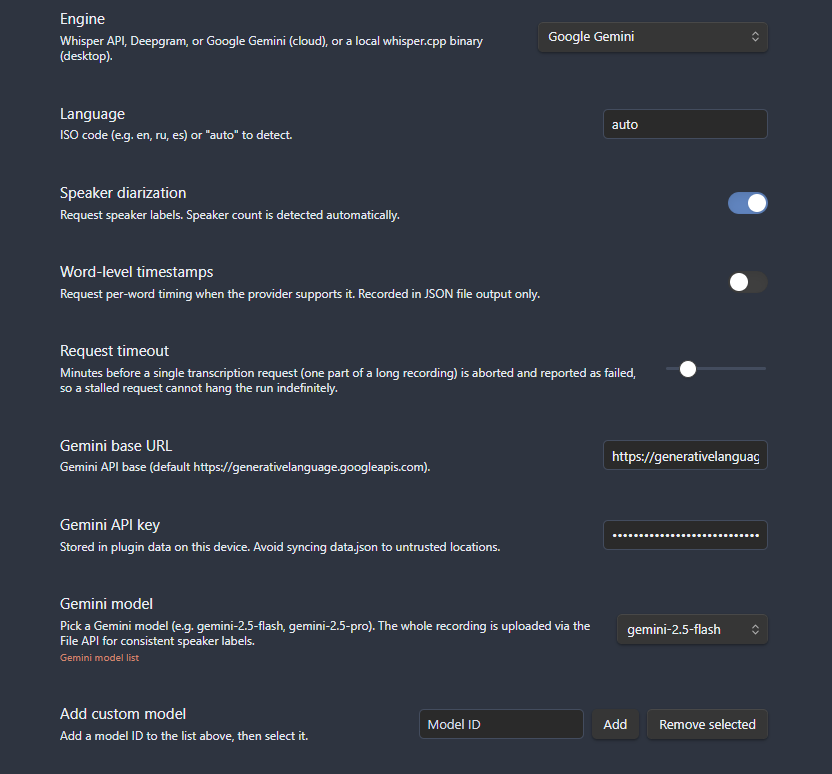
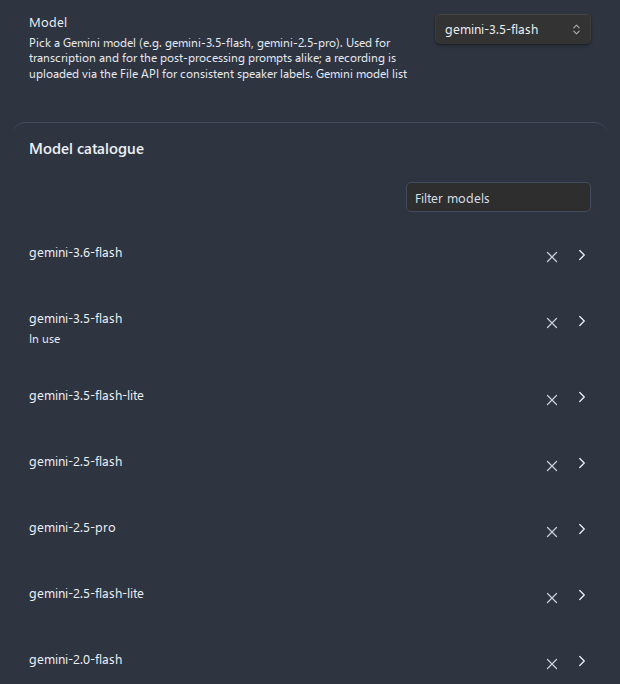
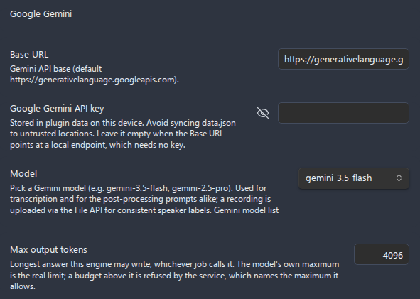

# Get a Google Gemini API key

Google Gemini is a multimodal model that transcribes audio directly. In Advanced Audio Recorder it is one of the four [transcription](../transcription.md) engines, and the **same key** also powers the [Gemini LLM post-processing](../llm-post-processing.md) provider - set it once and both features work. Gemini uploads the whole recording in one piece (up to 2 GB via the File API), supports speaker [diarization](../transcription.md#speakers-and-diarization), and Google's [AI Studio](https://aistudio.google.com/apikey) hands out a key with a free tier in a couple of clicks. This guide walks you from a blank settings tab to a working transcript.

- [Why Gemini](#why-gemini)
- [Step 1: Create the API key in Google AI Studio](#step-1-create-the-api-key-in-google-ai-studio)
- [Step 2: Configure Gemini for transcription](#step-2-configure-gemini-for-transcription)
- [How Gemini handles your audio](#how-gemini-handles-your-audio)
- [Reuse the same key for LLM post-processing](#reuse-the-same-key-for-llm-post-processing)
- [Verify it works](#verify-it-works)
- [Troubleshooting](#troubleshooting)
- [Related guides](#related-guides)

## Why Gemini

Gemini reads the audio itself rather than running a dedicated speech model, which makes it a strong all-rounder for the plugin:

- **Whole-file uploads.** Recordings up to **2 GB** are uploaded in one piece through Google's File API, so speaker numbering stays consistent across the file (subject to the splitting rule below).
- **Speaker diarization.** Gemini can label distinct speakers (`Speaker 1`, `Speaker 2`, and real names when clearly stated) - useful for meetings and interviews. Diarization is off by default and is only available on Gemini and Deepgram.
- **Free tier.** Google AI Studio includes a free quota to get started; heavier use moves to paid billing.
- **One key, two features.** The same Gemini key transcribes audio **and** drives Gemini-based [LLM post-processing](../llm-post-processing.md) (clean up, summarize, or a custom instruction).
- **Sensible default model.** The plugin ships with **`gemini-2.5-flash`** selected - fast and cheap enough for transcription, with `gemini-2.5-pro` available for difficult audio.

| Property                | Value                                                              |
| ----------------------- | ------------------------------------------------------------------ |
| Engine name in settings | **Google Gemini**                                                  |
| Default base URL        | `https://generativelanguage.googleapis.com`                        |
| Default model           | `gemini-2.5-flash`                                                 |
| Max file size           | 2 GB (uploaded whole via the File API)                             |
| Diarization             | Supported (off by default)                                         |
| Word-level timestamps   | Recorded in JSON output only                                       |
| Cost                    | Free tier in AI Studio, then paid                                  |
| Reused for              | Gemini [LLM post-processing](../llm-post-processing.md) (same key) |

*Figure: The Transcription settings section after you pick Google Gemini as the engine.*

---

## Step 1: Create the API key in Google AI Studio

1. Open **[Google AI Studio > API keys](https://aistudio.google.com/apikey)** in your browser.
2. Sign in with your Google account if prompted.
3. Click **Create API key** (you may be asked to pick or create a Google Cloud project - the default is fine for getting started).
4. When the key appears, click **Copy**. The key is a long string; treat it like a password.
5. Keep the AI Studio tab open until you have pasted the key into Obsidian - for security, Google may not show the full key again later.

*Figure: Creating and copying a Gemini API key in Google AI Studio.*

> Your free-tier usage and any billing live in Google AI Studio / Google Cloud. If a request is rejected for quota, check your usage there.

---

## Step 2: Configure Gemini for transcription

In Obsidian, open **Settings > Advanced Audio Recorder** and scroll to the **Transcription** section.

1. Turn on **Enable transcription**. The engine fields appear below it.
2. Set **Engine** to **Google Gemini**.
3. In **Gemini base URL**, leave the default `https://generativelanguage.googleapis.com` unless you have a specific reason to change it.
4. Paste your key into **Gemini API key**.
5. Under **Gemini model**, pick `gemini-2.5-flash` (default) or `gemini-2.5-pro` for harder audio. Use **Add custom model** to enter any other model id, **Remove selected** to drop one, or open the **Gemini model list** link to browse the [model catalogue](https://ai.google.dev/gemini-api/docs/models).
6. (Optional) Set **Language** to `auto` (default) or an ISO code such as `en`, `ru`, or `es`. Gemini transcribes each segment in the language actually spoken regardless, but a hint can help.
7. (Optional) Turn on **Speaker diarization** to label speakers. This toggle is only enabled for Gemini and Deepgram.
8. (Optional) Turn on **Transcribe after recording** to transcribe every new recording automatically.

*Figure: The Gemini model picker with the default model selected and the catalogue link.*

The table below summarizes the fields you set:

| Field                   | What to enter                                            |
| ----------------------- | -------------------------------------------------------- |
| **Engine**              | Google Gemini                                            |
| **Gemini base URL**     | `https://generativelanguage.googleapis.com` (default)    |
| **Gemini API key**      | The key you copied from AI Studio                        |
| **Gemini model**        | `gemini-2.5-flash` (default) or `gemini-2.5-pro`         |
| **Language**            | `auto` (default), or an ISO code like `en` / `ru` / `es` |
| **Speaker diarization** | On for meetings/interviews; off for a single speaker     |

For the shared output settings (destination, file format, in-note formatting, timestamps, speaker formatting), see the [transcription guide](../transcription.md#output-where-the-transcript-goes).

---

## How Gemini handles your audio

A few behaviors are specific to Gemini and worth knowing before you transcribe a long meeting:

- **Container conversion.** Gemini's File API accepts `wav`, `mp3`, `aac`, `ogg`, `flac`, and `aiff` directly. The plugin's default recording containers **WebM** and **M4A/MP4** are **not** accepted, so the plugin first decodes them to **16 kHz mono WAV** before uploading. This is automatic; you do not configure it.
- **Long recordings are split and stitched.** A recording longer than **15 minutes** is split into parts, each transcribed in its own request, then stitched back onto one timeline. This keeps a long job from outrunning the request timeout or hitting the model's output-token limit.
- **Diarization resets across splits.** Because each split is a separate request, **speaker numbering restarts** in each part (the `Speaker 1` in part two is not necessarily the `Speaker 1` in part one). When this happens on a diarized job, the plugin surfaces a **warning** so you know to reconcile the labels. For perfectly consistent speaker numbering on a long file, consider [Deepgram](deepgram-api-key.md), which sends up to 2 GB whole.
- **Request timeout.** Each request honors the **Request timeout** setting (default 10 minutes, range 1-60). A whole, healthy upload scales its timeout with size; a genuinely hung request is aborted and reported.
- **Word-level timestamps** appear in **JSON** file output only, not in the in-note transcript.

*Figure: The transcription progress dialog; Minimize sends the job to the status bar so you can keep working.*

---

## Reuse the same key for LLM post-processing

Gemini is also one of the three [LLM post-processing](../llm-post-processing.md) providers, alongside OpenAI and Anthropic. When you select **Google Gemini** as the LLM provider, the plugin **reuses the same Gemini API key** - the key field there reads *"Shared with the Gemini transcription engine - set it in either place."* You do not need a second key.

To enable it:

1. In the **Transcription** section, open the **LLM post-processing** subsection.
2. Turn on **Enable LLM post-processing**.
3. Pick a **Task**: Clean up (default), Summarize, or Custom.
4. Set **LLM provider** to **Google Gemini**. The **LLM base URL** auto-switches to `https://generativelanguage.googleapis.com` unless you typed a custom one, and the key is taken from your Gemini transcription key.
5. Pick a model under the Gemini LLM model picker (default `gemini-2.5-flash`), and adjust **Max output tokens** if needed (default 4096, range 512-32000).

*Figure: The LLM post-processing subsection with Google Gemini selected; the API key is shared with transcription.*

See the [LLM post-processing guide](../llm-post-processing.md) for the full set of tasks, prompts, and provider options.

---

## Verify it works

1. Open a note and record a short clip, or open an existing audio file in your vault.
2. Make sure Gemini is the selected engine and your key is pasted in.
3. With an audio file active, run **Transcribe active audio file** from the command palette (this command appears only when transcription is enabled and the active file is audio).
4. Watch the progress dialog. When it finishes, the transcript is inserted into the note and/or written to a sidecar file, depending on your **Transcript output** settings.

*Figure: A transcription job minimized to the status bar; click it to reopen the dialog.*

If a transcript appears with speaker labels (when diarization is on) and clickable timecodes, Gemini is working.

---

## Troubleshooting

| Symptom                                                     | Likely cause and fix                                                                                                                                                 |
| ----------------------------------------------------------- | -------------------------------------------------------------------------------------------------------------------------------------------------------------------- |
| `API key not valid` / `permission denied` / `401` / `403`   | The key is wrong, truncated, or restricted. Recopy it from [AI Studio](https://aistudio.google.com/apikey) into **Gemini API key**, with no spaces.                  |
| `429` / quota or rate-limit error                           | You hit the free-tier or project quota. Wait, or enable billing in Google AI Studio / Google Cloud. Try `gemini-2.5-flash` (cheaper) if you were using Pro.          |
| `404` / model not found                                     | The model id is unknown to your account. Pick `gemini-2.5-flash` or another id from the [model catalogue](https://ai.google.dev/gemini-api/docs/models).             |
| Speaker numbers seem to restart partway through a long file | Expected: a recording over 15 minutes is split and diarization resets per part (a warning is shown). Use [Deepgram](deepgram-api-key.md) for whole-file diarization. |
| Request times out on a long recording                       | Raise **Request timeout** (up to 60 minutes), or split the recording first. See [Splitting recordings](../splitting.md).                                             |
| Transcript is empty or truncated                            | The response hit the model's output-token limit. Use a shorter recording, split it, or choose a model with a larger output limit, as the error suggests.             |
| Connection or network errors                                | Gemini is a cloud engine and needs internet. For fully offline transcription, use [local whisper.cpp](local-whisper-cpp.md).                                         |

> **Key privacy.** Your Gemini API key is stored in the plugin's `data.json` on this device and is never written to diagnostics. Avoid syncing `data.json` to untrusted locations. If you need everything to stay offline, use the [local whisper.cpp engine](local-whisper-cpp.md) instead.

---

## Related guides

- [Transcription](../transcription.md) - engines, diarization, output formats, and destinations.
- [LLM post-processing](../llm-post-processing.md) - clean up, summarize, or apply a custom instruction with Gemini, OpenAI, or Anthropic.
- [Deepgram API key](deepgram-api-key.md) - whole-file diarization with consistent speaker numbering on long files.
- [Anthropic / Claude API key](anthropic-api-key.md) - for Claude-based LLM post-processing.
- [Local whisper.cpp (offline)](local-whisper-cpp.md) - private, offline transcription with no API key.
- [Settings reference](../settings-reference.md) - every setting, its options, and its default.
