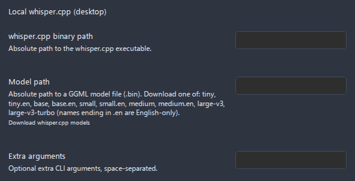

# Set up local whisper.cpp (offline transcription)

`whisper.cpp` is a small, fast C/C++ port of OpenAI's Whisper model that runs entirely on your own computer. Wire it into Advanced Audio Recorder and every transcription happens **offline** - no API key, no upload, no cloud bill, and nothing ever leaves your device. This guide walks you through getting the binary, downloading a model, pointing the plugin at both, and proving the whole thing works with the network unplugged.

- [Why local whisper.cpp](#why-local-whispercpp)
- [What you need](#what-you-need)
- [Step 1: Get the whisper.cpp binary](#step-1-get-the-whispercpp-binary)
    - [Option A: download a prebuilt release](#option-a-download-a-prebuilt-release)
    - [Option B: build from source](#option-b-build-from-source)
- [Step 2: Download a GGML model file](#step-2-download-a-ggml-model-file)
- [Step 3: Configure the plugin](#step-3-configure-the-plugin)
- [Step 4: Run a test transcription (and prove it is offline)](#step-4-run-a-test-transcription-and-prove-it-is-offline)
- [Extra arguments (optional)](#extra-arguments-optional)
- [Troubleshooting](#troubleshooting)
- [Related guides](#related-guides)

## Why local whisper.cpp

Pick the local engine when privacy, cost, or connectivity matter more than raw speed:

- **Free.** No API key and no per-minute charge. Once the binary and model are on disk, transcription costs nothing.
- **Private.** The audio is handed to a local process and never uploaded. The provider declares **no network requirement**, so the request timeout that applies to cloud engines does not apply here.
- **Offline.** Works on a plane, in an air-gapped vault, or anywhere without internet.
- **Yours to tune.** You choose the model size and can pass any extra `whisper.cpp` flag the binary supports.

### Trade-offs

- **Desktop only.** The engine shells out to a native binary through Node, which the mobile app cannot do, so it runs only in the Obsidian **desktop** app. The rest of the plugin - including cloud transcription - works on mobile too; see [Mobile support](../mobile-support.md).
- **It uses your hardware.** Transcription runs on your CPU (or GPU, if you built/downloaded a build with acceleration). A large model on a laptop CPU can be several times slower than real time.
- **Accuracy scales with model size.** Bigger models are more accurate but slower and use more memory. Smaller models are fast but make more mistakes.
- **No speaker labels.** Local `whisper.cpp` does not do diarization, so it produces no "who said what" labels. If you need speaker labels, use Deepgram or Gemini instead - see [Speakers and diarization](../transcription.md#speakers-and-diarization).

---

## What you need

| Item                       | Detail                                                                      |
| -------------------------- | --------------------------------------------------------------------------- |
| **Obsidian desktop**       | This engine is desktop-only; requires Obsidian **1.6.6+**.                  |
| **A `whisper.cpp` binary** | The command-line executable, downloaded or built (Step 1).                  |
| **A GGML model file**      | One `.bin` model file, e.g. `ggml-base.bin` (Step 2).                       |
| **Disk space**             | A few hundred MB for a small/medium model; ~3 GB for a `large-v3` model.    |
| **No API key**             | None required - that is the whole point of the local engine.                |

---

## Step 1: Get the whisper.cpp binary

You need the `whisper.cpp` command-line program. There are two ways to get it: download a prebuilt release (fastest) or build it from source (most flexible and lets you enable hardware acceleration).

### Option A: download a prebuilt release

1. Open the releases page: **<https://github.com/ggerganov/whisper.cpp/releases>**.
2. Download the asset that matches your operating system and CPU:
    - **Windows** - a `.zip` containing `whisper-cli.exe` (older builds may name it `main.exe`) and the DLLs it needs.
    - **macOS** - a build for Apple Silicon (`arm64`) or Intel (`x86_64`).
    - **Linux** - a `.tar.gz` or `.zip` for your architecture (`x86_64` / `arm64`).
3. Extract the archive to a stable folder you will not delete - for example `C:\Tools\whisper.cpp\` on Windows, or `~/whisper.cpp/` on macOS/Linux.
4. Note the full path to the executable inside it. You will paste this into the plugin in Step 3.

> Prebuilt assets are not always published for every platform on every release. If there is no asset for your system, use Option B.

### Option B: build from source

Building takes a few minutes and gives you a binary tuned for your machine (including optional GPU/Metal acceleration). You need `git` and a C/C++ toolchain (`cmake` plus a compiler - Visual Studio Build Tools on Windows, Xcode command-line tools on macOS, `build-essential` on Linux).

1. Clone the repository:

    ```bash
    git clone https://github.com/ggerganov/whisper.cpp
    cd whisper.cpp
    ```

2. Build with CMake (the documented, cross-platform path):

    ```bash
    cmake -B build
    cmake --build build --config Release
    ```

3. When the build finishes, the command-line program is produced as **`whisper-cli`** (on Windows, `whisper-cli.exe`). With the CMake build it lands under the build tree, for example:
    - **Windows:** `whisper.cpp\build\bin\Release\whisper-cli.exe`
    - **macOS / Linux:** `whisper.cpp/build/bin/whisper-cli`

4. Note that full path - it goes into the plugin in Step 3.

> The plugin only ever invokes the binary you point it at, with the arguments described in [Step 3](#step-3-configure-the-plugin). It does not download, update, or manage the binary for you - that is yours to maintain.

---

## Step 2: Download a GGML model file

`whisper.cpp` loads a single model file in the **GGML** format - one `.bin` file. The plugin does not bundle models; download one yourself.

1. Open the model repository: **<https://huggingface.co/ggerganov/whisper.cpp>**.
2. Download one `ggml-<name>.bin` file (for example `ggml-base.bin` or `ggml-small.en.bin`).
3. Save it next to your binary, or anywhere stable - e.g. `C:\Tools\whisper.cpp\models\` or `~/whisper.cpp/models/`.
4. Note the full path to the `.bin` file. It goes into the plugin in Step 3.

The settings tab lists the model names the plugin recognizes as guidance (the plugin points at a file path, so these names are not a dropdown - they tell you which file to fetch). Names ending in **`.en`** are **English-only**; the rest are multilingual. Bigger models are more accurate and slower:

| Model name       | Languages    | Relative size & speed              | Good for                                     |
| ---------------- | ------------ | ---------------------------------- | -------------------------------------------- |
| `tiny`           | Multilingual | Smallest, fastest, least accurate  | Quick tests, very fast machines, short clips |
| `tiny.en`        | English only | Smallest, fastest                  | English quick tests                          |
| `base`           | Multilingual | Small, fast                        | A solid starting point for most languages    |
| `base.en`        | English only | Small, fast                        | A solid starting point for English           |
| `small`          | Multilingual | Medium size/speed, better accuracy | Everyday transcription with good accuracy    |
| `small.en`       | English only | Medium size/speed                  | Everyday English transcription               |
| `medium`         | Multilingual | Large, slower, more accurate       | Difficult audio when you can spare the time  |
| `medium.en`      | English only | Large, slower                      | Difficult English audio                      |
| `large-v3`       | Multilingual | Largest, slowest, most accurate    | Best quality, accents, noisy audio           |
| `large-v3-turbo` | Multilingual | Large but faster than `large-v3`   | Near-large accuracy with better speed        |

**Recommendation:** start with **`base`** (or `base.en` for English) to confirm the whole pipeline works, then step up to **`small`** if you want better accuracy. Only move to `medium` or `large-v3` once you know your machine is fast enough.

---

## Step 3: Configure the plugin

Open **Settings > Advanced Audio Recorder > Transcription** and turn on **Enable transcription**, then select the local engine.

1. Toggle **Enable transcription** on.
2. In the **Engine** dropdown, choose **Local whisper.cpp (desktop)**.
3. Fill in the three local-engine fields:

| Field                       | What to enter                                                                                             |
| --------------------------- | --------------------------------------------------------------------------------------------------------- |
| **whisper.cpp binary path** | The **absolute** path to the executable from Step 1 (e.g. `whisper-cli` / `whisper-cli.exe`).             |
| **Model path**              | The **absolute** path to the `.bin` GGML model file from Step 2.                                          |
| **Extra arguments**         | Optional extra CLI flags, space-separated. Leave empty to start (see [below](#extra-arguments-optional)). |

Both paths must be **absolute** (full) paths. Use the OS-native form: backslashes on Windows, forward slashes on macOS/Linux. The **Model path** field also shows a **Download whisper.cpp models** link to the same Hugging Face repository from Step 2.


_Figure: the Transcription settings with the local engine selected._

You can also set **Language** (an ISO code like `en`, `ru`, `es`, or `auto` to detect) here - it is shared with the other engines. The plugin passes a chosen language to the binary; with `auto` it lets `whisper.cpp` detect the language.

> **Note:** the **Speaker diarization** toggle is greyed out for this engine because local `whisper.cpp` cannot produce speaker labels. The cloud-only **Request timeout** slider is also hidden - there is no network request to time out.

Example paths to use as a template:

| OS          | Binary path example                            | Model path example                            |
| ----------- | ---------------------------------------------- | --------------------------------------------- |
| **Windows** | `C:\Tools\whisper.cpp\whisper-cli.exe`         | `C:\Tools\whisper.cpp\models\ggml-base.bin`   |
| **macOS**   | `/Users/you/whisper.cpp/build/bin/whisper-cli` | `/Users/you/whisper.cpp/models/ggml-base.bin` |
| **Linux**   | `/home/you/whisper.cpp/build/bin/whisper-cli`  | `/home/you/whisper.cpp/models/ggml-base.bin`  |

The settings are stored on this device. Because the local engine needs nothing else, you are ready to transcribe.

---

## Step 4: Run a test transcription (and prove it is offline)

1. Make (or open) a short audio recording in your vault - a 10-20 second voice note is ideal for a first run.
2. Open the audio file itself (click its name in the embed, or its entry in the File Explorer) so it is the **active file**. Opening the _note_ that embeds it does not make the command available.
3. Run **Transcribe audio** from the command palette, or right-click the audio file (or its embed/player) and choose **Transcribe audio** - see the [three ways to run it](../transcription.md#three-ways-to-run-it). The palette command is available only while transcription is enabled and the active file is an audio file; the right-click action always works.
4. A progress dialog appears. It shows a progress bar and an elapsed timer, with **Cancel** and **Minimize** buttons. Wait for it to finish - the first run is slower because the model is loaded and warmed up.
5. The transcript is written to wherever your **Transcript output** destination points (in-note, a sidecar file, or both).

**To prove it is truly offline**, disconnect your network (turn off Wi-Fi or unplug the cable) and run the transcription again. It will still complete - local `whisper.cpp` never touches the network. This is the simplest way to confirm your audio is staying on your machine.

> Performance tip: the first transcription after launching Obsidian is the slowest because the model file is read from disk. Subsequent runs reuse the warmed-up paths and feel faster.

---

## Extra arguments (optional)

The **Extra arguments** field is appended verbatim to the `whisper.cpp` command line, after the model, input, and output flags the plugin already sets. The plugin always passes `-m <model>`, `-f <audio>`, `-oj` (JSON output), `-of <output>`, and `-l <language>` when a language is set - so do **not** repeat those. Use Extra arguments only for flags the plugin does not manage, for example:

| Example flag | Effect                                                          |
| ------------ | --------------------------------------------------------------- |
| `-t 8`       | Use 8 threads (raise it on a many-core CPU for speed).          |
| `-bo 5`      | Try more candidate decodings (slower, sometimes more accurate). |
| `-mc 0`      | Disable the context carried between segments.                   |

Arguments are space-separated. Leave the field empty unless you have a specific reason - the defaults work for most users. Consult the `whisper.cpp` documentation (run the binary with `--help`) for the full flag list, and be aware that an invalid flag will make the binary fail.

---

## Troubleshooting

- **"Local transcription is only available in the desktop app."** - You are on Obsidian mobile. The local engine is desktop only. Use a cloud engine on mobile, or switch to the desktop app.
- **"Local whisper.cpp did not produce an output file. Check the binary and model paths."** - The binary ran but wrote no JSON. This almost always means a wrong **binary path** or **Model path**, a missing/renamed `.bin` file, or the binary crashed. Re-check that both paths are absolute and point at real files.
- **Binary not found / "no such file" / not executable** -
    - Confirm the **whisper.cpp binary path** is the exact, absolute path to the executable (including `.exe` on Windows).
    - **macOS / Linux:** make the file executable if needed: `chmod +x /path/to/whisper-cli`.
    - **macOS Gatekeeper** may block an unsigned downloaded binary ("cannot be opened because the developer cannot be verified"). Allow it under **System Settings > Privacy & Security**, or clear the quarantine flag with `xattr -d com.apple.quarantine /path/to/whisper-cli`. Building from source (Option B) avoids this.
- **Wrong model path / "failed to load model"** - Verify the **Model path** points to a valid GGML `.bin` file you downloaded from the Hugging Face repository, that the file finished downloading, and that it is not corrupted. Re-download if in doubt.
- **"Local whisper.cpp produced invalid JSON output."** - The binary ran but its output could not be parsed. This usually means a non-standard or very old build, or an extra argument that changed the output format. Remove your extra arguments and try a clean prebuilt release.
- **Transcription is very slow / freezes for a while** - A large model on a CPU is slow. Switch to a smaller model (`base` or `small`), add `-t <n>` threads in Extra arguments, or use a GPU-accelerated build. A long recording can take minutes; the progress dialog stays responsive and can be minimized to the status bar while it runs.
- **The transcript has no speaker labels** - This is expected. Local `whisper.cpp` does not do diarization, so it cannot label speakers. The **Speaker diarization** toggle is greyed out for this engine. Use Deepgram or Gemini for speaker labels - see [Speakers and diarization](../transcription.md#speakers-and-diarization).
- **Wrong language detected** - Set **Language** to the correct ISO code (e.g. `en`, `ru`, `es`) instead of leaving it on `auto`, and consider a multilingual model (a `.en` model only handles English).

---

## Related guides

- [Transcription](../transcription.md) - engines, output formats, destinations, and the Transcribe dialog.
- [Speakers and diarization](../transcription.md#speakers-and-diarization) - why the local engine has no speaker labels, and which engines do.
- [LLM post-processing](../llm-post-processing.md) - clean up or summarize a local transcript with an LLM.
- [Use cases & how-tos](index.md) - the full list of setup guides and workflows.
- [Settings reference](../settings-reference.md) - every transcription setting and its default.
