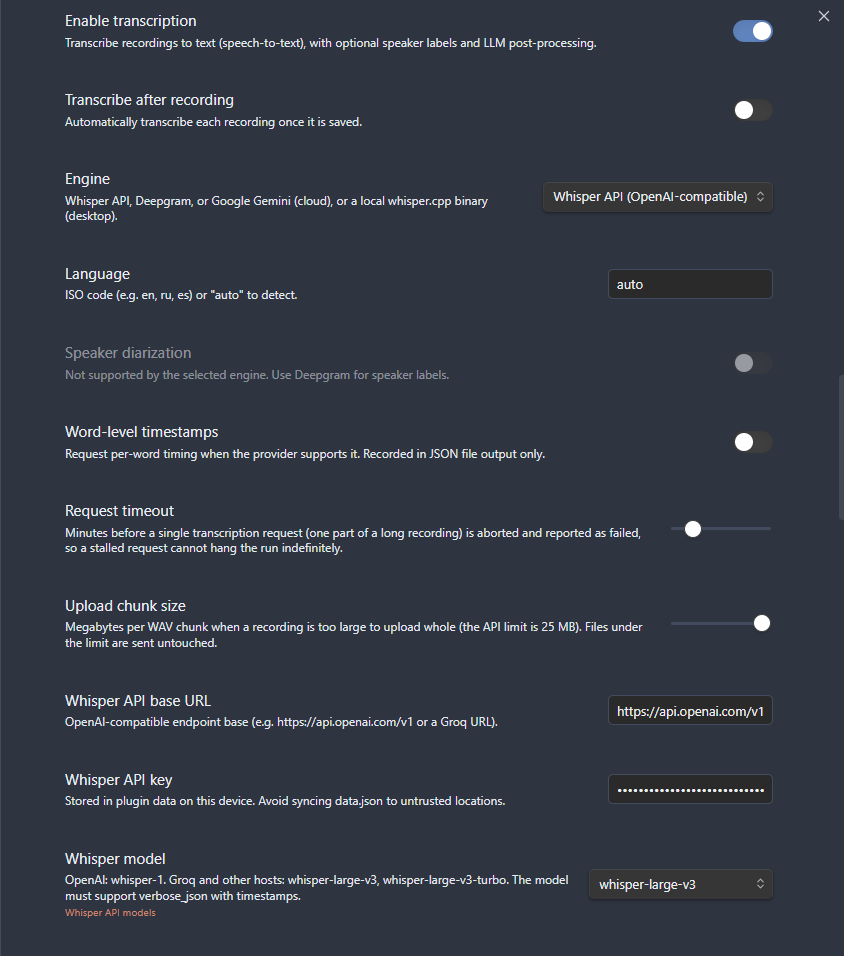

# Get an OpenAI API key for the Whisper API

The **Whisper API (OpenAI-compatible)** engine sends your recordings to OpenAI's hosted speech-to-text service and writes the transcript back into your vault. To use it you need an OpenAI **API key** and an account with billing enabled. This guide walks you through creating the key, turning on billing, pasting the key into the plugin, and running your first transcription. For a free-tier alternative that uses the very same engine, see [Groq (free Whisper)](groq-whisper-setup.md).

- [What you need it for](#what-you-need-it-for)
- [Step 1: Create an OpenAI account](#step-1-create-an-openai-account)
- [Step 2: Create a secret API key](#step-2-create-a-secret-api-key)
- [Step 3: Set up billing](#step-3-set-up-billing)
- [Step 4: Configure the plugin](#step-4-configure-the-plugin)
- [Step 5: Verify with a test recording](#step-5-verify-with-a-test-recording)
- [Settings reference](#settings-reference)
- [Limits and behavior](#limits-and-behavior)
- [Troubleshooting](#troubleshooting)
- [See also](#see-also)

## What you need it for

The plugin's **Whisper API** engine is the OpenAI-compatible speech-to-text path. With an OpenAI key it talks to OpenAI's hosted Whisper model and returns timed text. The same engine also works with other OpenAI-compatible hosts (such as Groq) by changing the base URL - but this guide covers the OpenAI path.

| Item                 | Value                                               |
| -------------------- | --------------------------------------------------- |
| **Engine**           | `Whisper API (OpenAI-compatible)`                   |
| **Default base URL** | `https://api.openai.com/v1`                         |
| **Default model**    | `whisper-1`                                         |
| **Diarization**      | Not supported (no speaker labels)                   |
| **Per-request cap**  | 25 MB (larger files are resampled and auto-chunked) |
| **Cost**             | Paid, billed per minute of audio                    |

Whisper API is the best choice when you want accurate single-speaker transcription - voice notes, dictation, and lectures. It does **not** label who is speaking; if you need that, use the [Deepgram](deepgram-api-key.md) or [Gemini](gemini-api-key.md) engines instead, which support [speaker diarization](../transcription.md#speakers-and-diarization).

---

## Step 1: Create an OpenAI account

1. Go to the OpenAI platform at <https://platform.openai.com/>.
2. Sign up with an email address or a Google/Microsoft/Apple account, or sign in if you already have one.
3. Verify your email and phone number if OpenAI asks you to.

You only need to do this once per OpenAI account.

## Step 2: Create a secret API key

1. Open the API keys page at <https://platform.openai.com/api-keys>.
2. Click **Create new secret key**.
3. (Optional) Give the key a name like `Obsidian Advanced Audio Recorder` so you can recognize it later.
4. Click **Create secret key**.
5. **Copy the key now.** OpenAI shows the full secret value **only once**. If you close the dialog without copying it, you cannot retrieve it later - you must delete the key and create a new one. The key starts with `sk-`.
6. Paste it somewhere safe for a moment (you will move it into the plugin in [Step 4](#step-4-configure-the-plugin)).

> **Keep the key secret.** Anyone with this key can spend against your account. Never paste it into a note, a screenshot, or a shared file. The plugin stores it locally on your device - see [Limits and behavior](#limits-and-behavior).

## Step 3: Set up billing

Whisper transcription on OpenAI is a **paid** service, billed roughly per minute of audio. A brand-new account usually needs a payment method and some prepaid credit before any request will succeed.

1. Open the billing page at <https://platform.openai.com/settings/organization/billing>.
2. Add a payment method.
3. Add credit (or enable auto-recharge) so requests are not rejected for an empty balance.
4. (Optional) Set a monthly usage limit so you cannot be billed past a cap you choose.

Without a positive balance, the plugin's transcription requests fail with a quota or billing error - see [Troubleshooting](#troubleshooting).

## Step 4: Configure the plugin

Open **Settings > Advanced Audio Recorder** and scroll to the **Transcription** section.

1. Turn on **Enable transcription**. The transcription controls appear.
2. In the **Engine** dropdown, choose **Whisper API (OpenAI-compatible)**.
3. Leave **Whisper API base URL** as `https://api.openai.com/v1` (the default).
4. Paste your secret key into **Whisper API key**.
5. In the **Whisper model** picker, select **`whisper-1`** (the default). You can also click **Add custom model** to type a model id, or **Remove selected** to drop one from the list.
6. Set **Language** to `auto` to auto-detect, or to an ISO code (for example `en`, `ru`, `es`).
7. (Optional) Choose where the transcript goes under **Transcript output > Destination**. The default is **Insert into note**.

_Figure: the Transcription settings configured for the OpenAI Whisper API engine._

> **Speaker diarization** stays greyed out and off for the Whisper API engine - OpenAI's Whisper does not return speaker labels. The speaker-related output controls (Include speakers, Merge speaker turns, Speaker format) are disabled to match.

## Step 5: Verify with a test recording

1. Click the **microphone icon** in the left ribbon (or run **Start/stop recording** from the command palette) and say a sentence or two.
2. Click the ribbon icon again to stop and save. An audio embed link is inserted into the active note.
3. Open the audio file so it is the **active file** (click its name in the embed, or its File Explorer entry), then run **Transcribe audio** from the command palette - or simply right-click the recording (or its embed/player) and choose **Transcribe audio**, which works regardless of which file is active. (Opening the note that embeds the audio leaves the _note_ active, so the palette command stays hidden.)
4. A progress dialog opens with a progress bar, an elapsed timer, **Cancel**, and **Minimize** (which sends the job to the status bar so you can keep working - click the status bar to reopen it). Closing the dialog cancels the job.
5. When it finishes, the transcript is written to the destination you chose. Read it back to confirm it matches what you said.

If the test works, your key, billing, and model are all correct.

---

## Settings reference

The fields the Whisper API engine adds under **Settings > Transcription** (defaults match the plugin):

| Setting                   | What it does                                                                                     | Default                     |
| ------------------------- | ------------------------------------------------------------------------------------------------ | --------------------------- |
| **Engine**                | Selects the transcription engine. Choose `Whisper API (OpenAI-compatible)`.                      | `Whisper API`               |
| **Language**              | ISO code (e.g. `en`, `ru`, `es`) or `auto` to detect.                                            | `auto`                      |
| **Speaker diarization**   | Speaker labels. Disabled and greyed out for Whisper API.                                         | Off (unavailable)           |
| **Word-level timestamps** | Per-word timing, recorded in JSON file output only.                                              | Off                         |
| **Request timeout**       | Minutes before a single request is aborted and reported as failed. Range 1-60.                   | 10 minutes                  |
| **Upload chunk size**     | Megabytes per WAV chunk when a file is too large to send whole. Range 1-24 (API limit is 25 MB). | 24 MB                       |
| **Whisper API base URL**  | OpenAI-compatible endpoint base.                                                                 | `https://api.openai.com/v1` |
| **Whisper API key**       | Your secret key. Stored in the plugin's `data.json` on this device.                              | empty                       |
| **Whisper model**         | The model id to request. Must support `verbose_json` with timestamps.                            | `whisper-1`                 |

The catalogue link shown next to the model picker points to OpenAI's speech-to-text guide: <https://platform.openai.com/docs/guides/speech-to-text>. For the full list of every transcription setting and its options, see the [Settings reference](../settings-reference.md) and the [Transcription guide](../transcription.md).

## Limits and behavior

- **25 MB hard per-request limit.** OpenAI rejects any single request larger than 25 MB. Files at or under 25 MB are uploaded in their original container, untouched. Larger recordings are automatically resampled to 16 kHz mono and split into upload-sized WAV chunks, transcribed separately, and stitched back onto one timeline - you do not need to split anything by hand. The **Upload chunk size** setting controls how big each chunk is (default 24 MB, to stay safely under the 25 MB limit).
- **No diarization.** The Whisper API does not return speaker labels, so the engine produces a single, unlabeled transcript. See [Speakers and diarization](../transcription.md#speakers-and-diarization).
- **Model requirements.** The model you pick must support `verbose_json` output with segment timestamps. `whisper-1` does; OpenAI's newer `gpt-4o-transcribe` models do **not**, so they are not offered and will not work here.
- **Compatible hosts.** Because this engine is OpenAI-compatible, you can point it at another host (such as Groq) by changing the base URL, key, and model. See [Groq (free Whisper)](groq-whisper-setup.md).
- **Where your key lives.** The key is stored in the plugin's `data.json` on this device and is never written into diagnostics output. Avoid syncing `data.json` to untrusted locations. If you want a fully offline path with no key at all, use [local whisper.cpp](local-whisper-cpp.md).

## Troubleshooting

| Symptom                                          | Likely cause and fix                                                                                                                           |
| ------------------------------------------------ | ---------------------------------------------------------------------------------------------------------------------------------------------- |
| **401 / invalid key**                            | The key is wrong, truncated, revoked, or pasted with extra spaces. Re-copy it from <https://platform.openai.com/api-keys> or create a new one. |
| **Quota / insufficient balance / billing error** | No credit on the account. Add a payment method and credit at <https://platform.openai.com/settings/organization/billing>.                      |
| **File too large / 413**                         | A single chunk exceeded 25 MB. Lower **Upload chunk size** toward 24 MB; the plugin already auto-chunks files over the limit.                  |
| **Request timed out**                            | The network stalled or the file is very long. Raise **Request timeout** (up to 60 minutes) and check your connection.                          |
| **Wrong language detected**                      | Set **Language** to the explicit ISO code instead of `auto`.                                                                                   |
| **No speaker labels**                            | Expected - Whisper API has no diarization. Switch to [Deepgram](deepgram-api-key.md) or [Gemini](gemini-api-key.md) for speakers.              |
| **"Model not found" or empty result**            | The model id is wrong or unsupported. Reselect `whisper-1`, or pick a model that supports `verbose_json` with timestamps.                      |

For broader diagnostics, see the [Troubleshooting guide](../troubleshooting.md).

## See also

- [Transcription](../transcription.md) - engines, diarization, output formats, and destinations.
- [Groq (free Whisper)](groq-whisper-setup.md) - the same engine on a free-tier, OpenAI-compatible host.
- [Deepgram](deepgram-api-key.md) and [Gemini](gemini-api-key.md) - engines that support speaker diarization.
- [Local whisper.cpp (offline)](local-whisper-cpp.md) - transcribe with no API key and no network.
- [LLM post-processing](../llm-post-processing.md) - clean up or summarize the transcript with an LLM.
- [Settings reference](../settings-reference.md) - every setting and its default.
